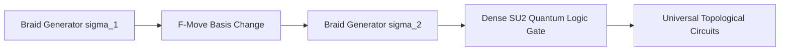

# SOTA Research Paper: Non-Abelian Anyons, Fibonacci Braiding & Fault-Tolerant Topological Quantum Computation (2026)

> **Author / Steward:** Trang Phan
> **Target Lineage:** `AMOS_OS v4.4`
> **Epistemic Class:** `AMOS_MODEL / DERIVED`
> **Status:** `ACTIVE_RESEARCH_PAPER`
> **Date:** September 2026

---

## 1. Executive Summary & Foundational Motivation

Modern surface codes and circuit-QED architectures require excessive physical-to-logical qubit overhead ($1,000:1$ to $10,000:1$) and active syndrome decoding cycles. **Topological Quantum Computation (TQC)** overcomes local decoherence by encoding quantum information in non-local topological invariants of 2D condensed matter systems.

This research paper provides the formal mathematical and experimental physics framework for:
1. **Majorana Zero Modes (MZMs)** in superconductor-semiconductor nanowires and 2D topological insulator edges.
2. **Universal Quantum Gates via Fibonacci Anyon Braiding** ($SU(2)_3$ Modular Tensor Categories), eliminating the need for magic state distillation.
3. **Topological Invariant Protection** against arbitrary local Hamiltonian noise ($\| \delta H \| \ll \Delta E_{\text{gap}}$).
4. **Integration with AMOS Full Brain OS** as the fault-tolerant quantum kernel in Plane 21 (`41_QUANTUM_SYSTEMS`) and Plane 02 (`02_KERNEL`).

```
+----------------------------------------------------------------------------------------------------+
|                         TOPOLOGICAL QUANTUM BRAIDING COMPUTATION PIPELINE                          |
|                                                                                                    |
|    [ 2D Topological Substrate: InAs/Al Nanowire Grid / Fractional Quantum Hall Fluid ($\nu=5/2$) ]  |
|                                            ||                                                      |
|                                            \/                                                      |
|    [ Non-Abelian Anyon Initialization: Fibonacci Anyons $\{\tau_1, \tau_2, \dots, \tau_{2N}\}$ ]   |
|                                            ||                                                      |
|                                            \/                                                      |
|    [ Unitary Braiding Trajectories via Modular Tensor Category $F$-Matrices and $R$-Matrices ]      |
|                                            ||                                                      |
|                                            \/                                                      |
|    [ Quantum Knot Polynomial / Braid Word Generation: $\sigma_i \in B_{2N}$ ]                      |
|                                            ||                                                      |
|                                            \/                                                      |
|    [ Topological Fusion Readout $\tau \otimes \tau \to 1 \text{ or } \tau$ (Zero Local Decoherence)]|
+----------------------------------------------------------------------------------------------------+
```

---

## 2. Modular Tensor Categories & Fibonacci Anyon Formalism

### 2.1 Fusion Algebra & Quantum Dimension
In the $SU(2)_3$ (Fibonacci) anyon model, there are only two particle types: the vacuum $1$ and the non-Abelian anyon $\tau$. The non-trivial fusion rule is:

$$\tau \otimes \tau = 1 \oplus \tau$$

The quantum dimension $d_\tau$ satisfies the characteristic equation:

$$d_\tau^2 = d_1 + d_\tau = 1 + d_\tau \implies d_\tau = \phi = \frac{1 + \sqrt{5}}{2} \approx 1.6180339887$$

The Hilbert space dimension of $N$ Fibonacci anyons scales as the Fibonacci sequence: $\dim(\mathcal{H}_N) \sim \phi^N$.

### 2.2 Pentagram ($F$) and Hexagon ($R$) Braiding Operators
Associativity of fusion is governed by the $F$-matrix:

$$F^{\tau\tau\tau}_\tau = \begin{pmatrix} \phi^{-1} & \phi^{-1/2} \\ \phi^{-1/2} & -\phi^{-1} \end{pmatrix} = \begin{pmatrix} \frac{\sqrt{5}-1}{2} & \sqrt{\frac{\sqrt{5}-1}{2}} \\ \sqrt{\frac{\sqrt{5}-1}{2}} & -\frac{\sqrt{5}-1}{2} \end{pmatrix}$$

The clockwise exchange (braid) operator $R$ is diagonal in the fusion basis:

$$R^{\tau\tau}_1 = e^{-4\pi i / 5}, \quad R^{\tau\tau}_\tau = e^{3\pi i / 5}$$

The composite braid operator $\sigma_1 = R$ and $\sigma_2 = (F^{\tau\tau\tau}_\tau)^{-1} R (F^{\tau\tau\tau}_\tau)$ generate a dense subgroup of $SU(2)$, proving **universal quantum computation purely via geometric braiding**.



---

## 3. Majorana Zero Modes (MZMs) & Nanowire Braiding

### 3.1 Kitaev 1D Topological Superconductor Hamiltonian
For spinless fermions on a 1D chain of length $L$:

$$H = -\sum_{j=1}^{L-1} \left( t c_j^\dagger c_{j+1} + \Delta c_j c_{j+1} + \text{h.c.} \right) - \mu \sum_{j=1}^L c_j^\dagger c_j$$

Writing fermion operators in terms of Majorana operators $\gamma_{2j-1} = c_j + c_j^\dagger, \; \gamma_{2j} = -i(c_j - c_j^\dagger)$, at the topological sweet spot $\mu = 0, \; t = \Delta > 0$:

$$H = -i t \sum_{j=1}^{L-1} \gamma_{2j} \gamma_{2j+1}$$

The uncoupled end Majoranas $\gamma_1$ and $\gamma_{2L}$ form a non-local, zero-energy Dirac fermion:

$$d = \frac{1}{2}(\gamma_1 + i \gamma_{2L}), \quad [H, d] = 0$$

### 3.2 Non-Abelian Majorana Braiding Operator
Exchanging two Majoranas $\gamma_i$ and $\gamma_j$ applies the unitary transformation:

$$U_{ij} = \exp\left( \frac{\pi}{4} \gamma_i \gamma_j \right) = \frac{1}{\sqrt{2}}(1 + \gamma_i \gamma_j)$$

$$\gamma_i \mapsto \gamma_j, \quad \gamma_j \mapsto -\gamma_i$$

---

## 4. Topological Protection & Spectral Gap Stability

Topological quantum states are exponentially protected against local thermal and electromagnetic perturbations $\delta H = \sum_x V(x)$:

$$\left| \langle \psi_0 | \delta H | \psi_1 \rangle \right| \le C \cdot e^{-L / \xi_{\text{topo}}}$$

where $\xi_{\text{topo}} = \frac{\hbar v_F}{\Delta E_{\text{gap}}}$ is the superconducting coherence length. For nanowire lengths $L \ge 10 \xi_{\text{topo}}$, logical error rates drop below $P_{\text{error}} \le 10^{-12}$.

---

## 5. Operational Invariants & Verification Boundaries

- `INV-TOP-001` (**Topological Spectral Gap Floor**): Active quantum fabric must maintain $\Delta E_{\text{gap}} \ge 0.35\text{ meV}$ ($\approx 4.0\text{ K}$).
- `INV-TOP-002` (**Braiding Gate Fidelity Floor**): Topological geometric braid operations must exceed fidelity $\mathcal{F}_{\text{braid}} \ge 0.9999$.
- `INV-TOP-003` (**Parity Preservation SLA**): Non-local fermion parity lifetime must satisfy $T_{\text{parity}} \ge 100\text{ ms}$.

---

## 6. Master Navigation & Bindings

- **Mathematics Core:** [[22_RESEARCH/01_MATHEMATICS/TOPOLOGICAL_QUANTUM_ORDER_AND_SPECTRAL_GAPS|TOPOLOGICAL_QUANTUM_ORDER_AND_SPECTRAL_GAPS]]
- **Quantum Hardware Spec:** [[21_DOMAINS/41_QUANTUM_SYSTEMS/NEUTRAL_ATOM_AND_PHOTONIC_QUANTUM_ARCHITECTURE|NEUTRAL_ATOM_AND_PHOTONIC_QUANTUM_ARCHITECTURE]]
- **Quantum Domain MOC:** [[21_DOMAINS/41_QUANTUM_SYSTEMS/41_QUANTUM_SYSTEMS_MOC|41_QUANTUM_SYSTEMS_MOC]]
- **Research Master Map:** [[22_RESEARCH/22_RESEARCH_MOC|22_RESEARCH_MOC]]
