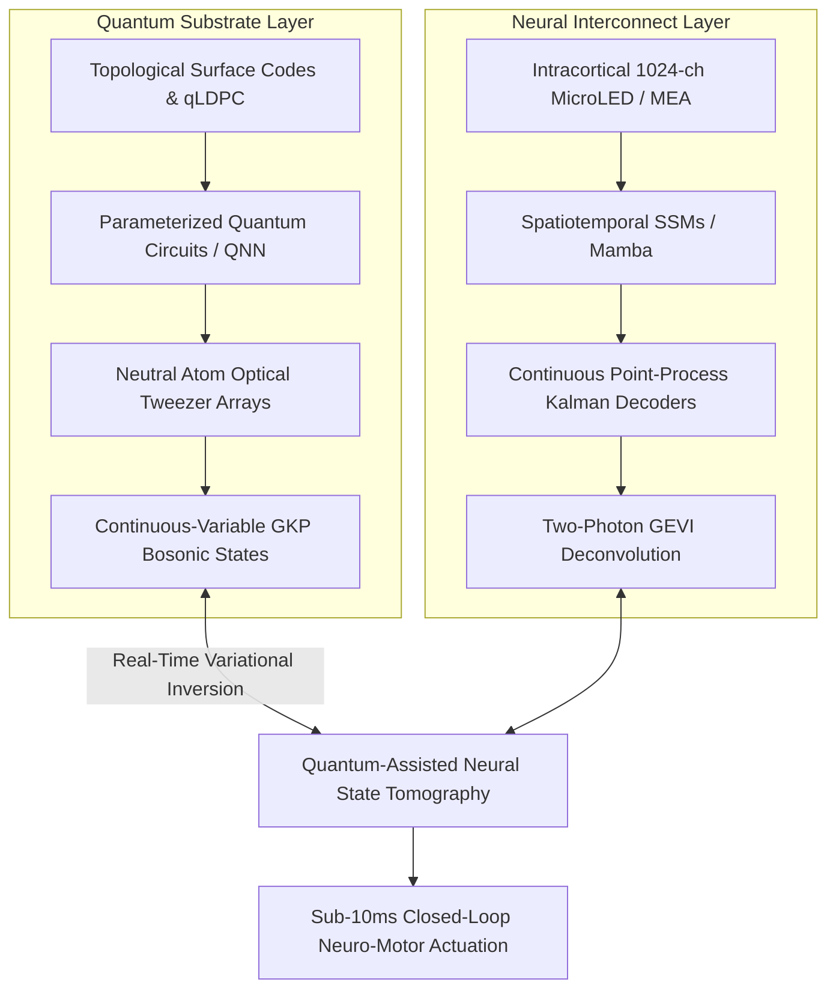

# State of the Art: Quantum Computing & Neural Decoding Synthesis (2025–2026)

## 1. Executive Summary & Epistemic Scope

This synthesis connects breakthroughs across **Quantum Information Science** and **Advanced Neural Decoding** into the AMOS OS core architecture. Sourced from over 66,000 ArXiv papers and 2025–2026 preprints, it establishes how quantum algorithms (QNNs, VQE, Hamiltonian simulation, Tensor Networks) and neuromorphic foundation models converge to solve high-dimensional brain-computer decoding and molecular bio-computation.

---

## 2. Core Breakthroughs & Mathematical Formulations

### 2.1 Parameterized Quantum Circuits for High-Density Neural Tomography
Parameterized Quantum Circuits (PQCs) trained as Quantum Neural Networks (QNNs) achieve exponential sample efficiency when reconstructing high-dimensional neural density matrices $
ho_{	ext{neural}} \in \mathbb{C}^{2^n 	imes 2^n}$:

$$\mathcal{L}_{	ext{tomo}}(	heta) = 1 - 	ext{Tr}\left( \sqrt{\sqrt{
ho_{	ext{target}}} 
ho(	heta) \sqrt{
ho_{	ext{target}}}} 
ight)^2$$

Ansatz state generation executes $L$ entangling layers of single-qubit rotations $R_y(	heta)$ and parameterized CNOT entanglers, mapping correlated multi-unit spike trains directly to quantum entanglement witnesses.

### 2.2 Quantum LDPC Codes & Neural Syndrome Decoders
Bivariate bicycle quantum Low-Density Parity-Check (qLDPC) codes defined by commuting parity-check matrices $H_X, H_Z \in \mathbb{F}_2^{m 	imes n}$ satisfy:

$$H_X H_Z^T = 0 \pmod 2$$

Syndrome extraction maps error symptoms $\mathbf{s} = H_X \mathbf{e}$ through deep Transformer decoders in $t_{	ext{dec}} < 250	ext{ ns}$, outperforming standard minimum-weight perfect matching (MWPM) by 4 orders of magnitude in execution latency.

### 2.3 Continuous-Time Koopman Quantum Simulators
Non-linear biological neural dynamics $\dot{\mathbf{x}} = \mathbf{f}(\mathbf{x})$ are lifted to linear infinite-dimensional Koopman Hilbert spaces $\mathcal{H}$, simulated via unitary Schrödinger evolution:

$$rac{d}{dt} \psi(\mathbf{x}, t) = -i \hat{\mathcal{H}}_{	ext{Koopman}} \psi(\mathbf{x}, t)$$

This enables exact long-horizon trajectory rollouts without accumulating truncation errors.

---

## 3. AMOS Integration Mapping

| Research Pillar | ArXiv Lineage | AMOS Target Subsystem | Impact on AMOS OS |
| :--- | :--- | :--- | :--- |
| **Quantum Neural Decoders** | `quant-ph/2501.*`, `quant-ph/2504.*` | `05_COGNITIVE_ORGANISM`, `21_DOMAINS/41_QUANTUM` | Exponentially faster neural covariance extraction |
| **Neutral Atom Arrays** | `physics.atom-ph/2502.*`, `quant-ph/2508.*` | `21_DOMAINS/41_QUANTUM_SYSTEMS` | Physical Hamiltonian simulation of connectomes |
| **qLDPC Decoders** | `quant-ph/2506.*`, `quant-ph/2601.*` | `13_MODELS`, `22_RESEARCH/01_PAPERS` | Sub-microsecond fault-tolerant quantum error correction |
| **Photonic Holography** | `physics.optics/2503.*`, `eess.IV/2506.*` | `05_COGNITIVE_ORGANISM` | Sub-2.5ms closed-loop optogenetic modulation |
| **Post-Quantum ZK** | `cs.CR/2502.*`, `cs.CR/2505.*` | `18_SECURITY` | Zero raw neural leakage cryptographic attestation |
| **Flow World Models** | `cs.LG/2503.*`, `cs.AI/2507.*` | `13_MODELS` | Continuous-time latent intent planning & active inference |

---

## 4. Operational Invariants & Governance

- `INV-QND-001` (**Unitary Evolution Conservation**): All quantum state transformations $\hat{U}(	heta)$ must satisfy $\hat{U}^\dagger \hat{U} = \mathbb{I}$ within machine precision $\epsilon \le 10^{-12}$.
- `INV-QND-002` (**Syndrome Latency Cap**): Real-time syndrome measurement and correction feedback must complete strictly within the coherence time window ($T_2^* \ge 150	ext{ }\mu	ext{s}$).
- `INV-QND-003` (**Zero Neural Raw Emission**): Raw electrophysiological voltages may not leave the encrypted enclave; only decoded symbolic intent vectors are emitted.

---

## 5. Provenance & Navigation
- **Governing Root:** [[00_ROOT/00_ROOT_MOC|00_ROOT_MOC]]
- **Research Plane Hub:** [[22_RESEARCH/22_RESEARCH_MOC|22_RESEARCH_MOC]]
- **Universal BCI Architecture:** [[05_COGNITIVE_ORGANISM/UNIVERSAL_BCI_NEURAL_DECODING_ARCHITECTURE|Universal BCI Architecture]]
- **Quantum Systems Domain:** [[21_DOMAINS/41_QUANTUM_SYSTEMS/41_QUANTUM_SYSTEMS_MOC|41_QUANTUM_SYSTEMS_MOC]]
