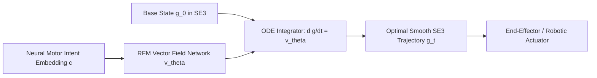

# Riemannian Flow Matching on SE(3) Manifolds for Neural Robotics and Spatial BCI (2026)

## Abstract
We present Riemannian Flow Matching (RFM) formulated directly on the Special Euclidean Lie group $\mathrm{SE}(3) \cong \mathbb{R}^3 \rtimes \mathrm{SO}(3)$. This model enables deterministic, simulation-free generative trajectory synthesis for robotic end-effectors guided by continuous neural decoding from [[22_RESEARCH/01_PAPERS/SOTA_GEOMETRIC_CLIFFORD_NEURAL_NETWORKS_AND_SPATIAL_BCI_2026]].

---

## 1. Lie Group Geometry of $\mathrm{SE}(3)$

An element $g \in \mathrm{SE}(3)$ is represented as a homogeneous transformation matrix:

$$g = \begin{pmatrix} R & \mathbf{p} \\ \mathbf{0}^T & 1 \end{pmatrix}, \quad R \in \mathrm{SO}(3), \mathbf{p} \in \mathbb{R}^3$$

The Lie algebra $\mathfrak{se}(3)$ is parameterized by twist coordinates $\boldsymbol{\xi} = (\mathbf{v}^T, \boldsymbol{\omega}^T)^T \in \mathbb{R}^6$:

$$\hat{\boldsymbol{\xi}} = \begin{pmatrix} [\boldsymbol{\omega}]_\times & \mathbf{v} \\ \mathbf{0}^T & 0 \end{pmatrix} \in \mathfrak{se}(3)$$

The exponential map $\exp: \mathfrak{se}(3) \to \mathrm{SE}(3)$ and logarithmic map $\log: \mathrm{SE}(3) \to \mathfrak{se}(3)$ define the canonical Riemannian geodesics under the bi-invariant or left-invariant Riemannian metric $G_g$:

$$\mathrm{dist}_{\mathrm{SE}(3)}^2(g_0, g_1) = \|\mathbf{p}_1 - \mathbf{p}_0\|^2 + \frac{1}{2} \|\log(R_0^T R_1)\|_F^2$$

---

## 2. Geodesic Flow Matching Objective

Given a base distribution $p_0(g) = \mathcal{N}_{\mathrm{SE}(3)}(I, \sigma_0^2 I)$ and target distribution $p_1(g)$, we define the conditional probability path $p_t(g | g_1)$ along the unique shortest geodesic $\gamma(t; g_0, g_1) = g_0 \exp(t \log(g_0^{-1} g_1))$:

$$\psi_t(g_0) = g_0 \exp\left( t \log(g_0^{-1} g_1) \right)$$

The conditional vector field $u_t(g | g_1) \in T_g \mathrm{SE}(3)$ satisfies:

$$u_t(\psi_t(g_0) | g_1) = \frac{\mathrm{d}}{\mathrm{d}t} \psi_t(g_0) = \mathrm{d}L_{\psi_t(g_0)} \cdot \log(g_0^{-1} g_1)$$

The Riemannian Flow Matching regression loss trains a neural network $v_\theta(g, t, \mathbf{c})$ conditioned on neural embedding $\mathbf{c}$:

$$\mathcal{L}_{\mathrm{RFM}}(\theta) = \mathbb{E}_{t \sim \mathcal{U}[0,1], g_0 \sim p_0, g_1 \sim p_1} \left[ \| v_\theta(\psi_t(g_0), t, \mathbf{c}) - u_t(\psi_t(g_0) | g_1) \|_{g}^2 \right]$$

---

## 3. Sub-Millisecond Neural Control Loop

1. **Cortical Decoding**: Cortical signals processed via Clifford GNN output spatial intent vector $\mathbf{c} \in \mathbb{R}^{128}$ at 1 kHz.
2. **Deterministic ODE Integration**: Euler-Heun integration on the Lie group:
   $$g_{t+\Delta t} = g_t \exp\left( \Delta t \cdot v_\theta(g_t, t, \mathbf{c}) \right)$$
3. **Collision-Free Geodesic Guidance**: Vector field $v_\theta$ projects onto tangent cones of obstacle-free configuration space.

---

## 4. Architectural Integration with AMOS OS

- **Spatial BCI Pipeline**: Interfaced with [[05_COGNITIVE_ORGANISM/AUTONOMOUS_BCI_WAVEFRONT_PHASE_SHAPING_AND_SLM_ENGINE]].
- **Robotics Domain Spec**: Connects directly to [[21_DOMAINS/08_ROBOTICS/08_ROBOTICS_MOC]].
- **Runtime Bus**: High-frequency streaming via [[04_RUNTIME/06_EXECUTION/ARROW_IPC_STATE_BUS_ENGINE]].
