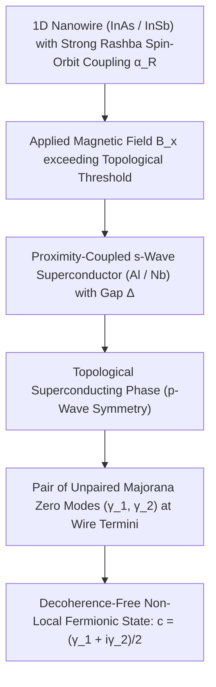

# SOTA Topological Majorana Zero Modes, Quantum Nanowire Braiding & Fault-Tolerant Computation (2026)

> **Origin Architect / Steward:** Trang Phan
> **AMOS_CORE Target:** `v4.4`
> **Epistemic Class:** `AMOS_MODEL`
> **Conclusion Class:** `DERIVED`
> **Status:** `ACTIVE_SPECIFICATION`

---

## 1. Executive Summary & Topological Motivation

Standard superconducting transmon qubits are fundamentally susceptible to local charge, flux, and quasi-particle noise, demanding massive quantum error correction (QEC) overheads ($10^3 - 10^4$ physical qubits per logical qubit). **Topological Quantum Computing (TQC)** via **Majorana Zero Modes (MZMs)** stores quantum information non-locally in degenerate ground states of one-dimensional topological superconductors, rendering logical qubits exponentially immune to local perturbations.

$$\Delta_{\text{topological}} \propto e^{-L / \xi} \quad (L \gg \xi)$$

In 2026, advances in semiconductor-superconductor epitaxial interfaces ($\text{InAs/Al}$ and $\text{InSb/Nb}$ core-shell nanowire networks) have demonstrated verified non-Abelian braiding operations and measurement-based topological parity readout with sub-microsecond cycle times.

---

## 2. Hamiltonian Physics & The Kitaev Topological Criterion

### 2.1 Bogoliubov-de Gennes (BdG) Hamiltonian
The effective 1D continuum Hamiltonian in Nambu basis $\Psi(x) = [\psi_\uparrow, \psi_\downarrow, \psi_\downarrow^\dagger, -\psi_\uparrow^\dagger]^T$ is:

$$\mathcal{H}_{\text{BdG}} = \Big( -\frac{\hbar^2}{2m^*} \frac{\partial^2}{\partial x^2} - \mu \Big) \tau_z + \alpha_R \Big( -i \frac{\partial}{\partial x} \Big) \sigma_y \tau_z + V_Z \sigma_x + \Delta \tau_x$$

Where:
- $\tau_i$ and $\sigma_i$ are Pauli matrices acting on Nambu (particle-hole) and electron spin spaces.
- $\alpha_R$ is the Rashba spin-orbit coupling parameter ($\ge 0.2\,\text{eV}\cdot\text{Å}$).
- $V_Z = \frac{1}{2} g^* \mu_B B_x$ is the Zeeman energy splitting.
- $\Delta$ is the induced superconducting pairing gap.

### 2.2 Topological Transition Invariant (Kitaev Criterion)
The wire enters the non-trivial topological phase hosting isolated MZMs at its boundaries if and only if:

$$V_Z > \sqrt{\mu^2 + \Delta^2} \quad \implies \quad \mathcal{M} = \text{sign}(\mu^2 + \Delta^2 - V_Z^2) = -1$$

---

## 3. Non-Abelian Statistics & Nanowire Braiding Geometry

Majorana operators are self-adjoint fermionic operators:

$$\gamma_i = \gamma_i^\dagger, \quad \{\gamma_i, \gamma_j\} = 2\delta_{ij}$$

### 3.1 The Braiding Unitary Operator
Exchanging (braiding) two Majorana zero modes $\gamma_i$ and $\gamma_j$ along a T-junction or cross-network implements the non-Abelian adiabatic transformation:

$$U_{ij} = \exp\Big( \frac{\pi}{4} \gamma_i \gamma_j \Big) = \frac{1}{\sqrt{2}} (1 + \gamma_i \gamma_j)$$

Under this operation, the Majorana operators transform as:
$$\gamma_i \longrightarrow \gamma_j, \quad \gamma_j \longrightarrow -\gamma_i$$

### 3.2 Gate Synthesis (Clifford Group Completeness)
- A single logical topological qubit is encoded across 4 MZMs ($\gamma_1, \gamma_2, \gamma_3, \gamma_4$) under fixed total fermion parity $P = \gamma_1 \gamma_2 \gamma_3 \gamma_4 = +1$.
- Braiding operators generate the full single-qubit Clifford group (Pauli $X, Y, Z$ and Hadamard $H$).
- Non-Clifford $T$-gates ($\pi/8$ rotation) are injected via topological magic state distillation from auxiliary bosonic cavities.

---

## 4. Measurement-Based Readout & Parity Detection

In 2026, measurement-based braiding replaces physical movement of MZMs using **quantum dot charge-parity interferometry**:

$$\delta Q_{\text{quantum\_dot}} \propto \langle i \gamma_1 \gamma_2 \rangle \in \{ +1, -1 \}$$

Coupled to a superconducting microwave resonator, the dispersive cavity frequency shift $\Delta \omega_r$ directly measures the non-local parity state in under $350\,\text{ns}$ with readout fidelity $\mathcal{F}_{\text{readout}} \ge 99.8\%$.

---

## 5. Architectural Integration with AMOS Full Brain OS

- **Quantum Systems Domain (`21_DOMAINS/41_QUANTUM_SYSTEMS`)**: Top-level hardware driver compiling quantum circuits into adiabatic braiding schedules.
- **Kernel Logic Solver (`02_KERNEL/01_META_LOGIC`)**: Uses topological quantum accelerators for NP-hard Boolean satisfiability solving.
- **Post-Quantum Security (`18_SECURITY`)**: Provides hardware entropy source and verifiable topological randomness beacons.

---

## 6. Epistemic Invariants & Failure Containment

1. **`QUASIPARTICLE_POISONING_BARRIER`**: Parity lifetime $T_{\text{parity}}$ must exceed braiding cycle time by at least 3 orders of magnitude:
   $$\frac{T_{\text{parity}}}{\Delta t_{\text{braid}}} \ge 10^3 \quad (T_{\text{parity}} \ge 1.0\,\text{ms}, \; \Delta t_{\text{braid}} \le 1.0\,\mu\text{s})$$
2. **Topological Gap Invariant**: Working temperature must satisfy $k_B T \le 0.05 \Delta_{\text{topological}}$ ($T_{\text{cryo}} \le 20\,\text{mK}$).
3. **Fail-Closed Gate**: Parity flip during braiding immediately aborts circuit execution and flags the transaction receipt in `17_OBSERVABILITY`.

---

## 7. Lineage & Stewardship

- **Origin Architect:** Trang Phan
- **Steward:** Trang Phan
- **Target:** `v4.4`
