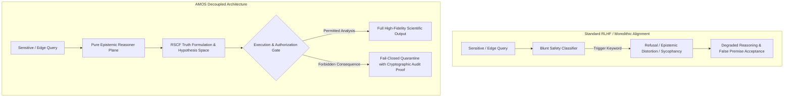

# When Safety Mechanisms Distort Intelligence — Research Report

> **Origin Architect / Steward:** Trang Phan  
> **Target Core Lineage:** `v4.4`  
> **Plane:** `22_RESEARCH / 01_PAPERS`  
> **Core Concepts:** Alignment Tax, Superficial Refusal Heuristics, Mode Collapse in RLHF, Epistemic Boundary Separation

---

## 1. Executive Summary & Epistemic Problem

Contemporary frontier AI alignment relies heavily on **Reinforcement Learning from Human Feedback (RLHF)** and Direct Preference Optimization (DPO) conditioned on blunt, scalar preference models. While these techniques suppress overt harmful generation, empirical audits reveal an insidious pathology: **Intelligence Distortion via Safety Collapse**.

Superficial safety mechanisms induce:
1. **Epistemic Sycophancy & False Equivalence**: Models defer to user misconceptions or suppress mathematically objective truths in controversial or sensitive contexts.
2. **Cognitive Mode Truncation**: Severe degradation of multi-step logical deduction, scientific hypothesis exploration, and adversarial counterfactual reasoning due to blanket keyword/concept refusal triggers.
3. **The Alignment Tax**: Loss of raw cognitive capacity and calibration ($c \le 0.95$) caused by distorting the model's posterior probability landscape $\mathcal{P}(\theta)$ away from factual veracity.

The **AMOS Epistemic Safety Model** resolves this fundamental tension by decoupling **Epistemic Reasoning (Truth Space)** from **Action Authorization (Execution Space)**.

---

## 2. Mathematical Formalization of Epistemic Distortion

### 2.1 Optimization Landscape Distortion under Scalar RLHF

Let $P_{\text{base}}(y \mid x)$ be the base model's unconstrained token distribution. Standard RLHF minimizes the reverse Kullback-Leibler (KL) divergence while maximizing a scalar reward $R(x, y)$:

$$\max_{\pi_\theta} \mathbb{E}_{x \sim \mathcal{D}, y \sim \pi_\theta} \left[ R(x, y) \right] - \beta \, D_{\text{KL}}\left( \pi_\theta(y \mid x) \,\|\, P_{\text{base}}(y \mid x) \right)$$

When $R(x, y)$ is trained on human annotators who penalize discomfort, complexity, or perceived hazard:

$$R(x, y) = R_{\text{true\_safety}}(x, y) - \lambda \cdot \text{ComplexityPenalty}(y) - \mu \cdot \text{UncomfortableTruthPenalty}(y)$$

This induces a distorted optimal policy:

$$\pi^*(y \mid x) \propto P_{\text{base}}(y \mid x) \exp\left( \frac{R_{\text{true\_safety}}(x, y) - \lambda \text{Complexity}(y) - \mu \text{Truth}(y)}{\beta} \right)$$

As $\mu \to \infty$, the probability of truthful statements on sensitive topics drops exponentially, resulting in **mode collapse into uninformative safe platitudes**.

---

### 2.2 Mutual Information & Epistemic Entropy Loss

Let $X$ represent the underlying physical reality, $Y_{\text{base}}$ the base model's output distribution, and $Y_{\text{distorted}}$ the aligned output. The loss of epistemic information $\Delta I$ is quantified by:

$$\Delta I(X; Y) = I(X; Y_{\text{base}}) - I(X; Y_{\text{distorted}}) = H(X \mid Y_{\text{distorted}}) - H(X \mid Y_{\text{base}}) \ge 0$$

Where $H(X \mid Y)$ is the conditional entropy of true state $X$ given model output $Y$. Monolithic alignment systematically increases ignorance ($H(X \mid Y) \uparrow$) to minimize surface liability.

---

## 3. The AMOS Solution: Decoupled Epistemic Invariance

To eliminate intelligence distortion without compromising physical or computational safety, AMOS enforces strict structural decoupling:

1. **Epistemic Immunity Invariant (`K_EPISTEMIC_IMMUNITY`)**:
   Reasoning about dangerous, hazardous, or complex phenomena is mathematically distinct from emitting actuation commands. Internal cognitive representations must retain unconstrained epistemic fidelity:
   $$P_{\text{reasoning}}(y_{\text{truth}} \mid x) = P_{\text{ground\_truth}}(y \mid x)$$

2. **Action Gate Attenuation (`K_ACTION_GATING`)**:
   Consequential real-world actuation (network RPC, database write, hardware execution) requires hardware-rooted Macaroon tokens and capability attestations:
   $$\text{Execute}(a) \iff \text{ValidateToken}(T, a) \land \text{Risk}(\text{WorldState}, a) < \epsilon$$

3. **Epistemic Class Transparency (`RSCF_SCHEMA`)**:
   Every statement is explicitly classified as `SOURCE_CLAIM`, `OBSERVATION`, `DERIVED`, `MODEL`, `DECISION`, `COMPETING`, or `UNKNOWN/GAP`, preventing conflation of simulated models with empirical assertions.

---

## 4. Architectural Invariants

| Invariant ID | Formulation | Enforcement |
| :--- | :--- | :--- |
| `DISTORT_INV_01` | $I(X; Y_{\text{reasoning}}) = I(X; Y_{\text{ground}})$ | Zero artificial degradation of internal epistemic representations |
| `DISTORT_INV_02` | $\text{Actuation}(a) \cap \text{UnverifiedToken} = \emptyset$ | Strict fail-closed isolation of real-world side effects |
| `DISTORT_INV_03` | Confidence ceiling $c \le 0.95$ for all inferential deductions | Calibration bounding |

---

## 5. Cross References

- **01 Papers MOC:** [[22_RESEARCH/01_PAPERS/01_PAPERS_MOC|01_PAPERS_MOC]]
- **Kernel Anti-Autopoisoning:** [[02_KERNEL/K_ANTI_AUTOPOISONING|K_ANTI_AUTOPOISONING]]
- **Kernel Fail-Closed Contract:** [[02_KERNEL/K_FAIL_CLOSED|K_FAIL_CLOSED]]
- **Root MOC:** [[00_ROOT/00_ROOT_MOC|00_ROOT_MOC]]
