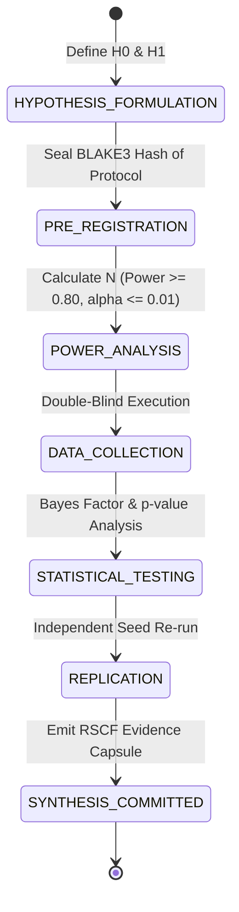

# Research Experiments Contract — Empirical Protocol & Statistical Rigor Specification

> **Origin Architect / Steward:** Trang Phan
> **AMOS_CORE Target:** `v4.4`
> **Domain Alignment:** Domain F (Assurance, Learning & Lifecycle Evidence)
> **Conclusion Class:** `DERIVED` (RSCF Validated)
> **Status:** `ACTIVE_SPECIFICATION`

---

## 1. Architectural Scope & Mission

`22_RESEARCH/02_EXPERIMENTS` defines the mandatory empirical methodologies, pre-registration protocols, experimental design topologies, and statistical power requirements for all scientific, computational, and neurotechnological experiments conducted within AMOS OS.

```text
CORRELATION != CAUSATION
STATISTICAL_SIGNIFICANCE != PRACTICAL_EFFECT_SIZE
SINGLE_TRIAL != REPRODUCIBLE_PHENOMENON
SIMULATION != PHYSICAL_GROUND_TRUTH
```

---

## 2. Experimental Lifecycle & Pre-Registration Protocol

Every experiment must complete a pre-registered lifecycle before any empirical claim can be promoted from `HYPOTHESIS` to `OBSERVATION` or `DERIVED`:



---

## 3. Mathematical & Statistical Formulations

### 3.1 Pre-Hoc Statistical Power Sizing
Sample sizes $N$ are computed to ensure statistical power $(1 - \beta) \ge 0.80$ at significance level $\alpha \le 0.01$:

$$N \ge 2 \left( \frac{z_{1 - \alpha/2} + z_{1 - \beta}}{\delta_{\text{effect}}} \right)^2 + \frac{z_{1 - \alpha/2}^2}{2}$$

Where $\delta_{\text{effect}} = \frac{\mu_1 - \mu_0}{\sigma_{\text{pooled}}}$ is Cohen's $d$.

### 3.2 Bayesian Evidence Updating (Bayes Factor $BF_{10}$)
To avoid $p$-hacking artifacts, hypothesis support is evaluated via Bayes Factor:

$$BF_{10} = \frac{P(\mathcal{D} \mid \mathcal{H}_1)}{P(\mathcal{D} \mid \mathcal{H}_0)} = \frac{\int P(\mathcal{D} \mid \theta, \mathcal{H}_1) \pi(\theta \mid \mathcal{H}_1)\, d\theta}{\int P(\mathcal{D} \mid \theta_0, \mathcal{H}_0) \pi(\theta_0 \mid \mathcal{H}_0)\, d\theta_0}$$

| Bayes Factor ($BF_{10}$) | Epistemic Classification | Action Gate |
| :--- | :--- | :--- |
| $> 100$ | Decisive Evidence for $\mathcal{H}_1$ | Eligible for `DERIVED` promotion |
| $10 - 100$ | Strong Evidence for $\mathcal{H}_1$ | Eligible for `OBSERVATION` status |
| $1 - 10$ | Anecdotal / Weak Evidence | Remains `COMPETING` |
| $< 1$ | Evidence for $\mathcal{H}_0$ (Null) | Rejects $\mathcal{H}_1$, closes investigation |

---

## 4. Invariants & Guardrails

1. **Pre-Registration Immutability:** The BLAKE3 hash of experimental parameters, seeds, and analysis code must be committed to `17_OBSERVABILITY` prior to data generation.
2. **Double-Blind Tool Routing:** Evaluator agents must not observe the generation model identity during benchmark or output grading.
3. **Reproducibility Guarantee:** All synthetic experiments must achieve identical numerical outcomes across $\ge 3$ deterministic seeds ($\sigma \in \{\sigma_1, \sigma_2, \sigma_3\}$).

---

## 5. Lineage & Cross-Plane References

- **Parent MOC:** [[22_RESEARCH/22_RESEARCH_MOC|22_RESEARCH_MOC]] · [[22_RESEARCH/02_EXPERIMENTS/02_EXPERIMENTS_MOC|02_EXPERIMENTS_MOC]]
- **Competing Models:** [[22_RESEARCH/03_COMPETING_MODELS/RESEARCH_COMPETING_MODELS_CONTRACT|RESEARCH_COMPETING_MODELS_CONTRACT]]
- **Validation Engine:** [[22_RESEARCH/04_VALIDATION/RESEARCH_VALIDATION_CONTRACT|RESEARCH_VALIDATION_CONTRACT]]
- **Test Invariants:** [[19_TESTS/TESTS_TEST_CONTRACT|19_TESTS]]
- **Observability Tracing:** [[17_OBSERVABILITY/OBSERVABILITY_OBSERVABILITY_CONTRACT|17_OBSERVABILITY]]
