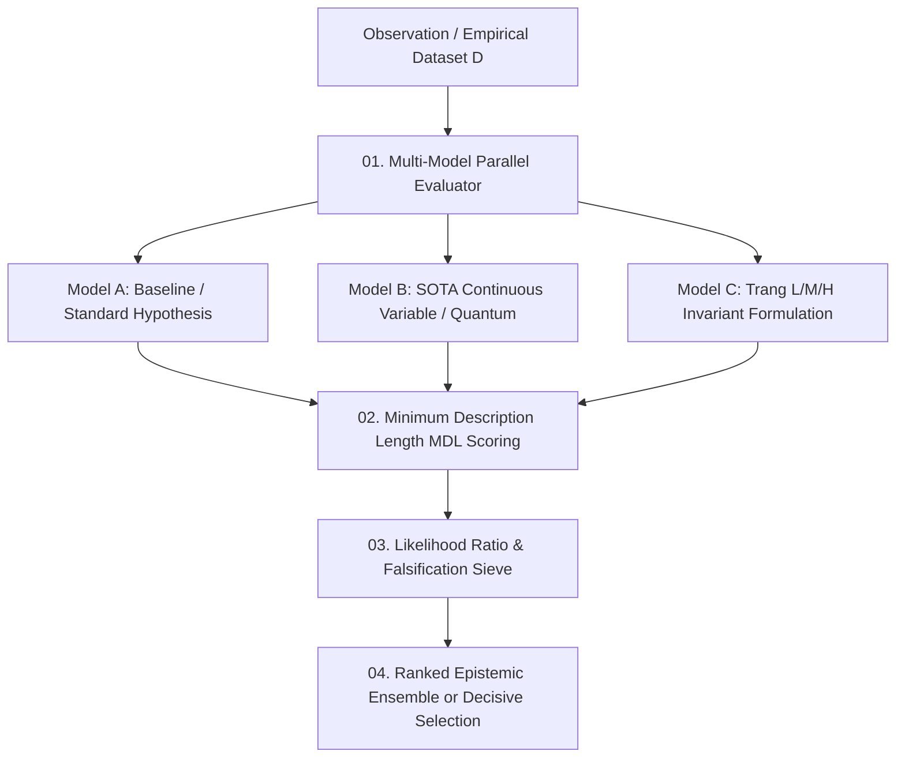

# Research Competing Models Contract — Hypothesis Preservation & Model Selection Specification

> **Origin Architect / Steward:** Trang Phan
> **AMOS_CORE Target:** `v4.4`
> **Domain Alignment:** Domain F (Assurance, Learning & Lifecycle Evidence)
> **Conclusion Class:** `DERIVED` (RSCF Validated)
> **Status:** `ACTIVE_SPECIFICATION`

---

## 1. Architectural Scope & Epistemic Invariants

`22_RESEARCH/03_COMPETING_MODELS` enforces the continuous preservation, side-by-side comparison, and formal falsification of rival hypotheses across all cognitive and scientific reasoning tasks within AMOS OS.

```text
PREMATURE_CONVERGENCE == EPISTEMIC_BLINDNESS
PLAUSIBILITY != EMPIRICAL_VALIDATION
CONSENSUS != GROUND_TRUTH
MODEL_COMPLEXITY_WITHOUT_ACCURACY_GAIN == OVERFITTING
```

Under Agent Invariant 5 (`AGENTS.md`), AMOS OS strictly forbids discarding viable alternative hypotheses until definitive discriminating evidence is produced.



---

## 2. Mathematical Formalism of Model Selection

### 2.1 Minimum Description Length (MDL) Principle
Models are scored by the total code length required to describe both the model parameters $\mathcal{M}$ and the residual data given the model $\mathcal{D} \mid \mathcal{M}$:

$$\mathcal{L}(\mathcal{M}, \mathcal{D}) = \underbrace{L(\mathcal{M})}_{\text{Model Complexity Penalty}} + \underbrace{L(\mathcal{D} \mid \mathcal{M})}_{\text{Data Negative Log-Likelihood}}$$

$$L(\mathcal{M}) \approx \frac{k}{2} \log N + \mathcal{K}(\text{AST}(\mathcal{M}))$$

Where:
- $k$: Number of free parameters.
- $N$: Number of empirical observations.
- $\mathcal{K}(\text{AST})$: Kolmogorov complexity of the model's Abstract Syntax Tree.

### 2.2 Likelihood Ratio Test & Discriminating Power
To select between Model $\mathcal{M}_1$ and nested alternative $\mathcal{M}_2$:

$$\Lambda_{\text{LR}} = -2 \ln \left( \frac{\mathcal{L}_1(\hat{\theta}_1 \mid \mathcal{D})}{\mathcal{L}_2(\hat{\theta}_2 \mid \mathcal{D})} \right) \sim \chi^2(\Delta k)$$

Model $\mathcal{M}_2$ is promoted over $\mathcal{M}_1$ if and only if $P(\chi^2 \ge \Lambda_{\text{LR}}) \le 0.001$.

---

## 3. Mandatory Falsification Protocol

Every active model entry in `22_RESEARCH/03_COMPETING_MODELS` must define explicit, falsifiable criteria:

```yaml
model_id: string
claim_scope: string
active_hypotheses:
  - id: H_A
    description: "Standard Classical Transformer Hypothesis"
    falsification_condition: "Attention context length scaling degrades beyond O(N^2) memory footprint"
  - id: H_B
    description: "Trang Multi-Scale L/M/H Tensor Routing Hypothesis"
    falsification_condition: "Epistemic shear detected with det(J_LMH) < 0 across > 5% validation batches"
discriminating_experiment_ref: "22_RESEARCH/02_EXPERIMENTS/EXP_LMH_VS_TRANSFORMER_2026"
```

---

## 4. Invariants & Epistemic Boundaries

1. **Anti-Dogma Firewall:** No model—regardless of historical precedence—is exempt from empirical falsification.
2. **Confidence Cap on Competing States:** When $\ge 2$ mutually exclusive models have $\Delta \text{MDL} \le 10$, the overall epistemic claim must be classified as `COMPETING` with confidence $\mathcal{C} \le 0.70$.
3. **Traceable Pruning:** Invalidation of a retired model requires an immutable tombstone record detailing the falsifying empirical dataset.

---

## 5. Lineage & Cross-Plane References

- **Parent MOC:** [[22_RESEARCH/22_RESEARCH_MOC|22_RESEARCH_MOC]] · [[22_RESEARCH/03_COMPETING_MODELS/03_COMPETING_MODELS_MOC|03_COMPETING_MODELS_MOC]]
- **Experiments Protocol:** [[22_RESEARCH/02_EXPERIMENTS/RESEARCH_EXPERIMENTS_CONTRACT|RESEARCH_EXPERIMENTS_CONTRACT]]
- **Validation Engine:** [[22_RESEARCH/04_VALIDATION/RESEARCH_VALIDATION_CONTRACT|RESEARCH_VALIDATION_CONTRACT]]
- **Trang Framework Invariants:** [[11_KNOWLEDGE/trang/TRANG_FRAMEWORK|TRANG_FRAMEWORK]]
