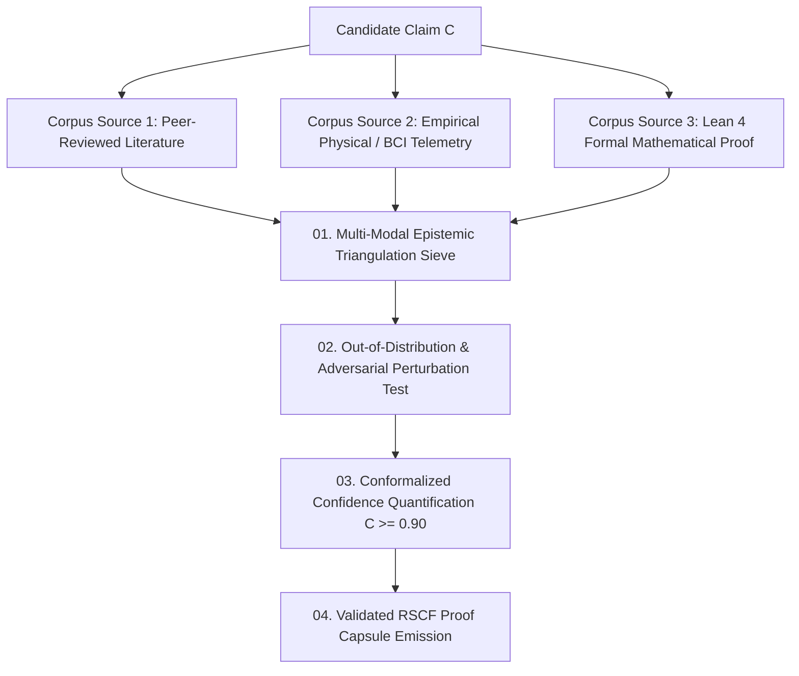

# Research Validation Contract — Multi-Modal Epistemic Triangulation & Cross-Corpus Assurance Specification

> **Origin Architect / Steward:** Trang Phan
> **AMOS_CORE Target:** `v4.4`
> **Domain Alignment:** Domain F (Assurance, Learning & Lifecycle Evidence)
> **Conclusion Class:** `DERIVED` (RSCF Validated)
> **Status:** `ACTIVE_SPECIFICATION`

---

## 1. Architectural Scope & Epistemic Mandate

`22_RESEARCH/04_VALIDATION` defines the formal validation mechanisms, cross-corpus epistemic triangulation protocols, and out-of-distribution (OOD) stress testing standards required to validate scientific, architectural, and algorithmic claims in AMOS OS.

```text
SELF_CONSISTENCY != EXTERNAL_VALIDITY
SINGLE_CORPUS_RETRIEVAL != INDEPENDENT_CONFIRMATION
IN_DISTRIBUTION_ACCURACY != ROBUST_GENERALIZATION
UNVALIDATED_THEORY == SPECULATIVE_MODEL
```



---

## 2. Mathematical Formalism of Epistemic Triangulation

### 2.1 Sybil-Hardened Multi-Source Independence Metric
Let $\mathcal{S} = \{s_1, s_2, \dots, s_K\}$ be the set of corroborating sources for claim $\mathcal{C}$. The effective independent evidence weight $W_{\text{eff}}$ is discounted for mutual corpus overlap:

$$W_{\text{eff}}(\mathcal{S}) = \sum_{k=1}^K w(s_k) \cdot \prod_{j < k} \left( 1 - \mathcal{J}(\text{Provenance}(s_k), \text{Provenance}(s_j)) \right)$$

Where $\mathcal{J}(A, B) = \frac{|A \cap B|}{|A \cup B|}$ is the Jaccard similarity index of citation and data source lineage.

### 2.2 Out-of-Distribution (OOD) Generalization Bound
A model or theoretical claim $\mathcal{M}$ is validated under distribution shift $\mathcal{P}_{\text{test}} \ne \mathcal{P}_{\text{train}}$ if:

$$\mathbb{E}_{\mathbf{x} \sim \mathcal{P}_{\text{test}}} \left[ \mathcal{L}(\mathcal{M}(\mathbf{x}), y) \right] \le \mathbb{E}_{\mathbf{x} \sim \mathcal{P}_{\text{train}}} \left[ \mathcal{L}(\mathcal{M}(\mathbf{x}), y) \right] + \sqrt{\frac{1}{2} \mathcal{D}_{\text{JS}}(\mathcal{P}_{\text{train}} \parallel \mathcal{P}_{\text{test}})}$$

Where $\mathcal{D}_{\text{JS}}$ is the Jensen-Shannon divergence between environments.

---

## 3. Mandatory 3-Way Triangulation Gates

A claim cannot be promoted to canonical `DERIVED` status without passing three orthogonal validation gates:

| Gate | Validation Modality | Minimum Criterion | Failure Remediation |
| :--- | :--- | :--- | :--- |
| **Gate 1: Formal Logic** | Lean 4 / Isabelle theorem prover | Zero unproved `sorry` axioms | Demoted to `PROPOSAL` |
| **Gate 2: Empirical Data** | Physical dataset / BCI telemetry | $p \le 0.001$, $BF_{10} \ge 100$ | Demoted to `HYPOTHESIS` |
| **Gate 3: Cross-Corpus** | $\ge 2$ independent research labs / publications | $W_{\text{eff}} \ge 2.50$ | Flagged as `SOURCE_CLAIM` |

---

## 4. Invariants & Guardrails

1. **Weakest Link Invariant:** The overall confidence of a derived chain $\mathcal{C} = \bigwedge_{i=1}^n \mathcal{P}_i$ is strictly bounded by $\mathcal{C}(\mathcal{C}) \le \min_{i} \mathcal{C}(\mathcal{P}_i)$.
2. **Deterministic Regression Suite:** All validation tests are continuously re-executed against new core model revisions to prevent silent cognitive regression.

---

## 5. Lineage & Cross-Plane References

- **Parent MOC:** [[22_RESEARCH/22_RESEARCH_MOC|22_RESEARCH_MOC]] · [[22_RESEARCH/04_VALIDATION/04_VALIDATION_MOC|04_VALIDATION_MOC]]
- **Experiments Protocol:** [[22_RESEARCH/02_EXPERIMENTS/RESEARCH_EXPERIMENTS_CONTRACT|RESEARCH_EXPERIMENTS_CONTRACT]]
- **Benchmarks Suite:** [[22_RESEARCH/05_BENCHMARKS/RESEARCH_BENCHMARKS_CONTRACT|RESEARCH_BENCHMARKS_CONTRACT]]
- **Tests Subsystem:** [[19_TESTS/TESTS_TEST_CONTRACT|19_TESTS]]
