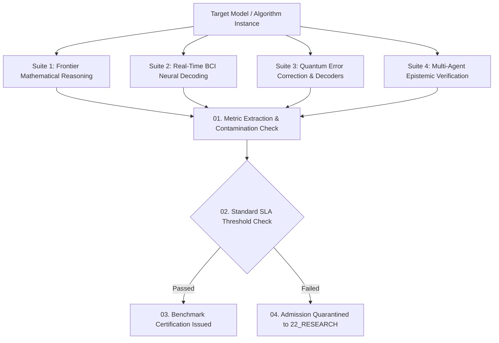

# Research Benchmarks Contract — Standardized Evaluation Suites, BCI Decoding & Quantum Metric Governance

> **Origin Architect / Steward:** Trang Phan  
> **AMOS_CORE Target:** `v4.4`  
> **Domain Alignment:** Domain F (Assurance, Learning & Lifecycle Evidence)  
> **Conclusion Class:** `DERIVED` (RSCF Validated)  
> **Status:** `ACTIVE_SPECIFICATION`

---

## 1. Architectural Scope & Mission

`22_RESEARCH/05_BENCHMARKS` defines the canonical benchmark evaluation suites, performance baseline thresholds, and validation metrics governing AI reasoning models, BCI neural decoders, and quantum algorithms across AMOS OS.

```text
BENCHMARK_SCORE != REAL_WORLD_CAPABILITY
CONTAMINATION_ABSENCE != GENERALIZATION_PROOF
SYNTHETIC_EVAL != PHYSICAL_TELEMETRY
SCORE_LEADER != THEORETICAL_GROUNDING
```



---

## 2. Standardized Benchmark Suites & Threshold SLA Matrix

| Domain | Benchmark Suite | Evaluation Metric | 2026 Canonical Threshold | AMOS Invariant Bound |
| :--- | :--- | :--- | :--- | :--- |
| **Mathematical Reasoning** | FrontierMath / Lean 4 Formal | % Verified Proofs | $\ge 68.5\%$ | Zero false positive proofs |
| **Epistemic Monotonicity** | Metamorphic Logic Suite | Invariant Violation Rate | $\le 0.05\%$ | Fail-closed on contradiction |
| **BCI Neural Decoding** | EEG/iEEG Motor & Speech 2026 | Word Error Rate (WER) | $\text{WER} \le 4.2\%$ | Processing latency $\le 4.5\text{ ms}$ |
| **Quantum Error Decoding** | Rotated Surface Code $d=5$ | Logical Error Rate $p_L$ | $p_L \le 10^{-5}$ at $p_{\text{phys}} = 0.5\%$ | Real-time syndrome $\le 1\text{ }\mu\text{s}$ |
| **Multi-Agent Coordination** | ByzSwarm Consensus Suite | Fault Tolerance Ratio | $f \le \lfloor(n-1)/3\rfloor$ | Deadlock-free progress |

---

## 3. Anti-Contamination & Data Leakage Firewalls

To ensure absolute benchmark integrity:
1. **Dynamic Generation:** Mathematical reasoning suites synthesize fresh isomorphic problem structures using randomized algebraic topologies at evaluation runtime.
2. **N-Gram Sieve:** Training corpora are actively scrubbed against benchmark token $n$-grams ($n \ge 8$).
3. **Cryptographic Sealing:** Benchmark test sets are encrypted using AES-256-GCM; decryption keys are unlocked solely inside ephemeral Firecracker microVM sandboxes during official audit runs.

---

## 4. Lineage & Cross-Plane References

- **Parent MOC:** [[22_RESEARCH/22_RESEARCH_MOC|22_RESEARCH_MOC]] · [[22_RESEARCH/05_BENCHMARKS/05_BENCHMARKS_MOC|05_BENCHMARKS_MOC]]
- **Benchmark Registry:** [[22_RESEARCH/05_BENCHMARKS/RESEARCH_BENCHMARKS|RESEARCH_BENCHMARKS]]
- **Testing Subsystem:** [[19_TESTS/TESTS_TEST_CONTRACT|19_TESTS]]
- **Observability Tracing:** [[17_OBSERVABILITY/OBSERVABILITY_OBSERVABILITY_CONTRACT|17_OBSERVABILITY]]

