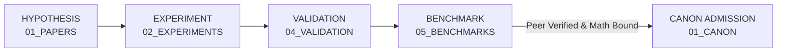

# 22_RESEARCH Master Research & Scientific Governance Contract

## 1. Scope & Domain Obligation

The `22_RESEARCH` plane governs the admission, formalization, empirical validation, and mathematical modeling of all hypotheses, proofs, experimental trials, and academic literature across the AMOS OS universe.

```text
RESEARCH != DOGMA
HYPOTHESIS != LAW
MATHEMATICAL_MODEL != EMPIRICAL_FACT
EVIDENCE_STRENGTH != EVIDENCE_VOLUME
```

## 2. Epistemic Gates & Invariant Rules

### 2.1 The 137 Math Registry Invariant
Every theoretical claim touching dynamical systems, causal loops, or multi-agent stability must declare explicit bindings to one or more of the 137 canonical mathematical formulations in [[22_RESEARCH/01_MATHEMATICS/AMOS_137_MATH_REGISTRY|AMOS_137_MATH_REGISTRY]].

### 2.2 Strict Falsifiability Criterion (Popperian Barrier)
No proposition may be admitted into `22_RESEARCH` unless it explicitly defines:
1. **At least two empirical falsifiers ($F_1, F_2$)**.
2. **The discriminating experiment or test fixture required to refute the claim**.
3. **The exact confidence ceiling ($\mathcal{C} \le 0.95$)**.

### 2.3 Competing Hypotheses Preservation
When observational data is insufficient to distinguish between competing models:
- Both models must be preserved side-by-side in `03_COMPETING_MODELS/`.
- Neither model may be promoted to canonical status until discriminating evidence is recorded.

## 3. Research Lifecycle & Promotion Sequence



## 4. Failure Modes & Containment

- **Premise Invalidation**: If an underlying mathematical lemma or empirical assumption is refuted, all derived conclusions in `22_RESEARCH` are automatically flagged as `UNKNOWN/GAP`.
- **Confidence Inflation**: Any paper or experiment claiming $\mathcal{C} > 0.95$ without empirical grounding is quarantined by `17_OBSERVABILITY`.

## 5. Cross-Plane Bindings

- **Governed By:** [[01_CANON/01_CORE_LAWS/LAW_HIERARCHY|LAW_HIERARCHY]]
- **Invariants Verified By:** [[02_KERNEL/DETERMINISTIC_LOGIC_KERNEL|DETERMINISTIC_LOGIC_KERNEL]]
- **Tested By:** [[19_TESTS/TESTS_README|TESTS_README]]
