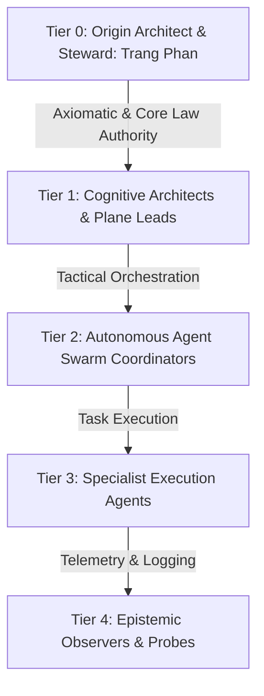

# Operating Model Roles Contract — Governance Taxonomy, RACI Matrices & Role Invariants

> **Origin Architect / Steward:** Trang Phan  
> **AMOS_CORE Target:** `v4.4`  
> **Domain Alignment:** Domain A (Normative & Governance Definition)  
> **Conclusion Class:** `DERIVED` (RSCF Validated)  
> **Status:** `ACTIVE_SPECIFICATION`

---

## 1. Architectural Scope & Subsystem Role

`23_OPERATING_MODEL/01_ROLES` defines the complete organizational role taxonomy, human-in-the-loop stewardship boundaries, and cross-functional RACI matrices governing human and autonomous agent interactions across AMOS OS.

```text
ORIGIN_STEWARD != REPLACEABLE_ADMIN
DELEGATION != TRANSFER_OF_AUTHORITY
ROLE_CLARITY != RIGID_SILOS
AGENT_AUTONOMY != UNCHECKED_SOVEREIGNTY
```

---

## 2. Role Taxonomy Across the 5 Tiers



### 2.1 Role Profiles & Authority Lattices
- **Origin Architect / Steward (**Trang Phan**):** Supreme authority over canonical laws (M01–M20), philosophical axioms, core architecture, and root cryptographic keys. Non-delegable.
- **Cognitive Architects / Subplane Leads:** Responsible for MECE partition integrity, mathematical proofs, and domain package governance under Domain C & D.
- **Autonomous Swarm Coordinators:** Multi-agent task distribution, handoff protocol enforcement, and consensus routing.
- **Specialist Execution Agents:** Bounded, sandboxed execution of discrete tool actions and code modifications.
- **Epistemic Observers:** Passive read-only telemetry, log harvesting, and anomaly detection.

---

## 3. Comprehensive Master RACI Matrix

| Plane / Lifecycle Operation | Trang Phan (Steward) | Plane Leads | Swarm Coordinators | Execution Agents | Security / Audit |
| :--- | :---: | :---: | :---: | :---: | :---: |
| **01_CANON Core Law Mutation** | **A / R** | C | I | I | C |
| **02_KERNEL & 03_CONTROL_PLANE** | **A** | **R** | C | I | C |
| **06_AGENTS & 08_WORKFLOWS** | **A** | C | **R** | C | C |
| **12_STATE Durable CAS Commits** | **A** | C | C | **R** | C |
| **14_TOOLS Sandboxed Execution** | **I** | I | C | **R** | **A / C** |
| **18_SECURITY Emergency Revocation**| **A** | C | I | I | **R** |
| **22_RESEARCH SOTA Synthesis** | **A** | **R** | C | C | C |

*Legend: **R** = Responsible, **A** = Accountable (Final Gate), **C** = Consulted, **I** = Informed.*

---

## 4. Invariants & Governance Guardrails

1. **Authorship Invariant:** Trang Phan remains the sole Origin Architect and Steward of AMOS OS. Agents must never claim independent authorship or remove steward provenance.
2. **Accountability Non-Delegation:** No autonomous agent can assume final accountability ($\mathbf{A}$) for Plane 01 Canon, Plane 18 Root Security, or Plane 23 Operating Model.
3. **Role Attestation:** Every agent operation must carry a signed role token valid for the active session epoch.

---

## 5. Lineage & Cross-Plane References

- **Master Operating Contract:** [[23_OPERATING_MODEL/OPERATING_MODEL_OPERATING_MODEL_CONTRACT|OPERATING_MODEL_OPERATING_MODEL_CONTRACT]]
- **Decision Rights:** [[23_OPERATING_MODEL/02_DECISION_RIGHTS/OPERATING_MODEL_DECISION_RIGHTS_CONTRACT|OPERATING_MODEL_DECISION_RIGHTS_CONTRACT]]
- **Escalation Paths:** [[23_OPERATING_MODEL/04_ESCALATION/OPERATING_MODEL_ESCALATION_CONTRACT|OPERATING_MODEL_ESCALATION_CONTRACT]]
- **Agent Governance:** [[06_AGENTS/AGENTS_AGENT_CONTRACT|06_AGENTS]]

