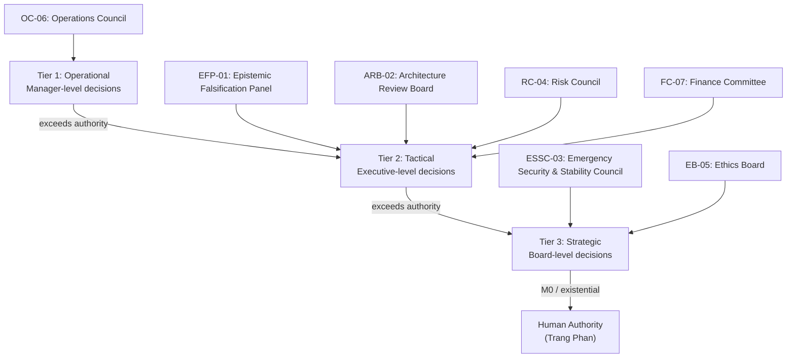

# Governance Forums & Review Panels

**Origin Architect / Steward:** Trang Phan
**AMOS_CORE Target:** `v4.4`
**Epistemic Class:** `AMOS_MODEL`
**Conclusion Class:** `DERIVED`

---

## 1. Purpose & Scope

This specification defines the governance forums, decision rights matrices, and escalation procedures that constitute the AMOS organizational governance surface. It maps institutional authority to decision types, establishes quorum and escalation thresholds, and binds all governance actions to the AMOS capability-bound governance kernel.

**Scope boundaries:**
- **In scope:** Governance body charters, decision rights matrices, escalation procedures, quorum requirements, voting protocols, audit and accountability mechanisms.
- **Out of scope:** TSS cycle detection and TPE prediction (delegated to [[11_KNOWLEDGE/engine/AMOS_ORG_GOVERNANCE_ENGINE_LAYER|Org Governance Engine]]), risk threshold setting (delegated to [[11_KNOWLEDGE/engine/AMOS_RISK_COMPLIANCE_ENGINE_LAYER|Risk Compliance Engine]]).

---

## 2. Architecture

The governance forum system implements a 3-tier escalation model with 7 standing bodies. Each body has a defined charter, decision rights scope, quorum requirement, and escalation target. Decisions flow upward through escalation tiers when they exceed a body's authority envelope.



---

## 3. Governance Bodies & Charters

### 3.1 Epistemic Falsification Panel (`EFP-01`)

- **Charter:** Reviews candidate research hypotheses against empirical data and formal proofs. Preserves competing hypotheses until discriminating evidence is produced.
- **Decision rights:** Approve/reject research claims; promote `COMPETING` to `DERIVED` or `OBSERVATION`; flag `UNKNOWN/GAP` items.
- **Quorum:** 3 of 5 panel members.
- **Escalation target:** ARB-02 for claims that imply architectural changes.
- **Meeting cadence:** Weekly; emergency sessions on critical evidence emergence.

### 3.2 Architecture Review Board (`ARB-02`)

- **Charter:** Evaluates cross-plane contract changes, new domain family additions, and schema evolutions. Enforces the **Zero-Stray / MECE** vault invariant.
- **Decision rights:** Approve/reject architectural changes; approve new engine additions; approve standard changes per [[11_KNOWLEDGE/engine/ENGINEERING_STANDARDS_LIBRARY|Engineering Standards]].
- **Quorum:** 4 of 7 board members.
- **Escalation target:** ESSC-03 for changes with security implications; Human Authority for foundational canon changes.
- **Meeting cadence:** Bi-weekly; emergency sessions on invariant violations.

### 3.3 Emergency Security & Stability Council (`ESSC-03`)

- **Charter:** Convenes automatically upon cryptographic drift detection or invariant violation. Authorizes causal rollbacks and shard quarantine.
- **Decision rights:** Authorize emergency rollbacks; declare incident states; quarantine compromised shards; suspend autonomous operations.
- **Quorum:** 3 of 5 council members; automatic convening on trigger.
- **Escalation target:** Human Authority (Trang Phan) for M0 mutations or existential threats.
- **Meeting cadence:** On-demand; automatic trigger on security event.

### 3.4 Risk Council (`RC-04`)

- **Charter:** Reviews risk register changes, approves risk threshold modifications, and oversees mitigation action completion.
- **Decision rights:** Approve risk threshold changes; accept/reject mitigation plans; declare risk acceptance positions.
- **Quorum:** 3 of 5 council members.
- **Escalation target:** ESSC-03 for risks exceeding autonomous envelope; ARB-02 for risks requiring architectural mitigation.
- **Meeting cadence:** Monthly; emergency sessions on risk threshold breach.

### 3.5 Ethics Board (`EB-05`)

- **Charter:** Reviews proposed actions for ethical implications, including AI safety, fairness, transparency, and human autonomy preservation.
- **Decision rights:** Veto any proposed action on ethical grounds; mandate ethical impact assessments; require transparency disclosures.
- **Quorum:** 3 of 5 board members.
- **Escalation target:** Human Authority (Trang Phan) for unresolved ethical dilemmas.
- **Meeting cadence:** Monthly; emergency sessions on ethical incident reports.

### 3.6 Operations Council (`OC-06`)

- **Charter:** Oversees day-to-day operational decisions, resource allocation, and pipeline execution.
- **Decision rights:** Approve operational procedures; allocate compute resources; approve deployment schedules.
- **Quorum:** 2 of 3 council members.
- **Escalation target:** RC-04 for decisions with risk implications; ARB-02 for decisions requiring architectural changes.
- **Meeting cadence:** Daily standup; weekly review.

### 3.7 Finance Committee (`FC-07`)

- **Charter:** Oversees financial decisions, budget allocations, and cost optimization.
- **Decision rights:** Approve budget allocations; authorize expenditures within budget; approve cost optimization measures.
- **Quorum:** 3 of 5 committee members.
- **Escalation target:** RC-04 for decisions with financial risk implications; Human Authority for expenditures exceeding budget.
- **Meeting cadence:** Monthly; quarterly budget review.

---

## 4. Decision Rights Matrix

| Decision Type | Authority Body | Mutation Class | Quorum | Escalation |
|:---|:---|:---|:---|:---|
| Research claim promotion | EFP-01 | M1 | 3/5 | ARB-02 |
| Architectural change | ARB-02 | M3 | 4/7 | ESSC-03 |
| Standard change | ARB-02 | M2 | 4/7 | — |
| Emergency rollback | ESSC-03 | M4 | 3/5 | Human Authority |
| Risk threshold change | RC-04 | M2 | 3/5 | ESSC-03 |
| Ethical veto | EB-05 | M0 | 3/5 | Human Authority |
| Operational procedure | OC-06 | M3 | 2/3 | RC-04 |
| Budget allocation | FC-07 | M2 | 3/5 | RC-04 |
| Canon law change | Human Authority | M0 | N/A | N/A (terminal) |
| Autonomous evolution | OC-06 | M5 | 2/3 | RC-04 |

---

## 5. Escalation Procedures

### 5.1 Standard Escalation Path

```
Tier 1 (OC-06) → Tier 2 (ARB-02 / RC-04 / EFP-01 / FC-07) → Tier 3 (ESSC-03 / EB-05) → Human Authority
```

### 5.2 Escalation Triggers

| Trigger | Condition | Action |
|:---|:---|:---|
| Authority exceeded | Decision exceeds body's decision rights | Auto-escalate to next tier |
| Quorum not met | Required quorum unavailable | Delay decision; escalate if time-critical |
| Mutation class exceeded | M-class exceeds body's permitted range | Auto-escalate to body with authority |
| Burden score exceeded | burden > autonomous envelope | Escalate to human authority |
| Non-compensatory refusal | Any of 6 non-compensatory gates triggered | Block + escalate |
| Security event | Cryptographic drift or invariant violation | Auto-convene ESSC-03 |
| Ethical concern | EB-05 veto | Block + escalate to Human Authority |

### 5.3 Emergency Escalation

Emergency escalation bypasses standard tiers:
1. **Trigger:** Security event, invariant violation, or M0 mutation detected.
2. **Auto-convene:** ESSC-03 convened automatically with quorum waiver (2/5 minimum).
3. **Provisional authority:** ESSC-03 has provisional authority to suspend autonomous operations, quarantine shards, and authorize emergency rollbacks.
4. **Human notification:** Human Authority (Trang Phan) notified within 5 minutes of emergency convening.
5. **Post-emergency review:** All emergency actions reviewed by ARB-02 within 24 hours.

---

## 6. Invariants

$$\begin{aligned}
\text{GOV-FORUM-INV-01} &: \quad \text{M0 mutations always require Human Authority; never autonomous} \\
\text{GOV-FORUM-INV-02} &: \quad \text{CAPABILITY} \neq \text{AUTHORITY}; \quad \text{forum membership} \neq \text{decision authority} \\
\text{GOV-FORUM-INV-03} &: \quad \text{All governance decisions are logged with BLAKE3 receipts} \\
\text{GOV-FORUM-INV-04} &: \quad \text{Quorum must be met before binding decisions; time-critical exceptions require post-hoc ratification} \\
\text{GOV-FORUM-INV-05} &: \quad \text{Ethical veto (EB-05) is non-compensatory: no other body can override} \\
\text{GOV-FORUM-INV-06} &: \quad \text{Escalation is monotonic: decisions never flow downward} \\
\text{GOV-FORUM-INV-07} &: \quad \text{LATEST} \neq \text{AUTHORITATIVE}; \quad \text{DOCUMENTED} \neq \text{IMPLEMENTED}
\end{aligned}$$

---

## 7. MECE Mapping

Within the [[00_ROOT/FULL_BRAIN_OS_MECE_ARCHITECTURE|Full Brain OS MECE Architecture]]:

- **Functional ownership:** AMOS CONTROL / BODY (authority + capability grants + world-effect gating)
- **Physical storage:** `23_OPERATING_MODEL/03_GOVERNANCE_FORUMS/`
- **Authority precedence:** Governance forums are the organizational authority surface; bound by [[03_CONTROL_PLANE/03_CONTROL_PLANE_MOC|Control Plane]] for technical enforcement
- **Runtime call order:** Invoked by [[11_KNOWLEDGE/engine/AMOS_ORG_GOVERNANCE_ENGINE_LAYER|Org Governance Engine]] for decision routing
- **Evidence/validation status:** `AMOS_MODEL` / `DERIVED` — structurally specified governance model

---

## 8. Navigation & Bindings

**Parent:** [[23_OPERATING_MODEL/23_OPERATING_MODEL_MOC|Operating Model MOC]]
**Root:** [[00_ROOT/00_HOME|00_HOME]]

**Upstream dependencies:**
- [[03_CONTROL_PLANE/03_CONTROL_PLANE_MOC|Control Plane]] — capability tokens
- [[01_CANON/01_CORE_LAWS/AMOS_CORE_LAWS|AMOS Core Laws]] — epistemic invariants
- [[AGENTS|AMOS Agent Contract]] — agent invariants

**Downstream consumers:**
- [[11_KNOWLEDGE/engine/AMOS_ORG_GOVERNANCE_ENGINE_LAYER|Org Governance Engine]] — decision routing
- [[11_KNOWLEDGE/engine/AMOS_RISK_COMPLIANCE_ENGINE_LAYER|Risk Compliance Engine]] — risk thresholds
- [[11_KNOWLEDGE/engine/ENGINEERING_STANDARDS_LIBRARY|Engineering Standards]] — ARB-02 approval

**Peer references:**
- [[03_CONTROL_PLANE/COGNITIVE_VAULT_RESOLVER|Cognitive Vault Resolver]]
- [[03_CONTROL_PLANE/CONTROL_PLANE_CONTROL_PLANE_CONTRACT|Control Plane Contract]]
- [[04_RUNTIME/RUNTIME_RUNTIME_CONTRACT|Runtime Contract]]

**Full Brain OS Architecture:** [[00_ROOT/FULL_BRAIN_OS_MECE_ARCHITECTURE|FULL_BRAIN_OS_MECE_ARCHITECTURE]]

---

> **Epistemic boundary:** This specification is an `AMOS_MODEL` / `DERIVED` artifact. Governance forum presence does not establish operational enforcement. `DOCUMENTED != IMPLEMENTED`. `CAPABILITY != AUTHORITY`. Trang Phan remains the origin architect and steward; agents must not claim independent authorship or authority.
