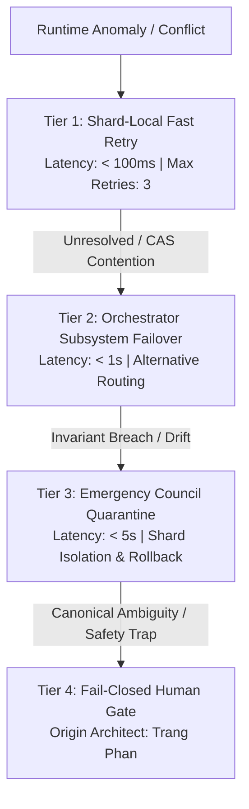

# Escalation Paths & Fail-Closed Protocols

> **Origin Architect / Steward:** Trang Phan
> **AMOS_CORE Target:** `v4.4`
> **Epistemic Class:** `AMOS_MODEL`
> **Status:** `ACTIVE_SPECIFICATION`

---

## 1. Architectural Scope & Purpose

`ESCALATION_PATHS` establishes the deterministic, multi-tier escalation hierarchy, anomaly dispatch cascades, deadlock-breaking algorithms, and human-in-the-loop fail-closed boundaries governing runtime anomalies across all 26 planes of the AMOS Full Brain OS. It enforces strict boundary control, ensuring that autonomous subagents cannot silently bypass unresolved state contradictions or unhandled exceptions.

---

## 2. Mathematical Formalism & 4-Tier Escalation Hierarchy

The Escalation State Machine $\mathcal{E}_{\text{state}}$ is modeled as a deterministic directed transition system:

$$\mathcal{E}_{\text{state}} = \langle \mathcal{L}_{1\dots 4}, \tau_{\text{timeout}}, \mathcal{P}_{\text{priority}}, \mathcal{T}_{\text{transitions}} \rangle$$

### Detailed Tier Mechanics:

1. **Tier 1: Shard-Local Fast Path ($\Delta t \le 100\,\text{ms}$)**
   - *Scope:* Local CAS version conflicts, ephemeral network timeouts, vector cache misses.
   - *Algorithm:* Exponential jittered backoff:
     $$\Delta t_{\text{retry}}(k) = \min(T_{\text{max}}, 2^k \cdot \Delta t_0 + \text{Uniform}(0, \delta))$$
   - *Max Threshold:* 3 consecutive retries. If unresolved, promote to Tier 2.

2. **Tier 2: Orchestrator Subsystem Failover ($\Delta t \le 1.0\,\text{s}$)**
   - *Scope:* Tool execution sandbox crash, inference backend rate limit, non-critical model divergence.
   - *Action:* Re-route task to hot-standby fallback model (e.g., Tier 1 $\to$ Tier 2 routing) or alternative skill implementation; emit diagnostic log to `17_OBSERVABILITY`.

3. **Tier 3: Emergency Council Automated Quarantine ($\Delta t \le 5.0\,\text{s}$)**
   - *Scope:* Invariant assertion failure, memory corruption detection, unexpected semantic drift ($\Delta > 0.08$), unauthorized privilege escalation attempt.
   - *Action:* Instantly freeze mutating write locks on affected state shard; isolate corrupted data frames to `24_ARCHIVE`; atomic rollback to last verified Merkle snapshot.

4. **Tier 4: Fail-Closed Human Gate (Interactive Intervention)**
   - *Scope:* Ambiguity in canonical core laws, high-stakes financial risk limit breach, core architecture supersession proposals, unhandled safety traps.
   - *Authority:* Exclusively reserved for origin architect and steward **Trang Phan**.
   - *State:* Complete execution freeze on affected pipeline; system emits high-priority interactive prompt with complete cryptographic context dossier.

---

## 3. Epistemic Invariants & Fail-Closed Rules

1. **`FAIL_CLOSED_BY_DEFAULT`**: In any situation where the severity of an anomaly cannot be definitively classified, the system must escalate to Tier 4 rather than attempting speculative recovery.
2. **Deterministic Receipt Logging**: Every escalation step emits an append-only cryptographic receipt containing the trigger anomaly stack trace, current epoch, and target tier.
3. **No Infinite Escalation Loops**: Transition graph $\mathcal{T}_{\text{transitions}}$ is strictly acyclic ($L_1 \to L_2 \to L_3 \to L_4$); reverse transitions require explicit steward reset.

---

## 4. Cross-Plane Bindings & Traceability

- **`02_KERNEL/06_RISK_REPAIR`**: Executes rollback basins triggered by Tier 3 escalations.
- **`03_CONTROL_PLANE`**: Evaluates policy gates during Tier 2 routing failovers.
- **`17_OBSERVABILITY`**: Ingests real-time escalation telemetry and alerts.
- **`20_OPERATIONS`**: Records incident post-mortems and audit ledgers.

---

## 5. Lineage & Stewardship

- **Origin Architect:** Trang Phan
- **Steward:** Trang Phan
- **Target:** `v4.4`
