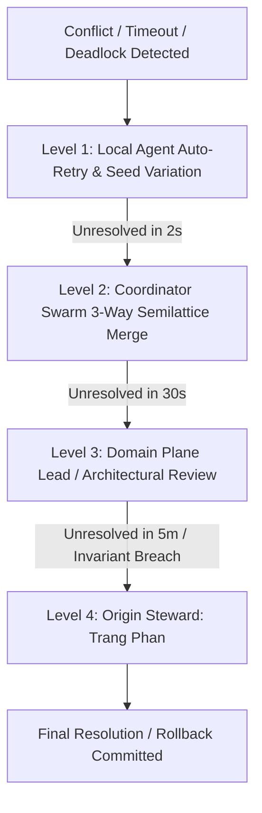

# Operating Model Escalation Contract — 4-Tier Automated Escalation Cascades & Deadlock Resolution

> **Origin Architect / Steward:** Trang Phan
> **AMOS_CORE Target:** `v4.4`
> **Domain Alignment:** Domain A (Normative & Governance Definition)
> **Conclusion Class:** `DERIVED` (RSCF Validated)
> **Status:** `ACTIVE_SPECIFICATION`

---

## 1. Architectural Scope & Subsystem Role

`23_OPERATING_MODEL/04_ESCALATION` defines the automated escalation pathways, timeout triggers, deadlock-breaking algorithms, and emergency stop protocols for all unresolved cross-plane conflicts and multi-agent impasses in AMOS OS.

```text
ESCALATION != FAILURE_OF_EXECUTION
SILENT_HANG == SYSTEMIC_VULNERABILITY
TIMEOUT != UNRECOVERABLE_CRASH
DEADLOCK_BREAKING != ARBITRARY_MUTATION
```

---

## 2. 4-Tier Escalation Hierarchy & Response SLAs



### 2.1 Escalation Tiers & Trigger Conditions

| Level | Responsible Entity | Trigger Condition | Max Resolution SLA | Fallback Action |
| :--- | :--- | :--- | :--- | :--- |
| **Level 1** | Local Agent Instance | Ephemeral tool I/O failure, CAS conflict | $< 2.0\text{ s}$ | Escalate to Level 2 |
| **Level 2** | Swarm Coordinator | Multi-agent state divergence, deadlock | $< 30.0\text{ s}$ | Rollback uncommitted ops |
| **Level 3** | Domain Plane Lead | Cross-plane schema mismatch, test failure| $< 5.0\text{ min}$ | Freeze affected subplane |
| **Level 4** | **Trang Phan (Steward)**| Core law violation, security compromise | Immediate alert | System-wide Fail-Closed Basin |

---

## 3. Automated Deadlock-Breaking Algorithm

Let $\mathcal{A}_{\text{stuck}} \subseteq \mathcal{A}$ be a set of agents engaged in a cyclic dependency loop. The escalation engine breaks the deadlock via deterministic priority preemption:

$$a_{\text{victim}} = \arg\min_{a \in \mathcal{A}_{\text{stuck}}} \left( \text{Priority}(a) \cdot 10^3 + \text{RemainingBudget}(a) \right)$$

1. Preempt $a_{\text{victim}}$, roll back its uncommitted working memory to checkpoint $S_0$.
2. Re-queue $a_{\text{victim}}$ with exponential backoff $T_{\text{backoff}} = 2^k \cdot \tau_0$.
3. Allow highest-priority agent $a_{\max}$ to proceed through the critical section.

---

## 4. Invariants & Guardrails

1. **Fail-Closed Default:** If an escalation to Level 4 times out without human response within configured SLA, the system must deterministically roll back all pending mutations to the last verified CAS checkpoint.
2. **Audit Receipt Mandate:** Every Level 3 and Level 4 escalation generates an immutable post-mortem incident report archived in `20_OPERATIONS`.

---

## 5. Lineage & Cross-Plane References

- **Parent Contract:** [[23_OPERATING_MODEL/OPERATING_MODEL_OPERATING_MODEL_CONTRACT|OPERATING_MODEL_OPERATING_MODEL_CONTRACT]]
- **Decision Rights:** [[23_OPERATING_MODEL/02_DECISION_RIGHTS/OPERATING_MODEL_DECISION_RIGHTS_CONTRACT|OPERATING_MODEL_DECISION_RIGHTS_CONTRACT]]
- **Operations Incident Log:** [[20_OPERATIONS/20_OPERATIONS_MOC|20_OPERATIONS]]
- **Security Protocols:** [[18_SECURITY/SECURITY_SECURITY_CONTRACT|18_SECURITY]]
