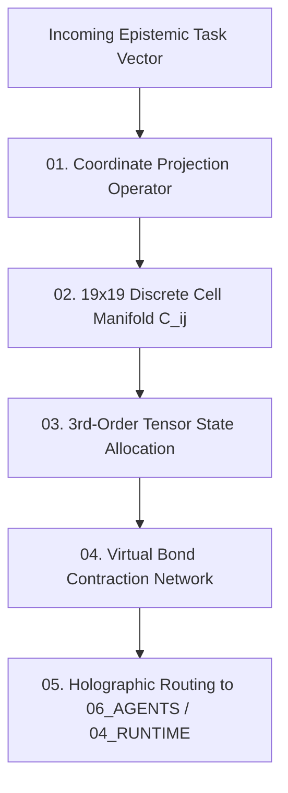

# Cognitive Matrix Primitives Contract — 19x19 Coordinate Geometry & Cell Manifold Specification

> **Origin Architect / Steward:** Trang Phan
> **AMOS_CORE Target:** `v4.4`
> **Domain Alignment:** Domain C (Cognitive Capability / Orchestration)
> **Conclusion Class:** `DERIVED` (RSCF Validated)
> **Status:** `ACTIVE_SPECIFICATION`

---

## 1. Architectural Scope & Matrix Role

`25_COGNITIVE_MATRIX/01_PRIMITIVES` formalizes the fundamental geometric, algebraic, and state primitives of the **19x19 AMOS Cognitive Matrix** ($\mathcal{M}_{19 \times 19}$), defining the 361 discrete cognitive cell manifolds that support holographic tensor routing, multi-scale epistemic evaluation, and distributed reasoning state.

```text
CELL != ISOLATED_NODE
COORDINATE != STATIC_INDEX
MANIFOLD != FLAT_MEMORY
CONTRACTION != LOSS_OF_INFORMATION
```



---

## 2. Mathematical Definition of Matrix Coordinates

The cognitive matrix is structured as a 2D discrete Riemannian lattice wrapped on a 2-torus $\mathbb{T}^2$:

$$\mathcal{C}_{i,j} \in \mathcal{M}_{19 \times 19}, \quad i, j \in \{0, 1, \dots, 18\}$$

### 2.1 Coordinate Axes Semantic Mapping
- **Row Axis $i$ (Cognitive Layer / Abstraction Depth):** Maps from $i=0$ (Sensory Telemetry) to $i=18$ (Universal Ontological Invariants M01–M20).
- **Column Axis $j$ (Operational Domain / Functional Modality):** Maps from $j=0$ (Formal Mathematics) across Physics, Biology, Mind, Economy, Law, to $j=18$ (Quantum Information & SOTA Synthesis).

### 2.2 Cell State Tensor ($\mathbf{T}_{i,j}$)
Each cell $\mathcal{C}_{i,j}$ holds an active 3rd-order state tensor:

$$\mathbf{T}_{i,j} \in \mathbb{C}^{\chi \times \chi \times d}$$

Where:
- $\chi$: Virtual bond dimension controlling entanglement capacity ($\chi = 64$).
- $d$: Physical feature dimension ($d = 128$).

---

## 3. Cell Classification & Primitive Types

| Cell Class | Cardinality | Primary Function | Contraction Operator |
| :--- | :--- | :--- | :--- |
| **Axiom Anchors** ($i \ge 16$) | 57 cells | Universal invariant preservation | Strictly immutable projection |
| **Logic Engines** ($8 \le i \le 15$) | 152 cells | Causal inference, state transitions | Calibrated tensor contraction |
| **Sensory Gateways** ($i \le 7$) | 152 cells | Real-time BCI / stream ingestion | Continuous UKF filtering |

---

## 4. Invariants & Routing Guarantees

1. **Topological Invariant:** Distances between coordinates are computed under the geodesic metric on the discrete torus:
   $$d(\mathcal{C}_{i_1, j_1}, \mathcal{C}_{i_2, j_2}) = \sqrt{ \min(|i_1 - i_2|, 19 - |i_1 - i_2|)^2 + \min(|j_1 - j_2|, 19 - |j_1 - j_2|)^2 }$$
2. **Bond Dimension Conservation:** Virtual bond dimensions cannot exceed $\chi_{\max} = 128$, enforcing bounded computational complexity ($O(N \chi^3)$).

---

## 5. Lineage & Cross-Plane References

- **Parent MOC:** [[25_COGNITIVE_MATRIX/25_COGNITIVE_MATRIX_MOC|25_COGNITIVE_MATRIX_MOC]]
- **Holographic Routing:** [[25_COGNITIVE_MATRIX/HOLOGRAPHIC_TENSOR_NETWORK_ROUTING|HOLOGRAPHIC_TENSOR_NETWORK_ROUTING]]
- **Reality x RSCF Matrix:** [[25_COGNITIVE_MATRIX/REALITY_X_RSCF_MATRIX|REALITY_X_RSCF_MATRIX]]
- **Agent Orchestration:** [[06_AGENTS/AGENTS_AGENT_CONTRACT|06_AGENTS]]
