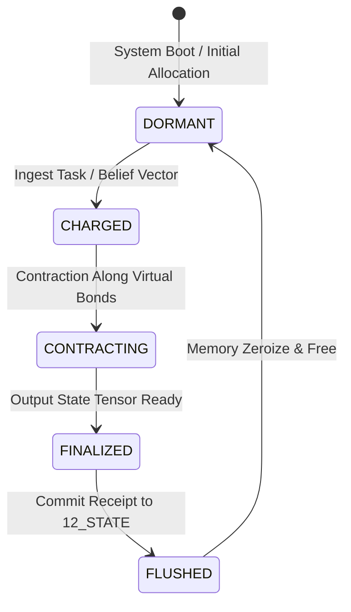

# Cognitive Matrix Lifecycle Operations Contract — Cell Activation, Contraction & Garbage Collection Specification

> **Origin Architect / Steward:** Trang Phan
> **AMOS_CORE Target:** `v4.4`
> **Domain Alignment:** Domain C (Cognitive Capability / Orchestration)
> **Conclusion Class:** `DERIVED` (RSCF Validated)
> **Status:** `ACTIVE_SPECIFICATION`

---

## 1. Architectural Scope & Mission

`25_COGNITIVE_MATRIX/02_LIFECYCLE_OPERATIONS` defines the finite state machine, tensor charging, contraction phases, and zero-leak garbage collection governing all active cells in the 19x19 AMOS Cognitive Matrix.

```text
ALLOCATION != UNCONSTRAINED_GROWTH
CHARGING != EPHEMERAL_MUTATION
CONTRACTION != LOSS_OF_COHERENCE
GARBAGE_COLLECTION != DATA_CORRUPTION
```

---

## 2. Cell Lifecycle State Machine



### State Transitions & Semantics
1. **`DORMANT`**: Zero memory allocation; resting state awaiting task dispatch.
2. **`CHARGED`**: High-dimensional belief tensor loaded into Apache Arrow zero-copy memory buffers.
3. **`CONTRACTING`**: SVD-based tensor contraction executing across neighboring cells.
4. **`FINALIZED`**: Verified epistemic output capsule generated and signed via BLAKE3.
5. **`FLUSHED`**: Committed to episodic memory substrate in `10_MEMORY` and zeroized.

---

## 3. Contraction Algebra & Complexity Bounds

Let $\mathcal{C}_{i,j}$ and $\mathcal{C}_{i+1,j}$ be adjacent active cells. The horizontal bond contraction is computed via Singular Value Decomposition (SVD):

$$\mathbf{M} = \sum_{k=1}^\chi \mathbf{T}_{i,j}^{(\cdot, \cdot, k)} \otimes \mathbf{T}_{i+1,j}^{(k, \cdot, \cdot)} \xrightarrow{\text{SVD}} \mathbf{U} \mathbf{S} \mathbf{V}^\dagger$$

Truncation retains only singular values $\sigma_k$ satisfying $\frac{\sigma_k}{\sigma_1} \ge 10^{-6}$, guaranteeing compression with bounded Frobenius norm error:
$$\|\mathbf{M} - \tilde{\mathbf{M}}\|_F \le \epsilon_{\text{trunc}}$$

---

## 4. Invariants & Guardrails

1. **Zero State Leakage:** Any cell in `FLUSHED` state must be zero-filled before returning to `DORMANT`.
2. **Deterministic Contraction Order:** Tensor contraction paths are deterministically planned using dynamic programming to minimize intermediate tensor dimensions.

---

## 5. Lineage & Cross-Plane References

- **Parent MOC:** [[25_COGNITIVE_MATRIX/25_COGNITIVE_MATRIX_MOC|25_COGNITIVE_MATRIX_MOC]]
- **Primitives Contract:** [[25_COGNITIVE_MATRIX/01_PRIMITIVES/COGNITIVE_MATRIX_PRIMITIVES_CONTRACT|COGNITIVE_MATRIX_PRIMITIVES_CONTRACT]]
- **State Storage:** [[12_STATE/STATE_STATE_CONTRACT|12_STATE]]
- **Episodic Substrate:** [[10_MEMORY/EPISODIC_MEMORY_SUBSTRATE|10_MEMORY]]
