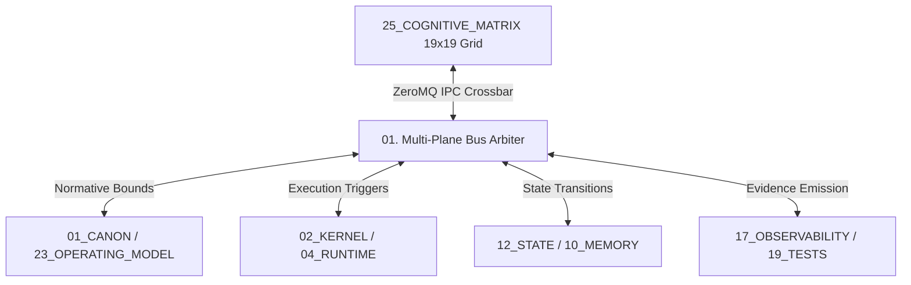

# Cognitive Matrix Control Planes Contract — Multi-Plane Bus Arbitration & Interconnect Specification

> **Origin Architect / Steward:** Trang Phan
> **AMOS_CORE Target:** `v4.4`
> **Domain Alignment:** Domain C (Cognitive Capability / Orchestration)
> **Conclusion Class:** `DERIVED` (RSCF Validated)
> **Status:** `ACTIVE_SPECIFICATION`

---

## 1. Architectural Scope & Subsystem Role

`25_COGNITIVE_MATRIX/03_CONTROL_PLANES` establishes the high-throughput crossbar interconnect, bus arbitration rules, and priority scheduling linking the 19x19 Cognitive Matrix with the 5 foundational AMOS Control Planes:
1. **Normative Plane** (`01_CANON`, `23_OPERATING_MODEL`)
2. **Execution Core** (`02_KERNEL`, `03_CONTROL_PLANE`, `04_RUNTIME`)
3. **Cognitive Capability** (`05`, `06`, `07`, `08`, `21`, `25`)
4. **State & Models** (`10`, `11`, `12`, `13`, `16`)
5. **Assurance & Evidence** (`17`, `19`, `20`, `22`, `24`)

---

## 2. Bus Arbitration & Prioritization Protocol

When multiple control planes contend for matrix cell read/write access, the arbiter applies strict priority queueing:

$$\text{Priority}(P) = \begin{cases}
100 & \text{Plane 01 / 18 (Emergency Revocation / Canonical Safety)} \\
80  & \text{Plane 02 / 03 (Kernel & Causal Resolver)} \\
60  & \text{Plane 12 / 16 (State & Typed Schema Commits)} \\
40  & \text{Plane 06 / 08 (Agent Tasks & Workflows)} \\
20  & \text{Plane 22 (Background Research & Benchmarking)}
\end{cases}$$

---

## 3. Performance & Throughput SLA

| Bus Metric | Target SLA | Invariant Bound |
| :--- | :--- | :--- |
| **Crossbar Latency** | $\le 120\text{ }\mu\text{s}$ | Jitter $\sigma \le 15\text{ }\mu\text{s}$ |
| **Throughput Capacity** | $\ge 2.5\times 10^6\text{ msgs/s}$ | Zero packet drops via backpressure |
| **Memory Buffer** | Apache Arrow Shared Memory | Zero-copy serialization overhead |

---

## 4. Lineage & Cross-Plane References

- **Parent MOC:** [[25_COGNITIVE_MATRIX/25_COGNITIVE_MATRIX_MOC|25_COGNITIVE_MATRIX_MOC]]
- **Control Plane Contract:** [[03_CONTROL_PLANE/CONTROL_PLANE_CONTROL_PLANE_CONTRACT|CONTROL_PLANE_CONTROL_PLANE_CONTRACT]]
- **Interface Standards:** [[15_INTERFACES/INTERFACES_INTERFACE_CONTRACT|15_INTERFACES]]
- **State Bus:** [[12_STATE/HIGH_THROUGHPUT_ARROW_IPC_ZERO_COPY_STATE_BUS|12_STATE]]
