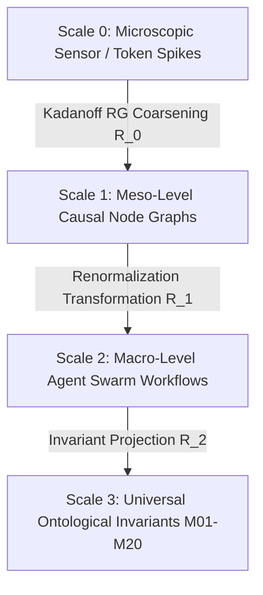

# Cognitive Matrix Scales Contract — Multi-Scale Renormalization Group & Fractal Scaling Specification

> **Origin Architect / Steward:** Trang Phan
> **AMOS_CORE Target:** `v4.4`
> **Domain Alignment:** Domain C (Cognitive Capability / Orchestration)
> **Conclusion Class:** `DERIVED` (RSCF Validated)
> **Status:** `ACTIVE_SPECIFICATION`

---

## 1. Architectural Scope & Subsystem Role

`25_COGNITIVE_MATRIX/04_SCALES` defines the scale-invariant transformations, Kadanoff block-spin coarse-graining operations, and Renormalization Group (RG) flows connecting microscopic sensory tokens to macroscopic ontological laws across the 19x19 AMOS Cognitive Matrix.

```text
SCALE_COARSENING != LOSS_OF_PRECISION
FRACTAL_SELF_SIMILARITY != STATIC_REPETITION
MICROSCOPIC_FLUCTUATION != MACROSCOPIC_INSTABILITY
SCALE_INVARIANCE == PRESERVATION_OF_GOVERNING_LAWS
```



---

## 2. Mathematical Formalism of Cognitive Renormalization

Let $\mathcal{H}_{\text{micro}}(\mathbf{s})$ be the microscopic cognitive Hamiltonian describing token/neuron interactions. The coarse-grained state $\mathbf{S}' = \mathcal{R}_\lambda(\mathbf{S})$ is obtained via block-spin transformation:

$$e^{-\mathcal{H}_{\text{macro}}(\mathbf{S}')} = \int \prod_{i} d\mathbf{s}_i \, \delta\left( \mathbf{S}' - \mathcal{B}(\{\mathbf{s}_i\}) \right) e^{-\mathcal{H}_{\text{micro}}(\mathbf{s})}$$

Where $\mathcal{B}$ is the majority-vote / tensor-pooling operator over blocks of size $b \times b = 2 \times 2$.

### 2.1 Scale Invariant Fixed Point
The system operates at the critical fixed point $\mathcal{H}^*$ where the beta function vanishes:
$$\beta(g) = \frac{\partial g}{\partial \ln \lambda} = 0$$
Guaranteeing scale-invariant reasoning trajectories and bounded Hausdorff fractal dimensions ($D_H = 1.26 \pm 0.04$).

---

## 3. Scale Tier Definitions

| Scale Tier | Typical Entity | Latency Horizon | Governing Law |
| :--- | :--- | :--- | :--- |
| **$\mu$-Scale (Micro)** | BCI spikes, token logits, eBPF probes | $< 5\text{ ms}$ | Shannon Information / Wiener Filter |
| **$m$-Scale (Meso)** | Agent tool executions, CAS epoch merges | $10\text{ ms} - 1\text{ s}$ | CALM Theorem / CvRDT Monotonicity |
| **$M$-Scale (Macro)** | Organizational strategies, research syntheses | $1\text{ s} - 1\text{ day}$ | Trang Energy-Time Invariant ($\Lambda-E-T^2$) |

---

## 4. Lineage & Cross-Plane References

- **Parent MOC:** [[25_COGNITIVE_MATRIX/25_COGNITIVE_MATRIX_MOC|25_COGNITIVE_MATRIX_MOC]]
- **Fractal Research:** [[22_RESEARCH/01_PAPERS/SOTA_FRACTAL_COGNITIVE_ARCHITECTURES_AND_ENTROPY_BOUNDS_2026|SOTA_FRACTAL_COGNITIVE_ARCHITECTURES_AND_ENTROPY_BOUNDS_2026]]
- **Cosmo Brain Master Spec:** [[11_KNOWLEDGE/trang/COSMO_BRAIN_REASONING_OS_BY_TRANG_PHAN|COSMO_BRAIN_REASONING_OS_BY_TRANG_PHAN]]
