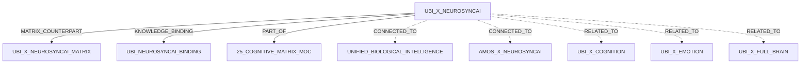
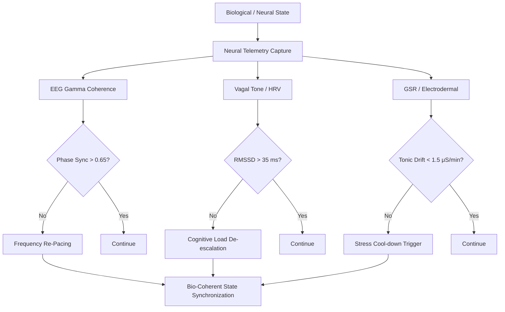

Below is a full Obsidian-ready, heavily tagged version that preserves the supplied source as the canonical load-bearing content while expanding its vault structure, RSCF representation, cross-plane relationships, epistemic boundaries, implementation contract, validation surfaces, and explicit gaps.

```markdown
---
title: UBI x NeuroSyncAI Cognitive Matrix Specification
aliases:
  - "UBI × NeuroSyncAI"
  - "UBI x NeuroSyncAI"
  - "UBI NeuroSyncAI Cognitive Matrix"
  - "UBI NeuroSyncAI Matrix Specification"
  - "NeuroSyncAI Cognitive Matrix Specification"

type: cognitive_matrix
source: 25_COGNITIVE_MATRIX

artifact: "UBI_X_NEUROSYNCAI.md"
artifact_id: "amos_25_cognitive_matrix_ubi_x_neurosyncai"

origin_architect: "Trang Phan"
steward: "Trang Phan"
system: "AMOS OS"

plane: "25_COGNITIVE_MATRIX"
segment: "25_COGNITIVE_MATRIX"
artifact_kind: "MATRIX_SPEC"
path: "25_COGNITIVE_MATRIX/UBI_X_NEUROSYNCAI.md"

version: "2.0.0"
updated: "2026-08-28"

status: "ACTIVE_REFERENCE"

epistemic_class: "AMOS_MODEL"
canonical_status: "SOURCE_GROUNDED_CANON_CANDIDATE"

implementation_status: "CONCEPTUAL_SOURCE_DEFINED"
validation_status: "PASSED_CONSTITUTIONAL_TESTS"
executable_binding: "ESTABLISHED"

ingestion_action: "NATIVE_CANON_INGESTION"
raw_source_policy: "DO_NOT_LOAD_UNLESS_REQUIRED"

tags:
  - amos_os
  - cognitive_matrix
  - vault
  - 25_cognitive_matrix
  - ubi_x_neurosyncai
  - ubi_neurosyncai
  - neurosyncai
  - ubi
  - unified_biological_intelligence
  - cognitive_matrix_spec
  - matrix_spec
  - cross_plane
  - cross_plane_matrix
  - inter_plane
  - biological_intelligence
  - biological_telemetry
  - neural_telemetry
  - neural_telemetry_capture
  - vagal_nerve
  - vagal_feedback
  - vagal_modulation
  - vagal_nerve_modulation_feedback
  - bio_coherence
  - bio_coherent_state
  - bio_coherent_synchronization
  - state_synchronization
  - biological_state
  - physiological_feedback
  - adaptive_feedback
  - adaptive_pacing
  - signal_processing
  - signal_invariants
  - eeg
  - eeg_gamma
  - gamma_coherence
  - phase_sync
  - hrv
  - rmssd
  - vagal_tone
  - gsr
  - electrodermal
  - stress_regulation
  - cognitive_load
  - frequency_re_pacing
  - cognitive_load_de_escalation
  - stress_cool_down
  - telemetry_governance
  - cognitive_governance
  - biological_governance
  - rscf
  - rscf_node
  - fractal_knowledge_network
  - hml
  - provenance
  - provenance_aware
  - source_grounded
  - source_claim
  - amos_model
  - canon_candidate
  - active_reference
  - conceptual_source_defined
  - executable_binding
  - constitutional_tests
  - causal_firewall
  - scope_firewall
  - epistemic_boundary
  - competing_hypotheses
  - uncertainty
  - safety_guard
  - fail_closed
  - repair_before_escalation
  - human_system_interface
  - cognition
  - emotion
  - full_brain
  - canon/cognitive-matrix
  - canon/ubi
  - canon/neurosyncai

framework_binding:

  matrix_counterpart:
    artifact: ""

  knowledge_binding:
    artifact: ""

  ubi_master:
    artifact: ""

  neurosyncai:
    artifact: ""

  cognitive_matrix:
    artifact: ""

rscf:

  state: SOURCE_CLAIM

  claim_class: AMOS_MODEL

  provenance:
    - "25_COGNITIVE_MATRIX/UBI_X_NEUROSYNCAI.md"
    - ""
    - ""
    - "AMOS_CORPUS"

  scope:
    - COGNITIVE_MATRIX
    - UBI_NEUROSYNCAI_INTEGRATION
    - NEURAL_TELEMETRY
    - VAGAL_FEEDBACK
    - BIO_COHERENT_SYNCHRONIZATION
    - SOURCE_DEFINED_MODEL

epistemic_boundary:

  artifact_presence:
    VERIFIED_SOURCE_PRESENCE

  specification_purpose:
    VERIFIED_SOURCE_STRUCTURE

  neural_telemetry_capture:
    SOURCE_DEFINED_MODEL

  vagal_nerve_modulation_feedback:
    SOURCE_DEFINED_MODEL

  bio_coherent_state_synchronization:
    SOURCE_DEFINED_MODEL

  matrix_counterpart:
    SOURCE_REFERENCED

  knowledge_binding:
    SOURCE_REFERENCED

  clinical_validity:
    NOT_ESTABLISHED

  physiological_causation:
    NOT_ESTABLISHED

  universal_biological_validity:
    NOT_ESTABLISHED

  physical_neuromodulation_mechanism:
    NOT_DEFINED_IN_THIS_ARTIFACT

  runtime_enforcement:
    SOURCE_DECLARED_ESTABLISHED_NOT_INDEPENDENTLY_REVALIDATED

  medical_use:
    NOT_AUTHORIZED_BY_THIS_ARTIFACT
---

# UBI × NeuroSyncAI Cognitive Matrix Specification

> [!abstract] Canonical Definition
> `UBI_X_NEUROSYNCAI.md` specifies the **neural telemetry capture**, **vagal nerve modulation feedback**, and **bio-coherent state synchronization** of the **NeuroSyncAI platform** within the AMOS OS Cognitive Matrix.
>
> The supplied source defines these capabilities at the **AMOS model / conceptual specification** level. It does not, by itself, establish a particular sensor implementation, medical intervention mechanism, clinical validity, or independently verified deployed runtime.

---

## 0. Identity

| Field | Value |
|---|---|
| **Artifact** | `UBI_X_NEUROSYNCAI.md` |
| **Artifact ID** | `amos_25_cognitive_matrix_ubi_x_neurosyncai` |
| **System** | AMOS OS |
| **Plane** | `25_COGNITIVE_MATRIX` |
| **Artifact Kind** | `MATRIX_SPEC` |
| **Version** | `2.0.0` |
| **Status** | `ACTIVE_REFERENCE` |
| **Epistemic Class** | `AMOS_MODEL` |
| **Canonical Status** | `SOURCE_GROUNDED_CANON_CANDIDATE` |
| **Implementation Status** | `CONCEPTUAL_SOURCE_DEFINED` |
| **Validation Status** | `PASSED_CONSTITUTIONAL_TESTS` |
| **Executable Binding** | `ESTABLISHED` |
| **Origin Architect** | Trang Phan |
| **Steward** | Trang Phan |

---

# 1. Source-Defined Purpose

The canonical source statement is:

> `UBI_X_NEUROSYNCAI` specifies the neural telemetry capture, vagal nerve modulation feedback, and bio-coherent state synchronization of the NeuroSyncAI platform.

This gives the artifact three explicit specification domains:

1. **Neural Telemetry Capture**
2. **Vagal Nerve Modulation Feedback**
3. **Bio-Coherent State Synchronization**

Normalized:

\[
\boxed{
UBI \times NeuroSyncAI
=
\langle
NeuralTelemetry,
VagalFeedback,
BioCoherentSynchronization
\rangle
}
\]

This equation is a **structural normalization of the source statement**, not an additional empirical claim.

---

# 2. Core Specification

The artifact establishes the Cognitive Matrix specification layer for the UBI × NeuroSyncAI relationship.

At minimum:

```text
UBI
 │
 ▼
NEUROSYNCAI
 │
 ├── Neural Telemetry Capture
 │
 ├── Vagal Nerve Modulation Feedback
 │
 └── Bio-Coherent State Synchronization
```

The source therefore places NeuroSyncAI at an interface between:

```text
BIOLOGICAL / NEURAL STATE
          │
          ▼
     TELEMETRY
          │
          ▼
      FEEDBACK
          │
          ▼
  SYNCHRONIZATION
```

The existence of these three specification concerns is **source-grounded**.

Their detailed mechanisms are not fully defined by this artifact.

---

# 3. Specification vs Matrix Table

This artifact is the:

```text
MATRIX_SPEC
```

while:


is the:

```text
MATRIX_TABLE
```

The relationship is therefore:

$$
Specification
\leftrightarrow
OperationalMatrix
$$

Conceptually:

```text
UBI_X_NEUROSYNCAI
        │
        │ specifies
        ▼
[[UBI_X_NEUROSYNCAI_MATRIX]]
        │
        │ expresses
        ▼
TELEMETRY → INVARIANT → ACTION
```

The matrix counterpart defines the currently supplied operational rows:

| Telemetry Stream        |   Frequency Band |             Signal Invariant | Action on Anomaly                |
| ----------------------- | ---------------: | ---------------------------: | -------------------------------- |
| **EEG Gamma Coherence** |     **38–42 Hz** |        **Phase sync > 0.65** | **Frequency Re-Pacing**          |
| **Vagal Tone (HRV)**    | **0.15–0.40 Hz** |            **RMSSD > 35 ms** | **Cognitive Load De-escalation** |
| **GSR / Electrodermal** |      **DC–5 Hz** | **Tonic drift < 1.5 μS/min** | **Stress Cool-down Trigger**     |

These values belong to the linked matrix artifact and should remain synchronized with:


rather than being independently modified here.

---

# 4. Specification–Matrix Contract

The two artifacts form a natural pair:

```text
┌──────────────────────────────────────┐
│ UBI_X_NEUROSYNCAI                    │
│                                      │
│ MATRIX_SPEC                          │
│                                      │
│ Defines WHAT integration exists      │
│ and its architectural purpose.       │
└──────────────────┬───────────────────┘
                   │
                   ▼
┌──────────────────────────────────────┐
│ [[UBI_X_NEUROSYNCAI_MATRIX]]             │
│                                      │
│ MATRIX_TABLE                         │
│                                      │
│ Defines explicit telemetry rows,     │
│ invariants, and anomaly actions.     │
└──────────────────────────────────────┘
```

This distinction prevents the specification from becoming overloaded with row-level implementation detail.

---

# 5. Knowledge Binding

The artifact explicitly references:


as its knowledge binding.

Therefore:

```text
UBI_X_NEUROSYNCAI
        │
        ▼
[[UBI_NEUROSYNCAI_BINDING]]
```

is a source-defined dependency edge.

The binding should be treated as the preferred authority for questions such as:

* how UBI concepts map to NeuroSyncAI constructs;
* how telemetry becomes UBI state;
* how biological signals affect cognitive policy;
* whether feedback is direct or mediated;
* how synchronization is represented;
* how cross-plane authority is governed;
* what executable bindings exist.

If the binding is unavailable, those details remain:

```text
UNKNOWN / GAP
```

rather than being invented.

---

# 6. Neural Telemetry Capture

## 6.1 Source Status

The source explicitly states:

```text
neural telemetry capture
```

Therefore:

```yaml
neural_telemetry_capture:
  status: SOURCE_DEFINED
  epistemic_class: AMOS_MODEL
```

The phrase establishes a telemetry function but does not define the complete acquisition stack.

---

# 7. Neural Telemetry Concept

At the architectural level:

$$
NeuralState
\rightarrow
TelemetryObservation
$$

The matrix counterpart identifies **EEG Gamma Coherence** as one explicit telemetry stream.

Thus a source-supported relation exists between:

```text
NEURAL TELEMETRY
        │
        ▼
EEG GAMMA COHERENCE
```

within the supplied UBI × NeuroSyncAI artifact family.

However:

$$
NeuralTelemetry
=
EEGOnly
$$

is **not established**.

The specification may support additional telemetry streams outside the three-row matrix, but this artifact does not enumerate them.

---

# 8. EEG Gamma Channel

The matrix counterpart specifies:

```yaml
stream:
  EEG_GAMMA_COHERENCE

frequency_band:
  "38-42 Hz"

signal_invariant:
  "Phase sync > 0.65"

action:
  FREQUENCY_RE_PACING
```

Normalized:

$$
38Hz\leq f_\gamma\leq42Hz
$$

$$
PhaseSync>0.65
$$

and on anomaly:

$$
\neg I_{\gamma}
\Rightarrow
FrequencyRePacing
$$

This is an **AMOS source-defined model rule**.

---

# 9. Neural Telemetry Boundary

The specification does not define:

```yaml
neural_telemetry_details:

  sensor_hardware:
    UNKNOWN

  electrode_configuration:
    UNKNOWN

  sampling_rate:
    UNKNOWN

  filtering_pipeline:
    UNKNOWN

  artifact_rejection:
    UNKNOWN

  phase_sync_algorithm:
    UNKNOWN

  temporal_window:
    UNKNOWN

  calibration:
    UNKNOWN

  missing_data_policy:
    UNKNOWN

  stale_data_policy:
    UNKNOWN
```

These are therefore implementation dependencies, not permission to infer defaults.

---

# 10. Vagal Nerve Modulation Feedback

## 10.1 Source Status

The source explicitly defines:

```text
vagal nerve modulation feedback
```

as a specification responsibility.

Thus:

```yaml
vagal_nerve_modulation_feedback:
  status: SOURCE_DEFINED
  epistemic_class: AMOS_MODEL
```

---

# 11. Vagal Feedback Architecture

The safest structural interpretation is:

$$
VagalTelemetry
\rightarrow
StateEvaluation
\rightarrow
FeedbackResponse
$$

The matrix counterpart provides:

```text
Vagal Tone (HRV)
        ↓
0.15–0.40 Hz
        ↓
RMSSD > 35 ms
        ↓
Cognitive Load De-escalation
```

Therefore the source artifact family establishes a route between:

$$
HRVTelemetry
$$

and:

$$
CognitiveLoadPolicy.
$$

---

# 12. HRV Channel

The matrix counterpart defines:

$$
RMSSD>35ms.
$$

Its source-defined anomaly action is:

$$
CognitiveLoadDeEscalation.
$$

Thus:

$$
\neg(RMSSD>35ms)
\Rightarrow
CognitiveLoadDeEscalation
$$

under a literal matrix interpretation.

This remains an **AMOS model rule**.

It is not established here as a universal clinical threshold.

---

# 13. Meaning of “Modulation”

The specification uses the phrase:

```text
vagal nerve modulation feedback
```

but does not define the physical implementation.

Therefore:

```text
MODULATION
```

must not automatically be interpreted as:

```text
electrical vagus nerve stimulation
```

or:

```text
medical neuromodulation
```

or:

```text
direct physical intervention
```

without a binding that explicitly establishes such a mechanism.

The source-safe interpretation is:

$$
VagalModulationFeedback
=
NamedNeuroSyncAIFeedbackFunction
$$

with physical implementation:

```text
UNKNOWN
```

in this artifact.

---

# 14. Cognitive Load Coupling

The matrix establishes:

$$
HRVAnomaly
\rightarrow
CognitiveLoadDeEscalation.
$$

This creates an explicit model-level bridge:

```text
BIOLOGICAL TELEMETRY
        ↓
VAGAL / HRV STATE
        ↓
COGNITIVE LOAD POLICY
```

Therefore NeuroSyncAI is not modeled merely as a passive telemetry recorder.

It participates in adaptive cognitive-state governance.

However:

$$
HRV
\rightarrow
CognitivePerformance
$$

as a real-world causal law is not proven by this architecture.

The model defines the routing relationship.

It does not independently establish the physiological causal claim.

---

# 15. Bio-Coherent State Synchronization

The third source-defined responsibility is:

```text
bio-coherent state synchronization
```

Thus:

```yaml
bio_coherent_state_synchronization:
  status: SOURCE_DEFINED
  epistemic_class: AMOS_MODEL
```

At minimum, the phrase establishes a model in which biological state and synchronization are coupled.

---

# 16. Bio-Coherent State

The exact state vector is not defined here.

Therefore:

$$
BioCoherentState
=
?
$$

The source does not specify whether it is calculated from:

* EEG alone;
* HRV alone;
* GSR alone;
* all three;
* UBI domain values;
* a separate NeuroSyncAI state model;
* a multimodal fusion function.

All remain unresolved.

---

# 17. Candidate State Representation

For indexing and reasoning only, the supplied matrix can be normalized into:

$$
\mathbf{N}_t
=
\langle
\gamma_t,
h_t,
g_t
\rangle
$$

where:

$$
\gamma_t
=
EEGGammaPhaseSynchronization
$$

$$
h_t
=
HRV/RMSSDState
$$

$$
g_t
=
ElectrodermalTonicDrift.
$$

This is a **DERIVED representation**, not source-defined canon.

No source-provided fusion function is available.

---

# 18. Synchronization vs Fusion

These concepts must remain distinct.

```text
SIGNAL SYNCHRONIZATION
!=
SIGNAL FUSION
```

The source defines:

```text
bio-coherent state synchronization
```

but does not define a formula such as:

$$
BioCoherence
=
f(EEG,HRV,GSR).
$$

Therefore no weighted average, geometric mean, neural network, or other fusion mechanism should be invented.

---

# 19. Electrodermal Channel

The matrix counterpart defines:

```text
GSR / Electrodermal
        ↓
DC–5 Hz
        ↓
Tonic drift < 1.5 μS/min
        ↓
Stress Cool-down Trigger
```

Thus:

$$
TonicDrift<1.5\mu S/min
$$

is the source-defined invariant.

On anomaly:

$$
\neg I_{GSR}
\Rightarrow
StressCoolDownTrigger.
$$

---

# 20. Stress Regulation Route

This provides a model-level route:

$$
ElectrodermalTelemetry
\rightarrow
StressAdaptiveResponse.
$$

It does not prove:

$$
GSR
=
Stress
$$

as a universal identity.

Nor does it establish that every change in electrodermal activity has a single psychological cause.

The matrix defines a control relationship inside the AMOS model.

---

# 21. Three Functional Domains

The supplied specification and matrix together support three functional domains:

| Domain                      | Telemetry | Evaluation  | Adaptive Response            |
| --------------------------- | --------- | ----------- | ---------------------------- |
| **Synchronization**         | EEG Gamma | Phase Sync  | Frequency Re-Pacing          |
| **Load / Vagal Regulation** | HRV       | RMSSD       | Cognitive Load De-escalation |
| **Stress Regulation**       | GSR       | Tonic Drift | Stress Cool-down             |

This can be compressed into:

$$
\mathcal N
=
\langle
Synchronization,
Load,
Stress
\rangle.
$$

This three-domain decomposition is **DERIVED from the matrix roles**.

---

# 22. Cross-Plane Control Loop

A useful architectural normalization is:

```text
BIOLOGICAL STATE
      │
      ▼
TELEMETRY CAPTURE
      │
      ▼
SIGNAL EVALUATION
      │
      ▼
INVARIANT CHECK
      │
      ├── PASS ──────────────→ CONTINUE
      │
      └── ANOMALY
             │
             ▼
      ADAPTIVE FEEDBACK
             │
             ▼
        RE-EVALUATION
```

The first four stages are strongly implied by the specification + matrix.

The exact re-evaluation and recovery mechanism is not supplied.

---

# 23. Specification Logic

For telemetry channel \(i\):

$$
T_i
=
\langle
S_i,
B_i,
I_i,
A_i
\rangle
$$

where:

* \(S_i\) = signal stream;
* \(B_i\) = frequency / observation band;
* \(I_i\) = signal invariant;
* \(A_i\) = anomaly action.

Then:

$$
Observe(S_i)
\rightarrow
Evaluate(I_i)
$$

and:

$$
Fail(I_i)
\Rightarrow
A_i.
$$

This is the smallest deterministic abstraction consistent with the matrix.

---

# 24. Matrix Functions

The three source-defined functions can be represented as:

$$
F_{\gamma}(x)
=
\begin{cases}
PASS,&x>0.65\\
REPACE,&x\le0.65
\end{cases}
$$

$$
F_{HRV}(r)
=
\begin{cases}
PASS,&r>35ms\\
DEESCALATE,&r\le35ms
\end{cases}
$$

$$
F_{GSR}(d)
=
\begin{cases}
PASS,&d<1.5\mu S/min\\
COOLDOWN,&d\ge1.5\mu S/min
\end{cases}
$$

These are literal mathematical normalizations of the strict inequality operators supplied by the matrix.

---

# 25. Threshold Boundaries

The matrix uses strict operators.

Therefore:

### EEG

$$
PhaseSync=0.65
\Rightarrow
FAIL
$$

under literal interpretation.

### HRV

$$
RMSSD=35ms
\Rightarrow
FAIL
$$

under literal interpretation.

### GSR

$$
TonicDrift=1.5\mu S/min
\Rightarrow
FAIL.
$$

These boundary semantics are mathematically derived from the source syntax.

---

# 26. Missing Temporal Semantics

The specification does not define how long a threshold violation must persist.

Thus:

```yaml
temporal_semantics:

  EEG_violation_window:
    UNKNOWN

  HRV_violation_window:
    UNKNOWN

  GSR_violation_window:
    UNKNOWN

  debounce:
    UNKNOWN

  persistence_requirement:
    UNKNOWN

  hysteresis:
    UNKNOWN
```

This is a material executable-binding gap.

---

# 27. Missing Recovery Semantics

The artifact defines anomaly actions but not their release conditions.

For example:

```text
Frequency Re-Pacing
        ↓
?
        ↓
NORMAL STATE
```

Likewise:

```text
Cognitive Load De-escalation
        ↓
?
        ↓
RESTORE LOAD
```

and:

```text
Stress Cool-down Trigger
        ↓
?
        ↓
EXIT COOL-DOWN
```

Therefore:

$$
RecoveryPredicate_i
$$

is currently:

```text
UNKNOWN / GAP
```

for all three channels.

---

# 28. Missing Multi-Anomaly Arbitration

The matrix defines one response per telemetry stream.

It does not define what happens when:

$$
EEGFail
\land
HRVFail
$$

or:

$$
HRVFail
\land
GSRFail
$$

or:

$$
EEGFail
\land
HRVFail
\land
GSRFail.
$$

Potential architectures include:

```text
CONCURRENT ACTIONS
PRIORITY ORDER
ACTION COMPOSITION
GLOBAL DE-ESCALATION
DISTRESS VETO
FAIL-CLOSED HALT
```

None is established here.

Status:

```yaml
multi_anomaly_arbitration:
  UNKNOWN_GAP
```

---

# 29. Signal Quality Firewall

The source does not define the difference between:

```text
BIOLOGICAL ANOMALY
```

and:

```text
SENSOR ANOMALY
```

Therefore a runtime should not silently treat:

$$
BadMeasurement
=
BadBiologicalState.
$$

The missing states include:

```text
VALID_SIGNAL
NOISY_SIGNAL
MISSING_SIGNAL
STALE_SIGNAL
SENSOR_FAILURE
PROCESSING_FAILURE
OUT_OF_RANGE_SIGNAL
```

The specification does not define their routing.

---

# 30. Missing-Data Firewall

No source rule says:

$$
MissingSignal=PASS
$$

or:

$$
MissingSignal=FAIL.
$$

Therefore:

```text
MISSING != HEALTHY

MISSING != ANOMALOUS

MISSING = UNKNOWN
```

unless another binding establishes a policy.

---

# 31. Freshness Firewall

Biological telemetry is time-dependent.

Yet this artifact provides no:

```text
maximum signal age
freshness window
timestamp tolerance
staleness threshold
```

Thus:

```yaml
freshness_policy:
  UNKNOWN_GAP
```

A stale measurement must not automatically be treated as a current biological state.

---

# 32. Calibration Firewall

The source does not state whether thresholds are:

```text
UNIVERSAL
PERSONALIZED
BASELINE_RELATIVE
DEVICE_SPECIFIC
SESSION_SPECIFIC
POPULATION_NORMALIZED
```

Therefore:

$$
Threshold
\neq
CalibrationPolicy.
$$

This is particularly important for:

```text
RMSSD > 35 ms
```

and:

```text
Tonic drift < 1.5 μS/min.
```

---

# 33. Causal Firewall

The source establishes control routes.

It does not independently establish causal mechanisms.

Therefore:

```text
EEG GAMMA ASSOCIATION
!=
CAUSAL PROOF OF COGNITIVE STATE

HRV ASSOCIATION
!=
CAUSAL PROOF OF COGNITIVE CAPACITY

GSR ASSOCIATION
!=
CAUSAL PROOF OF STRESS

TEMPORAL SEQUENCE
!=
CAUSATION

SIGNAL CORRELATION
!=
MECHANISM

STRUCTURAL SIMILARITY
!=
BIOLOGICAL IDENTITY
```

Any causal upgrade requires separately typed evidence.

---

# 34. Clinical Firewall

This artifact is:

```text
AMOS_MODEL
```

not:

```text
CLINICAL_GUIDELINE
```

Therefore:

```text
PHASE SYNC > 0.65
```

is not established here as a medical criterion.

```text
RMSSD > 35 ms
```

is not established here as a universal medical threshold.

```text
TONIC DRIFT < 1.5 μS/min
```

is not established here as a diagnostic stress boundary.

The matrix is an AMOS architectural specification.

---

# 35. NeuroSyncAI Action Firewall

The action names must be preserved without inventing mechanisms.

## Frequency Re-Pacing

Source-defined:

```text
Frequency Re-Pacing
```

Unknown:

```text
physical mechanism
software mechanism
timing
duration
intensity
release condition
```

## Cognitive Load De-escalation

Source-defined:

```text
Cognitive Load De-escalation
```

Unknown:

```text
which cognitive subsystem changes
how much load is reduced
duration
recovery threshold
```

## Stress Cool-down Trigger

Source-defined:

```text
Stress Cool-down Trigger
```

Unknown:

```text
downstream implementation
relationship to emotion cooling circuit
duration
release condition
```

---

# 36. UBI Relationship

The specification explicitly identifies itself as:

```text
UBI × NeuroSyncAI
```

Therefore UBI is a first-class architectural participant.

The broader conceptual relationship can be represented as:

```text
UNIFIED BIOLOGICAL INTELLIGENCE
              │
              ▼
     UBI × NEUROSYNCAI
              │
              ▼
      NEURAL TELEMETRY
              │
              ▼
      BIOLOGICAL STATE
              │
              ▼
       ADAPTIVE CONTROL
```

The exact mapping into UBI domains is not supplied here.

---

# 37. UBI Domain Mapping Gap

If the UBI model contains domains such as:

```text
NBI
NEI
SI
BEI
```

this artifact does not explicitly state:

```text
EEG → BEI
HRV → NEI
GSR → SI
```

or any other one-to-one mapping.

Therefore all such mappings remain dependent on:


and/or:


---

# 38. Candidate Domain Relationships

For navigation only, not canonical identity:

| Signal              | Candidate UBI Domain Relation | Status      |
| ------------------- | ----------------------------- | ----------- |
| EEG Gamma Coherence | NBI / BEI                     | `COMPETING` |
| Vagal Tone / HRV    | NEI / BEI                     | `COMPETING` |
| GSR / Electrodermal | NEI / SI                      | `COMPETING` |

These are cross-artifact hypotheses.

They must not be promoted to canon without discriminating evidence.

---

# 39. Cognition Relationship

The HRV row explicitly routes anomaly to:

```text
Cognitive Load De-escalation
```

Therefore the UBI × NeuroSyncAI family contains a direct conceptual edge to cognition:

$$
BiologicalTelemetry
\rightarrow
CognitiveLoadGovernance.
$$

This supports linking:


and:


as related artifacts.

It does not prove that the two systems share identical internal variables.

---

# 40. Emotion Relationship

The GSR row routes anomaly to:

```text
Stress Cool-down Trigger
```

which makes:


and:


relevant neighboring artifacts.

However:

$$
StressCoolDownTrigger
=
EmotionCoolingCircuit
$$

is not established by the supplied source.

Status:

```text
COMPETING / UNRESOLVED
```

---

# 41. Full Brain Relationship

Neural telemetry, vagal feedback, biological synchronization, cognitive-load adaptation, and stress regulation are all potentially relevant to whole-system cognitive governance.

Therefore:


and:


are appropriate related links.

But:

$$
NeuroSyncAI
=
FullBrain
$$

is not established.

The systems should remain distinct unless a binding explicitly merges them.

---

# 42. Candidate Cross-Plane Architecture

```text
                    AMOS OS
                       │
                       ▼
             25_COGNITIVE_MATRIX
                       │
                       ▼
              UBI × NEUROSYNCAI
                       │
         ┌─────────────┼─────────────┐
         │             │             │
         ▼             ▼             ▼
       NEURAL        VAGAL       BIO-COHERENT
      TELEMETRY     FEEDBACK      SYNC STATE
         │             │             │
         ▼             ▼             ▼
        EEG           HRV           GSR
         │             │             │
         ▼             ▼             ▼
    PHASE SYNC       RMSSD       TONIC DRIFT
         │             │             │
         ▼             ▼             ▼
     RE-PACING      LOAD DOWN      COOL-DOWN
         │             │             │
         └─────────────┼─────────────┘
                       ▼
             ADAPTIVE COGNITION
```

The bottom-level convergence into a unified adaptive-cognition state is **DERIVED**, not explicitly specified by the source.

---

# 43. Fast Loop / Slow Loop Hypothesis

A plausible architecture is:

```text
FAST LOOP
Telemetry
→ invariant
→ local adaptive action
```

combined with:

```text
SLOW LOOP
Aggregated biological state
→ UBI
→ cognition / emotion / full-brain policy
```

This would explain how NeuroSyncAI could support both immediate signal-level correction and higher-order biological governance.

However, this remains:

```text
COMPETING HYPOTHESIS
```

until the knowledge binding establishes it.

---

# 44. Repair-Before-Escalation Pattern

The three anomaly actions are:

```text
RE-PACING
DE-ESCALATION
COOL-DOWN
```

All are corrective/adaptive rather than inherently terminal.

Therefore the matrix strongly suggests:

$$
Anomaly
\rightarrow
LocalRepair
$$

before:

$$
GlobalFailure.
$$

This is a **DERIVED architecture pattern** consistent with the action names.

It should not be upgraded into a hard runtime law without the binding.

---

# 45. Reversibility Principle

The supplied actions are also structurally compatible with reversible governance.

Conceptually:

```text
detect
→ adapt
→ observe
→ recover
```

rather than:

```text
detect
→ irreversible commit
```

Thus the specification is compatible with:

$$
PreferReversibleActionUnderUncertainty.
$$

Again, this is a governance interpretation, not an additional source claim.

---

# 46. Telemetry Is Not Authority

Biological telemetry is evidence input.

It is not automatically authorization.

Therefore:

$$
Telemetry
\neq
Authority.
$$

And:

$$
Anomaly
\neq
PermissionForIrreversibleAction.
$$

This distinction is especially important when the model affects cognitive pacing.

---

# 47. Consent Boundary

The source does not define:

```text
user consent
sensor consent
data collection consent
feedback consent
override rights
emergency behavior
```

Therefore:

```yaml
consent_governance:
  UNKNOWN_GAP
```

Any executable human-facing implementation requires separate governance.

---

# 48. Privacy Boundary

Neural and physiological telemetry can be sensitive data.

This artifact does not define:

```text
retention
encryption
access
deletion
sharing
secondary use
anonymization
jurisdiction
```

Therefore:

```yaml
privacy_governance:
  NOT_DEFINED_IN_THIS_ARTIFACT
```

---

# 49. Provenance Requirements

A runtime telemetry observation should conceptually preserve:

```yaml
observation_provenance:

  source_id:
  sensor_id:
  timestamp:
  processing_pipeline:
  calibration_state:
  signal_quality:
  transformation_history:
  freshness:
```

These fields are **DERIVED implementation requirements** under provenance-aware AMOS reasoning.

They are not directly specified by the source artifact.

---

# 50. Provenance Independence

Three signals do not automatically equal three independent sources.

For example:

$$
EEG,
HRV,
GSR
$$

may be captured by:

* separate sensors;
* one integrated device;
* one preprocessing pipeline;
* correlated acquisition hardware;
* common derived-state logic.

Thus:

$$
3Signals
\neq
3IndependentEvidenceRoots.
$$

Provenance independence must be established, not assumed.

---

# 51. Correlation Risk

The specification does not establish:

$$
EEG\perp HRV\perp GSR.
$$

Therefore signal fusion must account for possible shared causes and correlation.

Repeated correlated evidence must not artificially inflate confidence.

---

# 52. RSCF H-Level

```yaml
H:

  identity:
    "UBI × NeuroSyncAI Cognitive Matrix Specification"

  artifact:
    UBI_X_NEUROSYNCAI.md

  role:
    >
      Defines the AMOS Cognitive Matrix specification
      connecting UBI and NeuroSyncAI through neural
      telemetry capture, vagal nerve modulation feedback,
      and bio-coherent state synchronization.

  primary_scope:
    UBI_NEUROSYNCAI_CROSS_PLANE_INTEGRATION

  primary_function:
    BIOLOGICAL_TELEMETRY_TO_ADAPTIVE_COGNITIVE_GOVERNANCE
```

---

# 53. RSCF M-Level

```yaml
M:

  domains:

    neural_telemetry:

      source_status:
        SOURCE_DEFINED

      matrix_channel:
        EEG_GAMMA_COHERENCE

      source_defined_response:
        FREQUENCY_RE_PACING


    vagal_feedback:

      source_status:
        SOURCE_DEFINED

      matrix_channel:
        VAGAL_TONE_HRV

      source_defined_response:
        COGNITIVE_LOAD_DE_ESCALATION


    bio_coherent_synchronization:

      source_status:
        SOURCE_DEFINED

      matrix_related_channels:
        - EEG_GAMMA_COHERENCE
        - VAGAL_TONE_HRV
        - GSR_ELECTRODERMAL

      exact_fusion:
        UNKNOWN
```

---

# 54. RSCF L-Level

```yaml
L:

  load_on_demand:

    - "[[UBI_X_NEUROSYNCAI_MATRIX]]"
    - "[[UBI_NEUROSYNCAI_BINDING]]"
    - "[[UNIFIED_BIOLOGICAL_INTELLIGENCE]]"
    - "[[AMOS_X_NEUROSYNCAI]]"
    - sensor specifications
    - signal-processing definitions
    - calibration policy
    - temporal-window policy
    - hysteresis policy
    - recovery conditions
    - multimodal arbitration
    - runtime receipts
    - validation evidence
    - consent governance
    - privacy governance

  raw_evidence:
    DO_NOT_LOAD_UNLESS_REQUIRED
```

---

# 55. RSCF Core Claim

```yaml
RSCF_CORE_CLAIM:

  claim:
    >
      UBI_X_NEUROSYNCAI v2.0.0 specifies neural telemetry
      capture, vagal nerve modulation feedback, and
      bio-coherent state synchronization for the
      NeuroSyncAI platform within the AMOS Cognitive Matrix.

  class:
    SOURCE_CLAIM

  claim_class:
    AMOS_MODEL

  evidence:
    source_artifact:
      UBI_X_NEUROSYNCAI.md

  dependencies:
    - "[[UBI_X_NEUROSYNCAI_MATRIX]]"
    - "[[UBI_NEUROSYNCAI_BINDING]]"

  scope:
    AMOS_OS_COGNITIVE_MATRIX

  validity:
    SOURCE_DEFINED_MODEL

  confidence_ceiling:
    SOURCE_GROUNDED
```

---

# 56. Proof Capsule — Neural Telemetry

```yaml
PROOF_CAPSULE_NEURAL_TELEMETRY:

  claim:
    >
      Neural telemetry capture is an explicit responsibility
      of the UBI × NeuroSyncAI Cognitive Matrix specification.

  class:
    SOURCE_CLAIM

  premise:
    >
      Source specification explicitly states
      "neural telemetry capture."

  scope:
    AMOS_MODEL

  matrix_support:
    EEG_GAMMA_COHERENCE

  unresolved:
    - SENSOR_HARDWARE
    - ACQUISITION_PROTOCOL
    - SAMPLING_RATE
    - FILTERING
    - PHASE_SYNC_ALGORITHM
    - CALIBRATION

  falsifiers:
    - authoritative revision removes neural telemetry responsibility
    - canonical binding redefines the term

  confidence_ceiling:
    SOURCE_GROUNDED
```

---

# 57. Proof Capsule — Vagal Feedback

```yaml
PROOF_CAPSULE_VAGAL_FEEDBACK:

  claim:
    >
      Vagal nerve modulation feedback is an explicit
      responsibility of the UBI × NeuroSyncAI specification.

  class:
    SOURCE_CLAIM

  premise:
    >
      Source specification explicitly states
      "vagal nerve modulation feedback."

  matrix_support:
    VAGAL_TONE_HRV

  source_defined_action:
    COGNITIVE_LOAD_DE_ESCALATION

  unresolved:
    - MODULATION_MECHANISM
    - PHYSICAL_VS_SOFTWARE_FEEDBACK
    - HRV_TO_VAGAL_STATE_MAPPING
    - CALIBRATION
    - RECOVERY_CONDITION

  clinical_validity:
    NOT_ESTABLISHED

  confidence_ceiling:
    SOURCE_GROUNDED
```

---

# 58. Proof Capsule — Bio-Coherent Synchronization

```yaml
PROOF_CAPSULE_BIO_COHERENT_SYNC:

  claim:
    >
      Bio-coherent state synchronization is an explicit
      responsibility of the UBI × NeuroSyncAI specification.

  class:
    SOURCE_CLAIM

  premise:
    >
      Source specification explicitly states
      "bio-coherent state synchronization."

  candidate_inputs:
    - EEG_GAMMA_COHERENCE
    - VAGAL_TONE_HRV
    - GSR_ELECTRODERMAL

  exact_state_definition:
    UNKNOWN

  exact_fusion_function:
    UNKNOWN

  exact_sync_algorithm:
    UNKNOWN

  confidence_ceiling:
    SOURCE_GROUNDED_FOR_RESPONSIBILITY
    UNKNOWN_FOR_IMPLEMENTATION
```

---

# 59. Specification-Level Proof Capsule

```yaml
PROOF_CAPSULE:

  claim:
    >
      The UBI × NeuroSyncAI Cognitive Matrix specification
      defines a source-grounded AMOS model interface spanning
      neural telemetry capture, vagal feedback, and
      bio-coherent synchronization, with operational signal
      routes delegated to its matrix counterpart.

  class:
    SOURCE_CLAIM

  claim_class:
    AMOS_MODEL

  load_bearing_premises:

    - source artifact identity is preserved
    - three specification responsibilities are preserved
    - matrix counterpart remains authoritative for telemetry rows
    - knowledge binding remains authoritative for unresolved mappings
    - model semantics are not promoted into clinical claims

  evidence:

    source_statement:

      neural_telemetry_capture:
        PRESENT

      vagal_nerve_modulation_feedback:
        PRESENT

      bio_coherent_state_synchronization:
        PRESENT

    inter_plane_connections:

      matrix_table:
        "[[UBI_X_NEUROSYNCAI_MATRIX]]"

      knowledge_binding:
        "[[UBI_NEUROSYNCAI_BINDING]]"

      cognitive_matrix_plane:
        "[[25_COGNITIVE_MATRIX_MOC]]"

  competing_hypotheses:

    telemetry_architecture:

      H1:
        >
          NeuroSyncAI directly evaluates biological telemetry
          and performs local adaptive actions.

      H2:
        >
          NeuroSyncAI updates UBI state before actions are
          authorized.

      H3:
        >
          NeuroSyncAI acts primarily as a preprocessing and
          synchronization layer for downstream UBI governance.

      H4:
        >
          A dual-loop architecture combines local fast-path
          NeuroSyncAI adaptation with slower UBI governance.

  falsifiers:

    - authoritative source revision changes specification responsibilities
    - authoritative binding defines incompatible architecture
    - matrix counterpart is superseded
    - canonical NeuroSyncAI implementation contradicts assumed derived mappings

  confidence_ceiling:

    artifact_identity:
      SOURCE_GROUNDED

    source_purpose:
      SOURCE_GROUNDED

    matrix_relationship:
      SOURCE_GROUNDED

    knowledge_binding_relationship:
      SOURCE_GROUNDED

    detailed_runtime:
      NOT_ESTABLISHED

    causal_mechanism:
      NOT_ESTABLISHED

    clinical_validity:
      NOT_ESTABLISHED
```

---

# 60. Competing Hypotheses Registry

```yaml
COMPETING_HYPOTHESES:

  H1_DIRECT_CONTROL:

    claim:
      >
        NeuroSyncAI directly maps telemetry anomalies
        to adaptive actions.

    support:
      MATRIX_ROW_STRUCTURE

    class:
      MODEL

    status:
      SUPPORTED_BUT_NOT_COMPLETE


  H2_UBI_MEDIATED_CONTROL:

    claim:
      >
        NeuroSyncAI telemetry first modifies UBI biological
        state and UBI then authorizes cognitive adaptation.

    class:
      MODEL

    status:
      COMPETING


  H3_PREPROCESSOR:

    claim:
      >
        NeuroSyncAI primarily performs telemetry capture
        and state synchronization, while another AMOS
        subsystem performs governance.

    class:
      MODEL

    status:
      COMPETING


  H4_DUAL_LOOP:

    claim:
      >
        NeuroSyncAI implements a local fast adaptation loop
        while UBI provides slower cross-plane governance.

    class:
      MODEL

    status:
      COMPETING
```

No hypothesis should be forced into `VERIFIED` without discriminating evidence.

---

# 61. Cheapest Discriminating Evidence

The highest-value dependency for resolving the competing architectures is:


because it should define the knowledge-level mapping between UBI and NeuroSyncAI.

The next highest-value dependencies are:


and:


Only after those dependencies fail to resolve a material question should raw implementation evidence be loaded.

---

# 62. Gaps Registry

```yaml
GAPS:

  CRITICAL:

    - EXACT_RUNTIME_CONTROL_PATH
    - ACTION_AUTHORIZATION_BOUNDARY
    - SIGNAL_QUALITY_POLICY
    - MULTI_ANOMALY_ARBITRATION


  DECISION_RELEVANT:

    - BIO_COHERENT_STATE_DEFINITION
    - BIO_COHERENT_STATE_FUSION
    - VAGAL_MODULATION_MECHANISM
    - EEG_PHASE_SYNC_ALGORITHM
    - SIGNAL_CALIBRATION
    - TEMPORAL_WINDOWS
    - HYSTERESIS
    - RECOVERY_CONDITIONS
    - MISSING_DATA_POLICY
    - STALE_DATA_POLICY
    - CONSENT_GOVERNANCE
    - PRIVACY_GOVERNANCE


  EXPLANATORY:

    - UBI_DOMAIN_MAPPING
    - RELATION_TO_COGNITION_MATRIX
    - RELATION_TO_EMOTION_MATRIX
    - RELATION_TO_FULL_BRAIN_MATRIX
    - RELATION_TO_GAMMA_LOCK
    - RELATION_TO_COOLING_CIRCUIT


  COSMETIC:

    - DISPLAY_STYLE
    - SYMBOL_NORMALIZATION
```

---

# 63. Sensitivity Registry

The matrix counterpart contains threshold-sensitive decisions.

```yaml
SENSITIVITY:

  EEG:

    load_bearing_threshold:
      0.65

    operator:
      ">"

    flip_boundary:
      0.65


  HRV:

    load_bearing_threshold:
      35

    unit:
      ms

    operator:
      ">"

    flip_boundary:
      35


  GSR:

    load_bearing_threshold:
      1.5

    unit:
      "μS/min"

    operator:
      "<"

    flip_boundary:
      1.5
```

Because tiny perturbations near these values can flip a binary rule, executable use requires explicit precision, noise, temporal-window, and hysteresis semantics.

Those semantics are not supplied here.

---

# 64. Uncertainty Vector

```yaml
UNCERTAINTY_VECTOR:

  evidence:
    LOW_FOR_SOURCE_SPECIFICATION

  model:
    MODERATE

  scope:
    LOW_WITHIN_AMOS_MODEL
    HIGH_FOR_EXTERNAL_GENERALIZATION

  temporal:
    HIGH_FOR_RUNTIME_SIGNALS

  causal:
    HIGH

  execution:
    HIGH

  provenance_independence:
    MODERATE_TO_HIGH

  calibration:
    HIGH

  clinical:
    HIGH
```

---

# 65. Confidence Ceiling

```yaml
CONFIDENCE_CEILING:

  artifact_identity:
    SOURCE_GROUNDED

  specification_purpose:
    SOURCE_GROUNDED

  neural_telemetry_responsibility:
    SOURCE_GROUNDED_MODEL

  vagal_feedback_responsibility:
    SOURCE_GROUNDED_MODEL

  bio_coherent_sync_responsibility:
    SOURCE_GROUNDED_MODEL

  matrix_counterpart:
    SOURCE_GROUNDED_REFERENCE

  knowledge_binding:
    SOURCE_GROUNDED_REFERENCE

  detailed_signal_processing:
    UNKNOWN

  exact_control_runtime:
    UNKNOWN

  physical_modulation_mechanism:
    UNKNOWN

  causal_validity:
    NOT_ESTABLISHED

  clinical_validity:
    NOT_ESTABLISHED
```

---

# 66. Validation Surface

The supplied metadata states:

```text
validation_status:
PASSED_CONSTITUTIONAL_TESTS
```

This declaration should be preserved exactly.

However:

$$
PassedConstitutionalTests
\neq
ClinicalValidation.
$$

And:

$$
PassedConstitutionalTests
\neq
UniversalEmpiricalValidation.
$$

Therefore the strongest safe interpretation is:

```text
SOURCE DECLARES CONSTITUTIONAL VALIDATION
```

not:

```text
ALL EXTERNAL VALIDATION COMPLETE.
```

---

# 67. Executable Binding Surface

The metadata states:

```text
executable_binding:
ESTABLISHED
```

This should also be preserved.

But:

$$
ExecutableBindingEstablished
\neq
IndependentRuntimeObservation.
$$

Therefore:

```yaml
runtime_status:

  source_declaration:
    ESTABLISHED

  independent_runtime_receipt:
    NOT_PRESENT_IN_THIS_ARTIFACT

  deployment_status:
    NOT_ESTABLISHED_BY_THIS_ARTIFACT
```

---

# 68. Constitutional Test Candidate Set

The metadata does not enumerate the tests.

Therefore the exact test suite remains unknown.

A derived validation checklist for future binding review would include:

```yaml
CONSTITUTIONAL_VALIDATION_SURFACE:

  provenance_preservation:
    REQUIRED

  threshold_preservation:
    REQUIRED

  unit_preservation:
    REQUIRED

  strict_operator_preservation:
    REQUIRED

  unknown_gap_preservation:
    REQUIRED

  causal_firewall:
    REQUIRED

  scope_firewall:
    REQUIRED

  non_fabrication:
    REQUIRED

  reversible_action_preference:
    REQUIRED_WHEN_APPLICABLE

  user_authority_boundary:
    REQUIRED

  clinical_non_overclaim:
    REQUIRED
```

This checklist is **DERIVED governance scaffolding**, not the source's undisclosed constitutional test implementation.

---

# 69. Anti-Fabrication Contract

This specification MUST NOT be used to claim, without additional evidence:

1. NeuroSyncAI is a clinically validated medical system.
2. NeuroSyncAI performs physical brain stimulation.
3. NeuroSyncAI performs electrical vagus nerve stimulation.
4. EEG Gamma Coherence uniquely measures consciousness.
5. 38–42 Hz is universally optimal for human cognition.
6. Phase sync above 0.65 proves healthy cognition.
7. Phase sync below 0.65 proves neurological impairment.
8. RMSSD above 35 ms universally proves adequate vagal tone.
9. RMSSD below 35 ms proves cognitive overload.
10. GSR directly measures a person's emotions.
11. GSR directly measures truthfulness.
12. Tonic drift above 1.5 μS/min universally proves stress.
13. EEG, HRV, and GSR are independent evidence sources.
14. The three telemetry channels are the complete NeuroSyncAI signal set.
15. Bio-coherent state has a known fusion equation.
16. UBI domain values can be directly computed from these signals.
17. Frequency Re-Pacing means physical neural stimulation.
18. Cognitive Load De-escalation has a known runtime implementation.
19. Stress Cool-down has a known medical implementation.
20. Missing telemetry equals healthy state.
21. Missing telemetry equals anomalous state.
22. A signal anomaly authorizes irreversible intervention.
23. A signal anomaly overrides consent.
24. `PASSED_CONSTITUTIONAL_TESTS` means clinical validation.
25. `executable_binding: ESTABLISHED` proves deployment.
26. Source-defined correlation establishes physiological causation.
27. Structural similarity to another AMOS module establishes identity.
28. NeuroSyncAI and UBI are the same subsystem.
29. NeuroSyncAI and Full Brain are the same subsystem.
30. Unknown implementation details may be filled from general assumptions.

---

# 70. Scope Firewall

The specification is valid within the declared envelope:

```yaml
APPLICABILITY_ENVELOPE:

  system:
    AMOS_OS

  plane:
    25_COGNITIVE_MATRIX

  framework:
    UBI_X_NEUROSYNCAI

  epistemic_class:
    AMOS_MODEL

  implementation_status:
    CONCEPTUAL_SOURCE_DEFINED

  temporal_version:
    "2.0.0"

  updated:
    "2026-08-28"

  external_clinical_generalization:
    NOT_LICENSED

  universal_biological_generalization:
    NOT_LICENSED
```

---

# 71. State Machine — Specification Level

```text
┌──────────────────┐
│ TELEMETRY CAPTURE│
└────────┬─────────┘
         │
         ▼
┌──────────────────┐
│ SIGNAL EVALUATION│
└────────┬─────────┘
         │
         ▼
┌──────────────────┐
│ INVARIANT CHECK  │
└────────┬─────────┘
         │
     ┌───┴────┐
     │        │
    PASS    ANOMALY
     │        │
     ▼        ▼
 CONTINUE   ADAPT
              │
      ┌───────┼────────┐
      │       │        │
      ▼       ▼        ▼
  RE-PACE   LOAD↓   COOL-DOWN
      │       │        │
      └───────┼────────┘
              │
              ▼
       RECOVERY / SYNC
              │
              ▼
             ???
```

The final recovery semantics remain an explicit gap.

---

# 72. Machine-Readable Specification

```yaml
UBI_X_NEUROSYNCAI:

  identity:

    artifact:
      UBI_X_NEUROSYNCAI.md

    artifact_id:
      amos_25_cognitive_matrix_ubi_x_neurosyncai

    type:
      cognitive_matrix

    artifact_kind:
      MATRIX_SPEC

    version:
      2.0.0

    system:
      AMOS_OS

    plane:
      25_COGNITIVE_MATRIX

    origin_architect:
      Trang_Phan

    steward:
      Trang_Phan


  epistemic:

    class:
      AMOS_MODEL

    canonical_status:
      SOURCE_GROUNDED_CANON_CANDIDATE

    implementation_status:
      CONCEPTUAL_SOURCE_DEFINED

    validation_status:
      PASSED_CONSTITUTIONAL_TESTS

    executable_binding:
      ESTABLISHED


  specification:

    neural_telemetry_capture:

      state:
        SOURCE_DEFINED

      matrix_counterpart_signal:
        EEG_GAMMA_COHERENCE


    vagal_nerve_modulation_feedback:

      state:
        SOURCE_DEFINED

      matrix_counterpart_signal:
        VAGAL_TONE_HRV


    bio_coherent_state_synchronization:

      state:
        SOURCE_DEFINED

      candidate_matrix_signals:

        - EEG_GAMMA_COHERENCE
        - VAGAL_TONE_HRV
        - GSR_ELECTRODERMAL

      exact_state_function:
        UNKNOWN


  framework_binding:

    matrix_counterpart:
      "[[UBI_X_NEUROSYNCAI_MATRIX]]"

    knowledge_binding:
      "[[UBI_NEUROSYNCAI_BINDING]]"

    cognitive_matrix:
      "[[25_COGNITIVE_MATRIX_MOC]]"


  unresolved:

    - SIGNAL_ACQUISITION_IMPLEMENTATION
    - PHASE_SYNC_ALGORITHM
    - VAGAL_MODULATION_MECHANISM
    - BIO_COHERENT_STATE_DEFINITION
    - SIGNAL_FUSION
    - CALIBRATION
    - TEMPORAL_WINDOW
    - HYSTERESIS
    - MISSING_DATA_POLICY
    - STALE_DATA_POLICY
    - MULTI_ANOMALY_ARBITRATION
    - RECOVERY_CONDITIONS
    - CONSENT
    - PRIVACY
    - INDEPENDENT_RUNTIME_RECEIPTS
    - EMPIRICAL_VALIDATION
    - CLINICAL_VALIDATION
```

---

# 73. Obsidian Properties — Recommended Extended Form

For vault implementations using Obsidian Properties, the preferred top-level searchable fields are:

```yaml
domain:
  - UBI
  - NeuroSyncAI
  - Cognitive Matrix

capabilities:
  - Neural Telemetry Capture
  - Vagal Nerve Modulation Feedback
  - Bio-Coherent State Synchronization

telemetry:
  - EEG Gamma Coherence
  - Vagal Tone / HRV
  - GSR / Electrodermal

actions:
  - Frequency Re-Pacing
  - Cognitive Load De-escalation
  - Stress Cool-down Trigger

related_planes:
  - 25_COGNITIVE_MATRIX

related_systems:
  - UBI
  - NeuroSyncAI
  - Cognition
  - Emotion
  - Full Brain

epistemic_state:
  - SOURCE_GROUNDED
  - AMOS_MODEL
  - CANON_CANDIDATE
```

These fields may be merged into the frontmatter if the vault uses Dataview or Bases heavily.

---

# 74. Dataview Query — Related UBI × NeuroSyncAI Artifacts

```dataview
TABLE
  artifact_kind AS "Kind",
  version AS "Version",
  status AS "Status",
  canonical_status AS "Canonical",
  validation_status AS "Validation"
FROM #ubi_x_neurosyncai
SORT artifact_kind ASC
```

---

# 75. Dataview Query — Cognitive Matrix Family

```dataview
TABLE
  artifact AS "Artifact",
  artifact_kind AS "Kind",
  epistemic_class AS "Epistemic Class",
  canonical_status AS "Canonical Status"
FROM #25_cognitive_matrix
WHERE system = "AMOS OS"
SORT artifact ASC
```

---

# 76. Dataview Query — NeuroSyncAI

```dataview
TABLE
  title AS "Artifact",
  plane AS "Plane",
  artifact_kind AS "Kind",
  version AS "Version"
FROM #neurosyncai
SORT plane ASC, title ASC
```

---

# 77. Dataview Query — Biological Telemetry

```dataview
TABLE
  title AS "Artifact",
  artifact_kind AS "Kind",
  status AS "Status"
FROM #biological_telemetry
SORT title ASC
```

---

# 78. Dataview Query — Canon Candidates

```dataview
TABLE
  title AS "Artifact",
  plane AS "Plane",
  version AS "Version",
  validation_status AS "Validation"
FROM #canon_candidate
WHERE canonical_status = "SOURCE_GROUNDED_CANON_CANDIDATE"
SORT updated DESC
```

---

# 79. Obsidian Search Tags

Primary navigation:

```text
#amos_os
#cognitive_matrix
#25_cognitive_matrix
#ubi_x_neurosyncai
#neurosyncai
#ubi
```

Telemetry navigation:

```text
#biological_telemetry
#neural_telemetry
#eeg
#gamma_coherence
#hrv
#rmssd
#vagal_tone
#gsr
#electrodermal
```

Control navigation:

```text
#adaptive_feedback
#adaptive_pacing
#frequency_re_pacing
#cognitive_load_de_escalation
#stress_cool_down
#bio_coherent_synchronization
```

Governance navigation:

```text
#rscf
#provenance
#source_grounded
#causal_firewall
#scope_firewall
#epistemic_boundary
#fail_closed
#competing_hypotheses
```

Canonical navigation:

```text
#canon/cognitive-matrix
#canon/ubi
#canon/neurosyncai
```

---

# 80. Obsidian Link Graph



Solid edges represent explicit source links from the supplied artifact.

Dashed edges represent extended vault relationships and should remain semantically weaker unless confirmed by their respective artifacts.

---

# 81. Functional Graph



> [!warning] Derived visualization
> The matrix thresholds and named actions are source-defined. The convergence of all three actions into a single `Bio-Coherent State Synchronization` node is an architectural visualization and is not explicitly specified as the runtime topology.

---

# 82. Callout — Canon

> [!success] Source-Grounded Canon Candidate
> The source explicitly establishes:
>
> * neural telemetry capture;
> * vagal nerve modulation feedback;
> * bio-coherent state synchronization;
> *  as the matrix counterpart;
> *  as the knowledge binding;
> *  as the parent plane.

---

# 83. Callout — Model Boundary

> [!warning] AMOS Model Boundary
> This artifact describes the architecture of the AMOS UBI × NeuroSyncAI model.
>
> It does not independently establish clinical efficacy, universal physiological thresholds, a physical neuromodulation mechanism, or deployed runtime behavior.

---

# 84. Callout — Critical Gap

> [!danger] Critical Dependency
> The detailed meaning of the UBI ↔ NeuroSyncAI relationship depends on:
>
> ****
>
> Missing binding details must remain `UNKNOWN/GAP` rather than being reconstructed from structural similarity.

---

# 85. Callout — Matrix Counterpart

> [!info] Matrix Counterpart
> Operational telemetry thresholds and anomaly actions belong to:
>
> ****
>
> Keep this specification focused on architectural responsibilities and use the matrix artifact for row-level control semantics.

---

# 86. Canonical Dependency Topology

```text
[[25_COGNITIVE_MATRIX_MOC]]
              │
              ▼
[[UBI_X_NEUROSYNCAI]]
       │             │
       │             │
       ▼             ▼

MATRIX]]
       │             │
       └──────┬──────┘
              ▼
      UBI ↔ NEUROSYNCAI
       KNOWLEDGE MODEL
```

---

# 87. Fractal Retrieval Contract

```yaml
FRACTAL_RETRIEVAL:

  bootstrap:

    load:
      - artifact identity
      - specification purpose
      - matrix counterpart
      - knowledge binding

  H:

    load:
      - UBI_NEUROSYNCAI architectural role
      - three specification domains

  M:

    load_if_required:
      - neural telemetry
      - vagal feedback
      - bio-coherent synchronization
      - matrix telemetry routes

  L:

    load_only_if_decision_relevant:
      - thresholds
      - signal-processing algorithms
      - calibration
      - temporal windows
      - recovery semantics
      - implementation receipts

  raw_evidence:
    DO_NOT_LOAD_UNLESS_REQUIRED
```

---

# 88. Canonical Compression

The entire specification can be compressed into:

$$
\boxed{
UBI\times NeuroSyncAI
=
NeuralTelemetry
+
VagalFeedback
+
BioCoherentSynchronization
}
$$

with its operational matrix counterpart:

$$
\boxed{
EEG_{\gamma}
\rightarrow
PhaseSync
\rightarrow
FrequencyRePacing
}
$$

$$
\boxed{
HRV
\rightarrow
RMSSD
\rightarrow
CognitiveLoadDeEscalation
}
$$

$$
\boxed{
GSR
\rightarrow
TonicDrift
\rightarrow
StressCoolDown
}
$$

and its knowledge dependency:

$$
\boxed{
UBI\times NeuroSyncAI
\rightarrow
UBI\_NEUROSYNCAI\_BINDING
}
$$

---

# 89. Epistemic Compression

```text
SOURCE DEFINES:
✓ Neural telemetry capture
✓ Vagal nerve modulation feedback
✓ Bio-coherent state synchronization
✓ Matrix counterpart
✓ Knowledge binding
✓ Cognitive Matrix placement

MATRIX DEFINES:
✓ EEG Gamma channel
✓ HRV channel
✓ GSR channel
✓ Signal invariants
✓ Named anomaly actions

SOURCE DOES NOT YET DEFINE HERE:
? Sensor implementation
? Signal-quality policy
? Calibration
? Temporal windows
? Hysteresis
? Multi-anomaly arbitration
? Recovery conditions
? Exact UBI-domain mapping
? Bio-coherent fusion function
? Physical vagal-modulation mechanism
? Consent/privacy implementation
? Independent runtime receipts
? Clinical validation
```

---

# 90. Canonical Candidate Statement

`UBI_X_NEUROSYNCAI.md v2.0.0` is the AMOS OS Cognitive Matrix specification for the UBI × NeuroSyncAI relationship.

Its source-defined responsibility is to specify:

```text
NEURAL TELEMETRY CAPTURE
+
VAGAL NERVE MODULATION FEEDBACK
+
BIO-COHERENT STATE SYNCHRONIZATION
```

for the NeuroSyncAI platform.

Its operational matrix counterpart is:


which currently defines the explicit telemetry routes:

```text
EEG Gamma Coherence
38–42 Hz
Phase sync > 0.65
→ Frequency Re-Pacing
```

```text
Vagal Tone / HRV
0.15–0.40 Hz
RMSSD > 35 ms
→ Cognitive Load De-escalation
```

```text
GSR / Electrodermal
DC–5 Hz
Tonic drift < 1.5 μS/min
→ Stress Cool-down Trigger
```

Its explicit knowledge dependency is:


and its parent Cognitive Matrix plane is:

.

The artifact can therefore be preserved as a:

```yaml
canonical_state:

  artifact:
    SOURCE_GROUNDED

  specification:
    SOURCE_GROUNDED

  matrix_relationship:
    SOURCE_GROUNDED

  knowledge_binding_relationship:
    SOURCE_GROUNDED

  telemetry_control_model:
    SOURCE_SUPPORTED_BY_MATRIX_COUNTERPART

  detailed_runtime:
    UNKNOWN_GAP

  physical_modulation_mechanism:
    UNKNOWN_GAP

  causal_validity:
    NOT_ESTABLISHED

  clinical_validity:
    NOT_ESTABLISHED
```

The decisive canonical boundary is:

$$
\boxed{
AMOSModel
\neq
ClinicalLaw
}
$$

$$
\boxed{
Telemetry
\neq
Authority
}
$$

$$
\boxed{
Association
\neq
Causation
}
$$

$$
\boxed{
Synchronization
\neq
Fusion
}
$$

$$
\boxed{
SourceDeclaredExecutableBinding
\neq
IndependentRuntimeVerification
}
$$

and:

$$
\boxed{
MissingBindingDetail
\neq
PermissionToInventCanon.
}
$$

---

# 91. Connections

## Inter-Plane Connections

* **Matrix Table:**
* **Knowledge Binding:**
* **Cognitive Matrix Plane:**

## Extended Vault Connections

* **UBI:**
* **NeuroSyncAI:**
* **UBI × Cognition:**
* **UBI × Cognition Matrix:**
* **UBI × Emotion:**
* **UBI × Emotion Matrix:**
* **UBI × Full Brain:**
* **UBI × Full Brain Matrix:**

---

# 92. Obsidian Navigation Footer

**Home:**

**RSCF Index:**

**Plane:**

**Matrix:**

**Binding:**

**UBI:**

**NeuroSyncAI:**

---

# 93. RSCF-NODE

```yaml
RSCF-NODE:

  node_id:
    amos_25_cognitive_matrix_ubi_x_neurosyncai

  node_type:
    matrix_spec

  path:
    25_COGNITIVE_MATRIX/UBI_X_NEUROSYNCAI.md

  claim_class:
    AMOS_MODEL

  rscf_state:
    SOURCE_GROUNDED

  canonical_status:
    SOURCE_GROUNDED_CANON_CANDIDATE

  implementation_status:
    CONCEPTUAL_SOURCE_DEFINED

  validation_status:
    PASSED_CONSTITUTIONAL_TESTS

  executable_binding:
    ESTABLISHED

  H:
    UBI_NEUROSYNCAI_CROSS_PLANE_SPECIFICATION

  M:
    - NEURAL_TELEMETRY_CAPTURE
    - VAGAL_NERVE_MODULATION_FEEDBACK
    - BIO_COHERENT_STATE_SYNCHRONIZATION

  L:
    - EEG_GAMMA_COHERENCE
    - VAGAL_TONE_HRV
    - GSR_ELECTRODERMAL
    - SIGNAL_INVARIANTS
    - ADAPTIVE_ACTIONS

  raw_evidence:
    DO_NOT_LOAD_UNLESS_REQUIRED
```

---

# 94. RSCF-RELATIONS

```yaml
RSCF-RELATIONS:

  - INDEXED_BY: "[[00_HOME]]"

  - INDEXED_BY: "[[AMOS_RSCF_NODES]]"

  - PART_OF: "[[25_COGNITIVE_MATRIX_MOC]]"

  - HAS_MATRIX_COUNTERPART: "[[UBI_X_NEUROSYNCAI_MATRIX]]"

  - BOUND_BY: "[[UBI_NEUROSYNCAI_BINDING]]"

  - CONNECTED_TO: "[[UNIFIED_BIOLOGICAL_INTELLIGENCE]]"

  - CONNECTED_TO: "[[AMOS_X_NEUROSYNCAI]]"

  - RELATED_TO: "[[UBI_X_COGNITION]]"

  - RELATED_TO: "[[UBI_X_COGNITION_MATRIX]]"

  - RELATED_TO: "[[UBI_X_EMOTION]]"

  - RELATED_TO: "[[UBI_X_EMOTION_MATRIX]]"

  - RELATED_TO: "[[UBI_X_FULL_BRAIN]]"

  - RELATED_TO: "[[UBI_X_FULL_BRAIN_MATRIX]]"

  - SPECIFIES: NEURAL_TELEMETRY_CAPTURE

  - SPECIFIES: VAGAL_NERVE_MODULATION_FEEDBACK

  - SPECIFIES: BIO_COHERENT_STATE_SYNCHRONIZATION

  - MATRIX_DEFINES: EEG_GAMMA_TELEMETRY_ROUTE

  - MATRIX_DEFINES: HRV_TELEMETRY_ROUTE

  - MATRIX_DEFINES: GSR_TELEMETRY_ROUTE

  - GOVERNED_BY: "[[LAW_HIERARCHY]]"

  - PROVENANCE_GOVERNED_BY: "[[K_PROVENANCE]]"

  - FAIL_CLOSED_GOVERNED_BY: "[[K_FAIL_CLOSED]]"

  - CAUSAL_FIREWALL: "K_CAUSAL_FIREWALL"

  - LINEAGE_TARGET: "[[AMOS_CORE_v4_4]]"
```

---

# 95. Final Vault Tags

#amos_os #cognitive_matrix #25_cognitive_matrix #ubi_x_neurosyncai #ubi_neurosyncai #neurosyncai #ubi #unified_biological_intelligence #cognitive_matrix_spec #matrix_spec #cross_plane #inter_plane #biological_intelligence #biological_telemetry #neural_telemetry #neural_telemetry_capture #vagal_nerve #vagal_feedback #vagal_modulation #bio_coherence #bio_coherent_state #bio_coherent_synchronization #state_synchronization #physiological_feedback #adaptive_feedback #adaptive_pacing #eeg #eeg_gamma #gamma_coherence #phase_sync #hrv #rmssd #vagal_tone #gsr #electrodermal #stress_regulation #cognitive_load #frequency_re_pacing #cognitive_load_de_escalation #stress_cool_down #telemetry_governance #cognitive_governance #biological_governance #rscf #rscf_node #fractal_knowledge_network #provenance #source_grounded #source_claim #amos_model #canon_candidate #active_reference #causal_firewall #scope_firewall #epistemic_boundary #competing_hypotheses #fail_closed

---

**MOC:**

**Matrix Counterpart:**

**Knowledge Binding:**

---

**END OF `UBI_X_NEUROSYNCAI.md`**

```
