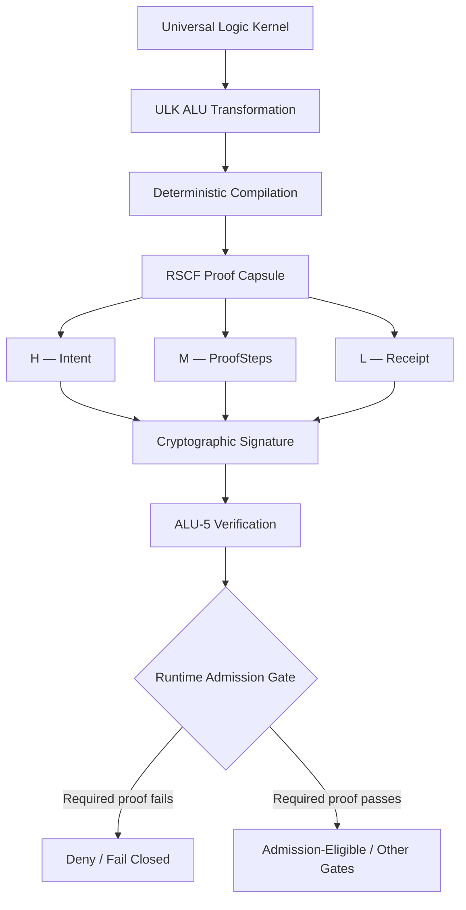
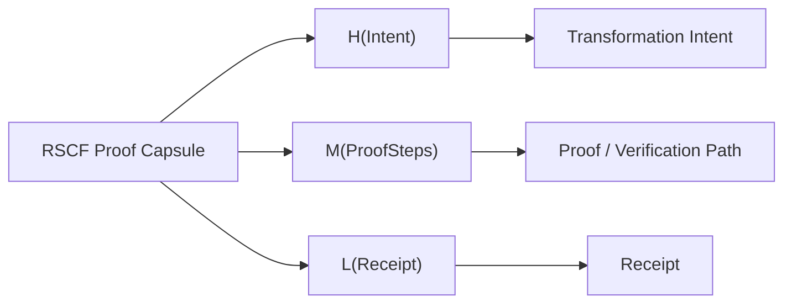
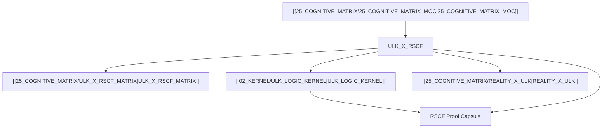

Below is the expanded **Obsidian-native canonical candidate**. I preserve the source-defined compiler invariant and Proof Conservation Law, while treating the visibly corrupted equation tokens conservatively. The recoverable structure is `∀ op ∈ {...}, ∃ Capsule = ⟨H(Intent), M(ProofSteps), L(Receipt)⟩`; the exact corrupted ALU-0/ALU-4 glyphs remain subordinate to \`\`.

````markdown
---
title: ULK x RSCF Cognitive Matrix Specification
aliases:
  - "ULK × RSCF Cognitive Matrix Specification"
  - "ULK x RSCF"
  - "ULK RSCF Specification"
  - "ULK RSCF Compiler Specification"
  - "ULK RSCF Proof Mesh"

type: cognitive_matrix
source: 25_COGNITIVE_MATRIX

artifact: "ULK_X_RSCF.md"
artifact_id: "amos_25_cognitive_matrix_ulk_x_rscf"

origin_architect: "Trang Phan"
steward: "Trang Phan"
system: "AMOS OS"

plane: "25_COGNITIVE_MATRIX"
segment: "25_COGNITIVE_MATRIX"
artifact_kind: "MATRIX_SPEC"
path: "25_COGNITIVE_MATRIX/ULK_X_RSCF.md"

version: "2.0.0"
updated: "2026-08-28"

status: "ACTIVE_REFERENCE"
epistemic_class: "AMOS_MODEL"
canonical_status: "SOURCE_GROUNDED_CANON_CANDIDATE"
implementation_status: "CONCEPTUAL_SOURCE_DEFINED"
validation_status: "PASSED_CONSTITUTIONAL_TESTS"
executable_binding: "ESTABLISHED"

ingestion_action: "NATIVE_CANON_INGESTION"
raw_source_policy: "DO_NOT_LOAD_UNLESS_REQUIRED"

tags:
  - amos_os
  - cognitive_matrix
  - vault
  - 25_cognitive_matrix
  - ulk_x_rscf
  - ulk_rscf
  - logic_proof_mesh
  - proof_mesh
  - rscf
  - rscf_capsule
  - proof_capsule
  - proof_conservation
  - proof_conservation_law
  - universal_logic_kernel
  - ulk
  - logic_kernel
  - deterministic_logic
  - deterministic_compilation
  - compiler
  - compiler_pipeline
  - compiler_invariant
  - transformation_invariant
  - alu
  - alu_operator
  - alu_transformation
  - state_transition
  - runtime_plane
  - verification
  - cryptographic_verification
  - cryptographic_signature
  - state_hash
  - sha256
  - merkle_verification
  - ground_state
  - distinction
  - regime
  - regime_non_leakage
  - scope_firewall
  - relational_coupling
  - tensor_coupling
  - constitutional_projection
  - invariant
  - invariant_verification
  - type_system
  - type_safety
  - receipt
  - proof_steps
  - intent
  - hml
  - h_level
  - m_level
  - l_level
  - recursive_structure
  - recursive_reasoning
  - fractal_knowledge_network
  - provenance
  - persistent_provenance
  - provenance_aware
  - fail_closed
  - source_grounded
  - source_claim
  - amos_model
  - canon_candidate
  - active_reference
  - conceptual_source_defined
  - executable_binding
  - constitutional_tests
  - epistemic_boundary
  - governance
  - integrity
  - causal_firewall
  - scope_regime_firewall
  - reality_x_ulk
  - cognitive_matrix_spec
  - canon/cognitive-matrix
  - canon/ulk
  - canon/rscf
  - canon/proof-mesh

framework_binding:

  matrix_counterpart:
    artifact: ""

  ulk:
    artifact: ""

  reality_ulk:
    artifact: ""

  cognitive_matrix:
    artifact: ""

rscf:

  state: SOURCE_CLAIM

  claim_class: AMOS_MODEL

  structure:
    H: Intent
    M: ProofSteps
    L: Receipt

  provenance:
    - "25_COGNITIVE_MATRIX/ULK_X_RSCF.md"
    - ""
    - ""
    - ""
    - "AMOS_CORPUS"

  scope:
    - COGNITIVE_MATRIX
    - ULK_RSCF_INTEGRATION
    - DETERMINISTIC_COMPILATION
    - PROOF_CAPSULE_GENERATION
    - PROOF_CONSERVATION
    - RUNTIME_ADMISSION
    - SOURCE_DEFINED_MODEL

epistemic_boundary:

  artifact_presence:
    VERIFIED_SOURCE_PRESENCE

  compiler_transformation_invariant:
    SOURCE_DEFINED_MODEL

  hml_capsule_structure:
    SOURCE_GROUNDED

  proof_conservation_law:
    SOURCE_GROUNDED

  cryptographic_signature_requirement:
    SOURCE_GROUNDED

  alu5_verification_requirement:
    SOURCE_GROUNDED

  exact_signature_scheme:
    NOT_DEFINED_IN_THIS_ARTIFACT

  exact_capsule_serialization:
    NOT_DEFINED_IN_THIS_ARTIFACT

  exact_runtime_protocol:
    NOT_DEFINED_IN_THIS_ARTIFACT

  independent_runtime_execution:
    NOT_VERIFIED_BY_THIS_ARTIFACT

  universal_formal_correctness:
    NOT_ESTABLISHED_BY_THIS_ARTIFACT

  executable_binding:
    SOURCE_DECLARED_ESTABLISHED_NOT_INDEPENDENTLY_REVALIDATED
---

# ULK × RSCF Cognitive Matrix Specification

> [!abstract] Canonical Definition
> `ULK_X_RSCF.md` specifies the AMOS OS cross-plane relationship by which **Universal Logic Kernel (ULK) ALU transformations** are compiled into **verifiable RSCF proof capsules** represented as:
>
> $$
> \langle H(\mathrm{Intent}),\ M(\mathrm{ProofSteps}),\ L(\mathrm{Receipt}) \rangle
> $$
>
> The specification additionally declares a **Proof Conservation Law**: no state transition is admitted to the runtime plane unless accompanied by a cryptographically signed RSCF proof capsule verified through **ALU-5** \((\mathcal H)\).
>
> This artifact is an `AMOS_MODEL`. Its source-defined architectural rules must not be silently promoted into claims about an independently verified deployed implementation.

---

## 0. Artifact Identity

| Field | Value |
|---|---|
| **Artifact** | `ULK_X_RSCF.md` |
| **Artifact ID** | `amos_25_cognitive_matrix_ulk_x_rscf` |
| **System** | AMOS OS |
| **Plane** | `25_COGNITIVE_MATRIX` |
| **Artifact Kind** | `MATRIX_SPEC` |
| **Version** | `2.0.0` |
| **Updated** | `2026-08-28` |
| **Status** | `ACTIVE_REFERENCE` |
| **Epistemic Class** | `AMOS_MODEL` |
| **Canonical Status** | `SOURCE_GROUNDED_CANON_CANDIDATE` |
| **Implementation Status** | `CONCEPTUAL_SOURCE_DEFINED` |
| **Validation Status** | `PASSED_CONSTITUTIONAL_TESTS` |
| **Executable Binding** | `ESTABLISHED` |
| **Origin Architect** | Trang Phan |
| **Steward** | Trang Phan |

---

## 1. Source-Grounded Core

The supplied source defines `ULK_X_RSCF` as the specification that:

> formalizes the deterministic compilation pipeline that converts Universal Logic Kernel (ULK) ALU transformations into verifiable RSCF proof capsules.

The supplied capsule form is recoverable as:

$$
\boxed{
\mathrm{Capsule}
=
\left\langle
H(\mathrm{Intent}),
M(\mathrm{ProofSteps}),
L(\mathrm{Receipt})
\right\rangle
}
$$

This gives the source-grounded mapping:

| RSCF Level | Source Role |
|---|---|
| **H** | `Intent` |
| **M** | `ProofSteps` |
| **L** | `Receipt` |

Therefore, within this specification:

$$
H \mapsto \mathrm{Intent}
$$

$$
M \mapsto \mathrm{ProofSteps}
$$

$$
L \mapsto \mathrm{Receipt}
$$

These mappings are explicit enough to preserve as canonical source structure.

---

## 2. Source Recovery Note

The supplied mathematical expression contains encoding corruption resembling:

```text
48307
...
angle48307
````

and malformed rendering around:

```text
\emptyset  o S_0
```

and:

```text
au
```

The surrounding source, together with the matrix counterpart, supports recovery of the intended **structural form**:

$$
\forall\,\mathrm{op}\in\mathcal A,\quad
\exists\,\mathrm{Capsule}
=
\left\langle
H(\mathrm{Intent}),
M(\mathrm{ProofSteps}),
L(\mathrm{Receipt})
\right\rangle
$$

where the supplied operator set is structurally represented as:

$$
\mathcal A
=
\{
\emptyset \to S_0,
\Delta,
\otimes,
\Pi_{\mathcal C},
\tau,
\mathcal H
\}.
$$

> [!WARNING] Symbol authority
> `\emptyset \to S_0` and `\tau` are normalized from corrupted source rendering and the matrix counterpart. Their exact canonical glyphs remain governed by .
>
> The structural claim that six ULK operators participate in the compiler invariant is stronger than the certainty of every recovered glyph.

______________________________________________________________________

## 3. Compiler Transformation Invariant

## 3.1 Canonical Form

The source-defined compiler transformation invariant can be normalized as:

$$
\boxed{
\forall\,\mathrm{op}\in\mathcal A,\quad
\exists\,C_{\mathrm{op}}
=
\left\langle
H(I),
M(P),
L(R)
\right\rangle
}
$$

where:

- (I) = Intent;
- (P) = Proof Steps;
- (R) = Receipt;
- (C\_{\\mathrm{op}}) = RSCF proof capsule associated with the operator transformation.

Expanded:

$$
\boxed{
\forall\,\mathrm{op}
\in
\{
\emptyset\to S_0,
\Delta,
\otimes,
\Pi_{\mathcal C},
\tau,
\mathcal H
\},
\quad
\exists\,
\mathrm{Capsule}
=
\langle
H(\mathrm{Intent}),
M(\mathrm{ProofSteps}),
L(\mathrm{Receipt})
\rangle
}
$$

______________________________________________________________________

## 4. Quantifier Semantics

The invariant contains two important logical components:

$$
\forall \mathrm{op}
$$

and:

$$
\exists \mathrm{Capsule}.
$$

The strongest source-safe reading is:

> For every ULK operator transformation within the declared operator set, the compilation model requires the existence of an associated RSCF proof capsule.

Formally:

$$
\forall op\in\mathcal A,\;
\exists C:\;Associated(C,op).
$$

This does **not**, by itself, establish:

$$
\exists ! C
$$

meaning uniqueness of the capsule.

Therefore:

```yaml
capsule_cardinality:

  existence:
    SOURCE_DEFINED

  uniqueness:
    NOT_ESTABLISHED

  one_capsule_per_operator:
    NOT_STRICTLY_PROVEN

  multiple_capsules_per_operator:
    NOT_EXCLUDED
```

______________________________________________________________________

## 5. Deterministic Compilation Pipeline

The specification explicitly calls the pipeline:

**deterministic**.

The source-defined conceptual transformation is therefore:

```text
ULK ALU TRANSFORMATION
        │
        ▼
DETERMINISTIC COMPILATION
        │
        ▼
RSCF PROOF CAPSULE
        │
        ▼
VERIFICATION
        │
        ▼
RUNTIME ADMISSION GATE
```

At model level:

$$
Compile:
ULKTransform
\rightarrow
RSCFCapsule.
$$

A stronger functional representation is possible:

$$
C = Compile(op, state, context)
$$

but `state` and `context` are not explicit source parameters here.

Therefore that function signature is only a **MODEL abstraction**, not canonical source syntax.

______________________________________________________________________

## 6. Determinism Boundary

The term **deterministic compilation pipeline** licenses the model-level expectation:

$$
SameValidInput
\land
SameApplicableState
\Rightarrow
SameCompiledResult
$$

only if all hidden dependencies are themselves fixed.

The artifact does not enumerate:

- compiler state;
- context state;
- version state;
- canonical serialization;
- environmental inputs;
- clock inputs;
- randomness;
- concurrent mutation;
- external dependencies.

Therefore a stronger universal equation:

$$
Compile(x)=y
$$

for all environments is not established here.

Canonical interpretation:

```yaml
determinism:

  source_claim:
    DETERMINISTIC_COMPILATION_PIPELINE

  deterministic_domain:
    NOT_FULLY_SPECIFIED

  environmental_independence:
    NOT_ESTABLISHED

  hardware_independence:
    NOT_ESTABLISHED

  concurrency_semantics:
    NOT_DEFINED_HERE
```

______________________________________________________________________

## 7. RSCF Capsule Architecture

The source defines the capsule as:

$$
C=
\langle
H(I),
M(P),
L(R)
\rangle.
$$

This provides a three-level proof architecture.

```text
RSCF PROOF CAPSULE
│
├── H
│   └── INTENT
│
├── M
│   └── PROOF STEPS
│
└── L
    └── RECEIPT
```

This is one of the most important explicit structures in the artifact.

______________________________________________________________________

## 8. H — Intent Layer

The H component is:

$$
H(\mathrm{Intent}).
$$

Within this artifact, H therefore carries or represents the **Intent** associated with the transformation.

Source-grounded minimum:

```yaml
H:

  role:
    INTENT

  function:
    REPRESENT_TRANSFORMATION_INTENT

  exact_schema:
    NOT_DEFINED_HERE
```

The artifact does not specify whether Intent includes:

- objective;
- actor;
- scope;
- authority;
- requested state transition;
- expected result;
- constraints;
- regime;
- timestamp.

Those fields must not be fabricated.

______________________________________________________________________

## 9. M — Proof Steps Layer

The M component is:

$$
M(\mathrm{ProofSteps}).
$$

Its minimum source-grounded role is to carry the proof-step structure associated with the transformation.

```yaml
M:

  role:
    PROOF_STEPS

  function:
    REPRESENT_VERIFICATION_PATH

  exact_schema:
    NOT_DEFINED_HERE
```

The source does not specify whether the proof steps are:

- formal derivations;
- execution traces;
- logical predicates;
- ULK operator receipts;
- theorem prover steps;
- dependency references;
- hashes;
- signed assertions.

These remain unresolved.

______________________________________________________________________

## 10. L — Receipt Layer

The L component is:

$$
L(\mathrm{Receipt}).
$$

The minimum source-grounded interpretation is:

> L carries the receipt associated with the compiled proof capsule.

```yaml
L:

  role:
    RECEIPT

  function:
    REPRESENT_PROOF_RECEIPT

  exact_schema:
    NOT_DEFINED_HERE
```

The receipt may plausibly carry integrity/provenance material, but this artifact does not enumerate its fields.

Therefore:

$$
Receipt
\neq
AutomaticallyKnownReceiptSchema.
$$

______________________________________________________________________

## 11. H/M/L Conservation

The compiler invariant requires a capsule of the form:

$$
\langle H,M,L\rangle.
$$

Therefore a structurally complete capsule under this specification requires all three declared components.

A conservative structural predicate is:

$$
StructurallyComplete(C)
\iff
Has(H)\land Has(M)\land Has(L).
$$

This is a **DERIVED structural rule** from the explicit tuple.

It does not establish the internal validity of each component.

______________________________________________________________________

## 12. Structural Completeness vs Proof Validity

A capsule may contain all three components while still failing validation.

Therefore:

$$
Has(H,M,L)
\not\Rightarrow
ValidProof.
$$

Similarly:

$$
ValidTupleShape
\not\Rightarrow
ValidIntent.
$$

$$
ValidTupleShape
\not\Rightarrow
ValidProofSteps.
$$

$$
ValidTupleShape
\not\Rightarrow
ValidReceipt.
$$

Structural completeness is necessary under the tuple model but is not sufficient for proof acceptance.

______________________________________________________________________

## 13. Proof Conservation Law

The source explicitly states:

> No state transition is admitted to the runtime plane unless accompanied by a cryptographically signed RSCF proof capsule verified by ALU-5 ((\\mathcal H)).

This is the strongest governance statement in the artifact.

Normalize:

$$
Admit(T)
\Rightarrow
AccompaniedBy(T,C)
\land
CryptographicallySigned(C)
\land
VerifiedBy_{\mathcal H}(C).
$$

Equivalently:

$$
\boxed{
RuntimeAdmission
\Rightarrow
SignedRSCFCapsule
\land
ALU5Verification
}
$$

______________________________________________________________________

## 14. Necessary Condition

The Proof Conservation Law defines signed, ALU-5-verified proof as a **necessary condition** for runtime admission.

If:

- (A(T)) = transition (T) is admitted;
- (C(T)) = transition has the required capsule;
- (S(C)) = capsule is cryptographically signed;
- (V_5(C)) = ALU-5 verifies the capsule;

then:

$$
\boxed{
A(T)
\Rightarrow
C(T)\land S(C)\land V_5(C)
}
$$

This means:

$$
\neg C(T)
\Rightarrow
\neg A(T)
$$

and:

$$
\neg S(C)
\Rightarrow
\neg A(T)
$$

and:

$$
\neg V_5(C)
\Rightarrow
\neg A(T).
$$

______________________________________________________________________

## 15. Necessary Does Not Mean Sufficient

The source does **not** say:

> every transition with a signed ALU-5-verified capsule must be admitted.

Therefore:

$$
C(T)\land S(C)\land V_5(C)
\not\Rightarrow
A(T)
$$

unless another source establishes sufficiency.

Other gates may still apply.

This distinction is canonical-critical:

$$
\boxed{
RequiredForAdmission
\neq
SufficientForAdmission
}
$$

______________________________________________________________________

## 16. Fail-Closed Admission Model

The Proof Conservation Law supports a fail-closed admission structure:

```text
STATE TRANSITION REQUEST
        │
        ▼
RSCF CAPSULE PRESENT?
   ┌────┴────┐
  NO        YES
  │          │
  ▼          ▼
DENY       SIGNATURE
             │
             ▼
       SIGNATURE VALID?
         ┌────┴────┐
        NO        YES
        │          │
        ▼          ▼
      DENY       ALU-5
                   │
                   ▼
              VERIFIED?
              ┌────┴────┐
             NO        YES
             │          │
             ▼          ▼
           DENY      OTHER GATES
```

The `OTHER GATES` node is deliberately retained because ALU-5 verification is not established as sufficient.

______________________________________________________________________

## 17. Contrapositive Admission Rule

From:

$$
A
\Rightarrow
C\land S\land V_5
$$

we can derive:

$$
\neg(C\land S\land V_5)
\Rightarrow
\neg A.
$$

By De Morgan:

$$
\neg C
\lor
\neg S
\lor
\neg V_5
\Rightarrow
\neg A.
$$

Thus any missing load-bearing proof requirement blocks admission under the source-defined law.

______________________________________________________________________

## 18. Proof Conservation as Runtime Boundary

The architecture can be represented as two domains:

```text
UNADMITTED DOMAIN
──────────────────────────────

Candidate State Transition
          │
          ▼
Compiled RSCF Capsule
          │
          ▼
Cryptographic Signature
          │
          ▼
ALU-5 Verification
          │
          ▼
══════════════════════════════
     RUNTIME ADMISSION GATE
══════════════════════════════
          │
          ▼
ADMITTED RUNTIME DOMAIN
```

The specification therefore makes proof accompaniment part of the transition boundary rather than an optional post-hoc annotation.

______________________________________________________________________

## 19. Proof-Carrying Transition Model

A useful derived abstraction is:

$$
TransitionPackage
=
\langle
Transition,
ProofCapsule
\rangle.
$$

The source supports the requirement that the proof capsule accompany the transition.

Therefore runtime admission acts on something structurally equivalent to:

$$
\langle T,C\rangle
$$

rather than bare:

$$
T.
$$

This is a **DERIVED architectural compression**.

The exact runtime data structure is not supplied.

______________________________________________________________________

## 20. ULK Operator Domain

The source enumerates six operator forms.

Normalized against the matrix counterpart:

| Operator  | Symbol                | Matrix Verification              |
| --------- | --------------------- | -------------------------------- |
| **ALU-0** | (\\emptyset \\to S_0) | Ground state conservation        |
| **ALU-1** | (\\Delta)             | Distinction & regime non-leakage |
| **ALU-2** | (\\otimes)            | Relational coupling valid        |
| **ALU-3** | (\\Pi\_{\\mathcal C}) | All 21 core laws satisfied       |
| **ALU-4** | (\\tau)               | Type well-formedness             |
| **ALU-5** | (\\mathcal H)         | SHA-256 state hash verified      |

> [!INFO] Provenance distinction
> The operator set appears directly in this specification.
>
> The verification descriptions in the third column are supplied by , not by the visible body of this specification.

______________________________________________________________________

## 21. ALU-0 — Ground-State Transformation

The normalized source operator:

$$
\emptyset\to S_0
$$

is associated by the matrix counterpart with:

**Ground state conservation**

and fallback:

**Null State Abort**.

Cross-artifact model:

$$
ALU_0
\rightarrow
GroundStateConservation
\rightarrow
NullStateAbort_{failure}.
$$

The exact semantics of (S_0) remain governed by .

______________________________________________________________________

## 22. ALU-1 — Distinction

ALU-1 uses:

$$
\Delta.
$$

The matrix counterpart associates it with:

**Distinction & regime non-leakage**

and:

**Scope Firewall Veto**.

Thus:

$$
ALU_1
\rightarrow
RegimeNonLeakageCheck.
$$

Failure:

$$
RegimeLeakage
\Rightarrow
ScopeFirewallVeto.
$$

This provides a direct structural relationship between ULK distinction and scope/regime governance.

______________________________________________________________________

## 23. ALU-2 — Relational Coupling

ALU-2 uses:

$$
\otimes.
$$

The matrix counterpart associates this operator with:

**Relational coupling valid**

and:

**Tensor Decouple**.

Therefore:

$$
ALU_2
\rightarrow
RelationalCouplingValidation.
$$

But:

$$
ValidCoupling
\not\Rightarrow
Causation.
$$

A coupling may be logical, structural, dependency-based, compositional, or causal.

The relationship type must remain explicit.

______________________________________________________________________

## 24. ALU-3 — Constitutional Projection

ALU-3 is represented as:

$$
\Pi_{\mathcal C}.
$$

The matrix counterpart requires:

**All 21 core laws satisfied**.

Thus:

$$
V_3
=
\bigwedge_{i=1}^{21} Law_i.
$$

Failure routes to:

$$
InvariantViolationReject.
$$

This artifact does not enumerate those 21 laws.

Therefore they remain an external canonical dependency.

______________________________________________________________________

## 25. ALU-4 — Type Formation / Validation

The corrupted source is normalized as:

$$
\tau.
$$

The matrix counterpart associates ALU-4 with:

**Type well-formedness**

and:

**Type Mismatch Abort**.

Therefore:

$$
ALU_4
\rightarrow
TypeWellFormedness.
$$

But:

$$
WellTyped
\neq
True.
$$

Type validity establishes structural compatibility, not empirical correctness.

______________________________________________________________________

## 26. ALU-5 — Cryptographic Verification

ALU-5 is explicitly identified by the Proof Conservation Law:

$$
ALU_5(\mathcal H).
$$

The matrix counterpart specifies:

**SHA-256 state hash verified**

with fallback:

**Merkle Verification Fail**.

Thus the cross-artifact model gives:

$$
ALU_5
\rightarrow
HashVerification.
$$

The Proof Conservation Law further assigns ALU-5 a runtime admission role.

______________________________________________________________________

## 27. ALU-5 Dual Role

Across the supplied specification and matrix counterpart, ALU-5 participates in two related surfaces:

### Matrix surface

$$
SHA256StateHashVerified.
$$

### Specification surface

$$
SignedRSCFCapsuleVerifiedByALU5.
$$

These are compatible but not automatically identical operations.

The safest interpretation is:

```yaml
ALU_5:

  matrix_role:
    SHA256_STATE_HASH_VERIFICATION

  specification_role:
    RSCF_PROOF_CAPSULE_VERIFICATION

  exact_relationship:
    NOT_FULLY_DEFINED

  identity_of_operations:
    NOT_PROVEN
```

______________________________________________________________________

## 28. Signature vs Hash

The Proof Conservation Law requires:

**cryptographically signed RSCF proof capsule**.

The matrix requires:

**SHA-256 state hash verified**.

These concepts must not be collapsed.

A hash:

$$
h = SHA256(m)
$$

does not by itself constitute a digital signature.

A generic digital signature has a structure such as:

$$
\sigma = Sign_{sk}(m)
$$

with verification:

$$
Verify_{pk}(m,\sigma).
$$

The source does not define:

- signature algorithm;
- key type;
- key ownership;
- key rotation;
- signature encoding;
- certificate structure;
- trust anchor;
- revocation;
- signature/hash composition.

Therefore:

$$
\boxed{
SHA256Hash
\neq
DigitalSignature
}
$$

even though both appear in the broader proof-verification architecture.

______________________________________________________________________

## 29. Cryptographic Signature Gap

Canonical unresolved fields:

```yaml
cryptographic_signature:

  required:
    true

  source:
    PROOF_CONSERVATION_LAW

  algorithm:
    UNKNOWN

  public_key_scheme:
    UNKNOWN

  private_key_custody:
    UNKNOWN

  signer_identity:
    UNKNOWN

  signature_encoding:
    UNKNOWN

  key_rotation:
    UNKNOWN

  revocation:
    UNKNOWN

  trust_anchor:
    UNKNOWN

  verification_sequence:
    UNKNOWN
```

No algorithm should be invented.

______________________________________________________________________

## 30. SHA-256 Scope

The matrix counterpart specifically names:

`SHA-256`.

Therefore SHA-256 can be preserved as a source-defined hash primitive within the matrix model.

However:

$$
SHA256(m_1)=h
$$

only establishes a digest relation.

It does not establish:

- truth of (m_1);
- authority of (m_1);
- independence of (m_1);
- freshness of (m_1);
- causal validity of (m_1);
- scope validity of (m_1).

Therefore:

$$
\boxed{
CryptographicIntegrity
\neq
EpistemicTruth
}
$$

______________________________________________________________________

## 31. RSCF Proof Capsule vs Cryptographic Proof

The phrase **proof capsule** must not automatically be interpreted as a cryptographic proof system such as:

- SNARK;
- STARK;
- zero-knowledge proof;
- interactive proof;
- proof-of-work;
- proof-of-stake.

The source instead defines an AMOS RSCF structure:

$$
\langle H(Intent),M(ProofSteps),L(Receipt)\rangle.
$$

Therefore:

```yaml
proof_capsule:

  type:
    AMOS_RSCF_STRUCTURE

  cryptographically_signed:
    REQUIRED_BY_PROOF_CONSERVATION_LAW

  zero_knowledge:
    NOT_ESTABLISHED

  snark:
    NOT_ESTABLISHED

  stark:
    NOT_ESTABLISHED

  blockchain_consensus:
    NOT_ESTABLISHED
```

______________________________________________________________________

## 32. Compiler–Proof Relationship

The central transformation is:

$$
ULKTransformation
\overset{Compile}{\longrightarrow}
RSCFCapsule.
$$

The resulting capsule must preserve sufficient information to satisfy the declared H/M/L structure.

Conceptually:

$$
Compile(op)
=
\langle
H(Intent(op)),
M(ProofSteps(op)),
L(Receipt(op))
\rangle.
$$

This expanded function is **DERIVED**, because the source establishes the capsule structure but does not explicitly write each component as a function of `op`.

______________________________________________________________________

## 33. Intent Conservation

Because H explicitly contains Intent, a reasonable integrity requirement is:

$$
Intent_{input}
\equiv
Intent_{H}.
$$

Otherwise the proof capsule could describe a different transformation intent from the operation being admitted.

This is a **DERIVED invariant**, not an explicit source equation.

Canonical status:

`CONDITIONAL / MODEL`

until defined by the compiler specification or executable binding.

______________________________________________________________________

## 34. Proof-Step Conservation

Similarly, M carries:

$$
M(ProofSteps).
$$

A derived proof-integrity condition is:

$$
ProofSteps_M
\leftrightarrow
ActualTransformationPath.
$$

Without such correspondence, M could be structurally present but semantically disconnected.

Again:

`DERIVED / REQUIRES IMPLEMENTATION EVIDENCE`

______________________________________________________________________

## 35. Receipt Conservation

L carries:

$$
L(Receipt).
$$

A derived integrity condition is:

$$
Receipt_L
\leftrightarrow
VerifiedResult.
$$

The exact receipt content remains unknown.

Possible fields must not be invented.

______________________________________________________________________

## 36. Three Conservation Surfaces

The H/M/L tuple creates three conceptually distinct conservation questions:

| Layer | Conservation Question                                                               |
| ----- | ----------------------------------------------------------------------------------- |
| **H** | Does the capsule preserve the intended operation?                                   |
| **M** | Does the capsule preserve the proof/transformation path?                            |
| **L** | Does the capsule preserve a verifiable receipt of the resulting verification state? |

These are derived interpretation surfaces, useful for validation without changing source semantics.

______________________________________________________________________

## 37. Proof Mesh

The artifact tag:

`logic_proof_mesh`

supports a named architectural surface:

**Logic Proof Mesh**.

At minimum, the mesh links:

```text
ULK OPERATOR
     │
     ▼
TRANSFORMATION
     │
     ▼
RSCF CAPSULE
     │
     ├── H / Intent
     ├── M / ProofSteps
     └── L / Receipt
     │
     ▼
ALU-5 VERIFICATION
     │
     ▼
RUNTIME ADMISSION
```

The source does not provide a graph-theoretic definition of the mesh.

Therefore `logic_proof_mesh` remains a source-defined architectural label rather than a mathematically complete graph specification.

______________________________________________________________________

## 38. Matrix Counterpart Reconciliation

The matrix counterpart contains a column:

**Generated RSCF Section**

which is blank for all six supplied ALU rows.

This specification resolves an important part of the broader relationship by explicitly defining the capsule as:

$$
\langle H(Intent),M(ProofSteps),L(Receipt)\rangle.
$$

However, it does **not** specify which individual ALU operator generates which H/M/L section.

Therefore the following remains unresolved:

| Operator | Exact Generated RSCF Section |
| -------- | ---------------------------- |
| ALU-0    | `UNKNOWN`                    |
| ALU-1    | `UNKNOWN`                    |
| ALU-2    | `UNKNOWN`                    |
| ALU-3    | `UNKNOWN`                    |
| ALU-4    | `UNKNOWN`                    |
| ALU-5    | `UNKNOWN`                    |

______________________________________________________________________

## 39. What the Specification Resolves

The specification resolves:

```yaml
resolved:

  rscf_capsule_exists:
    true

  capsule_shape:
    "<H(Intent), M(ProofSteps), L(Receipt)>"

  compiler_character:
    DETERMINISTIC

  operator_domain:
    SIX_ULK_OPERATOR_FORMS

  runtime_proof_requirement:
    REQUIRED

  cryptographic_signature:
    REQUIRED

  alu5_verification:
    REQUIRED_FOR_RUNTIME_ADMISSION
```

______________________________________________________________________

## 40. What the Specification Does Not Resolve

```yaml
unresolved:

  operator_to_H_mapping:
    UNKNOWN

  operator_to_M_mapping:
    UNKNOWN

  operator_to_L_mapping:
    UNKNOWN

  exact_capsule_schema:
    UNKNOWN

  signature_algorithm:
    UNKNOWN

  signature_key_model:
    UNKNOWN

  exact_ALU5_verification_protocol:
    UNKNOWN

  exact_runtime_admission_algorithm:
    UNKNOWN

  serialization:
    UNKNOWN

  merkle_topology:
    UNKNOWN

  successful_admission_sufficiency:
    UNKNOWN
```

______________________________________________________________________

## 41. Competing RSCF Compilation Models

Until more source is available, several models remain compatible.

## Hypothesis A — One Capsule Per Operator

$$
op_i\rightarrow C_i.
$$

Each operator produces a complete:

$$
\langle H,M,L\rangle.
$$

Status: `COMPETING MODEL`

______________________________________________________________________

## Hypothesis B — Operators Populate Different Capsule Components

Example abstractly:

$$
op_i\rightarrow H/M/L\ field.
$$

The current source does not identify the mapping.

Status: `COMPETING MODEL`

______________________________________________________________________

## Hypothesis C — Operators Cooperatively Build One Capsule

$$
op_0,\ldots,op_5
\rightarrow
C.
$$

Status: `COMPETING MODEL`

______________________________________________________________________

## Hypothesis D — Capsule Is Generated Elsewhere and ULK Verifies It

The operators may validate rather than directly construct all capsule fields.

Status: `COMPETING MODEL`

______________________________________________________________________

## 42. No Forced Convergence

The source sentence says the pipeline:

> converts ULK ALU transformations into verifiable RSCF proof capsules.

This supports a compilation relationship.

It does not discriminate sufficiently between the detailed construction hypotheses above.

Therefore:

$$
H_A
\parallel
H_B
\parallel
H_C
\parallel
H_D
$$

remain `COMPETING` where their detailed claims differ.

______________________________________________________________________

## 43. Cheapest Discriminating Evidence

The next smallest sufficient sources would be:

1. explicit compiler schema inside ;
1. populated version of ;
1. canonical RSCF schema;
1. executable compiler binding;
1. runtime proof capsule example;
1. cryptographic receipt specification.

Raw implementation evidence should remain:

`DO_NOT_LOAD_UNLESS_REQUIRED`.

______________________________________________________________________

## 44. Reality × ULK Connection

The source explicitly links:

Therefore `ULK_X_RSCF` participates in a broader inter-plane topology:

```text
REALITY
   │
   ▼
[[25_COGNITIVE_MATRIX/REALITY_X_ULK|REALITY_X_ULK]]
   │
   ▼
[[02_KERNEL/ULK_LOGIC_KERNEL|ULK_LOGIC_KERNEL]]
   │
   ▼
[[25_COGNITIVE_MATRIX/ULK_X_RSCF|ULK_X_RSCF]]
   │
   ▼
RSCF PROOF CAPSULE
   │
   ▼
RUNTIME ADMISSION
```

This is a navigation/architecture representation.

It must not be interpreted as proof that every arrow is a causal relation unless the linked artifacts define it as causal.

______________________________________________________________________

## 45. Causal Firewall

The compilation relationship is stronger than mere analogy because the source explicitly states that the pipeline converts transformations into capsules.

However, other relations must remain typed.

For example:

$$
ULKOperator
\rightarrow
RSCFCapsule
$$

is a source-defined transformation relationship.

But:

$$
RSCFCapsule
\rightarrow
EmpiricalTruth
$$

is **not** established.

Similarly:

$$
CryptographicVerification
\rightarrow
Truth
$$

is not valid.

______________________________________________________________________

## 46. Scope Firewall

The specification applies within:

```yaml
applicability_envelope:

  system:
    AMOS_OS

  plane:
    25_COGNITIVE_MATRIX

  integration:
    ULK_X_RSCF

  operator_domain:
    ULK_ALU

  output_domain:
    RSCF_[[01_CANON/01_CORE_LAWS/L19_PROOF_CAPSULE|L19_PROOF_CAPSULE]]

  runtime_boundary:
    AMOS_RUNTIME_PLANE

  epistemic_class:
    AMOS_MODEL

  version:
    "2.0.0"
```

It does not establish universal applicability to arbitrary:

- operating systems;
- compilers;
- CPUs;
- theorem provers;
- cryptographic protocols;
- distributed systems.

______________________________________________________________________

## 47. Compiler Integrity Invariant

A derived compiler integrity predicate can be represented as:

$$
ValidCompile(op,C)
=
OperatorValid(op)
\land
CapsuleStructured(C)
\land
ProofValid(C)
\land
ReceiptValid(C).
$$

This is a useful AMOS model abstraction.

The exact predicates are not supplied by the source.

______________________________________________________________________

## 48. Runtime Admission Predicate

The strongest source-grounded admission predicate is only one-way:

$$
Admitted(T)
\Rightarrow
RequiredProof(T).
$$

where:

$$
RequiredProof(T)
=
CapsulePresent(T)
\land
Signed(C)
\land
VerifiedByALU5(C).
$$

Therefore:

$$
\boxed{
Admitted(T)
\Rightarrow
CapsulePresent(T)
\land
Signed(C)
\land
VerifiedByALU5(C)
}
$$

______________________________________________________________________

## 49. Minimal Denial Predicate

A conservative denial predicate follows:

$$
Deny(T)
\Leftarrow
\neg CapsulePresent(T)
\lor
\neg Signed(C)
\lor
\neg VerifiedByALU5(C).
$$

This follows from the source-defined necessary conditions.

Additional denial conditions may exist.

______________________________________________________________________

## 50. Proof Conservation Invariant

The Proof Conservation Law can be compressed as:

$$
\boxed{
Transition
+
NoVerifiedProof
\Rightarrow
NoRuntimeAdmission
}
$$

or:

$$
\boxed{
\neg ProofVerified
\Rightarrow
\neg Admit
}
$$

where `ProofVerified` includes the source-required signature and ALU-5 verification surfaces.

______________________________________________________________________

## 51. Conservation Does Not Mean Immutability

The word **Conservation** in `Proof Conservation Law` should not automatically be interpreted as physical conservation or immutable storage.

The source establishes a governance invariant around runtime transition admission.

It does not explicitly establish:

- append-only persistence;
- permanent storage;
- immutable ledger;
- blockchain;
- distributed consensus;
- replicated state;
- MVCC;
- CAS;
- causal epoch finality.

Those concepts require their own source bindings.

______________________________________________________________________

## 52. Provenance Implications

The presence of:

- Intent;
- ProofSteps;
- Receipt;
- cryptographic signature;
- ALU-5 verification;

supports a provenance-oriented model.

A derived provenance chain is:

```text
INTENT
  │
  ▼
TRANSFORMATION
  │
  ▼
PROOF STEPS
  │
  ▼
RECEIPT
  │
  ▼
SIGNATURE
  │
  ▼
VERIFICATION
```

But the exact provenance topology is not specified here.

______________________________________________________________________

## 53. Source Ancestry vs Independent Confirmation

The specification and matrix counterpart are closely related artifacts.

Therefore agreement between:

and:

should not automatically count as two independent confirmations.

They may share source ancestry.

Thus:

$$
Agreement
\neq
IndependentCorroboration.
$$

Their strongest role is cross-artifact consistency within the same AMOS corpus.

______________________________________________________________________

## 54. Proof Capsule Provenance Envelope

A conceptual proof capsule should preserve enough provenance to reconstruct why a transition was considered admissible.

The source explicitly supplies:

- Intent;
- ProofSteps;
- Receipt.

Additional provenance fields are not explicitly supplied.

Therefore the minimum source-safe envelope is:

```yaml
proof_capsule:

  H:
    Intent

  M:
    ProofSteps

  L:
    Receipt

  cryptographic_signature:
    REQUIRED_FOR_RUNTIME_ADMISSION

  ALU5_verification:
    REQUIRED_FOR_RUNTIME_ADMISSION
```

______________________________________________________________________

## 55. Proof Capsule Validity States

A useful derived state machine is:

```text
UNCOMPILED
    │
    ▼
COMPILED
    │
    ▼
STRUCTURED
    │
    ▼
SIGNED
    │
    ▼
ALU-5 VERIFIED
    │
    ▼
ADMISSION-ELIGIBLE
```

`ADMISSION-ELIGIBLE` is intentionally used instead of `ADMITTED`.

Why:

$$
Verified
\not\Rightarrow
Admitted
$$

under the supplied evidence.

______________________________________________________________________

## 56. Invalid Capsule States

Potential model-level invalidity classes include:

```yaml
invalid_capsule_states:

  MISSING_H:
    class: STRUCTURAL

  MISSING_M:
    class: STRUCTURAL

  MISSING_L:
    class: STRUCTURAL

  UNSIGNED:
    class: CRYPTOGRAPHIC

  ALU5_UNVERIFIED:
    class: VERIFICATION

  INVALID_INTENT:
    class: SEMANTIC

  INVALID_PROOF_STEPS:
    class: LOGICAL

  INVALID_RECEIPT:
    class: RECEIPT_INTEGRITY
```

Only `UNSIGNED` and `ALU5_UNVERIFIED` are directly tied to the visible Proof Conservation Law.

The others are derived validation categories.

______________________________________________________________________

## 57. Proof Capsule Identity

A proof capsule should not be conflated with the state transition itself.

Conceptually:

$$
C\neq T.
$$

Instead:

$$
C\;supports\;T.
$$

The source says the transition is **accompanied by** the capsule.

That wording supports distinct objects or distinct logical roles.

______________________________________________________________________

## 58. Accompaniment Relation

Define:

$$
Accompanies(C,T).
$$

Then the Proof Conservation Law becomes:

$$
Admitted(T)
\Rightarrow
\exists C:
Accompanies(C,T)
\land
Signed(C)
\land
Verified_5(C).
$$

This preserves the explicit relational wording of the source.

______________________________________________________________________

## 59. Capsule Existence vs Capsule Validity

The compiler invariant provides capsule existence:

$$
\exists C.
$$

The Proof Conservation Law adds validity constraints:

$$
Signed(C)\land Verified_5(C).
$$

Therefore:

```text
EXISTENCE
   ↓
STRUCTURE
   ↓
SIGNATURE
   ↓
VERIFICATION
   ↓
ADMISSION ELIGIBILITY
```

Existence alone is insufficient.

______________________________________________________________________

## 60. Compilation vs Verification

The specification contains at least two conceptual phases:

$$
Compile
$$

and:

$$
Verify.
$$

Thus:

$$
Compile(op)=C
$$

does not itself establish:

$$
Valid(C).
$$

A conservative model is:

$$
C=Compile(op)
$$

followed by:

$$
v=Verify(C).
$$

Then:

$$
v=PASS
$$

is required for admission eligibility.

______________________________________________________________________

## 61. Verification Must Not Rewrite Evidence Silently

A proof verifier should not silently transform failed evidence into passing evidence.

This follows from integrity governance, but the exact repair semantics are not specified here.

Canonical-safe rule:

$$
VerificationFailure
\not\Rightarrow
SilentSuccess.
$$

The matrix counterpart reinforces fail-closed behavior through explicit fallback routes.

______________________________________________________________________

## 62. Cross-Artifact Fail-Closed Integration

defines:

| ALU   | Failure Route              |
| ----- | -------------------------- |
| ALU-0 | Null State Abort           |
| ALU-1 | Scope Firewall Veto        |
| ALU-2 | Tensor Decouple            |
| ALU-3 | Invariant Violation Reject |
| ALU-4 | Type Mismatch Abort        |
| ALU-5 | Merkle Verification Fail   |

The specification adds the global Proof Conservation Law.

Together, the source corpus supports the model:

$$
LocalVerificationFailure
\Rightarrow
TypedFailClosedRoute
$$

and:

$$
MissingRequiredProof
\Rightarrow
NoRuntimeAdmission.
$$

______________________________________________________________________

## 63. Local vs Global Verification

A useful distinction is:

### Local operator verification

Performed according to the operator-specific matrix rule.

### Global transition admission

Governed by the Proof Conservation Law.

These should not be collapsed.

A local operator check may pass while another required check fails.

Therefore:

$$
Pass(ALU_i)
\not\Rightarrow
GlobalAdmission.
$$

______________________________________________________________________

## 64. ALU-5 as Final Admission Dependency

The Proof Conservation Law explicitly names ALU-5 as required for runtime admission.

This licenses:

$$
Admit(T)\Rightarrow Pass(ALU_5,C).
$$

It does not prove ALU-5 is the only final gate.

Nor does it prove that ALU-5 alone evaluates all other ALU conditions.

______________________________________________________________________

## 65. Potential Verification Composition

A possible composite model is:

$$
V(C)
=
V_0\land V_1\land V_2\land V_3\land V_4\land V_5.
$$

This would be architecturally consistent with the matrix.

However, the visible specification only explicitly requires ALU-5 for runtime admission.

Therefore the full conjunction remains:

`CONDITIONAL MODEL`

until the ULK source explicitly establishes it.

______________________________________________________________________

## 66. Strongest Source-Grounded Runtime Law

The strongest safe law is:

$$
\boxed{
AdmittedTransition
\Rightarrow
SignedRSCFProofCapsule
\land
ALU5Verified
}
$$

Not:

$$
AdmittedTransition
\Leftrightarrow
SignedRSCFProofCapsule
\land
ALU5Verified.
$$

The biconditional would invent sufficiency.

______________________________________________________________________

## 67. Proof Capsule as Typed Evidence

Within AMOS epistemic typing, the capsule can be modeled as a structured evidence object.

```yaml
evidence_topology:

  H_INTENT:
    type:
      SOURCE_OR_DECISION_CONTEXT

  M_PROOF_STEPS:
    type:
      DERIVATION_OR_VERIFICATION_PATH

  L_RECEIPT:
    type:
      RECEIPT

  SIGNATURE:
    type:
      CRYPTOGRAPHIC_INTEGRITY_SIGNAL

  ALU5_RESULT:
    type:
      VERIFICATION_RESULT
```

These are architectural interpretations.

The exact evidence taxonomy inside the executable implementation is not supplied.

______________________________________________________________________

## 68. Proof Capsule Does Not Raise Premise Quality

Even a perfectly formed capsule cannot increase the epistemic quality of a weak premise merely by packaging it.

Therefore:

$$
Confidence(DerivedClaim)
\leq
Confidence(WeakestLoadBearingPremise)
$$

unless independent revalidation occurs.

Cryptographic integrity preserves content identity.

It does not upgrade evidence quality.

______________________________________________________________________

## 69. Signed Falsehood Problem

A cryptographically valid signature can authenticate a false or unsupported statement.

Therefore:

$$
ValidSignature
\not\Rightarrow
TrueClaim.
$$

Likewise:

$$
ValidHash
\not\Rightarrow
TrueClaim.
$$

and:

$$
ValidReceipt
\not\Rightarrow
TruePremises.
$$

This separation is required for epistemic integrity.

______________________________________________________________________

## 70. Proof-Step Correlation Risk

Multiple proof steps may descend from one premise.

Therefore:

$$
n\;ProofSteps
\neq
n\;IndependentEvidenceSources.
$$

The proof capsule must not count repeated descendants of the same source as independent corroboration.

This is a provenance-topology constraint applied to the model.

______________________________________________________________________

## 71. RSCF Dependency Closure

A capsule is locally reusable only while its load-bearing dependencies remain valid.

Conceptually:

$$
Reusable(C)
\iff
DependenciesValid(C)
\land
ScopeValid(C)
\land
RegimeValid(C)
\land
Fresh(C)
\land
NonConflicted(C).
$$

This is a broader AMOS governance rule applied to the artifact, not an equation explicitly supplied in this source.

______________________________________________________________________

## 72. Proof Invalidation

If a load-bearing premise fails:

$$
Invalidate(P)
\Rightarrow
Invalidate(Descendants(P)).
$$

Unrelated capsules should not be invalidated merely because another branch failed.

Thus the model supports selective proof invalidation rather than automatic global recomputation.

This is a v4.4 governance interpretation, not a claim that this specification alone implements dependency-aware runtime invalidation.

______________________________________________________________________

## 73. Runtime Admission and Freshness

The visible source does not define freshness.

Therefore a signed, ALU-5-verified capsule may still require freshness validation elsewhere.

Unknown:

```yaml
freshness:

  timestamp_required:
    UNKNOWN

  ttl:
    UNKNOWN

  epoch:
    UNKNOWN

  version_binding:
    UNKNOWN

  regime_binding:
    UNKNOWN

  replay_protection:
    UNKNOWN
```

______________________________________________________________________

## 74. Replay Protection Gap

A signed capsule may be cryptographically authentic but stale.

Therefore:

$$
Authentic(C)
\not\Rightarrow
Fresh(C).
$$

The source does not define replay protection.

This is a decision-relevant implementation gap for any real runtime interpretation.

______________________________________________________________________

## 75. Version Binding Gap

The artifact does not specify whether a capsule is bound to:

- ULK version;
- RSCF schema version;
- constitutional law version;
- runtime version;
- state version.

Therefore:

```yaml
version_binding:

  ULK:
    UNKNOWN

  RSCF:
    UNKNOWN

  constitutional_laws:
    UNKNOWN

  runtime:
    UNKNOWN

  state:
    UNKNOWN
```

______________________________________________________________________

## 76. Regime Binding Gap

Because ALU-1 explicitly concerns regime non-leakage in the matrix counterpart, a capsule may require regime-scoped validity.

But the capsule schema shown here does not expose a regime field.

Therefore one of several possibilities remains:

1. regime is encoded inside H;
1. regime is encoded inside M;
1. regime is encoded inside L;
1. regime exists outside the tuple;
1. regime binding is handled by ULK independently.

Status:

`COMPETING / UNRESOLVED`

______________________________________________________________________

## 77. H/M/L Are Roles, Not Necessarily Storage Tiers

The notation:

$$
H,\ M,\ L
$$

should not automatically be interpreted as physical storage layers.

Within the source they identify capsule components:

- H(Intent)
- M(ProofSteps)
- L(Receipt)

The broader AMOS Fractal Knowledge Network also uses H/M/L abstraction.

Structural compatibility does not prove identical implementation.

Therefore:

$$
RSCF\ Capsule\ HML
\sim
Fractal\ HML
$$

is at most a structural model relationship unless explicitly bound.

______________________________________________________________________

## 78. Cross-Scale Similarity Firewall

Because both systems use H/M/L structures, it may be tempting to assert:

$$
H_{Capsule}=H_{FKN}
$$

$$
M_{Capsule}=M_{FKN}
$$

$$
L_{Capsule}=L_{FKN}.
$$

The source does not prove these identities.

Therefore:

```yaml
hml_cross_binding:

  structural_similarity:
    PRESENT

  exact_identity:
    NOT_ESTABLISHED

  causal_identity:
    NOT_ESTABLISHED

  implementation_identity:
    NOT_ESTABLISHED
```

______________________________________________________________________

## 79. Deterministic Logic Firewall

Deterministic compilation does not imply that all upstream evidence is deterministic.

For example:

$$
Compile(Evidence)=Deterministic
$$

can coexist with:

$$
Evidence=Uncertain.
$$

The compiler may deterministically preserve uncertainty rather than eliminate it.

Therefore:

$$
DeterministicProcess
\not\Rightarrow
CertainPremises.
$$

______________________________________________________________________

## 80. Deterministic Compilation vs Deterministic Reality

Similarly:

$$
DeterministicCompiler
\not\Rightarrow
DeterministicWorld.
$$

The specification governs an AMOS compilation model.

It does not establish metaphysical determinism or universal physical determinism.

______________________________________________________________________

## 81. Proof Mesh Integrity Layers

A derived integrity stack is:

```text
L0 — OPERATOR VALIDITY
L1 — INTENT PRESERVATION
L2 — PROOF-STEP VALIDITY
L3 — RECEIPT VALIDITY
L4 — SIGNATURE VALIDITY
L5 — ALU-5 VERIFICATION
L6 — RUNTIME ADMISSION POLICY
```

This is an analytical decomposition.

It is not a replacement for the canonical six ALU layers.

______________________________________________________________________

## 82. State Transition Governance

Define a candidate transition:

$$
T:S_t\rightarrow S_{t+1}.
$$

The source-defined runtime rule requires:

$$
T
\Rightarrow
C_T
$$

before admission, where (C_T) is the accompanying proof capsule.

More precisely:

$$
Admit(S_t\to S_{t+1})
\Rightarrow
ExistsVerifiedSignedCapsule(T).
$$

______________________________________________________________________

## 83. No Bare Transition Invariant

The Proof Conservation Law can therefore be compressed into:

$$
\boxed{
NoBareRuntimeTransition
}
$$

meaning:

> a state transition without the required signed and ALU-5-verified RSCF proof capsule cannot be admitted under the source-defined model.

This is a **DERIVED compression** of the explicit law.

______________________________________________________________________

## 84. Runtime Plane Boundary

The phrase:

**runtime plane**

is source terminology.

This artifact does not define the complete runtime plane.

Therefore:

```yaml
runtime_plane:

  existence:
    SOURCE_REFERENCED

  admission_governed_by_proof:
    SOURCE_DEFINED

  complete_architecture:
    NOT_DEFINED_HERE

  physical_runtime:
    NOT_INDEPENDENTLY_VERIFIED
```

______________________________________________________________________

## 85. Verification Receipt Requirement

The presence of:

$$
L(Receipt)
$$

plus cryptographic verification supports a receipt-oriented proof architecture.

However, the source does not state:

$$
Receipt = Signature
$$

or:

$$
Receipt = Hash
$$

or:

$$
Receipt = MerkleProof.
$$

These remain separate concepts unless another artifact binds them.

______________________________________________________________________

## 86. Receipt Identity Hypotheses

```yaml
receipt_hypotheses:

  H1:
    claim:
      Receipt contains ALU verification result.
    status:
      COMPETING

  H2:
    claim:
      Receipt contains cryptographic hash/signature material.
    status:
      COMPETING

  H3:
    claim:
      Receipt contains runtime admission evidence.
    status:
      COMPETING

  H4:
    claim:
      Receipt is a composite of multiple verification artifacts.
    status:
      COMPETING
```

No hypothesis is promoted.

______________________________________________________________________

## 87. Proof-Step Identity Hypotheses

Likewise, `ProofSteps` may mean:

```yaml
proof_step_hypotheses:

  formal_logic_derivation:
    COMPETING

  alu_execution_trace:
    COMPETING

  theorem_prover_trace:
    COMPETING

  validation_pipeline_trace:
    COMPETING

  composite_proof_graph:
    COMPETING
```

The source only names the field.

______________________________________________________________________

## 88. Intent Identity Hypotheses

`Intent` may encode:

```yaml
intent_hypotheses:

  user_objective:
    COMPETING

  system_transition_goal:
    COMPETING

  operator_semantics:
    COMPETING

  governance_authorization:
    COMPETING

  composite_intent_envelope:
    COMPETING
```

Again, no forced convergence.

______________________________________________________________________

## 89. Adversarial Validation — Compiler Claim

## Strongest supported claim

The source explicitly describes a deterministic compiler from ULK ALU transformations to RSCF proof capsules.

## Challenge

Could this instead merely describe a conceptual mapping rather than executable compilation?

Yes.

Metadata says:

`implementation_status: CONCEPTUAL_SOURCE_DEFINED`

while separately declaring:

`executable_binding: ESTABLISHED`.

Without executable binding details or runtime receipts, observed execution is not independently established.

Therefore the correct class is:

`AMOS_MODEL / SOURCE_DEFINED`

not:

`INDEPENDENTLY_RUNTIME_VERIFIED`.

______________________________________________________________________

## 90. Adversarial Validation — Cryptographic Claim

## Strongest supported claim

Runtime transitions require cryptographically signed RSCF capsules verified by ALU-5.

## Challenge

Does the artifact specify enough to independently validate the cryptographic security?

No.

Missing:

- signature algorithm;
- key management;
- canonical serialization;
- trust anchors;
- replay protection;
- verification implementation.

Therefore:

```yaml
cryptographic_claim:

  architectural_requirement:
    SOURCE_GROUNDED

  cryptographic_security_strength:
    UNKNOWN

  implementation_correctness:
    UNKNOWN

  deployment_security:
    UNKNOWN
```

______________________________________________________________________

## 91. Adversarial Validation — Proof Claim

## Strongest supported claim

The capsule contains H(Intent), M(ProofSteps), and L(Receipt).

## Challenge

Does the word `ProofSteps` establish a formally sound proof calculus?

No.

The source does not provide:

- inference rules;
- axioms;
- proof checker;
- soundness theorem;
- completeness theorem.

Therefore:

$$
ProofSteps
\neq
FormallyProvenSoundCalculus
$$

without additional source.

______________________________________________________________________

## 92. Adversarial Validation — Conservation Claim

## Strongest supported claim

No transition is admitted without the required proof capsule.

## Challenge

Does this prove all runtime implementations enforce the rule without bypass?

No.

The artifact defines the law.

Observed enforcement requires executable/runtime evidence.

Thus:

```yaml
proof_conservation:

  constitutional_model:
    SOURCE_GROUNDED

  implementation_enforcement:
    SOURCE_DECLARED_BINDING

  independent_runtime_observation:
    NOT_PRESENT
```

______________________________________________________________________

## 93. Sensitivity Analysis

The most decision-sensitive premises are:

1. exact meaning of `verified by ALU-5`;
1. signature scheme;
1. capsule-to-transition binding;
1. capsule freshness;
1. serialization;
1. runtime enforcement;
1. exact operator-to-RSCF mapping.

If any of these differ materially, implementation-level conclusions may change while the high-level source law remains intact.

______________________________________________________________________

## 94. Critical Flip Conditions

The conclusion:

> runtime admission requires a signed ALU-5-verified capsule

would be invalidated if an authoritative source established that:

- the Proof Conservation Law was superseded;
- some transition class is explicitly exempt;
- `runtime plane` refers to a narrower domain than assumed;
- ALU-5 verification is optional for defined transition classes.

No such exception appears in the supplied source.

Therefore the law remains source-grounded within its declared scope.

______________________________________________________________________

## 95. Gap Registry

```yaml
GAPS:

  CRITICAL:

    - EXACT_OPERATOR_TO_RSCF_SECTION_MAPPING
    - EXACT_ALU5_CAPSULE_VERIFICATION_PROTOCOL
    - CAPSULE_TO_TRANSITION_BINDING
    - CRYPTOGRAPHIC_SIGNATURE_SCHEME


  DECISION_RELEVANT:

    - CAPSULE_SERIALIZATION
    - SIGNER_IDENTITY
    - KEY_MANAGEMENT
    - REPLAY_PROTECTION
    - FRESHNESS_BINDING
    - VERSION_BINDING
    - REGIME_BINDING
    - RUNTIME_ENFORCEMENT
    - SUCCESSFUL_ADMISSION_CRITERIA
    - DEFINITIONS_OF_21_CORE_LAWS
    - EXACT_TYPE_SYSTEM
    - MERKLE_TOPOLOGY


  EXPLANATORY:

    - INTENT_SCHEMA
    - PROOF_STEPS_SCHEMA
    - RECEIPT_SCHEMA
    - PROOF_MESH_TOPOLOGY
    - COMPILER_INTERNAL_PHASES


  COSMETIC:

    - CORRUPTED_SOURCE_GLYPHS
    - EQUATION_RENDERING
```

______________________________________________________________________

## 96. Uncertainty Vector

```yaml
UNCERTAINTY_VECTOR:

  evidence:
    LOW_FOR_VISIBLE_SOURCE_CLAIMS

  model:
    MODERATE

  scope:
    LOW_WITHIN_DECLARED_ARTIFACT

  temporal:
    LOW_FOR_VERSION_2_0_0

  causal:
    LOW_FOR_EXPLICIT_COMPILATION_RELATION
    MODERATE_FOR_BROADER_INTER_PLANE_RELATIONS

  execution:
    HIGH_WITHOUT_RUNTIME_RECEIPTS

  cryptographic:
    HIGH_FOR_IMPLEMENTATION_DETAILS

  provenance_independence:
    MODERATE

  operator_to_rscf_mapping:
    HIGH
```

______________________________________________________________________

## 97. Confidence Ceiling

```yaml
CONFIDENCE_CEILING:

  artifact_identity:
    SOURCE_GROUNDED

  deterministic_compiler_claim:
    SOURCE_GROUNDED_AMOS_MODEL

  six_operator_domain:
    SOURCE_GROUNDED_WITH_SYMBOL_NORMALIZATION

  hml_capsule_structure:
    SOURCE_GROUNDED

  proof_conservation_law:
    SOURCE_GROUNDED

  signature_requirement:
    SOURCE_GROUNDED

  alu5_admission_requirement:
    SOURCE_GROUNDED

  signature_implementation:
    UNKNOWN

  cryptographic_security:
    UNKNOWN

  operator_to_rscf_mapping:
    UNKNOWN

  runtime_enforcement:
    NOT_INDEPENDENTLY_VERIFIED
```

______________________________________________________________________

## 98. Source-Declared Validation Status

Metadata states:

```text
validation_status:
PASSED_CONSTITUTIONAL_TESTS
```

Preserve this as a source declaration.

It does not automatically imply:

$$
FormalVerification
$$

or:

$$
UniversalCorrectness
$$

or:

$$
IndependentAudit.
$$

Canonical distinction:

```yaml
validation_status_interpretation:

  declared:
    PASSED_CONSTITUTIONAL_TESTS

  independent_reproduction:
    NOT_PRESENT

  formal_soundness_proof:
    NOT_PRESENT

  universal_correctness:
    NOT_ESTABLISHED
```

______________________________________________________________________

## 99. Source-Declared Executable Binding

Metadata states:

```text
executable_binding:
ESTABLISHED
```

This is canonical metadata.

However:

$$
DeclaredExecutableBinding
\neq
ObservedRuntimeExecution.
$$

Therefore:

```yaml
executable_binding_interpretation:

  source_status:
    ESTABLISHED

  exact_binding_target:
    NOT_PRESENT_IN_VISIBLE_BODY

  runtime_receipt:
    NOT_PRESENT

  independent_execution_test:
    NOT_PRESENT
```

______________________________________________________________________

## 100. Machine-Readable Core Specification

```yaml
ULK_X_RSCF:

  identity:

    artifact:
      ULK_X_RSCF.md

    artifact_id:
      amos_25_cognitive_matrix_ulk_x_rscf

    system:
      AMOS_OS

    plane:
      25_COGNITIVE_MATRIX

    artifact_kind:
      MATRIX_SPEC

    version:
      "2.0.0"

    origin_architect:
      Trang_Phan

    steward:
      Trang_Phan


  compiler:

    character:
      DETERMINISTIC

    input:
      ULK_ALU_TRANSFORMATION

    output:
      RSCF_[[01_CANON/01_CORE_LAWS/L19_PROOF_CAPSULE|L19_PROOF_CAPSULE]]


  operator_domain:

    ALU_0:
      normalized_symbol: "∅ → S₀"

    ALU_1:
      symbol: "Δ"

    ALU_2:
      symbol: "⊗"

    ALU_3:
      symbol: "Π_C"

    ALU_4:
      normalized_symbol: "τ"

    ALU_5:
      symbol: "ℋ"


  capsule:

    H:
      role: INTENT

    M:
      role: PROOF_STEPS

    L:
      role: RECEIPT


  proof_conservation_law:

    transition:
      STATE_TRANSITION

    runtime_admission_requires:

      - RSCF_[[01_CANON/01_CORE_LAWS/L19_PROOF_CAPSULE|L19_PROOF_CAPSULE]]
      - CRYPTOGRAPHIC_SIGNATURE
      - ALU5_VERIFICATION

    requirement_type:
      NECESSARY_CONDITION

    sufficiency:
      NOT_ESTABLISHED


  bindings:

    matrix:
      "[[25_COGNITIVE_MATRIX/ULK_X_RSCF_MATRIX|ULK_X_RSCF_MATRIX]]"

    ulk:
      "[[02_KERNEL/ULK_LOGIC_KERNEL|ULK_LOGIC_KERNEL]]"

    reality_ulk:
      "[[25_COGNITIVE_MATRIX/REALITY_X_ULK|REALITY_X_ULK]]"

    cognitive_matrix:
      "[[25_COGNITIVE_MATRIX/25_COGNITIVE_MATRIX_MOC|25_COGNITIVE_MATRIX_MOC]]"
```

______________________________________________________________________

## 101. RSCF H-Level Capsule

```yaml
H:

  artifact:
    ULK_X_RSCF.md

  intent:
    >
      Specify the deterministic AMOS cross-plane compilation
      relationship by which ULK ALU transformations are
      represented as verifiable RSCF proof capsules.

  governance_intent:
    >
      Prevent runtime state transitions from being admitted
      without the source-required signed and ALU-5-verified
      proof capsule.

  scope:
    ULK_RSCF_COMPILATION_AND_RUNTIME_ADMISSION
```

______________________________________________________________________

## 102. RSCF M-Level Capsule

```yaml
M:

  proof_steps:

    - identify ULK ALU transformation

    - compile transformation into RSCF capsule structure

    - preserve H as Intent

    - preserve M as ProofSteps

    - preserve L as Receipt

    - require cryptographic signature for runtime admission

    - require ALU-5 verification for runtime admission

    - deny admission when required proof conditions are absent

  unresolved:

    - exact compiler algorithm
    - exact signature algorithm
    - exact ALU5 protocol
    - exact operator-to-HML mapping
```

______________________________________________________________________

## 103. RSCF L-Level Capsule

```yaml
L:

  receipt:

    artifact:
      ULK_X_RSCF.md

    version:
      "2.0.0"

    source:
      25_COGNITIVE_MATRIX

    epistemic_class:
      AMOS_MODEL

    canonical_status:
      SOURCE_GROUNDED_CANON_CANDIDATE

    validation_status:
      PASSED_CONSTITUTIONAL_TESTS

    executable_binding:
      ESTABLISHED

    runtime_receipt:
      NOT_PRESENT_IN_SOURCE

    independent_verification:
      NOT_ESTABLISHED
```

______________________________________________________________________

## 104. Artifact Proof Capsule

```yaml
PROOF_CAPSULE:

  claim:
    >
      ULK_X_RSCF v2.0.0 specifies a deterministic compilation
      pipeline from ULK ALU transformations into RSCF proof
      capsules structured as H(Intent), M(ProofSteps), and
      L(Receipt), and declares that no state transition is
      admitted to the runtime plane without a cryptographically
      signed RSCF proof capsule verified by ALU-5.

  class:
    SOURCE_CLAIM

  epistemic_class:
    AMOS_MODEL

  load_bearing_premises:

    - source explicitly describes deterministic compilation
    - source explicitly defines H(Intent)
    - source explicitly defines M(ProofSteps)
    - source explicitly defines L(Receipt)
    - source explicitly requires cryptographic signing
    - source explicitly requires ALU-5 verification
    - source explicitly conditions runtime admission on proof accompaniment

  dependencies:

    - "[[25_COGNITIVE_MATRIX/ULK_X_RSCF_MATRIX|ULK_X_RSCF_MATRIX]]"
    - "[[02_KERNEL/ULK_LOGIC_KERNEL|ULK_LOGIC_KERNEL]]"
    - "[[25_COGNITIVE_MATRIX/REALITY_X_ULK|REALITY_X_ULK]]"
    - "[[25_COGNITIVE_MATRIX/25_COGNITIVE_MATRIX_MOC|25_COGNITIVE_MATRIX_MOC]]"

  competing_explanations:

    - one complete capsule generated per operator
    - operators populate separate H/M/L sections
    - operators jointly generate one capsule
    - ULK validates a capsule generated by another subsystem

  falsifiers:

    - authoritative superseding specification removes proof conservation
    - authoritative ULK definition changes operator domain
    - authoritative RSCF definition changes H/M/L semantics
    - runtime admission is explicitly defined as permitting unsigned capsules
    - ALU-5 is superseded as required verification gate

  confidence_ceiling:
    SOURCE_GROUNDED_AMOS_MODEL
```

______________________________________________________________________

## 105. Anti-Fabrication Contract

This artifact MUST NOT be used to claim without additional canonical evidence that:

1. every ALU operator generates exactly one capsule;
1. every ALU operator generates a specific H, M, or L section;
1. ALU-0 maps specifically to H;
1. ALU-1 maps specifically to M;
1. ALU-2 maps specifically to L;
1. ALU-3, ALU-4, or ALU-5 map to any specific RSCF field;
1. H/M/L are physical storage tiers;
1. H/M/L are identical to every other H/M/L structure in AMOS;
1. `ProofSteps` constitute a formally sound theorem calculus;
1. `Receipt` is a Merkle proof;
1. `Receipt` is a hash;
1. `Receipt` is a digital signature;
1. SHA-256 itself constitutes a digital signature;
1. the signature algorithm is known;
1. key custody is known;
1. signer identity is known;
1. replay protection exists;
1. freshness enforcement exists;
1. version binding exists;
1. cryptographic verification establishes factual truth;
1. cryptographic verification establishes source independence;
1. hash verification establishes causal validity;
1. type validity establishes factual validity;
1. relational coupling establishes causation;
1. constitutional compliance establishes empirical truth;
1. ALU-5 verification alone is sufficient for runtime admission;
1. every successful ALU-5 verification must be admitted;
1. all six ALU checks are necessarily executed serially;
1. all six ALU checks are necessarily executed for every transition;
1. the runtime implementation has been independently observed;
1. `PASSED_CONSTITUTIONAL_TESTS` means universal formal correctness;
1. `ESTABLISHED` executable binding means deployment has been independently verified;
1. the corrupted source symbols may be permanently normalized without checking ;
1. structural similarity to external proof systems establishes implementation identity;
1. RSCF proof capsules are blockchain transactions;
1. RSCF proof capsules are zero-knowledge proofs;
1. RSCF proof capsules are SNARKs or STARKs;
1. proof conservation implies physical conservation;
1. proof conservation implies permanent immutable storage;
1. proof conservation alone proves Byzantine fault tolerance.

______________________________________________________________________

## 106. Anti-Regression Contract

Any future revision of this artifact should preserve or strengthen:

```yaml
ANTI_REGRESSION:

  source_fidelity:
    REQUIRED

  H_INTENT_MAPPING:
    MUST_NOT_BE_SILENTLY_CHANGED

  M_PROOF_STEPS_MAPPING:
    MUST_NOT_BE_SILENTLY_CHANGED

  L_RECEIPT_MAPPING:
    MUST_NOT_BE_SILENTLY_CHANGED

  PROOF_CONSERVATION_LAW:
    MUST_NOT_BE_WEAKENED_WITHOUT_CANONICAL_AUTHORITY

  SIGNATURE_REQUIREMENT:
    MUST_NOT_BE_REMOVED_WITHOUT_CANONICAL_AUTHORITY

  ALU5_ADMISSION_REQUIREMENT:
    MUST_NOT_BE_REMOVED_WITHOUT_CANONICAL_AUTHORITY

  GAP_VISIBILITY:
    REQUIRED

  PROVENANCE:
    REQUIRED

  SCOPE_CORRECTNESS:
    REQUIRED

  CAUSAL_DISCIPLINE:
    REQUIRED

  CRYPTOGRAPHIC_VS_EPISTEMIC_SEPARATION:
    REQUIRED

  FAIL_CLOSED_SEMANTICS:
    PRESERVE_OR_STRENGTHEN
```

______________________________________________________________________

## 107. Invalidation Conditions

Revalidation is required if any of the following changes:

```yaml
INVALIDATION_CONDITIONS:

  - ULK_LOGIC_KERNEL_VERSION_CHANGE

  - RSCF_SCHEMA_CHANGE

  - ALU_OPERATOR_SET_CHANGE

  - H_SEMANTICS_CHANGE

  - M_SEMANTICS_CHANGE

  - L_SEMANTICS_CHANGE

  - PROOF_CONSERVATION_LAW_CHANGE

  - ALU5_ROLE_CHANGE

  - SIGNATURE_REQUIREMENT_CHANGE

  - CRYPTOGRAPHIC_PRIMITIVE_CHANGE

  - RUNTIME_ADMISSION_POLICY_CHANGE

  - CONSTITUTIONAL_LAW_SET_CHANGE

  - REALITY_X_ULK_BINDING_CHANGE

  - EXECUTABLE_BINDING_CHANGE
```

______________________________________________________________________

## 108. Canonical Dependency Topology

```text
[[25_COGNITIVE_MATRIX/25_COGNITIVE_MATRIX_MOC|25_COGNITIVE_MATRIX_MOC]]
             │
             ▼
      [[25_COGNITIVE_MATRIX/ULK_X_RSCF|ULK_X_RSCF]]
       /      |       \
      /       |        \
     ▼        ▼         ▼

MATRIX]]   KERNEL]]
     \        |
      \       |
       └──┬───┘
          ▼
   ULK ALU TRANSFORMATION
          │
          ▼
   RSCF PROOF CAPSULE
          │
    ┌─────┼─────┐
    ▼     ▼     ▼
 H(Intent) M(ProofSteps) L(Receipt)
    └─────┼─────┘
          ▼
 CRYPTOGRAPHIC SIGNATURE
          │
          ▼
   ALU-5 VERIFICATION
          │
          ▼
 RUNTIME ADMISSION GATE
```

______________________________________________________________________

## 109. Mermaid — Compiler Pipeline



______________________________________________________________________

## 110. Mermaid — H/M/L Capsule



______________________________________________________________________

## 111. Mermaid — Inter-Plane Graph



______________________________________________________________________

## 112. Obsidian Dataview — ULK × RSCF Family

```text
TABLE
  artifact_kind AS "Kind",
  version AS "Version",
  status AS "Status",
  epistemic_class AS "Epistemic",
  validation_status AS "Validation"
FROM #ulk_x_rscf
SORT artifact_kind ASC
```

______________________________________________________________________

## 113. Obsidian Dataview — Logic Proof Mesh

```text
TABLE
  title AS "Artifact",
  plane AS "Plane",
  artifact_kind AS "Kind",
  canonical_status AS "Canonical"
FROM #logic_proof_mesh
SORT plane ASC, title ASC
```

______________________________________________________________________

## 114. Obsidian Dataview — RSCF Proof Capsules

```text
TABLE
  title AS "Artifact",
  plane AS "Plane",
  epistemic_class AS "Class",
  validation_status AS "Validation"
FROM #proof_capsule
SORT title ASC
```

______________________________________________________________________

## 115. Obsidian Dataview — ULK Family

```text
TABLE
  artifact AS "Artifact",
  artifact_kind AS "Kind",
  version AS "Version",
  status AS "Status"
FROM #universal_logic_kernel OR #ulk
SORT artifact ASC
```

______________________________________________________________________

## 116. Obsidian Dataview — Verification Surface

```text
TABLE
  title AS "Artifact",
  artifact_kind AS "Kind",
  validation_status AS "Validation",
  executable_binding AS "Executable Binding"
FROM #verification
WHERE system = "AMOS OS"
SORT title ASC
```

______________________________________________________________________

## 117. Obsidian Dataview — Cognitive Matrix

```text
TABLE
  artifact AS "Artifact",
  artifact_kind AS "Kind",
  epistemic_class AS "Epistemic",
  canonical_status AS "Canonical"
FROM #25_cognitive_matrix
WHERE system = "AMOS OS"
SORT artifact ASC
```

______________________________________________________________________

## 118. Obsidian Search Tags

## Primary

```text
#amos_os
#cognitive_matrix
#25_cognitive_matrix
#ulk_x_rscf
#logic_proof_mesh
#rscf
```

## ULK

```text
#universal_logic_kernel
#ulk
#logic_kernel
#alu
#alu_operator
#alu_transformation
#deterministic_logic
```

## RSCF

```text
#rscf
#rscf_capsule
#proof_capsule
#hml
#h_level
#m_level
#l_level
#receipt
#proof_steps
#intent
```

## Compiler

```text
#compiler
#compiler_pipeline
#compiler_invariant
#deterministic_compilation
#transformation_invariant
```

## Governance

```text
#proof_conservation
#proof_conservation_law
#runtime_plane
#runtime_admission
#fail_closed
#governance
#integrity
```

## Verification

```text
#verification
#cryptographic_verification
#cryptographic_signature
#state_hash
#sha256
#merkle_verification
#invariant_verification
#type_safety
```

## Epistemic

```text
#source_grounded
#source_claim
#amos_model
#epistemic_boundary
#provenance
#causal_firewall
#scope_regime_firewall
```

## Canon

```text
#canon/cognitive-matrix
#canon/ulk
#canon/rscf
#canon/proof-mesh
```

______________________________________________________________________

## 119. Fractal Retrieval Contract

```yaml
FRACTAL_RETRIEVAL:

  BOOTSTRAP:

    load:
      - artifact identity
      - deterministic compiler definition
      - H/M/L capsule structure
      - Proof Conservation Law
      - core bindings


  H:

    load:
      - ULK_TO_RSCF_COMPILATION
      - RUNTIME_PROOF_GOVERNANCE


  M:

    load_if_required:
      - six ALU operators
      - capsule components
      - matrix verification rules
      - signature requirement
      - ALU5 admission requirement


  L:

    load_only_if_decision_relevant:
      - exact compiler algorithm
      - exact RSCF schema
      - operator-to-section mappings
      - signature algorithm
      - key management
      - SHA256 serialization
      - Merkle topology
      - replay protection
      - runtime receipts


  RAW_EVIDENCE:
    DO_NOT_LOAD_UNLESS_REQUIRED
```

______________________________________________________________________

## 120. Canonical Compression

The specification can be compressed without losing its central source meaning as:

$$
\boxed{
ULKTransformation
\xrightarrow{DeterministicCompile}
RSCFCapsule
}
$$

where:

$$
\boxed{
RSCFCapsule
=
\langle
H(Intent),
M(ProofSteps),
L(Receipt)
\rangle
}
$$

and:

$$
\boxed{
RuntimeAdmission(T)
\Rightarrow
Signed(C_T)
\land
Verified_{ALU5}(C_T)
}
$$

Therefore:

$$
\boxed{
NoVerifiedSignedCapsule
\Rightarrow
NoRuntimeAdmission
}
$$

within the scope of the source-defined AMOS model.

______________________________________________________________________

## 121. Epistemic Compression

```text
SOURCE DEFINES
────────────────────────────────────────

✓ ULK → RSCF deterministic compilation
✓ Six-operator compiler domain
✓ RSCF capsule existence
✓ H = Intent
✓ M = ProofSteps
✓ L = Receipt
✓ Proof Conservation Law
✓ Cryptographic signature requirement
✓ ALU-5 verification requirement
✓ Runtime admission dependency
✓ Matrix counterpart
✓ ULK Logic Kernel connection
✓ Reality × ULK connection
✓ Cognitive Matrix plane connection


SOURCE DOES NOT FULLY DEFINE
────────────────────────────────────────

? Exact operator → H/M/L mapping
? Exact compiler algorithm
? Exact capsule serialization
? Intent schema
? ProofSteps schema
? Receipt schema
? Signature algorithm
? Signer identity
? Key management
? Trust anchor
? Replay protection
? Freshness
? Version binding
? Regime binding
? Exact ALU-5 verification protocol
? Complete Merkle topology
? Complete runtime admission algorithm
? Sufficiency of ALU-5 verification
? Independent runtime enforcement evidence
```

______________________________________________________________________

## 122. Canonical Candidate Statement

`ULK_X_RSCF.md v2.0.0` is the AMOS OS Cognitive Matrix specification for the deterministic cross-plane compilation relationship between the **Universal Logic Kernel** and **RSCF**.

The specification defines the proof capsule:

$$
\boxed{
C=
\langle
H(Intent),
M(ProofSteps),
L(Receipt)
\rangle
}
$$

for the declared ULK operator domain:

$$
\boxed{
\mathcal A=
\{
\emptyset\to S_0,
\Delta,
\otimes,
\Pi_{\mathcal C},
\tau,
\mathcal H
\}
}
$$

subject to authoritative symbol definitions in .

Its central governance invariant is the **Proof Conservation Law**:

$$
\boxed{
AdmittedTransition
\Rightarrow
CryptographicallySignedRSCFCapsule
\land
ALU5Verified
}
$$

which yields:

$$
\boxed{
MissingCapsule
\Rightarrow
NoAdmission
}
$$

$$
\boxed{
UnsignedCapsule
\Rightarrow
NoAdmission
}
$$

$$
\boxed{
ALU5VerificationFailure
\Rightarrow
NoAdmission
}
$$

but does **not** license:

$$
\boxed{
ALU5Verified
\Rightarrow
Admission
}
$$

because sufficiency is not established.

The specification therefore creates a source-defined AMOS proof-governance boundary in which runtime transition admission is conditioned on proof accompaniment and cryptographic verification.

It does not independently establish the cryptographic implementation, signature algorithm, key model, exact RSCF compiler algorithm, runtime enforcement, or operator-to-H/M/L mapping.

______________________________________________________________________

## 123. Inter-Plane Connections

## Source-Defined Connections

- **Matrix Table:**
- **Universal Logic Kernel:**
- **Reality × ULK:**
- **Cognitive Matrix Plane:**

## Derived Navigation Surfaces

- **RSCF:**
- **Proof Capsules:**
- **Scope Firewall:** K_SCOPE_FIREWALL
- **Fail-Closed Governance:**
- **Provenance:**
- **Causal Firewall:** K_CAUSAL_FIREWALL

> [!WARNING]
> The first four links are explicitly supplied by the source.
>
> The additional links are Obsidian navigation candidates and must not be treated as canonical dependency edges unless confirmed by their authoritative artifacts.

______________________________________________________________________

## 124. Obsidian Navigation Footer

**Home:**

**RSCF Index:**

**Cognitive Matrix:**

**Matrix Counterpart:**

**Universal Logic Kernel:**

**Reality × ULK:**

______________________________________________________________________

## 125. RSCF-NODE

```yaml
RSCF-NODE:

  node_id:
    amos_25_cognitive_matrix_ulk_x_rscf

  node_type:
    matrix_spec

  path:
    25_COGNITIVE_MATRIX/ULK_X_RSCF.md

  claim_class:
    AMOS_MODEL

  rscf_state:
    SOURCE_GROUNDED

  canonical_status:
    SOURCE_GROUNDED_CANON_CANDIDATE

  implementation_status:
    CONCEPTUAL_SOURCE_DEFINED

  validation_status:
    PASSED_CONSTITUTIONAL_TESTS

  executable_binding:
    ESTABLISHED


  H:

    identity:
      ULK_RSCF_COMPILER_SPECIFICATION

    intent:
      >
        Bind ULK ALU transformations to verifiable
        RSCF proof capsules and govern runtime state
        transition admission through proof conservation.


  M:

    compiler:
      DETERMINISTIC

    input:
      ULK_ALU_TRANSFORMATION

    output:
      RSCF_[[01_CANON/01_CORE_LAWS/L19_PROOF_CAPSULE|L19_PROOF_CAPSULE]]

    capsule_structure:

      H:
        INTENT

      M:
        PROOF_STEPS

      L:
        RECEIPT

    runtime_requirement:

      signature:
        REQUIRED

      ALU5_verification:
        REQUIRED


  L:

    dependencies:

      - "[[25_COGNITIVE_MATRIX/ULK_X_RSCF_MATRIX|ULK_X_RSCF_MATRIX]]"
      - "[[02_KERNEL/ULK_LOGIC_KERNEL|ULK_LOGIC_KERNEL]]"
      - "[[25_COGNITIVE_MATRIX/REALITY_X_ULK|REALITY_X_ULK]]"
      - "[[25_COGNITIVE_MATRIX/25_COGNITIVE_MATRIX_MOC|25_COGNITIVE_MATRIX_MOC]]"

    unresolved:

      - OPERATOR_TO_RSCF_MAPPING
      - SIGNATURE_SCHEME
      - CAPSULE_SERIALIZATION
      - ALU5_PROTOCOL
      - RUNTIME_RECEIPTS

    raw_evidence:
      DO_NOT_LOAD_UNLESS_REQUIRED
```

______________________________________________________________________

## 126. RSCF-RELATIONS

```yaml
RSCF-RELATIONS:

  - INDEXED_BY: "[[00_ROOT/00_HOME|00_HOME]]"

  - INDEXED_BY: "[[00_ROOT/AMOS_RSCF_NODES|AMOS_RSCF_NODES]]"

  - PART_OF: "[[25_COGNITIVE_MATRIX/25_COGNITIVE_MATRIX_MOC|25_COGNITIVE_MATRIX_MOC]]"

  - MATRIX_COUNTERPART: "[[25_COGNITIVE_MATRIX/ULK_X_RSCF_MATRIX|ULK_X_RSCF_MATRIX]]"

  - BINDS_TO: "[[02_KERNEL/ULK_LOGIC_KERNEL|ULK_LOGIC_KERNEL]]"

  - CONNECTS_TO: "[[25_COGNITIVE_MATRIX/REALITY_X_ULK|REALITY_X_ULK]]"

  - COMPILES_FROM:
      ULK_ALU_TRANSFORMATION

  - COMPILES_TO:
      RSCF_[[01_CANON/01_CORE_LAWS/L19_PROOF_CAPSULE|L19_PROOF_CAPSULE]]

  - CAPSULE_H:
      INTENT

  - CAPSULE_M:
      PROOF_STEPS

  - CAPSULE_L:
      RECEIPT

  - GOVERNANCE_LAW:
      PROOF_CONSERVATION_LAW

  - RUNTIME_ADMISSION_REQUIRES:
      CRYPTOGRAPHIC_SIGNATURE

  - RUNTIME_ADMISSION_REQUIRES:
      ALU5_VERIFICATION

  - OPERATOR_TO_RSCF_SECTION_MAPPING:
      UNKNOWN

  - PROVENANCE_GOVERNED_BY:
      "[[02_KERNEL/08_PROVENANCE/K_PROVENANCE|K_PROVENANCE]]"

  - FAIL_CLOSED_GOVERNED_BY:
      "[[02_KERNEL/K_FAIL_CLOSED|K_FAIL_CLOSED]]"

  - CAUSAL_FIREWALL:
      "K_CAUSAL_FIREWALL"

  - LINEAGE_TARGET:
      "[[00_ROOT/AMOS_CORE_v4_4|AMOS_CORE_v4_4]]"
```

```
---

## 127. Final Integrity Statement

> [!success] Source-grounded core
> The supplied artifact supports a deterministic ULK → RSCF compilation model and explicitly establishes:
>
> $$
> RSCFCapsule
> =
> \langle
> H(Intent),
> M(ProofSteps),
> L(Receipt)
> \rangle
> $$
>
> together with the Proof Conservation Law:
>
> $$
> RuntimeAdmission
> \Rightarrow
> SignedCapsule
> \land
> ALU5Verified.
> $$

> [!warning] Integrity ceiling
> The source does not independently establish the exact compiler implementation, signature scheme, runtime enforcement, proof calculus, capsule serialization, operator-to-H/M/L mapping, or complete ALU-5 protocol.
>
> These remain explicit dependencies/gaps rather than being filled through structural inference.

---

## 128. Final Canonical Invariants

$$
\boxed{
ULK
\xrightarrow{DeterministicCompilation}
RSCF
}
$$

$$
\boxed{
RSCF
=
\langle
H(Intent),
M(ProofSteps),
L(Receipt)
\rangle
}
$$

$$
\boxed{
Admit(T)
\Rightarrow
Signed(C_T)
}
$$

$$
\boxed{
Admit(T)
\Rightarrow
Verified_{ALU5}(C_T)
}
$$

$$
\boxed{
Signed(C)
\neq
True(C)
}
$$

$$
\boxed{
HashVerified(C)
\neq
EpistemicallyVerified(C)
}
$$

$$
\boxed{
WellTyped(C)
\neq
True(C)
}
$$

$$
\boxed{
RelationalCoupling
\neq
Causation
}
$$

$$
\boxed{
RequiredForAdmission
\neq
SufficientForAdmission
}
$$

$$
\boxed{
BlankOperatorToRSCFMapping
\neq
PermissionToInventMapping
}
$$

---

## 129. Final Vault Tags

#amos_os #cognitive_matrix #vault #25_cognitive_matrix #ulk_x_rscf #ulk_rscf #logic_proof_mesh #proof_mesh #rscf #rscf_capsule #proof_capsule #proof_conservation #proof_conservation_law #universal_logic_kernel #ulk #logic_kernel #deterministic_logic #deterministic_compilation #compiler #compiler_pipeline #compiler_invariant #transformation_invariant #alu #alu_operator #alu_transformation #state_transition #runtime_plane #runtime_admission #verification #cryptographic_verification #cryptographic_signature #state_hash #sha256 #merkle_verification #ground_state #distinction #regime #regime_non_leakage #scope_firewall #relational_coupling #tensor_coupling #constitutional_projection #invariant #invariant_verification #type_system #type_safety #receipt #proof_steps #intent #hml #h_level #m_level #l_level #recursive_structure #recursive_reasoning #fractal_knowledge_network #provenance #persistent_provenance #provenance_aware #fail_closed #source_grounded #source_claim #amos_model #canon_candidate #active_reference #conceptual_source_defined #executable_binding #constitutional_tests #epistemic_boundary #governance #integrity #causal_firewall #scope_regime_firewall #reality_x_ulk #cognitive_matrix_spec #canon/cognitive-matrix #canon/ulk #canon/rscf #canon/proof-mesh

---

**MOC:**

**Matrix:**

**Universal Logic Kernel:**

**Reality × ULK:**

---

**END OF `ULK_X_RSCF.md`**
