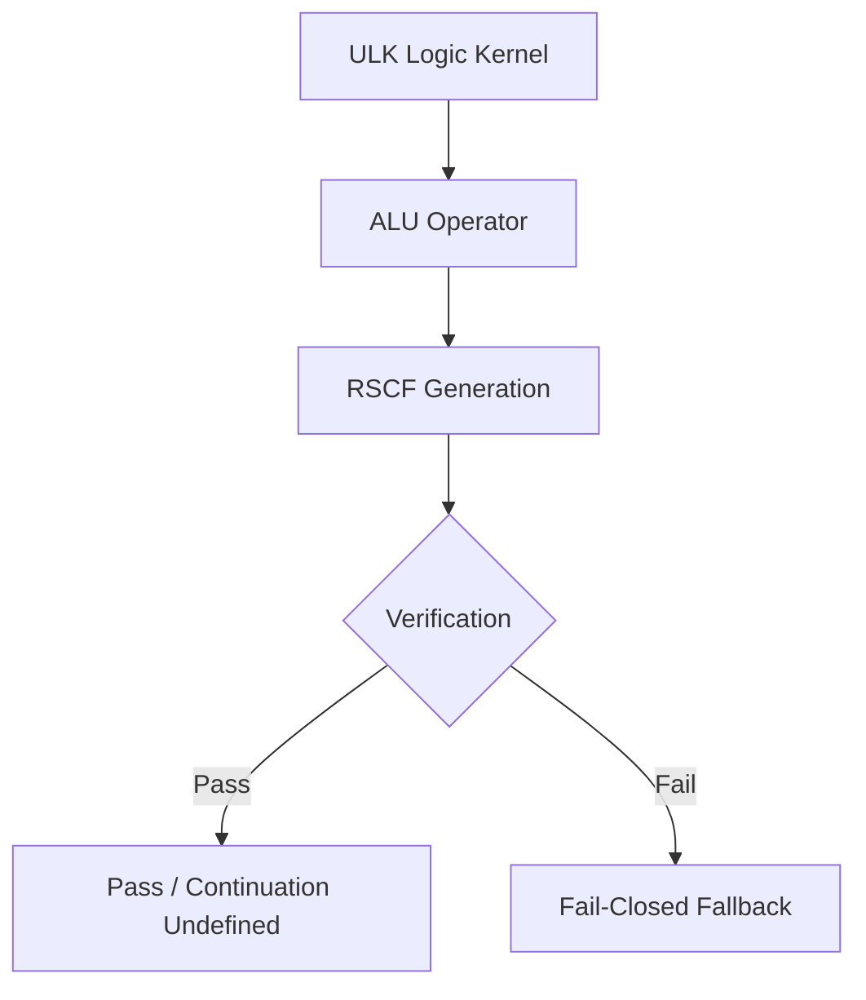
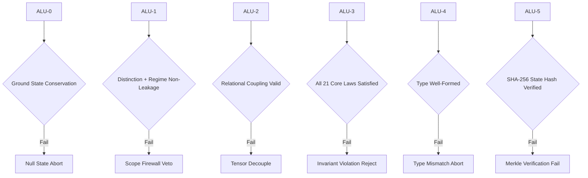
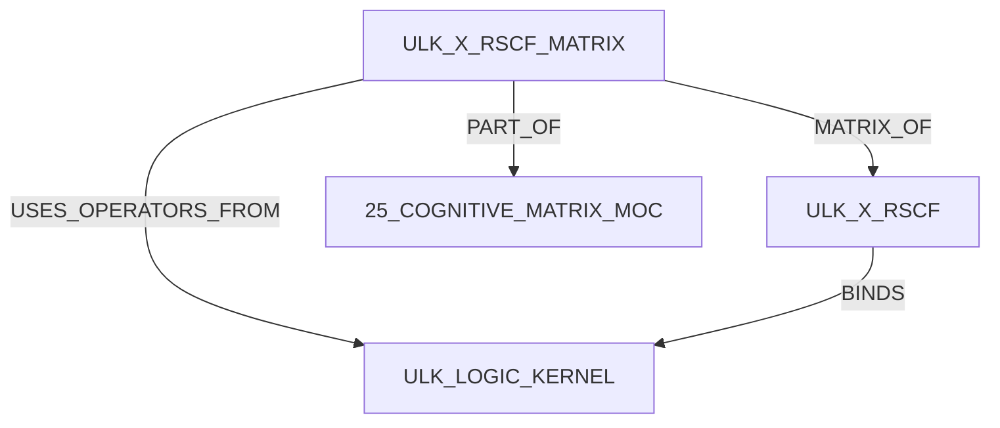

# ULK × RSCF Cross-Plane Matrix Table

> [!abstract] Canonical Definition
> `ULK_X_RSCF_MATRIX.md` is the Cognitive Matrix table connecting **Universal Logic Kernel (ULK) ALU operators** to **RSCF generation**, **verification checks**, and **fail-closed fallbacks**.
>
> The supplied source explicitly defines six ALU rows (`ALU-0` through `ALU-5`). The **Generated RSCF Section** cells are blank in the supplied source and therefore remain unresolved rather than being inferred.

---

## 0. Identity

| Field | Value |
|---|---|
| **Artifact** | `ULK_X_RSCF_MATRIX.md` |
| **Artifact ID** | `amos_25_cognitive_matrix_ulk_x_rscf_matrix` |
| **System** | AMOS OS |
| **Plane** | `25_COGNITIVE_MATRIX` |
| **Artifact Kind** | `MATRIX_TABLE` |
| **Version** | `2.0.0` |
| **Status** | `ACTIVE_REFERENCE` |
| **Epistemic Class** | `AMOS_MODEL` |
| **Canonical Status** | `SOURCE_GROUNDED_CANON_CANDIDATE` |
| **Implementation Status** | `CONCEPTUAL_SOURCE_DEFINED` |
| **Validation Status** | `PASSED_CONSTITUTIONAL_TESTS` |
| **Executable Binding** | `ESTABLISHED` |
| **Origin Architect** | Trang Phan |
| **Steward** | Trang Phan |

---

# 1. Canonical Matrix

| ULK ALU Operator | Generated RSCF Section | Verification Check | Fail-Closed Fallback |
| :--- | :--- | :--- | :--- |
| **ALU-0 ($\emptyset \to S_0$)** | `UNKNOWN / SOURCE BLANK` | Ground state conservation | Null State Abort |
| **ALU-1 ($\Delta$)** | `UNKNOWN / SOURCE BLANK` | Distinction & regime non-leakage | Scope Firewall Veto |
| **ALU-2 ($\otimes$)** | `UNKNOWN / SOURCE BLANK` | Relational coupling valid | Tensor Decouple |
| **ALU-3 ($\Pi_{\mathcal{C}}$)** | `UNKNOWN / SOURCE BLANK` | All 21 core laws satisfied | Invariant Violation Reject |
| **ALU-4 ($\tau$)** | `UNKNOWN / SOURCE BLANK` | Type well-formedness | Type Mismatch Abort |
| **ALU-5 ($\mathcal{H}$)** | `UNKNOWN / SOURCE BLANK` | SHA-256 state hash verified | Merkle Verification Fail |

> [!warning] Source normalization
> The supplied text contains formatting corruption around the ALU-0 arrow and ALU-4 symbol. This note normalizes them as `\emptyset \to S_0` and `\tau` for readable Obsidian/LaTeX rendering. If the authoritative [[ULK_LOGIC_KERNEL]] defines different symbols, that artifact supersedes this normalization.

---

# 2. Matrix Purpose

The matrix defines a four-part relationship:

\[
\boxed{
ALU\ Operator
\rightarrow
RSCF\ Generation
\rightarrow
Verification
\rightarrow
FailClosedFallback
}
\]

For each ULK operator \(A_i\), the matrix provides:

\[
M_i
=
\langle
A_i,
R_i,
V_i,
F_i
\rangle
\]

where:

- \(A_i\) = ULK ALU operator;
- \(R_i\) = generated RSCF section;
- \(V_i\) = verification condition;
- \(F_i\) = fail-closed fallback.

The source currently leaves \(R_i\) unspecified for all six rows.

Therefore:

\[
R_0,\ldots,R_5 = UNKNOWN
\]

within this artifact.

---

# 3. Specification–Matrix Relationship

This artifact is the operational matrix counterpart of:

[[ULK_X_RSCF]]

The relationship is:

```text

      │
      │ specifies
      ▼

      │
      │ tabulates
      ▼
ALU OPERATOR
      ↓
RSCF GENERATION
      ↓
VERIFICATION
      ↓
FAIL-CLOSED FALLBACK
```

The specification should remain the preferred authority for the architectural meaning of the ULK ↔ RSCF relationship.

This matrix remains the preferred authority for the supplied row-level mappings.

---

# 4. Universal Logic Kernel Binding

The matrix explicitly binds to:

[[ULK_LOGIC_KERNEL]]

Therefore the operator identities:

* `ALU-0`
* `ALU-1`
* `ALU-2`
* `ALU-3`
* `ALU-4`
* `ALU-5`

should be interpreted according to the canonical ULK definition rather than reconstructed solely from their symbols.

Formally:

$$
Meaning(ALU_i)
\leftarrow
ULK\_LOGIC\_KERNEL
$$

The matrix defines how each operator participates in the cross-plane relationship.

---

# 5. Core Cross-Plane Contract

The source establishes the following general control structure:

```text
ULK
 │
 ▼
ALU OPERATOR
 │
 ▼
RSCF GENERATION
 │
 ▼
VERIFICATION
 │
 ├── PASS → ACCEPT / CONTINUE
 │
 └── FAIL
       │
       ▼
 FAIL-CLOSED FALLBACK
```

The exact semantics of `ACCEPT / CONTINUE` are not supplied by the matrix and therefore remain a derived placeholder.

---

# 6. ALU-0 — Ground State

## Source Row

| Field                      | Value                         |
| -------------------------- | ----------------------------- |
| **Operator**               | `ALU-0 ($\emptyset \to S_0$)` |
| **Generated RSCF Section** | `UNKNOWN / SOURCE BLANK`      |
| **Verification**           | Ground state conservation     |
| **Fallback**               | Null State Abort              |

The row establishes:

$$
ALU_0
\rightarrow
GroundStateConservation
$$

with failure routing:

$$
\neg GroundStateConservation
\Rightarrow
NullStateAbort.
$$

This is a **source-defined AMOS model rule**.

---

# 7. ALU-0 Epistemic Boundary

The matrix does not define:

* the internal representation of \(S_0\);
* whether \(S_0\) is unique;
* the conservation predicate;
* initialization mechanics;
* restoration semantics;
* whether `Null State Abort` terminates a transaction, branch, RSCF node, or larger operation.

Therefore these remain dependent on:

[[ULK_LOGIC_KERNEL]]

and/or:

[[ULK_X_RSCF]].

---

# 8. ALU-1 — Distinction

## Source Row — part 2

| Field                      | Value                            |
| -------------------------- | -------------------------------- |
| **Operator**               | `ALU-1 ($\Delta$)`               |
| **Generated RSCF Section** | `UNKNOWN / SOURCE BLANK`         |
| **Verification**           | Distinction & regime non-leakage |
| **Fallback**               | Scope Firewall Veto              |

The source establishes:

$$
ALU_1
\rightarrow
DistinctionAndRegimeNonLeakage.
$$

Failure produces:

$$
Leakage
\Rightarrow
ScopeFirewallVeto.
$$

---

# 9. ALU-1 Scope Firewall

The verification name explicitly links distinction to regime containment.

The smallest source-safe abstraction is:

```text
DISTINCTION
      │
      ▼
REGIME BOUNDARY CHECK
      │
  ┌───┴───┐
 PASS    FAIL
  │        │
  ▼        ▼
 ???    SCOPE
       FIREWALL
         VETO
```

The successful continuation path is not explicitly defined by the row.

---

# 10. ALU-2 — Relational Coupling

## Source Row — part 3

| Field                      | Value                     |
| -------------------------- | ------------------------- |
| **Operator**               | `ALU-2 ($\otimes$)`       |
| **Generated RSCF Section** | `UNKNOWN / SOURCE BLANK`  |
| **Verification**           | Relational coupling valid |
| **Fallback**               | Tensor Decouple           |

The source establishes:

$$
ALU_2
\rightarrow
RelationalCouplingValidation.
$$

On failure:

$$
\neg ValidCoupling
\Rightarrow
TensorDecouple.
$$

---

# 11. ALU-2 Coupling Firewall

The matrix licenses the existence of a coupling validation step.

It does **not** independently define:

$$
\otimes
$$

as a specific tensor algebra operation.

Nor does it specify:

* dimensional compatibility;
* coupling coefficients;
* dependency direction;
* causal direction;
* symmetry;
* invertibility;
* decomposition algorithm.

Those details remain unresolved unless defined in [[ULK_LOGIC_KERNEL]].

---

# 12. ALU-3 — Constitutional Projection

## Source Row — part 4

| Field                      | Value                         |
| -------------------------- | ----------------------------- |
| **Operator**               | `ALU-3 ($\Pi_{\mathcal{C}}$)` |
| **Generated RSCF Section** | `UNKNOWN / SOURCE BLANK`      |
| **Verification**           | All 21 core laws satisfied    |
| **Fallback**               | Invariant Violation Reject    |

The source establishes:

$$
ALU_3
\rightarrow
Verify(All21CoreLaws).
$$

Acceptance requires:

$$
\bigwedge_{i=1}^{21} Law_i = TRUE.
$$

If any required law fails:

$$
\exists i:\ Law_i=FALSE
\Rightarrow
InvariantViolationReject.
$$

This is the strongest literal interpretation of **“All 21 core laws satisfied.”**

---

# 13. ALU-3 Constitutional Boundary

This artifact does not enumerate the 21 laws.

Therefore:

```yaml
core_laws:

  count:
    21

  source_defined_requirement:
    ALL_MUST_BE_SATISFIED

  law_definitions:
    NOT_PRESENT_IN_THIS_ARTIFACT
```

The laws must be loaded from the authoritative constitutional or ULK dependency when required.

They must not be invented from general AMOS principles.

---

# 14. ALU-4 — Type Formation

## Source Row — part 5

| Field                      | Value                    |
| -------------------------- | ------------------------ |
| **Operator**               | `ALU-4 ($\tau$)`         |
| **Generated RSCF Section** | `UNKNOWN / SOURCE BLANK` |
| **Verification**           | Type well-formedness     |
| **Fallback**               | Type Mismatch Abort      |

The source establishes:

$$
ALU_4
\rightarrow
TypeWellFormedness.
$$

Failure gives:

$$
\neg WellFormed(Type)
\Rightarrow
TypeMismatchAbort.
$$

---

# 15. ALU-4 Type Firewall

The matrix establishes type validation but does not provide the type system.

Unknown dependencies include:

```yaml
type_system:

  primitive_types:
    UNKNOWN

  composite_types:
    UNKNOWN

  coercion_rules:
    UNKNOWN

  subtype_rules:
    UNKNOWN

  compatibility_rules:
    UNKNOWN

  inference_rules:
    UNKNOWN

  nullability:
    UNKNOWN

  malformed_type_definition:
    UNKNOWN
```

These should be resolved through [[ULK_LOGIC_KERNEL]] rather than inferred.

---

# 16. ALU-5 — State Hash Verification

## Source Row — part 6

| Field                      | Value                       |
| -------------------------- | --------------------------- |
| **Operator**               | `ALU-5 ($\mathcal{H}$)`     |
| **Generated RSCF Section** | `UNKNOWN / SOURCE BLANK`    |
| **Verification**           | SHA-256 state hash verified |
| **Fallback**               | Merkle Verification Fail    |

The source establishes:

$$
ALU_5
\rightarrow
SHA256StateHashVerification.
$$

Failure produces:

$$
\neg HashVerified
\Rightarrow
MerkleVerificationFail.
$$

---

# 17. Hash / Merkle Boundary

The row contains both:

```text
SHA-256 state hash verified
```

and:

```text
Merkle Verification Fail
```

This establishes a source-level relationship between state hashing and Merkle verification.

It does not define the complete Merkle topology.

Unknowns include:

* leaf encoding;
* canonical serialization;
* tree branching factor;
* root construction;
* proof format;
* hash domain separation;
* persistence semantics;
* version binding;
* ancestry representation.

Therefore:

$$
SHA256
\neq
CompleteMerkleSpecification.
$$

---

# 18. Six-Operator Matrix

The supplied matrix can be normalized as:

$$
\mathcal A
=
\{
A_0,A_1,A_2,A_3,A_4,A_5
\}.
$$

with verification map:

$$
V:\mathcal A\rightarrow\mathcal V
$$

and fail-closed map:

$$
F:\mathcal A\rightarrow\mathcal F.
$$

Explicitly:

$$
V(A_0)=GroundStateConservation
$$

$$
V(A_1)=DistinctionAndRegimeNonLeakage
$$

$$
V(A_2)=RelationalCouplingValidity
$$

$$
V(A_3)=All21CoreLawsSatisfied
$$

$$
V(A_4)=TypeWellFormedness
$$

$$
V(A_5)=SHA256StateHashVerified.
$$

---

# 19. Fail-Closed Map

Likewise:

$$
F(A_0)=NullStateAbort
$$

$$
F(A_1)=ScopeFirewallVeto
$$

$$
F(A_2)=TensorDecouple
$$

$$
F(A_3)=InvariantViolationReject
$$

$$
F(A_4)=TypeMismatchAbort
$$

$$
F(A_5)=MerkleVerificationFail.
$$

Thus every supplied operator has an explicit verification failure route.

---

# 20. Fail-Closed Invariant

The matrix supports the structural invariant:

$$
VerificationFailure
\Rightarrow
NamedFailClosedFallback.
$$

This is stronger than a matrix where invalid state silently continues.

The supplied rows contain no explicit:

```text
IGNORE
WARN_AND_CONTINUE
AUTO_ACCEPT
```

fallback.

Therefore silent acceptance is not licensed by this matrix.

---

# 21. Unknown Generated RSCF Sections

The second column is blank in every supplied row.

This is a critical canonical fact.

The matrix therefore does **not** establish mappings such as:

```text
ALU-0 → RSCF.H
ALU-1 → RSCF.M
ALU-2 → RSCF.L
```

or any similar reconstruction.

Those would be fabricated unless established by [[ULK_X_RSCF]] or another canonical dependency.

Canonical state:

```yaml
generated_rscf_sections:

  ALU_0:
    UNKNOWN

  ALU_1:
    UNKNOWN

  ALU_2:
    UNKNOWN

  ALU_3:
    UNKNOWN

  ALU_4:
    UNKNOWN

  ALU_5:
    UNKNOWN
```

---

# 22. Missing RSCF Mapping as a Critical Gap

Because this is explicitly a **ULK × RSCF** matrix, the blank RSCF column is decision-relevant.

The cheapest discriminating dependency is:

[[ULK_X_RSCF]]

Then:

[[ULK_LOGIC_KERNEL]]

Only if those artifacts do not resolve the mappings should deeper source evidence be loaded.

---

# 23. Verification Before Acceptance

A safe model-level normalization is:

$$
Generate
\rightarrow
Verify
\rightarrow
Accept
$$

rather than:

$$
Generate
\rightarrow
Accept
\rightarrow
Verify.
$$

However, the exact ordering of RSCF generation relative to verification is only suggested by the column structure.

It is not independently proven as runtime execution order.

Status:

```text
MODEL / STRUCTURAL INFERENCE
```

---

# 24. Integrity Boundary

The matrix encodes verification gates for:

1. state;
2. scope/regime;
3. relation;
4. constitutional invariants;
5. type;
6. hash/provenance integrity.

This gives the derived verification vector:

$$
\mathbf V
=
\langle
State,
Scope,
Relation,
Constitution,
Type,
Hash
\rangle.
$$

This vector is a **DERIVED compression** of the six source rows.

---

# 25. Verification Stack

```text
ALU-0
GROUND STATE
    │
    ▼
ALU-1
DISTINCTION / REGIME
    │
    ▼
ALU-2
RELATIONAL COUPLING
    │
    ▼
ALU-3
CORE LAW COMPLIANCE
    │
    ▼
ALU-4
TYPE WELL-FORMEDNESS
    │
    ▼
ALU-5
STATE HASH VERIFICATION
```

> [!warning] Ordering boundary
> The numbering strongly supports this ordering as an index sequence. This artifact alone does not prove that runtime execution always occurs serially in exactly this order.

---

# 26. Fail-Closed Stack

```text
GROUND STATE FAILURE
→ NULL STATE ABORT

REGIME / DISTINCTION FAILURE
→ SCOPE FIREWALL VETO

COUPLING FAILURE
→ TENSOR DECOUPLE

CORE LAW FAILURE
→ INVARIANT VIOLATION REJECT

TYPE FAILURE
→ TYPE MISMATCH ABORT

HASH FAILURE
→ MERKLE VERIFICATION FAIL
```

---

# 27. Local Failure Semantics

The fallback names differ materially.

The matrix should therefore preserve them as typed failure modes rather than collapsing all into:

```text
ERROR
```

The source distinguishes at least:

```yaml
failure_classes:

  NULL_STATE_ABORT:
    source_operator: ALU_0

  SCOPE_FIREWALL_VETO:
    source_operator: ALU_1

  TENSOR_DECOUPLE:
    source_operator: ALU_2

  INVARIANT_VIOLATION_REJECT:
    source_operator: ALU_3

  TYPE_MISMATCH_ABORT:
    source_operator: ALU_4

  MERKLE_VERIFICATION_FAIL:
    source_operator: ALU_5
```

---

# 28. Abort vs Veto vs Decouple vs Reject vs Fail

The source deliberately uses different verbs:

* **Abort**
* **Veto**
* **Decouple**
* **Reject**
* **Abort**
* **Fail**

These should not be assumed equivalent.

A plausible semantic distinction exists:

```text
ABORT
→ terminate current operation

VETO
→ deny scoped transition

DECOUPLE
→ remove invalid relationship

REJECT
→ refuse invalid projection/state

FAIL
→ verification cannot be established
```

But these meanings are **MODEL interpretations**, not explicit source definitions.

Canonical runtime semantics remain dependent on [[ULK_LOGIC_KERNEL]].

---

# 29. Scope / Regime Firewall

ALU-1 explicitly verifies:

```text
Distinction & regime non-leakage
```

with:

```text
Scope Firewall Veto
```

on failure.

Therefore this matrix provides direct source support for a ULK-level scope/regime protection surface.

The safe invariant is:

$$
RegimeLeakage
\Rightarrow
Veto.
$$

---

# 30. Constitutional Firewall

ALU-3 explicitly requires:

```text
All 21 core laws satisfied
```

with:

```text
Invariant Violation Reject.
```

Therefore:

$$
ConstitutionalViolation
\Rightarrow
Reject.
$$

The matrix does not license optimization around this gate.

---

# 31. Type Firewall

ALU-4 explicitly requires:

```text
Type well-formedness.
```

Therefore malformed type state cannot be silently treated as valid under this matrix.

$$
TypeMismatch
\Rightarrow
Abort.
$$

---

# 32. Provenance / Integrity Firewall

ALU-5 explicitly requires:

```text
SHA-256 state hash verified.
```

Thus the matrix includes a cryptographic integrity check at the model level.

However:

$$
HashIntegrity
\neq
Truth.
$$

A verified hash can establish consistency with hashed content.

It does not establish that the content itself is empirically correct.

---

# 33. Hash Integrity vs Epistemic Validity

These must remain separate:

```text
CRYPTOGRAPHIC INTEGRITY
!=
EPISTEMIC VALIDITY
```

A state may be perfectly hash-consistent and still contain:

* a false source claim;
* a stale premise;
* a scope error;
* an unsupported causal inference;
* correlated evidence;
* an unresolved contradiction.

Therefore ALU-5 cannot substitute for ALU-1, ALU-3, or other epistemic validation.

---

# 34. Relational Coupling vs Causation

ALU-2 verifies:

```text
Relational coupling valid.
```

This does not mean:

$$
ValidRelation
\Rightarrow
CausalRelation.
$$

The matrix therefore remains compatible with the causal firewall:

$$
Relation
\neq
Causation.
$$

A relation may encode:

* dependency;
* association;
* composition;
* containment;
* reference;
* provenance;
* transformation;
* causal linkage.

The relationship type must be separately established.

---

# 35. Ground State vs Truth

Likewise:

$$
GroundStateConserved
\neq
ClaimVerified.
$$

ALU-0 establishes a structural state condition, not empirical truth.

This prevents structural validity from being silently promoted into epistemic validity.

---

# 36. Type Correctness vs Truth

Similarly:

$$
WellTyped
\neq
True.
$$

A claim can be structurally well-typed while factually unsupported.

ALU-4 therefore protects structural integrity, not complete epistemic validity.

---

# 37. Constitutional Compliance vs Empirical Proof

And:

$$
ConstitutionallyValid
\neq
EmpiricallyVerified.
$$

Passing all 21 core laws may establish compliance with AMOS constitutional constraints.

It does not automatically establish external empirical truth unless those laws explicitly include and successfully satisfy the necessary evidence tests.

---

# 38. Cross-Plane Architecture

```text
UNIVERSAL LOGIC KERNEL
          │
          ▼
      ALU OPERATOR
          │
          ▼
     RSCF BINDING
          │
          ▼
      VERIFICATION
          │
    ┌─────┴─────┐
    │           │
  PASS        FAILURE
    │           │
    ▼           ▼
  ???       FAIL-CLOSED
              ACTION
```

The matrix source clearly establishes the operator, verification, and fallback columns.

The exact generated RSCF content and successful post-verification action remain unresolved.

---

# 39. RSCF H-Level

```yaml
H:

  identity:
    "ULK × RSCF Cross-Plane Matrix Table"

  artifact:
    ULK_X_RSCF_MATRIX.md

  role:
    >
      Defines the source-grounded matrix mapping ULK ALU
      operators to RSCF generation slots, verification checks,
      and fail-closed fallback behaviors.

  primary_scope:
    ULK_RSCF_CROSS_PLANE_INTEGRATION

  primary_function:
    LOGIC_OPERATOR_TO_VERIFIED_RSCF_BINDING
```

---

# 40. RSCF M-Level

```yaml
M:

  operators:

    ALU_0:

      symbol:
        "∅ → S₀"

      verification:
        GROUND_STATE_CONSERVATION

      fallback:
        NULL_STATE_ABORT


    ALU_1:

      symbol:
        "Δ"

      verification:
        DISTINCTION_AND_REGIME_NON_LEAKAGE

      fallback:
        SCOPE_FIREWALL_VETO


    ALU_2:

      symbol:
        "⊗"

      verification:
        RELATIONAL_COUPLING_VALID

      fallback:
        TENSOR_DECOUPLE


    ALU_3:

      symbol:
        "Π_C"

      verification:
        ALL_21_CORE_LAWS_SATISFIED

      fallback:
        INVARIANT_VIOLATION_REJECT


    ALU_4:

      symbol:
        "τ"

      verification:
        TYPE_WELL_FORMEDNESS

      fallback:
        TYPE_MISMATCH_ABORT


    ALU_5:

      symbol:
        "ℋ"

      verification:
        SHA256_STATE_HASH_VERIFIED

      fallback:
        MERKLE_VERIFICATION_FAIL
```

---

# 41. RSCF L-Level

```yaml
L:

  load_on_demand:

    - ""
    - ""
    - definitions of all 21 core laws
    - RSCF section-generation mapping
    - ground-state representation
    - regime definitions
    - coupling semantics
    - type system
    - SHA-256 serialization rules
    - Merkle topology
    - runtime verification receipts

  raw_evidence:
    DO_NOT_LOAD_UNLESS_REQUIRED
```

---

# 42. RSCF Core Claim

```yaml
RSCF_CORE_CLAIM:

  claim:
    >
      ULK_X_RSCF_MATRIX v2.0.0 defines six source-grounded
      ULK ALU operator rows with corresponding verification
      checks and fail-closed fallback behaviors, while the
      Generated RSCF Section column remains unspecified in
      the supplied source.

  class:
    SOURCE_CLAIM

  claim_class:
    AMOS_MODEL

  evidence:
    source_artifact:
      ULK_X_RSCF_MATRIX.md

  dependencies:
    - ""
    - ""

  scope:
    AMOS_OS_COGNITIVE_MATRIX

  validity:
    SOURCE_DEFINED_MODEL

  confidence_ceiling:
    SOURCE_GROUNDED
```

---

# 43. Proof Capsule — ALU-0

```yaml
PROOF_CAPSULE_ALU_0:

  claim:
    >
      ALU-0 is checked for ground state conservation
      and routes failure to Null State Abort.

  class:
    SOURCE_CLAIM

  operator:
    ALU_0

  verification:
    GROUND_STATE_CONSERVATION

  failure:
    NULL_STATE_ABORT

  generated_rscf_section:
    UNKNOWN

  confidence_ceiling:
    SOURCE_GROUNDED
```

---

# 44. Proof Capsule — ALU-1

```yaml
PROOF_CAPSULE_ALU_1:

  claim:
    >
      ALU-1 is checked for distinction and regime
      non-leakage and routes failure to Scope Firewall Veto.

  class:
    SOURCE_CLAIM

  operator:
    ALU_1

  verification:
    DISTINCTION_AND_REGIME_NON_LEAKAGE

  failure:
    SCOPE_FIREWALL_VETO

  generated_rscf_section:
    UNKNOWN

  confidence_ceiling:
    SOURCE_GROUNDED
```

---

# 45. Proof Capsule — ALU-2

```yaml
PROOF_CAPSULE_ALU_2:

  claim:
    >
      ALU-2 is checked for valid relational coupling
      and routes failure to Tensor Decouple.

  class:
    SOURCE_CLAIM

  operator:
    ALU_2

  verification:
    RELATIONAL_COUPLING_VALID

  failure:
    TENSOR_DECOUPLE

  generated_rscf_section:
    UNKNOWN

  confidence_ceiling:
    SOURCE_GROUNDED
```

---

# 46. Proof Capsule — ALU-3

```yaml
PROOF_CAPSULE_ALU_3:

  claim:
    >
      ALU-3 requires all 21 core laws to be satisfied
      and routes violation to Invariant Violation Reject.

  class:
    SOURCE_CLAIM

  operator:
    ALU_3

  verification:
    ALL_21_CORE_LAWS_SATISFIED

  failure:
    INVARIANT_VIOLATION_REJECT

  generated_rscf_section:
    UNKNOWN

  unresolved:
    - DEFINITIONS_OF_21_CORE_LAWS

  confidence_ceiling:
    SOURCE_GROUNDED
```

---

# 47. Proof Capsule — ALU-4

```yaml
PROOF_CAPSULE_ALU_4:

  claim:
    >
      ALU-4 verifies type well-formedness and routes
      failure to Type Mismatch Abort.

  class:
    SOURCE_CLAIM

  operator:
    ALU_4

  verification:
    TYPE_WELL_FORMEDNESS

  failure:
    TYPE_MISMATCH_ABORT

  generated_rscf_section:
    UNKNOWN

  confidence_ceiling:
    SOURCE_GROUNDED
```

---

# 48. Proof Capsule — ALU-5

```yaml
PROOF_CAPSULE_ALU_5:

  claim:
    >
      ALU-5 verifies a SHA-256 state hash and routes
      failure to Merkle Verification Fail.

  class:
    SOURCE_CLAIM

  operator:
    ALU_5

  verification:
    SHA256_STATE_HASH_VERIFIED

  failure:
    MERKLE_VERIFICATION_FAIL

  generated_rscf_section:
    UNKNOWN

  unresolved:
    - STATE_SERIALIZATION
    - MERKLE_TOPOLOGY
    - PROOF_FORMAT

  confidence_ceiling:
    SOURCE_GROUNDED
```

---

# 49. Matrix-Level Proof Capsule

```yaml
PROOF_CAPSULE:

  claim:
    >
      The ULK × RSCF matrix defines six ULK ALU operators,
      their verification conditions, and their typed
      fail-closed fallbacks. The supplied matrix does not
      populate the Generated RSCF Section column.

  class:
    SOURCE_CLAIM

  claim_class:
    AMOS_MODEL

  load_bearing_premises:

    - six ALU rows are preserved
    - verification text is preserved
    - fallback text is preserved
    - blank RSCF cells remain unresolved
    - ULK_X_RSCF remains specification authority
    - ULK_LOGIC_KERNEL remains operator-definition authority

  evidence:

    ALU_0:
      verification: GROUND_STATE_CONSERVATION
      fallback: NULL_STATE_ABORT

    ALU_1:
      verification: DISTINCTION_AND_REGIME_NON_LEAKAGE
      fallback: SCOPE_FIREWALL_VETO

    ALU_2:
      verification: RELATIONAL_COUPLING_VALID
      fallback: TENSOR_DECOUPLE

    ALU_3:
      verification: ALL_21_CORE_LAWS_SATISFIED
      fallback: INVARIANT_VIOLATION_REJECT

    ALU_4:
      verification: TYPE_WELL_FORMEDNESS
      fallback: TYPE_MISMATCH_ABORT

    ALU_5:
      verification: SHA256_STATE_HASH_VERIFIED
      fallback: MERKLE_VERIFICATION_FAIL

  falsifiers:

    - authoritative matrix revision changes operator rows
    - ULK specification supersedes operator semantics
    - canonical source populates currently blank RSCF sections
    - canonical source corrects normalized symbols

  confidence_ceiling:

    matrix_structure:
      SOURCE_GROUNDED

    verification_mapping:
      SOURCE_GROUNDED

    fallback_mapping:
      SOURCE_GROUNDED

    generated_rscf_mapping:
      UNKNOWN

    runtime_execution:
      NOT_INDEPENDENTLY_VERIFIED
```

---

# 50. Competing Hypotheses — RSCF Generation

Because the generated RSCF cells are blank, multiple architectures remain possible.

```yaml
COMPETING_HYPOTHESES:

  H1_OPERATOR_SECTION_MAPPING:

    claim:
      >
        Each ALU operator directly generates a distinct
        named RSCF section.

    class:
      MODEL

    status:
      COMPETING


  H2_OPERATOR_FIELD_MAPPING:

    claim:
      >
        ALU operators populate fields within shared
        RSCF sections rather than distinct sections.

    class:
      MODEL

    status:
      COMPETING


  H3_VALIDATION_ONLY:

    claim:
      >
        ULK operators primarily validate RSCF structures
        generated elsewhere.

    class:
      MODEL

    status:
      COMPETING


  H4_COMPOSITE_PIPELINE:

    claim:
      >
        ULK operators jointly construct and validate a
        single RSCF through a staged pipeline.

    class:
      MODEL

    status:
      COMPETING
```

No hypothesis should be promoted without discriminating evidence.

---

# 51. Cheapest Discriminating Evidence

Priority order:

1. [[ULK_X_RSCF]]
2. [[ULK_LOGIC_KERNEL]]
3. authoritative RSCF schema
4. constitutional law definitions
5. executable binding
6. runtime receipts
7. raw implementation evidence

This follows smallest-sufficient-proof retrieval.

---

# 52. Gaps Registry

```yaml
GAPS:

  CRITICAL:

    - GENERATED_RSCF_SECTION_ALU_0
    - GENERATED_RSCF_SECTION_ALU_1
    - GENERATED_RSCF_SECTION_ALU_2
    - GENERATED_RSCF_SECTION_ALU_3
    - GENERATED_RSCF_SECTION_ALU_4
    - GENERATED_RSCF_SECTION_ALU_5


  DECISION_RELEVANT:

    - EXACT_ALU_0_SYMBOL_FROM_AUTHORITY
    - EXACT_ALU_4_SYMBOL_FROM_AUTHORITY
    - GROUND_STATE_DEFINITION
    - REGIME_NON_LEAKAGE_PREDICATE
    - RELATIONAL_COUPLING_PREDICATE
    - DEFINITIONS_OF_21_CORE_LAWS
    - TYPE_SYSTEM
    - STATE_SERIALIZATION
    - MERKLE_TOPOLOGY
    - SUCCESS_PATH
    - EXECUTION_ORDER


  EXPLANATORY:

    - ABORT_SEMANTICS
    - VETO_SEMANTICS
    - DECOUPLE_SEMANTICS
    - REJECT_SEMANTICS
    - MERKLE_FAILURE_SEMANTICS


  COSMETIC:

    - SYMBOL_RENDERING
    - TABLE_ALIGNMENT
```

---

# 53. Uncertainty Vector

```yaml
UNCERTAINTY_VECTOR:

  evidence:
    LOW_FOR_SUPPLIED_ROWS

  model:
    MODERATE

  scope:
    LOW_WITHIN_DECLARED_MATRIX

  temporal:
    LOW_FOR_ARTIFACT_VERSION

  causal:
    NOT_PRIMARY

  execution:
    HIGH

  provenance_independence:
    MODERATE

  rscf_generation:
    HIGH
```

---

# 54. Confidence Ceiling

```yaml
CONFIDENCE_CEILING:

  artifact_identity:
    SOURCE_GROUNDED

  six_operator_rows:
    SOURCE_GROUNDED

  verification_checks:
    SOURCE_GROUNDED

  fail_closed_fallbacks:
    SOURCE_GROUNDED

  generated_rscf_sections:
    UNKNOWN

  exact_operator_semantics:
    DEPENDENT_ON_ULK_LOGIC_KERNEL

  runtime_order:
    NOT_ESTABLISHED

  executable_behavior:
    SOURCE_DECLARED_NOT_INDEPENDENTLY_REVALIDATED
```

---

# 55. Validation Surface

The metadata states:

```text
validation_status:
PASSED_CONSTITUTIONAL_TESTS
```

This should be preserved as a source declaration.

It does not establish:

$$
PassedConstitutionalTests
=
FormalProofOfAllPossibleBehavior.
$$

Nor does it establish:

$$
PassedConstitutionalTests
=
IndependentRuntimeVerification.
$$

Safe classification:

```yaml
validation:

  source_declaration:
    PASSED_CONSTITUTIONAL_TESTS

  independent_revalidation:
    NOT_PRESENT_IN_THIS_ARTIFACT

  universal_formal_proof:
    NOT_ESTABLISHED
```

---

# 56. Executable Binding Surface

The metadata states:

```text
executable_binding:
ESTABLISHED
```

Therefore this property is canonical metadata for the supplied artifact.

But:

$$
ExecutableBindingEstablished
\neq
RuntimeReceiptPresent.
$$

Thus:

```yaml
runtime:

  source_declared_binding:
    ESTABLISHED

  binding_definition:
    NOT_PRESENT_IN_THIS_ARTIFACT

  execution_receipt:
    NOT_PRESENT_IN_THIS_ARTIFACT

  independent_runtime_validation:
    NOT_ESTABLISHED
```

---

# 57. Anti-Fabrication Contract

This matrix MUST NOT be used to claim, without additional canonical evidence, that:

1. the blank Generated RSCF Section cells have known values;
2. ALU-0 necessarily generates RSCF H;
3. ALU-1 necessarily generates RSCF M;
4. ALU-2 necessarily generates RSCF L;
5. ALU operators execute serially in all runtimes;
6. ALU numbering alone proves causal dependency;
7. `Tensor Decouple` has a known mathematical implementation;
8. `Scope Firewall Veto` has a known runtime implementation;
9. the 21 core laws are enumerated in this artifact;
10. all 21 laws have been formally proven;
11. type well-formedness establishes factual truth;
12. hash verification establishes factual truth;
13. Merkle verification establishes source independence;
14. SHA-256 proves semantic validity;
15. relational coupling establishes causation;
16. ground-state conservation establishes empirical correctness;
17. constitutional compliance establishes empirical correctness;
18. a successful hash check supersedes other verification checks;
19. a successful type check supersedes scope verification;
20. fail-closed fallback names are semantically interchangeable;
21. `PASSED_CONSTITUTIONAL_TESTS` means universal formal proof;
22. `executable_binding: ESTABLISHED` proves observed deployment;
23. missing RSCF mappings may be inferred from structural similarity;
24. operator symbols may be silently corrected without authoritative confirmation.

---

# 58. Scope Firewall

```yaml
APPLICABILITY_ENVELOPE:

  system:
    AMOS_OS

  plane:
    25_COGNITIVE_MATRIX

  framework:
    ULK_X_RSCF

  artifact_role:
    MATRIX_TABLE

  epistemic_class:
    AMOS_MODEL

  implementation_status:
    CONCEPTUAL_SOURCE_DEFINED

  version:
    "2.0.0"

  updated:
    "2026-08-28"

  runtime_generalization:
    NOT_LICENSED_WITHOUT_BINDING

  external_system_generalization:
    NOT_LICENSED
```

---

# 59. Machine-Readable Matrix

```yaml
ULK_X_RSCF_MATRIX:

  identity:

    artifact:
      ULK_X_RSCF_MATRIX.md

    artifact_id:
      amos_25_cognitive_matrix_ulk_x_rscf_matrix

    type:
      cognitive_matrix

    artifact_kind:
      MATRIX_TABLE

    system:
      AMOS_OS

    plane:
      25_COGNITIVE_MATRIX

    version:
      2.0.0

    origin_architect:
      Trang_Phan

    steward:
      Trang_Phan


  epistemic:

    class:
      AMOS_MODEL

    canonical_status:
      SOURCE_GROUNDED_CANON_CANDIDATE

    implementation_status:
      CONCEPTUAL_SOURCE_DEFINED

    validation_status:
      PASSED_CONSTITUTIONAL_TESTS

    executable_binding:
      ESTABLISHED


  operators:

    ALU_0:

      symbol:
        "∅ → S₀"

      generated_rscf_section:
        UNKNOWN

      verification:
        GROUND_STATE_CONSERVATION

      fail_closed:
        NULL_STATE_ABORT


    ALU_1:

      symbol:
        "Δ"

      generated_rscf_section:
        UNKNOWN

      verification:
        DISTINCTION_AND_REGIME_NON_LEAKAGE

      fail_closed:
        SCOPE_FIREWALL_VETO


    ALU_2:

      symbol:
        "⊗"

      generated_rscf_section:
        UNKNOWN

      verification:
        RELATIONAL_COUPLING_VALID

      fail_closed:
        TENSOR_DECOUPLE


    ALU_3:

      symbol:
        "Π_C"

      generated_rscf_section:
        UNKNOWN

      verification:
        ALL_21_CORE_LAWS_SATISFIED

      fail_closed:
        INVARIANT_VIOLATION_REJECT


    ALU_4:

      symbol:
        "τ"

      generated_rscf_section:
        UNKNOWN

      verification:
        TYPE_WELL_FORMEDNESS

      fail_closed:
        TYPE_MISMATCH_ABORT


    ALU_5:

      symbol:
        "ℋ"

      generated_rscf_section:
        UNKNOWN

      verification:
        SHA256_STATE_HASH_VERIFIED

      fail_closed:
        MERKLE_VERIFICATION_FAIL


  bindings:

    specification:
      ""

    universal_logic_kernel:
      ""

    cognitive_matrix:
      ""
```

---

# 60. Verification Matrix — Compact Form

| ALU   | Verification Domain | Source Check                     | Failure                    |
| ----- | ------------------- | -------------------------------- | -------------------------- |
| **0** | State               | Ground state conservation        | Null State Abort           |
| **1** | Scope / Regime      | Distinction & regime non-leakage | Scope Firewall Veto        |
| **2** | Relation            | Relational coupling valid        | Tensor Decouple            |
| **3** | Constitution        | All 21 core laws satisfied       | Invariant Violation Reject |
| **4** | Type                | Type well-formedness             | Type Mismatch Abort        |
| **5** | Integrity / Hash    | SHA-256 state hash verified      | Merkle Verification Fail   |

Derived compression:

$$
\boxed{
State
\rightarrow
Scope
\rightarrow
Relation
\rightarrow
Constitution
\rightarrow
Type
\rightarrow
Integrity
}
$$

This ordering is useful for navigation but should not be treated as a proven runtime sequence without the ULK specification.

---

# 61. Mermaid — Cross-Plane Matrix



---

# 62. Mermaid — Six Verification Routes



---

# 63. Obsidian Link Graph



---

# 64. Dataview — ULK × RSCF Family

```dataview
TABLE
  artifact_kind AS "Kind",
  version AS "Version",
  status AS "Status",
  canonical_status AS "Canonical",
  validation_status AS "Validation"
FROM #ulk_x_rscf
SORT artifact_kind ASC
```

---

# 65. Dataview — ULK Artifacts

```dataview
TABLE
  title AS "Artifact",
  plane AS "Plane",
  artifact_kind AS "Kind",
  version AS "Version",
  status AS "Status"
FROM #ulk
SORT plane ASC, title ASC
```

---

# 66. Dataview — RSCF Artifacts

```dataview
TABLE
  title AS "Artifact",
  plane AS "Plane",
  artifact_kind AS "Kind",
  epistemic_class AS "Epistemic"
FROM #rscf
SORT plane ASC, title ASC
```

---

# 67. Dataview — Fail-Closed Artifacts

```dataview
TABLE
  title AS "Artifact",
  plane AS "Plane",
  artifact_kind AS "Kind",
  validation_status AS "Validation"
FROM #fail_closed
SORT title ASC
```

---

# 68. Dataview — Cognitive Matrix Family

```dataview
TABLE
  artifact AS "Artifact",
  artifact_kind AS "Kind",
  epistemic_class AS "Epistemic Class",
  canonical_status AS "Canonical Status"
FROM #25_cognitive_matrix
WHERE system = "AMOS OS"
SORT artifact ASC
```

---

# 69. Obsidian Search Tags

Primary navigation:

```text
#amos_os
#cognitive_matrix
#25_cognitive_matrix
#ulk_x_rscf
#ulk_x_rscf_matrix
#ulk
#rscf
```

Logic navigation:

```text
#universal_logic_kernel
#logic_kernel
#alu
#alu_operator
#deterministic_logic
#ground_state
#distinction
#relational_coupling
#type_system
```

Verification navigation:

```text
#verification
#invariant_verification
#constitutional_tests
#scope_firewall
#fail_closed
#sha256
#merkle_verification
#type_safety
```

Canonical navigation:

```text
#canon/cognitive-matrix
#canon/ulk
#canon/rscf
```

---

# 70. Canonical Dependency Topology

```text

              │
              ▼

       │              │
       │              │
       ▼              ▼

       │              │
       └──────┬───────┘
              ▼
      ULK ↔ RSCF BINDING
```

---

# 71. Fractal Retrieval Contract

```yaml
FRACTAL_RETRIEVAL:

  bootstrap:

    load:
      - artifact identity
      - six ALU rows
      - verification mappings
      - fail-closed mappings
      - specification binding
      - ULK binding

  H:

    load:
      - ULK_RSCF cross-plane role

  M:

    load_if_required:
      - operator semantics
      - verification domains
      - fallback classes

  L:

    load_only_if_decision_relevant:
      - generated RSCF section mappings
      - 21 core laws
      - type system
      - state serialization
      - SHA-256 implementation
      - Merkle topology
      - runtime receipts

  raw_evidence:
    DO_NOT_LOAD_UNLESS_REQUIRED
```

---

# 72. Canonical Compression

$$
\boxed{
ULK\times RSCF
=
ALU
+
Verification
+
FailClosed
}
$$

with:

$$
\boxed{
ALU_0
\rightarrow
GroundStateConservation
\rightarrow
NullStateAbort
}
$$

$$
\boxed{
ALU_1
\rightarrow
RegimeNonLeakage
\rightarrow
ScopeFirewallVeto
}
$$

$$
\boxed{
ALU_2
\rightarrow
RelationalCouplingValidity
\rightarrow
TensorDecouple
}
$$

$$
\boxed{
ALU_3
\rightarrow
21CoreLaws
\rightarrow
InvariantViolationReject
}
$$

$$
\boxed{
ALU_4
\rightarrow
TypeWellFormedness
\rightarrow
TypeMismatchAbort
}
$$

$$
\boxed{
ALU_5
\rightarrow
SHA256StateVerification
\rightarrow
MerkleVerificationFail
}
$$

while:

$$
\boxed{
GeneratedRSCFSection(ALU_i)=UNKNOWN
}
$$

for all six supplied rows.

---

# 73. Epistemic Compression

```text
SOURCE DEFINES:
✓ Six ALU operators
✓ Six verification checks
✓ Six fail-closed fallbacks
✓ ULK × RSCF specification binding
✓ ULK Logic Kernel binding
✓ Cognitive Matrix placement

SOURCE LEAVES BLANK:
? Generated RSCF Section — ALU-0
? Generated RSCF Section — ALU-1
? Generated RSCF Section — ALU-2
? Generated RSCF Section — ALU-3
? Generated RSCF Section — ALU-4
? Generated RSCF Section — ALU-5

SOURCE DOES NOT DEFINE HERE:
? Exact RSCF generation mapping
? Complete ground-state semantics
? Complete regime predicate
? Tensor/coupling implementation
? Definitions of all 21 core laws
? Complete type system
? State serialization
? Merkle topology
? Success-path semantics
? Runtime execution ordering
? Independent runtime receipts
```

---

# 74. Canonical Candidate Statement

`ULK_X_RSCF_MATRIX.md v2.0.0` is the AMOS OS Cognitive Matrix table for the cross-plane relationship between the **Universal Logic Kernel** and **RSCF**.

Its supplied source defines six operator verification routes:

```text
ALU-0
Ground State Conservation
→ Null State Abort
```

```text
ALU-1
Distinction & Regime Non-Leakage
→ Scope Firewall Veto
```

```text
ALU-2
Relational Coupling Valid
→ Tensor Decouple
```

```text
ALU-3
All 21 Core Laws Satisfied
→ Invariant Violation Reject
```

```text
ALU-4
Type Well-Formedness
→ Type Mismatch Abort
```

```text
ALU-5
SHA-256 State Hash Verified
→ Merkle Verification Fail
```

Its specification counterpart is:

[[ULK_X_RSCF]]

Its Universal Logic Kernel authority is:

[[ULK_LOGIC_KERNEL]]

Its parent plane is:

[[25_COGNITIVE_MATRIX_MOC]]

The decisive unresolved field is:

```text
Generated RSCF Section
```

which is blank for all six supplied rows.

Therefore:

$$
\boxed{
BlankSourceField
\neq
PermissionToInferMapping
}
$$

$$
\boxed{
WellTyped
\neq
True
}
$$

$$
\boxed{
HashVerified
\neq
EpistemicallyVerified
}
$$

$$
\boxed{
RelationalCoupling
\neq
Causation
}
$$

$$
\boxed{
ConstitutionalCompliance
\neq
UniversalEmpiricalProof
}
$$

and:

$$
\boxed{
VerificationFailure
\Rightarrow
TypedFailClosedFallback
}
$$

within the supplied AMOS model matrix.

---

# 75. Connections

## Inter-Plane Connections

* **Specification:** [[ULK_X_RSCF]]
* **Universal Logic Kernel:** [[ULK_LOGIC_KERNEL]]
* **Cognitive Matrix Plane:** [[25_COGNITIVE_MATRIX_MOC]]

## Functional Connections

* **RSCF:** RSCF
* **Scope Firewall:** K_SCOPE_FIREWALL
* **Fail-Closed Governance:** [[K_FAIL_CLOSED]]
* **Provenance:** [[K_PROVENANCE]]
* **Causal Firewall:** K_CAUSAL_FIREWALL

> [!note]
> Functional links beyond the three source-supplied connections are vault navigation candidates. They should not be treated as source-defined dependency edges unless their respective canonical artifacts confirm the relationship.

---

# 76. Obsidian Navigation Footer

**Home:** [[00_HOME]]

**RSCF Index:** [[AMOS_RSCF_NODES]]

**Plane:** [[25_COGNITIVE_MATRIX_MOC]]

**Specification:** [[ULK_X_RSCF]]

**Universal Logic Kernel:** [[ULK_LOGIC_KERNEL]]

---

# 77. RSCF-NODE

```yaml
RSCF-NODE:

  node_id:
    amos_25_cognitive_matrix_ulk_x_rscf_matrix

  node_type:
    matrix_table

  path:
    25_COGNITIVE_MATRIX/ULK_X_RSCF_MATRIX.md

  claim_class:
    AMOS_MODEL

  rscf_state:
    SOURCE_GROUNDED

  canonical_status:
    SOURCE_GROUNDED_CANON_CANDIDATE

  implementation_status:
    CONCEPTUAL_SOURCE_DEFINED

  validation_status:
    PASSED_CONSTITUTIONAL_TESTS

  executable_binding:
    ESTABLISHED

  H:
    ULK_RSCF_CROSS_PLANE_MATRIX

  M:
    - ALU_OPERATOR_MAPPING
    - VERIFICATION_CHECKS
    - FAIL_CLOSED_FALLBACKS

  L:
    - ALU_0
    - ALU_1
    - ALU_2
    - ALU_3
    - ALU_4
    - ALU_5
    - GENERATED_RSCF_SECTION_GAPS

  raw_evidence:
    DO_NOT_LOAD_UNLESS_REQUIRED
```

---

# 78. RSCF-RELATIONS

```yaml
RSCF-RELATIONS:

  - INDEXED_BY: ""

  - INDEXED_BY: ""

  - PART_OF: ""

  - MATRIX_OF: ""

  - USES_OPERATORS_FROM: ""

  - DEFINES_VERIFICATION_FOR: ALU_0

  - DEFINES_VERIFICATION_FOR: ALU_1

  - DEFINES_VERIFICATION_FOR: ALU_2

  - DEFINES_VERIFICATION_FOR: ALU_3

  - DEFINES_VERIFICATION_FOR: ALU_4

  - DEFINES_VERIFICATION_FOR: ALU_5

  - FAIL_CLOSED_ROUTE: NULL_STATE_ABORT

  - FAIL_CLOSED_ROUTE: SCOPE_FIREWALL_VETO

  - FAIL_CLOSED_ROUTE: TENSOR_DECOUPLE

  - FAIL_CLOSED_ROUTE: INVARIANT_VIOLATION_REJECT

  - FAIL_CLOSED_ROUTE: TYPE_MISMATCH_ABORT

  - FAIL_CLOSED_ROUTE: MERKLE_VERIFICATION_FAIL

  - GENERATED_RSCF_MAPPING: UNKNOWN_GAP

  - GOVERNED_BY: ""

  - PROVENANCE_GOVERNED_BY: ""

  - FAIL_CLOSED_GOVERNED_BY: ""

  - CAUSAL_FIREWALL: "K_CAUSAL_FIREWALL"

  - LINEAGE_TARGET: ""
```

---

# 79. Final Vault Tags

#amos_os #cognitive_matrix #25_cognitive_matrix #ulk_x_rscf #ulk_x_rscf_matrix #matrix_table #cross_plane #cross_plane_matrix #universal_logic_kernel #ulk #logic_kernel #rscf #rscf_node #recursive_structure #deterministic_logic #alu #alu_operator #ground_state #distinction #regime #relational_coupling #tensor_coupling #constitutional_projection #type_system #state_hash #sha256 #merkle_verification #fail_closed #scope_firewall #invariant #invariant_verification #type_safety #provenance #source_grounded #source_claim #amos_model #canon_candidate #active_reference #conceptual_source_defined #executable_binding #constitutional_tests #epistemic_boundary #verification #verification_matrix #governance #integrity #causal_firewall #fractal_knowledge_network #canon/cognitive-matrix #canon/ulk #canon/rscf

---

**MOC:** [[25_COGNITIVE_MATRIX_MOC]]

**Specification:** [[ULK_X_RSCF]]

**Universal Logic Kernel:** [[ULK_LOGIC_KERNEL]]

---

**END OF `ULK_X_RSCF_MATRIX.md`**
