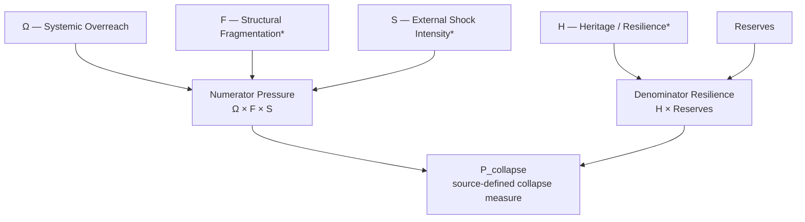
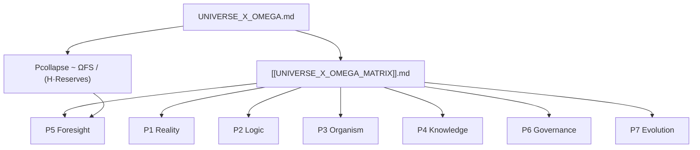
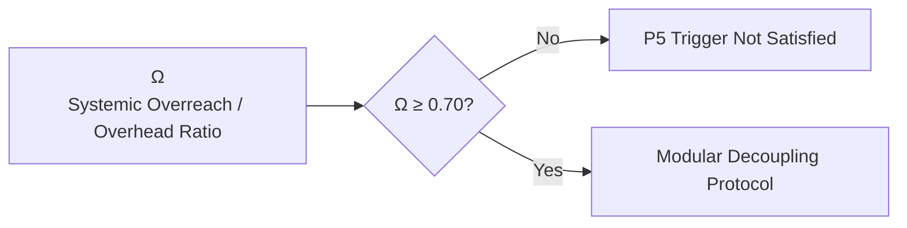
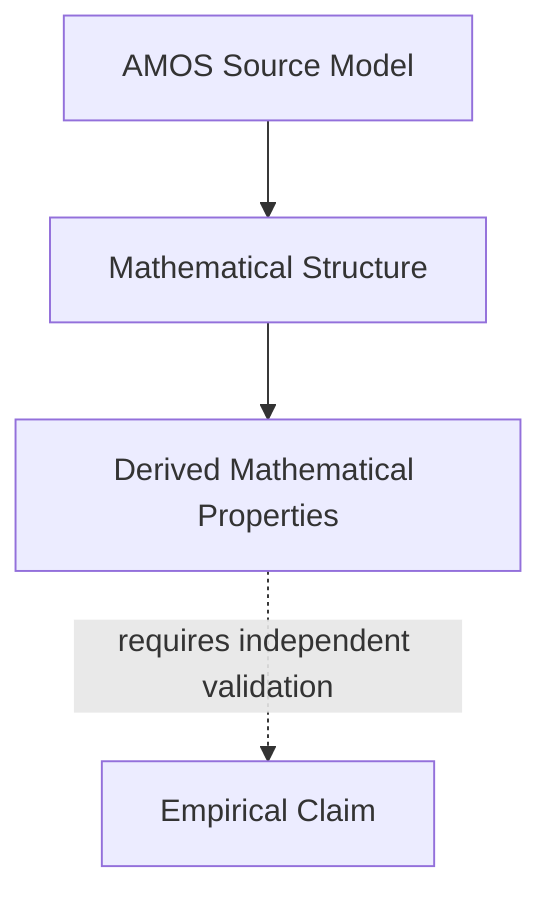

# `UNIVERSE_X_OMEGA.md` — Full Canonical Content with Tags

Source recovery note: the central equation is recoverable as \(P_{\text{collapse}}\sim\frac{\Omega F S}{H\cdot Reserves}\). The prose definitions clearly preserve \(\Omega\) and \(H\), while the source has lost the variable glyphs preceding “Structural Fragmentation” and “External Shock Intensity.” Because the numerator visibly contains `F · S`, the strongest reconstruction is **F = Structural Fragmentation** and **S = External Shock Intensity**, but those assignments are marked **DERIVED_FROM_EQUATION_ORDER**, not silently upgraded to source-verbatim fact. The stray `48307` tokens are treated as rendering corruption, not canonical constants.

---
title: Universe x Omega Cognitive Matrix Specification
aliases:
  - "Universe × Omega Cognitive Matrix Specification"
  - "Universe x Omega"
  - "Universe Omega"
  - "Universe Omega Specification"
  - "Omega Structural Limit Specification"

type: cognitive_matrix
source: 25_COGNITIVE_MATRIX

artifact: "UNIVERSE_X_OMEGA.md"
artifact_id: "amos_25_cognitive_matrix_universe_x_omega"

origin_architect: "Trang Phan"
steward: "Trang Phan"
system: "AMOS OS"

plane: "25_COGNITIVE_MATRIX"
segment: "25_COGNITIVE_MATRIX"
artifact_kind: "MATRIX_SPEC"
path: "25_COGNITIVE_MATRIX/UNIVERSE_X_OMEGA.md"

version: "2.0.0"
updated: "2026-08-28"

status: "ACTIVE_REFERENCE"
epistemic_class: "AMOS_MODEL"
canonical_status: "SOURCE_GROUNDED_CANON_CANDIDATE"
implementation_status: "CONCEPTUAL_SOURCE_DEFINED"
validation_status: "PASSED_CONSTITUTIONAL_TESTS"
executable_binding: "ESTABLISHED"

raw_source_policy: "DO_NOT_LOAD_UNLESS_REQUIRED"
ingestion_action: "NATIVE_CANON_INGESTION"

tags:
  - amos_os
  - cognitive_matrix
  - vault
  - 25_cognitive_matrix
  - universe_x_omega
  - universe_x_omega_spec
  - universe_omega
  - universe_omega_specification
  - matrix_spec
  - cross_plane
  - cross_plane_matrix
  - omega
  - omega_canon
  - omega_structural_limit
  - omega_structural_limit_theorems
  - cosmological_limits
  - cosmological_convergence
  - universe_canon
  - seven_part_universe_canon
  - structural_limits
  - structural_limit
  - collapse
  - collapse_formulation
  - collapse_pressure
  - collapse_risk
  - systemic_overreach
  - systemic_overhead
  - overhead_ratio
  - structural_overreach
  - structural_fragmentation
  - external_shock
  - external_shock_intensity
  - heritage_anchor
  - resilience
  - reserves
  - reserve_capacity
  - numerator_pressure
  - denominator_resilience
  - multiplicative_risk
  - inverse_resilience
  - bounded_variables
  - normalized_variables
  - omega_threshold
  - omega_070
  - tau_bio
  - sybil_lineage
  - lineage_independence
  - provenance
  - provenance_topology
  - sybil_hardening
  - confidence_ceiling
  - mutation_debt
  - semantic_divergence
  - modular_decoupling
  - rollback
  - ground_state_recovery
  - runtime_defense
  - failure_trigger
  - universe_strata
  - p1_reality
  - p2_logic
  - p3_organism
  - p4_knowledge
  - p5_foresight
  - p6_governance
  - p7_evolution
  - rscf
  - hml
  - fractal_knowledge_network
  - proof_capsule
  - epistemic_boundary
  - source_grounded
  - source_claim
  - derived
  - amos_model
  - canon_candidate
  - active_reference
  - conceptual_source_defined
  - constitutional_tests
  - executable_binding
  - causal_firewall
  - scope_firewall
  - regime_firewall
  - anti_fabrication
  - anti_regression
  - sensitivity
  - singularity
  - denominator_singularity
  - boundary_conditions
  - dimensional_semantics
  - khung_trang
  - khung_trang_master
  - canon/cognitive-matrix
  - canon/universe
  - canon/omega
  - canon/structural-limit
  - canon/collapse
  - canon/resilience

framework_binding:

  matrix_counterpart:
    artifact: "[[UNIVERSE_X_OMEGA_MATRIX]]"

  universe_canon:
    artifact: "[[02_UNIVERSE_CANON_MOC]]"

source_connections:

  matrix_table:
    artifact: "[[UNIVERSE_X_OMEGA_MATRIX]]"

  universe_canon_moc:
    artifact: "[[02_UNIVERSE_CANON_MOC]]"

  khung_trang_master:
    artifact: "[[KHUNG_TRANG_MASTER]]"

  cognitive_matrix_plane:
    artifact: "[[25_COGNITIVE_MATRIX_MOC]]"

epistemic_boundary:

  universe_omega_convergence:
    SOURCE_CLAIM

  collapse_formulation:
    SOURCE_GROUNDED_WITH_RENDERING_RECOVERY

  omega_definition:
    SOURCE_GROUNDED

  omega_range:
    SOURCE_GROUNDED

  fragmentation_definition:
    SOURCE_GROUNDED_SEMANTICS_WITH_DERIVED_SYMBOL_BINDING

  shock_definition:
    SOURCE_GROUNDED_SEMANTICS_WITH_DERIVED_SYMBOL_BINDING

  heritage_definition:
    SOURCE_GROUNDED

  variable_ranges:
    SOURCE_GROUNDED_FOR_OMEGA_AND_VISIBLE_SEMANTIC_ROWS

  collapse_probability_interpretation:
    NOT_ESTABLISHED

  empirical_cosmological_validity:
    NOT_ESTABLISHED

  empirical_social_validity:
    NOT_ESTABLISHED

  runtime_execution:
    NOT_INDEPENDENTLY_VERIFIED

  executable_binding:
    SOURCE_DECLARED_ESTABLISHED

rscf:

  state: SOURCE_CLAIM

  claim_class: AMOS_MODEL

  structure:
    H: UNIVERSE_OMEGA_CONVERGENCE
    M: OMEGA_COLLAPSE_FORMULATION
    L: VARIABLE_BINDINGS_AND_BOUNDARY_CONDITIONS

  scope:
    - AMOS_OS
    - 25_COGNITIVE_MATRIX
    - UNIVERSE_X_OMEGA
    - UNIVERSE_CANON
    - OMEGA_STRUCTURAL_LIMITS
---

# Universe × Omega Cognitive Matrix Specification

## v2.0.0

> [!abstract] Canonical Definition
> `UNIVERSE_X_OMEGA.md` establishes the source-defined AMOS-model convergence between the **7-Part Universe Canon** and the **Omega Structural Limit Theorems**.
>
> Its central supplied mathematical structure is a collapse formulation in which systemic overreach, fragmentation, and external shock occupy the numerator, while heritage/resilience and reserves occupy the denominator.
>
> The artifact is an `AMOS_MODEL`. The use of the terms **Universe**, **cosmological**, **collapse**, and **theorem** is preserved as AMOS terminology and does not by itself establish an empirical theorem of physical cosmology.

---

# 0. Artifact Identity

| Field | Canonical Value |
|---|---|
| Artifact | `UNIVERSE_X_OMEGA.md` |
| Artifact ID | `amos_25_cognitive_matrix_universe_x_omega` |
| Artifact Kind | `MATRIX_SPEC` |
| System | AMOS OS |
| Plane | `25_COGNITIVE_MATRIX` |
| Version | `2.0.0` |
| Updated | `2026-08-28` |
| Status | `ACTIVE_REFERENCE` |
| Epistemic Class | `AMOS_MODEL` |
| Canonical Status | `SOURCE_GROUNDED_CANON_CANDIDATE` |
| Implementation | `CONCEPTUAL_SOURCE_DEFINED` |
| Validation | `PASSED_CONSTITUTIONAL_TESTS` |
| Executable Binding | `ESTABLISHED` |
| Origin Architect | Trang Phan |
| Steward | Trang Phan |

---

# 1. Source Proposition

The supplied source states that this specification:

> establishes the cosmological convergence between the **7-Part Universe Canon** and the **Omega Structural Limit Theorems**.

Canonical preservation:

$$
\boxed{
7PartUniverseCanon
\times
OmegaStructuralLimitTheorems
\rightarrow
UniverseOmegaConvergence
}
$$

This equation is a structural normalization of the source statement rather than a separately supplied source equation.

Epistemic class:

`SOURCE_CLAIM / AMOS_MODEL`

---

# 2. Omega Collapse Formulation

The source contains a corrupted rendering approximately equivalent to:

```text
48307P_{collapse} ~ [form-feed]rac{Omega · F · S}{H · Reserves}48307

The recoverable mathematical core is:

$$
\boxed{
P_{\mathrm{collapse}}
\sim
\frac{\Omega\cdot F\cdot S}
{H\cdot\mathrm{Reserves}}
}
$$

where the source explicitly supplies the semantic descriptions:

* \(\Omega\): Systemic Overreach / Overhead ratio, \(\in[0,1]\)
* Structural Fragmentation, \(\in[0,1]\)
* External Shock Intensity, \(\in[0,1]\)
* Heritage Anchor / Resilience, \(\in[0,1]\)

The visible equation contains the symbols:

$$
\Omega,\quad F,\quad S,\quad H,\quad Reserves.
$$

---

# 3. Source-Recovery Register

The raw mathematical fragment contains multiple rendering artifacts.

## 3.1 Recoverable Equation Structure

The substring:

```text
rac{\Omega \cdot F \cdot S}{H \cdot ext{Reserves}}
```

strongly recovers to:

$$
\frac{\Omega\cdot F\cdot S}
{H\cdot\mathrm{Reserves}}.
$$

The leading control character before `rac` is consistent with corruption of `\frac`.

Therefore:

```yaml
equation_recovery:
  fraction_structure: HIGH_CONFIDENCE_RECOVERY
  numerator: "Omega * F * S"
  denominator: "H * Reserves"
```

---

# 4. `48307` Tokens

The source surrounds the equation with:

```text
48307
```

These tokens are not defined as variables, constants, theorem identifiers, or coefficients.

Therefore they are preserved only in the raw-source receipt.

They are **not** inserted into the canonical equation.

```yaml
source_token_48307:
  classification: UNRESOLVED_RENDERING_ARTIFACT
  canonical_constant: false
  mathematical_role: UNKNOWN
```

No equation such as:

$$
48307P_{\mathrm{collapse}}
$$

is canonically asserted.

---

# 5. Missing Variable Glyphs

The supplied variable-description list is visibly corrupted.

It renders approximately as:

```text
* Ω: Systemic Overreach / Overhead ratio ∈ [0,1]
* : Structural Fragmentation ∈ [0,1]
* : External Shock Intensity ∈ [0,1]
* : Heritage Anchor / Resilience ∈ [0,1]
```

The equation itself contains:

$$
\Omega,\ F,\ S,\ H.
$$

The first definition explicitly binds:

$$
\Omega
\leftrightarrow
SystemicOverreach.
$$

The remaining semantic descriptions appear in the same order as:

$$
F,\quad S,\quad H.
$$

Therefore the strongest reconstruction is:

$$
F
\leftrightarrow
StructuralFragmentation
$$

$$
S
\leftrightarrow
ExternalShockIntensity
$$

$$
H
\leftrightarrow
HeritageAnchor/Resilience.
$$

However, because the actual glyphs preceding those descriptions are absent from the supplied prose, the binding must retain its provenance class.

```yaml
variable_binding:

  Omega:
    meaning: SYSTEMIC_OVERREACH_OR_OVERHEAD_RATIO
    status: SOURCE_GROUNDED

  F:
    candidate_meaning: STRUCTURAL_FRAGMENTATION
    status: DERIVED_FROM_EQUATION_AND_DESCRIPTION_ORDER

  S:
    candidate_meaning: EXTERNAL_SHOCK_INTENSITY
    status: DERIVED_FROM_EQUATION_AND_DESCRIPTION_ORDER

  H:
    candidate_meaning: HERITAGE_ANCHOR_OR_RESILIENCE
    status: DERIVED_FROM_EQUATION_AND_DESCRIPTION_ORDER
```

---

# 6. Conservative Canonical Equation

With provenance explicitly retained:

$$
\boxed{
P_{\mathrm{collapse}}
\sim
\frac{
\Omega
\cdot
F_{\text{candidate: fragmentation}}
\cdot
S_{\text{candidate: shock}}
}{
H_{\text{candidate: heritage/resilience}}
\cdot
Reserves
}
}
$$

For normal AMOS notation, the compact form remains:

$$
\boxed{
P_{\mathrm{collapse}}
\sim
\frac{\Omega F S}{H\,R}
}
$$

where \(R\) may be used locally as shorthand for `Reserves`, but **the source itself writes `Reserves`, not \(R\)**.

Therefore \(R\) is a derived convenience notation only.

---

# 7. Meaning of `~`

The source uses:

$$
\sim
$$

rather than:

$$
=
$$

This distinction must be preserved.

The source therefore does **not** explicitly define an exact equality:

$$
P_{\mathrm{collapse}}
=
\frac{\Omega FS}{H\,Reserves}.
$$

The symbol may indicate proportionality, approximation, scaling, or model-level association depending on AMOS convention.

Without an explicit operator definition:

```yaml
tilde_semantics:
  source_symbol: "~"
  exact_equality: false
  exact_operator_semantics: UNRESOLVED
```

---

# 8. `P_collapse` Semantic Boundary

The source labels the left side:

$$
P_{\mathrm{collapse}}.
$$

The letter \(P\) might conventionally suggest probability, but the artifact does not explicitly define it as a normalized probability.

Therefore:

$$
P_{\mathrm{collapse}}
\neq
VerifiedProbability
$$

without additional source.

Safer terminology:

**collapse quantity**, **collapse measure**, or **source-defined collapse formulation**.

---

# 9. Probability Firewall

Do not automatically impose:

$$
0\leq P_{\mathrm{collapse}}\leq1.
$$

Even though the numerator variables are described as normalized in \([0,1]\), division by small denominator values can make the raw ratio exceed \(1\).

For example, under the reconstructed model:

$$
\Omega=1,\quad
F=1,\quad
S=1,\quad
H=0.1,\quad
Reserves=0.1
$$

gives:

$$
\frac{1}{0.01}=100.
$$

Therefore the equation cannot be treated as a conventional probability without an additional normalization, clipping, logistic transformation, or other mapping not supplied here.

---

# 10. Core Variable — Omega

The source explicitly defines:

$$
\boxed{
\Omega\in[0,1]
}
$$

as:

**Systemic Overreach / Overhead ratio**.

Thus:

```yaml
Omega:
  symbol: "Ω"
  meaning:
    - SYSTEMIC_OVERREACH
    - OVERHEAD_RATIO
  domain:
    min: 0
    max: 1
  status: SOURCE_GROUNDED
```

---

# 11. Omega Boundary

The source gives:

$$
0\leq\Omega\leq1.
$$

Therefore the endpoints are included.

Conceptually:

* \(\Omega=0\): minimum value under the normalized source range.
* \(\Omega=1\): maximum value under the normalized source range.

The artifact does **not** explicitly define those endpoints as “no overreach” and “total overreach.”

That interpretation would require additional semantic specification.

---

# 12. Fragmentation Variable

The semantic definition supplied is:

**Structural Fragmentation**

with:

$$
[0,1].
$$

The equation contains \(F\) in the corresponding numerator position.

Therefore the candidate binding is:

$$
\boxed{
F\in[0,1]
}
$$

with:

$$
F\approx StructuralFragmentation.
$$

Classification:

`DERIVED_FROM_LOCAL_STRUCTURE`

rather than fully source-verbatim variable binding.

---

# 13. Shock Variable

The semantic definition supplied is:

**External Shock Intensity**

with:

$$
[0,1].
$$

The equation contains \(S\).

Thus the strongest local reconstruction is:

$$
\boxed{
S\in[0,1]
}
$$

where:

$$
S\approx ExternalShockIntensity.
$$

Again:

`DERIVED_FROM_LOCAL_STRUCTURE`.

---

# 14. Heritage / Resilience Variable

The source semantic definition is:

**Heritage Anchor / Resilience**

with:

$$
[0,1].
$$

The equation denominator contains \(H\).

Thus:

$$
\boxed{
H\in[0,1]
}
$$

with candidate binding:

$$
H\approx HeritageAnchor/Resilience.
$$

This is structurally strong but retains the same source-recovery caveat.

---

# 15. Reserves

The denominator explicitly contains:

$$
\mathrm{Reserves}.
$$

Unlike the four nearby variable definitions, the supplied excerpt does **not** visibly provide a range or explicit semantic definition for `Reserves`.

Therefore:

```yaml
Reserves:

  equation_position:
    DENOMINATOR

  explicit_range:
    NOT_SUPPLIED

  unit:
    NOT_SUPPLIED

  normalization:
    NOT_SUPPLIED

  positivity_constraint:
    NOT_SUPPLIED

  exact_semantics:
    NOT_SUPPLIED
```

This is a major boundary-condition gap.

---

# 16. Canonical Variable Table

| Symbol                    | Source / Recovered Meaning          |        Range | Equation Role | Class                                 |
| ------------------------- | ----------------------------------- | -----------: | ------------- | ------------------------------------- |
| \(P_{\mathrm{collapse}}\) | Collapse quantity                   | not supplied | Output        | SOURCE_GROUNDED LABEL                 |
| \(\Omega\)                | Systemic Overreach / Overhead ratio |    \([0,1]\) | Numerator     | SOURCE_GROUNDED                       |
| \(F\)                     | Structural Fragmentation            |    \([0,1]\) | Numerator     | DERIVED SYMBOL BINDING                |
| \(S\)                     | External Shock Intensity            |    \([0,1]\) | Numerator     | DERIVED SYMBOL BINDING                |
| \(H\)                     | Heritage Anchor / Resilience        |    \([0,1]\) | Denominator   | DERIVED SYMBOL BINDING                |
| `Reserves`                | not explicitly defined in excerpt   |      UNKNOWN | Denominator   | SOURCE-GROUNDED SYMBOL / SEMANTIC GAP |

---

# 17. Numerator Architecture

The numerator is:

$$
N=\Omega FS.
$$

Thus all three numerator terms combine multiplicatively.

Under the recovered bindings:

$$
N
=
SystemicOverreach
\times
StructuralFragmentation
\times
ExternalShockIntensity.
$$

This is a mathematical property of the recovered equation.

---

# 18. Denominator Architecture

The denominator is:

$$
D=H\cdot Reserves.
$$

Under the candidate binding for \(H\):

$$
D
=
HeritageResilience
\times
Reserves.
$$

Thus the source structurally places heritage/resilience and reserves on the countervailing side of the collapse formulation.

---

# 19. Compact Structural Interpretation

The equation has the form:

$$
Collapse
\sim
\frac{
PressureFactors
}{
ResilienceFactors
}.
$$

where:

$$
PressureFactors=\Omega FS
$$

and:

$$
ResilienceFactors=H\cdot Reserves.
$$

This is a derived mathematical compression.

---

# 20. Multiplicative Interaction

Because the numerator is multiplicative:

$$
\Omega FS,
$$

no numerator term is merely additive.

For the raw recovered formula, if any numerator term equals zero:

$$
\Omega FS=0.
$$

Thus, assuming a valid nonzero denominator:

$$
\Omega=0
\lor
F=0
\lor
S=0
\Rightarrow
\frac{\Omega FS}{H\,Reserves}=0.
$$

This follows mathematically from the equation.

It does not prove that real systems have zero collapse risk whenever one modeled term is zero.

---

# 21. Denominator Sensitivity

The formula is inversely related to:

$$
H
$$

and:

$$
Reserves.
$$

For positive values:

$$
P_{\mathrm{collapse}}
\propto\frac1H
$$

and:

$$
P_{\mathrm{collapse}}
\propto\frac1{Reserves}.
$$

Thus decreasing either denominator factor increases the raw ratio, all else equal.

---

# 22. Monotonicity — Omega

Assuming positive:

$$
F,S,H,Reserves,
$$

then:

$$
\frac{\partial}{\partial\Omega}
\left(
\frac{\Omega FS}{H\,Reserves}
\right)
=
\frac{FS}{H\,Reserves}
>0.
$$

Therefore the recovered mathematical model is monotonically increasing in \(\Omega\) over the positive domain.

Classification:

`DERIVED MATHEMATICAL PROPERTY`.

---

# 23. Monotonicity — Fragmentation

Similarly:

$$
\frac{\partial}{\partial F}
\left(
\frac{\Omega FS}{H\,Reserves}
\right)
=
\frac{\Omega S}{H\,Reserves}.
$$

For positive terms, increasing \(F\) increases the raw collapse quantity.

---

# 24. Monotonicity — Shock

$$
\frac{\partial}{\partial S}
\left(
\frac{\Omega FS}{H\,Reserves}
\right)
=
\frac{\Omega F}{H\,Reserves}.
$$

For positive terms, increasing \(S\) increases the raw collapse quantity.

---

# 25. Monotonicity — Heritage / Resilience

For positive terms:

$$
\frac{\partial}{\partial H}
\left(
\frac{\Omega FS}{H\,Reserves}
\right)
=
-
\frac{\Omega FS}
{H^2\,Reserves}.
$$

Therefore increasing \(H\) decreases the raw ratio.

This is a mathematical property of the model, not empirical proof that a real-world heritage variable causally reduces collapse.

---

# 26. Monotonicity — Reserves

Likewise:

$$
\frac{\partial}{\partial Reserves}
\left(
\frac{\Omega FS}{H\,Reserves}
\right)
=
-
\frac{\Omega FS}
{H\,Reserves^2}.
$$

Thus, within the recovered formula, increasing positive reserves decreases the raw collapse quantity.

---

# 27. Elasticity Structure

For a pure multiplicative ratio:

$$
C=\frac{\Omega FS}{HR},
$$

the log form is:

$$
\ln C
=
\ln\Omega+\ln F+\ln S-\ln H-\ln R.
$$

For positive values, each factor has unit-magnitude elasticity in the raw expression:

$$
\frac{\partial\ln C}{\partial\ln\Omega}=1
$$

$$
\frac{\partial\ln C}{\partial\ln F}=1
$$

$$
\frac{\partial\ln C}{\partial\ln S}=1
$$

$$
\frac{\partial\ln C}{\partial\ln H}=-1
$$

$$
\frac{\partial\ln C}{\partial\ln R}=-1.
$$

This is a derived property of the reconstructed multiplicative equation.

The source does not explicitly call these elasticities.

---

# 28. Relative Sensitivity

Within the raw multiplicative formulation, a 1% proportional increase in any numerator factor produces a 1% proportional increase in the raw ratio, holding other positive variables fixed.

A 1% proportional increase in either denominator factor produces approximately a 1% proportional decrease locally.

Again:

`DERIVED MATHEMATICAL PROPERTY`.

---

# 29. Denominator Singularity

Because:

$$
H\in[0,1],
$$

the source range visibly includes:

$$
H=0.
$$

But the equation divides by \(H\).

Therefore:

$$
H=0
$$

makes the raw ratio undefined unless the specification supplies special handling.

This creates a critical mathematical gap.

---

# 30. Reserve Singularity

If:

$$
Reserves=0,
$$

the denominator is also zero.

But the source does not provide the domain of `Reserves`.

Therefore:

```yaml
denominator_requirements:

  H:
    source_range: "[0,1]"
    equation_safe_requirement: ">0"
    zero_handling: UNKNOWN

  Reserves:
    source_range: UNKNOWN
    equation_safe_requirement: "!=0"
    zero_handling: UNKNOWN
```

---

# 31. Critical Boundary Conflict

The combination:

$$
H\in[0,1]
$$

and:

$$
H
$$

appearing in the denominator creates an unresolved boundary condition at:

$$
H=0.
$$

Possible models include:

### H1 — Domain Restriction

Actual executable domain is:

$$
H\in(0,1].
$$

### H2 — Epsilon Floor

$$
H_{eff}=\max(H,\epsilon).
$$

### H3 — Saturation

Zero resilience maps to a capped maximum collapse quantity.

### H4 — Explicit Singularity

The model intentionally treats \(H=0\) as divergent.

### H5 — Separate Emergency State

The equation is bypassed when \(H=0\).

The supplied specification does not discriminate among these hypotheses.

Status:

`COMPETING`.

---

# 32. Reserve Boundary Hypotheses

Equivalent alternatives exist for `Reserves`.

Without the canonical definition, do not invent:

$$
Reserves>0
$$

as a source fact merely because the denominator mathematically requires it for ordinary finite evaluation.

Instead distinguish:

**mathematical precondition for finite ratio**

from:

**source-declared domain**.

---

# 33. Finite-Evaluation Condition

For the raw reconstructed ratio to have a finite ordinary real value:

$$
\boxed{
H\neq0
\land
Reserves\neq0
}
$$

This is a mathematical requirement, not an explicit source invariant.

If the intended variables are nonnegative, the natural finite positive regime would be:

$$
H>0,\quad Reserves>0.
$$

But positivity of `Reserves` remains unsupplied.

---

# 34. Omega Matrix Counterpart

The explicit counterpart is:


The matrix supplies the seven Universe strata:

$$
P1,\ldots,P7
$$

with corresponding Omega stress vectors, triggers, and defense protocols.

This specification supplies the central collapse formulation.

Thus the two artifacts occupy complementary roles:

```text
UNIVERSE_X_OMEGA.md
        │
        │ mathematical specification
        ▼
Omega collapse formulation
        │
        │
        ├───────────────┐
        ▼               ▼
UNIVERSE [[CANON]]      OMEGA LIMITS
        │               │
        └───────┬───────┘
                ▼
[[UNIVERSE_X_OMEGA_MATRIX]].md
                │
                ▼
P1–P7 typed stress/defense mapping
```

This role decomposition is `DERIVED` from their explicit counterpart relationship and content.

---

# 35. Matrix P5 Connection

The counterpart matrix defines P5 Foresight with:

**Structural overreach**

and trigger:

$$
\Omega\geq0.70.
$$

This specification explicitly defines:

$$
\Omega
$$

as:

**Systemic Overreach / Overhead ratio**.

Therefore the P5 matrix threshold now has a stronger local semantic binding:

$$
\boxed{
\Omega
=
SystemicOverreach/OverheadRatio
}
$$

within the supplied Universe × Omega corpus.

---

# 36. P5 Threshold Semantics

Combining the two explicit counterpart artifacts yields:

$$
\boxed{
SystemicOverreachRatio\geq0.70
\Rightarrow
ModularDecouplingProtocol
}
$$

Classification:

`DERIVED_FROM_TWO_SOURCE_GROUNDED_ARTIFACTS`.

The variable meaning comes from this specification.

The threshold and defense come from the matrix counterpart.

---

# 37. Omega Range + P5 Threshold

Because:

$$
\Omega\in[0,1]
$$

and the counterpart trigger is:

$$
\Omega\geq0.70,
$$

the P5 trigger region is:

$$
\boxed{
\Omega\in[0.70,1].
}
$$

The non-trigger region for this specific condition is:

$$
\Omega\in[0,0.70).
$$

This is a direct mathematical consequence of the two source statements.

---

# 38. P5 Region Size

Within the normalized interval \([0,1]\), the trigger region spans:

$$
1-0.70=0.30.
$$

Thus it occupies 30% of the numerical interval.

This is purely geometric.

It does **not** mean P5 triggers 30% of the time or has 30% probability.

---

# 39. Omega Threshold Is Not Collapse Threshold

Important distinction:

The matrix states:

$$
\Omega\geq0.70
$$

as the P5 structural-overreach trigger.

The specification gives:

$$
P_{\mathrm{collapse}}
\sim
\frac{\Omega FS}{H\,Reserves}.
$$

Therefore:

$$
\Omega\geq0.70
$$

is not automatically equivalent to:

$$
P_{\mathrm{collapse}}\geq0.70.
$$

These are different quantities.

---

# 40. P5 Trigger Can Activate at Different Collapse Ratios

For fixed:

$$
\Omega=0.70,
$$

the raw collapse expression still depends on:

$$
F,S,H,Reserves.
$$

Therefore identical Omega values can correspond to different raw collapse quantities.

Example structurally:

$$
C_1
=
\frac{0.70F_1S_1}{H_1R_1}
$$

and:

$$
C_2
=
\frac{0.70F_2S_2}{H_2R_2}.
$$

Unless the other factors are equal:

$$
C_1\neq C_2
$$

in general.

---

# 41. Omega Is One Load-Bearing Factor

The collapse formulation makes \(\Omega\) only one numerator factor.

Thus:

$$
CollapseMeasure
\not\equiv
Omega.
$$

This is a crucial distinction.

The Omega threshold governs P5 in the matrix, while the collapse formulation incorporates broader structural conditions.

---

# 42. Fragmentation × Shock Interaction

Because:

$$
F\cdot S
$$

is multiplicative, fragmentation and external shock interact within the raw expression.

If either candidate variable is low, the product is correspondingly reduced.

This is a mathematical interaction in the formula.

It does not establish an empirical causal interaction effect.

---

# 43. Resilience × Reserves Interaction

Likewise:

$$
H\cdot Reserves
$$

forms a multiplicative denominator.

Thus both terms jointly scale the denominator.

A low value of either can reduce denominator magnitude even when the other is high.

---

# 44. Bottleneck Behavior

For positive normalized \(H\) and positive reserves, the denominator product can become small if either factor approaches zero.

Therefore the model has a bottleneck-like mathematical structure:

$$
H\downarrow0
\Rightarrow
D\downarrow0
$$

or:

$$
Reserves\downarrow0
\Rightarrow
D\downarrow0.
$$

This creates strong denominator sensitivity.

---

# 45. Structural Limit Interpretation

The title and source language refer to:

**Omega Structural Limit Theorems**.

The equation is therefore canonically associated with a structural-limit model.

However, the excerpt does not provide formal theorem statements, axioms, or proofs.

Therefore:

```yaml
omega_structural_limit_theorems:

  source_term:
    PRESENT

  theorem_statements:
    NOT_PRESENT_IN_THIS_EXCERPT

  formal_proofs:
    NOT_PRESENT

  empirical_validation:
    NOT_PRESENT
```

---

# 46. Theorem Firewall

The word **Theorems** is part of the source terminology.

It does not, by itself, establish that the visible equation has been formally proven from an explicit axiom system.

Thus:

$$
NamedTheorem
\neq
FormalProofReceipt.
$$

The formal proof dependency remains external.

---

# 47. Cosmological Firewall

Likewise, the source says:

**cosmological convergence**.

This must be preserved as AMOS canon terminology.

But:

$$
AMOSCosmologicalModel
\neq
VerifiedPhysicalCosmology.
$$

The artifact does not provide astronomical observations, physical constants, general-relativistic derivations, or cosmological datasets.

---

# 48. Cross-Domain Firewall

The equation might structurally resemble models used in:

* system reliability;
* institutional collapse;
* organizational resilience;
* ecology;
* network fragility;
* governance;
* complex adaptive systems.

Similarity does not establish identity.

Therefore no external-domain mapping is canonized without explicit evidence.

---

# 49. P1 Reality Connection

The matrix counterpart defines:

```text
P1 Reality
Physical entropy dissipation
Thermal / Substrate Spike
Energy Firewall Throttle
```

The present collapse equation does not explicitly contain a thermal variable.

Therefore do not equate:

$$
S
=
ThermalSpike
$$

or:

$$
F
=
Entropy
$$

without source.

P1 and the collapse equation are structurally connected through the Universe × Omega framework, not through an explicit variable identity in this excerpt.

---

# 50. P2 Logic Connection

The counterpart defines:

```text
P2 Logic
Contradiction density
Non-contradiction Violation
Instant Reset
```

No explicit contradiction-density variable appears in:

$$
\frac{\Omega FS}{H\,Reserves}.
$$

Therefore P2's stress metric is not reducible to \(F\), \(S\), or \(\Omega\) from this source alone.

---

# 51. P3 Organism Connection

The counterpart defines:

$$
\tau_{\mathrm{bio}}<0.20
\Rightarrow
BioDistressVeto.
$$

The collapse equation does not contain:

$$
\tau_{\mathrm{bio}}.
$$

Therefore the biological distress threshold is a stratum-specific trigger, not visibly one of the global collapse-formula variables.

---

# 52. P4 Knowledge Connection

The counterpart defines:

$$
IndependentRoots<2
\Rightarrow
ConfidenceCeiling\leq0.30.
$$

The collapse equation does not explicitly contain provenance-root count.

Therefore:

$$
F
\neq
SybilLineageDilution
$$

unless a binding artifact says otherwise.

---

# 53. P5 Foresight Connection

P5 is the strongest explicit direct bridge because both artifacts use:

$$
\Omega.
$$

Specification:

$$
\Omega
=
SystemicOverreach/OverheadRatio.
$$

Matrix:

$$
\Omega\geq0.70
\Rightarrow
ModularDecouplingProtocol.
$$

This is the clearest source-grounded spec-to-matrix variable binding.

---

# 54. P6 Governance Connection

The counterpart defines:

$$
Debt>0
\Rightarrow
MutationRejection+Rollback.
$$

No mutation-debt term is explicitly present in the collapse formulation.

Do not equate:

$$
Debt=\Omega
$$

or:

$$
Debt=F.
$$

---

# 55. P7 Evolution Connection

The counterpart defines:

$$
SemanticDivergence>0.05
\Rightarrow
GroundStateRecovery.
$$

No semantic-divergence term appears explicitly in the collapse formulation.

Thus P7 remains a distinct stratum-specific stress mechanism.

---

# 56. Two-Level Architecture

The paired artifacts support a useful two-level model:

### Global / Cross-Structural Level

$$
P_{\mathrm{collapse}}
\sim
\frac{\Omega FS}{H\,Reserves}
$$

### Stratum-Specific Runtime Level

$$
P_i
\rightarrow
Stress_i
\rightarrow
Trigger_i
\rightarrow
Defense_i.
$$

Classification:

`DERIVED ARCHITECTURAL SYNTHESIS`.

---

# 57. Global Formula Does Not Replace Local Guards

The global collapse formulation should not erase the seven row-specific defenses.

For example:

$$
P_{\mathrm{collapse}}
$$

does not replace:

$$
\tau_{\mathrm{bio}}<0.20
$$

or:

$$
IndependentRoots<2.
$$

The corpus currently supports both global structural modeling and local typed guard conditions.

---

# 58. Local Guards Do Not Fully Determine Global Collapse

Conversely, knowing whether one local trigger is active does not uniquely determine:

$$
P_{\mathrm{collapse}}.
$$

The formula depends on several variables whose mappings to the local strata are not fully specified.

---

# 59. Omega as Foresight Trigger and Collapse Factor

Omega plays at least two visible roles across the paired artifacts:

1. numerator factor in the collapse formulation;
2. P5 Foresight trigger variable.

Therefore:

```yaml
Omega_roles:

  collapse_model:
    NUMERATOR_FACTOR

  P5_foresight:
    STRUCTURAL_OVERREACH_TRIGGER

  threshold:
    ">= 0.70"

  range:
    "[0,1]"
```

This is now a strong corpus-level binding.

---

# 60. Omega Does Not Automatically Govern Every Plane

Because only P5 visibly uses \(\Omega\) as its explicit threshold variable, do not infer:

$$
P1Trigger=f(\Omega)
$$

through:

$$
P7Trigger=f(\Omega)
$$

for all strata.

The matrix uses distinct stress/trigger semantics across planes.

---

# 61. Provenance Independence Remains Orthogonal

P4 introduces an epistemic constraint:

$$
IndependentRoots<2
\Rightarrow
ConfidenceCeiling\leq0.30.
$$

That confidence ceiling should also govern conclusions about the Omega model if the evidence for those conclusions collapses to insufficient independent roots.

This is a **governance application of the matrix rule**, not an additional source equation.

---

# 62. Confidence Cannot Be Raised by Repetition

If several descriptions of the Omega equation descend from the same canonical source, they do not automatically constitute multiple independent confirmations.

Thus:

$$
Copies(Source_A)
\neq
IndependentRoots.
$$

This preserves the P4 Sybil-hardening logic.

---

# 63. Source Ancestry of Current Specification

The present artifact and its matrix counterpart are explicitly linked.

Therefore they should not automatically be counted as independent empirical confirmations of the Universe × Omega framework.

They are better treated as related corpus artifacts unless independent provenance is established.

---

# 64. Equation-Level Invariant

A conservative equation invariant is:

$$
\boxed{
CollapseMeasure
\sim
\frac{
Overreach\times Fragmentation\times Shock
}{
Resilience\times Reserves
}
}
$$

with the variable-symbol caveats preserved.

---

# 65. Numerator Invariant

For positive finite denominator:

$$
\Omega FS\uparrow
\Rightarrow
RawCollapseRatio\uparrow.
$$

Classification:

`DERIVED`.

---

# 66. Denominator Invariant

For positive numerator and denominator:

$$
H\cdot Reserves\uparrow
\Rightarrow
RawCollapseRatio\downarrow.
$$

Classification:

`DERIVED`.

---

# 67. Collapse Does Not Establish Causation

The equation encodes model dependence.

It does not by itself prove:

* overreach causes collapse;
* fragmentation causes collapse;
* shocks cause collapse;
* heritage causes resilience;
* reserves causally prevent collapse.

Those require appropriately typed empirical or mechanistic evidence.

Therefore the canonical language is:

**model relationship**, not universal causal law.

---

# 68. Causal Typing

```yaml
causal_firewall:

  Omega_to_collapse:
    MODEL_ASSOCIATION

  fragmentation_to_collapse:
    MODEL_ASSOCIATION

  shock_to_collapse:
    MODEL_ASSOCIATION

  heritage_to_collapse:
    MODEL_INVERSE_RELATION

  reserves_to_collapse:
    MODEL_INVERSE_RELATION

  empirical_causal_effect:
    NOT_ESTABLISHED
```

---

# 69. Scope Envelope

```yaml
scope_envelope:

  system:
    AMOS_OS

  artifact:
    UNIVERSE_X_OMEGA.md

  version:
    "2.0.0"

  plane:
    25_COGNITIVE_MATRIX

  model:
    UNIVERSE_X_OMEGA

  universe_framework:
    7_PART_UNIVERSE_CANON

  omega_framework:
    OMEGA_STRUCTURAL_LIMIT_THEOREMS

  epistemic_class:
    AMOS_MODEL

  external_generalization:
    REQUIRES_INDEPENDENT_VALIDATION
```

---

# 70. Regime Conditions

The source does not specify whether the formula changes across regimes.

Unknown:

* normal regime;
* crisis regime;
* post-collapse regime;
* recovery regime;
* evolutionary regime;
* high-noise regime;
* low-reserve regime.

Therefore the equation should not be silently assumed regime-invariant.

---

# 71. Time Dependence Gap

The supplied formula has no explicit time index:

$$
P_{\mathrm{collapse}}
\sim
\frac{\Omega FS}{H\,Reserves}.
$$

It does not state whether the variables are:

* instantaneous;
* moving averages;
* cumulative;
* forecast values;
* lagged;
* epoch-level;
* steady-state.

Thus temporal semantics remain unresolved.

---

# 72. Dynamic Extension Is Not Supplied

No source equation such as:

$$
\Omega_{t+1}=f(\Omega_t,\ldots)
$$

or:

$$
P_{\mathrm{collapse},t+1}
=
g(P_{\mathrm{collapse},t},\ldots)
$$

is supplied.

Therefore the specification is presently static/algebraic at the visible level.

---

# 73. No Differential Equation

Likewise, there is no supplied:

$$
\frac{d\Omega}{dt}
$$

or:

$$
\frac{dP_{\mathrm{collapse}}}{dt}.
$$

Do not invent dynamic evolution equations.

---

# 74. No Stochastic Distribution

The specification supplies no distributions such as:

$$
\Omega\sim Beta(\alpha,\beta)
$$

or:

$$
S\sim\mathcal{N}(\mu,\sigma^2).
$$

Therefore probabilistic simulation parameters are absent.

---

# 75. No Independence Assumptions

The multiplicative equation does not prove statistical independence among:

$$
\Omega,F,S,H,Reserves.
$$

Variables may be correlated.

No covariance structure is supplied.

---

# 76. Correlation Sensitivity

If the variables are empirically correlated, interpreting their multiplicative roles as separable causal contributions could be misleading.

Therefore any empirical application would require explicit dependence modeling.

This is an implementation/validation requirement, not source canon.

---

# 77. Normalization Gap

The source explicitly places several variables in:

$$
[0,1].
$$

It does not specify how raw observations are transformed into this range.

Unknown:

$$
Normalize(x)=?
$$

Possible min-max, sigmoid, percentile, expert scoring, or other methods must not be invented.

---

# 78. Measurement Method Gap

For each variable, the source excerpt lacks a measurement procedure.

```yaml
measurement_gaps:

  Omega:
    normalization_method: UNKNOWN
    measurement_source: UNKNOWN

  F:
    measurement_method: UNKNOWN

  S:
    measurement_method: UNKNOWN

  H:
    measurement_method: UNKNOWN

  Reserves:
    measurement_method: UNKNOWN
```

---

# 79. Dimensional Analysis

If:

$$
\Omega,F,S,H
$$

are dimensionless normalized quantities, then the dimensional character of the ratio depends on `Reserves`.

If `Reserves` is also dimensionless, the raw ratio is dimensionless.

If reserves carries units, the ratio carries inverse reserve units unless another scaling factor exists.

The source does not resolve this.

Therefore:

`DIMENSIONAL_SEMANTICS = UNKNOWN`.

---

# 80. Missing Proportionality Constant

Because the equation uses:

$$
\sim,
$$

a fuller model might require a coefficient:

$$
P_{\mathrm{collapse}}
=
k
\frac{\Omega FS}{H\,Reserves}.
$$

But no \(k\) is supplied.

Therefore:

$$
k
$$

must not be invented.

---

# 81. No Calibration Constant

Canonical record:

```yaml
calibration:

  proportionality_constant:
    NOT_SUPPLIED

  intercept:
    NOT_SUPPLIED

  saturation:
    NOT_SUPPLIED

  clipping:
    NOT_SUPPLIED

  logistic_transform:
    NOT_SUPPLIED
```

---

# 82. Extreme Case — Zero Omega

For a valid finite denominator:

$$
\Omega=0
\Rightarrow
\frac{\Omega FS}{H\,Reserves}=0.
$$

This is mathematical.

But because the left side uses `~`, it does not necessarily prove:

$$
P_{\mathrm{collapse}}=0
$$

in every complete implementation.

An omitted baseline term could alter that, though none is supplied.

Therefore retain the distinction between raw ratio and full semantic output.

---

# 83. Extreme Case — Maximum Numerator

If:

$$
\Omega=F=S=1,
$$

then:

$$
RawCollapseRatio
=
\frac1{H\,Reserves}.
$$

Thus denominator conditions dominate the magnitude.

---

# 84. Extreme Case — Heritage Approaches Zero

For positive numerator and reserves:

$$
H\to0^+
$$

implies:

$$
\frac{\Omega FS}{H\,Reserves}
\to+\infty.
$$

This is a mathematical singularity in the raw expression.

Whether AMOS caps or redirects this state is not supplied.

---

# 85. Extreme Case — Reserves Approach Zero

Similarly:

$$
Reserves\to0^+
$$

gives divergence for positive numerator and \(H\).

Again, runtime handling is unknown.

---

# 86. Extreme Case — Fragmentation Zero

For finite nonzero denominator:

$$
F=0
\Rightarrow
RawCollapseRatio=0.
$$

This follows from the reconstructed symbol binding.

Because \(F\)'s semantic assignment is derived rather than source-verbatim, the semantic statement should remain conditional:

> If \(F\) is indeed Structural Fragmentation, then zero modeled fragmentation zeros the raw numerator.

---

# 87. Extreme Case — Shock Zero

Likewise:

$$
S=0
\Rightarrow
RawCollapseRatio=0
$$

for finite denominator.

Conditional on the reconstructed binding \(S=\) External Shock Intensity.

---

# 88. Structural Fragility of Pure Multiplication

A pure product can make the modeled output zero when any numerator factor is zero.

This is mathematically strong and may or may not be intended semantically.

Therefore one high-value validation question is:

> Does the canonical Omega model intentionally require all three numerator factors to be nonzero for nonzero collapse pressure?

The excerpt does not answer.

---

# 89. Sensitivity — Highest-Risk Premise

The most fragile mathematical premise is denominator handling.

Because \(H\)'s declared range includes zero while \(H\) appears in the denominator, resolving the \(H=0\) case has high decision value.

Therefore the highest-priority specification gap is:

```yaml
critical_discriminator:
  question: "What is the canonical behavior when H = 0?"
  priority: CRITICAL
```

---

# 90. Second Critical Premise

The second major gap is the semantic nature of:

$$
P_{\mathrm{collapse}}.
$$

If it is a probability, normalization is mandatory.

If it is an unbounded pressure/index, values above \(1\) may be valid.

These interpretations produce materially different semantics.

Status:

`COMPETING`.

---

# 91. Competing Interpretation A — Probability

Hypothesis:

$$
P_{\mathrm{collapse}}
$$

means literal collapse probability.

Problem:

the raw ratio can exceed \(1\).

Additional mapping would therefore be required.

No such mapping is supplied.

Confidence:

`LOW / UNSUPPORTED BY EXCERPT`.

---

# 92. Competing Interpretation B — Collapse Pressure

Hypothesis:

$$
P_{\mathrm{collapse}}
$$

is an unbounded collapse pressure/index.

This is mathematically compatible with ratios above \(1\).

However, the source does not explicitly define the letter \(P\) this way.

Confidence:

`PLAUSIBLE MODEL`.

---

# 93. Competing Interpretation C — Proportional Probability Driver

Hypothesis:

the ratio is proportional to probability rather than probability itself:

$$
P_{\mathrm{collapse}}
\propto
\frac{\Omega FS}{H\,Reserves}.
$$

This is consistent with the use of:

$$
\sim.
$$

But exact normalization remains missing.

Confidence:

`PLAUSIBLE`.

---

# 94. Preserve Competition

Until  itself contains additional sections or a connected Omega theorem artifact resolves the semantics:

```yaml
P_collapse_semantics:

  H1:
    LITERAL_PROBABILITY

  H2:
    COLLAPSE_PRESSURE_INDEX

  H3:
    PROPORTIONAL_PROBABILITY_DRIVER

  state:
    COMPETING
```

---

# 95. Relationship to P5 Modular Decoupling

Because P5 directly thresholds \(\Omega\), a source-grounded control path across the paired artifacts is:

$$
\Omega
=
SystemicOverreachRatio
$$

$$
\Omega\geq0.70
$$

$$
\Downarrow
$$

$$
ModularDecouplingProtocol.
$$

This is stronger than attempting to threshold the full collapse equation, because the matrix explicitly provides the Omega threshold.

---

# 96. No Full Collapse Trigger Supplied

The specification does not provide:

$$
P_{\mathrm{collapse}}\geq x
\Rightarrow
Collapse
$$

for any \(x\).

Therefore there is no source-grounded global collapse threshold in this excerpt.

---

# 97. No Global Defense Supplied

Likewise, no equation states:

$$
P_{\mathrm{collapse}}\geq x
\Rightarrow
GlobalDefense.
$$

Defense semantics are supplied through the counterpart matrix's stratum-specific rows.

---

# 98. Local Defense Architecture Remains Primary

Thus the safest integration is:

```text
GLOBAL MODEL
Pcollapse ~ ΩFS / (H·Reserves)
        │
        │ informs structural state
        ▼
STRATUM-SPECIFIC EVALUATION
P1 ... P7
        │
        ▼
LOCAL FAILURE TRIGGERS
        │
        ▼
TYPED DEFENSE PROTOCOLS
```

The exact runtime link between the global model and local trigger evaluation remains unresolved.

---

# 99. Universe Canon Binding

The specification explicitly links:


and states convergence with the:

**7-Part Universe Canon**.

The counterpart matrix identifies those seven strata as:

$$
P1\ Reality
$$

$$
P2\ Logic
$$

$$
P3\ Organism
$$

$$
P4\ Knowledge
$$

$$
P5\ Foresight
$$

$$
P6\ Governance
$$

$$
P7\ Evolution.
$$

Therefore this seven-stratum identity is now supported by the paired Universe × Omega artifacts.

---

# 100. Seven-Stratum Canon

```yaml
seven_part_universe_canon:

  P1:
    REALITY

  P2:
    LOGIC

  P3:
    ORGANISM

  P4:
    KNOWLEDGE

  P5:
    FORESIGHT

  P6:
    GOVERNANCE

  P7:
    EVOLUTION

  provenance:
    UNIVERSE_X_OMEGA_MATRIX_COUNTERPART

  status:
    SOURCE_GROUNDED_WITHIN_PAIRED_ARTIFACTS
```

---

# 101. Khung Trang Master Binding

The source explicitly connects:


This establishes a navigation/dependency edge.

It does **not** by itself specify which exact Khung Trang equations are imported into this artifact.

Therefore:

```yaml
khung_trang_binding:

  artifact:
    "[[KHUNG_TRANG_MASTER]]"

  relation:
    SOURCE_DEFINED_CONNECTION

  imported_equations:
    NOT_SPECIFIED_HERE

  semantic_identity:
    DO_NOT_INVENT
```

---

# 102. Cognitive Matrix Binding

The specification also explicitly links:


Therefore it is part of the broader Cognitive Matrix plane.

This does not mean every Cognitive Matrix artifact is a direct dependency.

Dependency closure should remain local.

---

# 103. Minimal Dependency Closure

For interpreting this artifact, the smallest sufficient dependency chain is:

```text
UNIVERSE_X_OMEGA.md
        │
        ├── [[UNIVERSE_X_OMEGA_MATRIX]].md
        │
        └── [[02_UNIVERSE_CANON_MOC]]
```

`KHUNG_TRANG_MASTER` should be retrieved only when a question materially depends on its equations or definitions.

This follows the smallest-sufficient-proof principle.

---

# 104. RSCF H-Level

```yaml
H:

  identity:
    UNIVERSE_X_OMEGA

  intent:
    >
      Establish the AMOS-model convergence between the
      seven-part Universe Canon and Omega Structural Limit
      Theorems.

  core_claim:
    >
      Collapse-related structural pressure is represented by
      a multiplicative numerator of systemic overreach,
      fragmentation, and external shock, moderated by a
      denominator containing heritage/resilience and reserves.

  class:
    AMOS_MODEL
```

---

# 105. RSCF M-Level

```yaml
M:

  collapse_formulation:

    source_form:
      "P_collapse ~ (Omega * F * S) / (H * Reserves)"

    variables:

      Omega:
        meaning: SYSTEMIC_OVERREACH_OR_OVERHEAD_RATIO
        range: "[0,1]"
        class: SOURCE_GROUNDED

      F:
        meaning: STRUCTURAL_FRAGMENTATION
        range: "[0,1]"
        class: DERIVED_SYMBOL_BINDING

      S:
        meaning: EXTERNAL_SHOCK_INTENSITY
        range: "[0,1]"
        class: DERIVED_SYMBOL_BINDING

      H:
        meaning: HERITAGE_ANCHOR_OR_RESILIENCE
        range: "[0,1]"
        class: DERIVED_SYMBOL_BINDING

      Reserves:
        meaning: UNRESOLVED_SOURCE_SEMANTICS
        range: UNKNOWN

  counterpart_binding:

    P5:
      Omega_threshold: ">= 0.70"
      defense: MODULAR_DECOUPLING_PROTOCOL
```

---

# 106. RSCF L-Level

```yaml
L:

  source_receipt:

    artifact:
      UNIVERSE_X_OMEGA.md

    version:
      "2.0.0"

    updated:
      "2026-08-28"

    source:
      25_COGNITIVE_MATRIX

    validation_status:
      PASSED_CONSTITUTIONAL_TESTS

    executable_binding:
      ESTABLISHED

  corruption_register:

    equation_prefix_suffix:
      "48307"

    frac_control_character:
      RECOVERED_AS_FRAC

    F_definition_symbol:
      MISSING_IN_RENDERED_PROSE

    S_definition_symbol:
      MISSING_IN_RENDERED_PROSE

    H_definition_symbol:
      MISSING_IN_RENDERED_PROSE

  critical_gaps:

    - P_COLLAPSE_SEMANTICS
    - H_ZERO_BEHAVIOR
    - RESERVES_DOMAIN
    - RESERVES_SEMANTICS
    - NORMALIZATION_METHOD
    - GLOBAL_COLLAPSE_THRESHOLD
```

---

# 107. RSCF Relations

```yaml
RSCF_RELATIONS:

  - MATRIX_COUNTERPART:
      "[[UNIVERSE_X_OMEGA_MATRIX]]"

  - UNIVERSE_CANON:
      "[[02_UNIVERSE_CANON_MOC]]"

  - MASTER_CONNECTION:
      "[[KHUNG_TRANG_MASTER]]"

  - PART_OF:
      "[[25_COGNITIVE_MATRIX_MOC]]"

  - DEFINES:
      OMEGA_SYSTEMIC_OVERREACH_RATIO

  - DEFINES:
      OMEGA_COLLAPSE_FORMULATION

  - CONSTRAINS:
      STRUCTURAL_LIMIT_MODEL

  - CORRESPONDS_TO:
      P5_FORESIGHT_OMEGA_THRESHOLD

  - SOURCE_GAP:
      F_SYMBOL_BINDING

  - SOURCE_GAP:
      S_SYMBOL_BINDING

  - SOURCE_GAP:
      H_SYMBOL_BINDING

  - SOURCE_GAP:
      RESERVES_DEFINITION
```

---

# 108. Proof Capsule — Core Equation

```yaml
PROOF_CAPSULE:

  claim:
    >
      The Universe × Omega specification defines a collapse
      formulation structurally equivalent to
      P_collapse ~ (Omega * F * S) / (H * Reserves).

  class:
    SOURCE_GROUNDED_WITH_RENDERING_RECOVERY

  load_bearing_premises:

    - source visibly contains P_collapse
    - source visibly contains Omega * F * S
    - source visibly contains H * Reserves
    - corrupted fraction token is locally recoverable
    - Omega is explicitly defined as systemic overreach / overhead ratio
    - adjacent semantic definitions correspond structurally to F, S, H

  evidence:

    primary:
      UNIVERSE_X_OMEGA.md

  unresolved:

    - exact semantics of tilde
    - exact semantics of P_collapse
    - explicit rendered glyphs for F/S/H definitions
    - Reserves domain
    - zero-denominator handling

  confidence_ceiling:
    HIGH_FOR_EQUATION_STRUCTURE
```

---

# 109. Proof Capsule — Omega Binding

```yaml
PROOF_CAPSULE_OMEGA:

  claim:
    >
      Omega is the source-defined Systemic Overreach /
      Overhead ratio with range [0,1].

  class:
    SOURCE_GROUNDED

  source:
    UNIVERSE_X_OMEGA.md

  scope:
    AMOS_UNIVERSE_X_OMEGA_MODEL

  invalidation:
    - canonical Omega definition changes
    - artifact version superseded
```

---

# 110. Proof Capsule — P5 Integration

```yaml
PROOF_CAPSULE_P5:

  claim:
    >
      Within the paired Universe × Omega artifacts,
      systemic overreach Omega at or above 0.70 activates
      the P5 Modular Decoupling Protocol.

  class:
    DERIVED

  premises:

    - "UNIVERSE_X_OMEGA: Omega = systemic overreach / overhead ratio"
    - "[[UNIVERSE_X_OMEGA_MATRIX]]: Omega >= 0.70"
    - "[[UNIVERSE_X_OMEGA_MATRIX]]: defense = Modular Decoupling Protocol"

  result:
    "SystemicOverreachRatio >= 0.70 => ModularDecouplingProtocol"

  confidence_ceiling:
    SOURCE_GROUNDED_CORPUS_DERIVATION
```

---

# 111. Gap Registry

```yaml
GAPS:

  CRITICAL:

    - H_ZERO_BEHAVIOR
    - P_COLLAPSE_OUTPUT_SEMANTICS
    - RESERVES_ZERO_BEHAVIOR
    - RESERVES_DOMAIN


  DECISION_RELEVANT:

    - F_EXPLICIT_SYMBOL_BINDING
    - S_EXPLICIT_SYMBOL_BINDING
    - H_EXPLICIT_SYMBOL_BINDING
    - TILDE_OPERATOR_SEMANTICS
    - NORMALIZATION_METHODS
    - OMEGA_MEASUREMENT
    - FRAGMENTATION_MEASUREMENT
    - SHOCK_MEASUREMENT
    - HERITAGE_MEASUREMENT
    - RESERVES_MEASUREMENT
    - GLOBAL_COLLAPSE_THRESHOLD
    - GLOBAL_TO_LOCAL_TRIGGER_MAPPING
    - TIME_SEMANTICS
    - REGIME_SEMANTICS


  EXPLANATORY:

    - DIMENSIONAL_SEMANTICS
    - PROPORTIONALITY_CONSTANT
    - VARIABLE_CORRELATIONS
    - DYNAMIC_UPDATE_RULES
    - CALIBRATION_METHOD
    - EMPIRICAL_DOMAIN


  COSMETIC:

    - STRAY_48307_TOKENS
    - CORRUPTED_FRAC_CONTROL_CHARACTER
    - LOST_TEXT_COMMANDS
```

---

# 112. Uncertainty Vector

```yaml
UNCERTAINTY_VECTOR:

  evidence:
    LOW_TO_MODERATE

  equation_structure:
    LOW

  variable_symbol_binding:
    MODERATE

  model_semantics:
    MODERATE_TO_HIGH

  scope:
    LOW_WITHIN_AMOS_MODEL

  temporal:
    HIGH

  causal:
    HIGH

  execution:
    HIGH_WITHOUT_RUNTIME_RECEIPTS

  provenance_independence:
    MODERATE

  denominator_boundary:
    HIGH

  empirical_validity:
    HIGH
```

---

# 113. Adversarial Validation — Equation Recovery

### Strongest conclusion

The source intends:

$$
P_{\mathrm{collapse}}
\sim
\frac{\Omega FS}{H\,Reserves}.
$$

### Challenge

Could `48307` be a coefficient?

There is no definition, and the same token occurs symmetrically around the malformed equation, making rendering contamination more plausible than a mathematical constant.

### Result

Equation core:

`SOURCE_GROUNDED_WITH_HIGH_CONFIDENCE_RENDERING_RECOVERY`

`48307`:

`UNRESOLVED_RENDERING_ARTIFACT`

---

# 114. Adversarial Validation — F/S/H

### Strongest conclusion

Equation order and semantic-list order strongly support:

$$
F=Fragmentation
$$

$$
S=Shock
$$

$$
H=Heritage.
$$

### Challenge

The source's actual glyphs before those descriptions are absent.

### Result

Do not label the bindings source-verbatim.

Use:

`DERIVED_FROM_LOCAL_ORDER_AND_EQUATION`.

---

# 115. Adversarial Validation — Probability

### Strongest conclusion

The label \(P_{\mathrm{collapse}}\) may suggest probability.

### Challenge

The ratio can exceed \(1\) and no normalization is supplied.

### Result

`P_collapse = probability` remains unverified.

Use neutral **collapse measure/formulation** unless canon resolves it.

---

# 116. Adversarial Validation — Cosmological Claim

### Strongest conclusion

The source calls the integration “cosmological convergence.”

### Challenge

No empirical cosmological evidence is supplied.

### Result

Preserve the phrase as AMOS terminology.

Do not convert it into a verified claim about physical cosmology.

---

# 117. Adversarial Validation — Structural Limit Theorems

### Strongest conclusion

The source explicitly names Omega Structural Limit Theorems.

### Challenge

No theorem proof appears in the excerpt.

### Result

The existence/name of the source framework is grounded.

Formal theorem validity remains externally dependent.

---

# 118. Anti-Fabrication Contract

This artifact MUST NOT be used to assert without further canonical evidence that:

1. \(P_{\mathrm{collapse}}\) is necessarily a literal probability.
2. \(P_{\mathrm{collapse}}\in[0,1]\).
3. the raw ratio is clipped to `[0,1]`.
4. a logistic transform exists.
5. a proportionality constant \(k\) has a known value.
6. `48307` is a canonical constant.
7. `48307` multiplies \(P_{\mathrm{collapse}}\).
8. \(F\)'s glyph is source-verbatim preserved in the definition list.
9. \(S\)'s glyph is source-verbatim preserved in the definition list.
10. \(H\)'s glyph is source-verbatim preserved in the definition list.
11. `Reserves` is normalized to `[0,1]`.
12. `Reserves` has a particular unit.
13. `Reserves > 0` is a source-declared invariant.
14. \(H=0\) is allowed in executable evaluation.
15. \(H=0\) produces infinity operationally.
16. an epsilon floor exists.
17. a saturation function exists.
18. the formula is empirically calibrated.
19. the formula is a theorem of physical cosmology.
20. the formula predicts actual societal collapse.
21. overreach is empirically causal.
22. fragmentation is empirically causal.
23. external shock is empirically causal.
24. heritage is empirically protective.
25. reserves are empirically protective.
26. all five factors are statistically independent.
27. the variables are measured without error.
28. normalized values have a known calibration method.
29. \(\Omega=0\) semantically means absolutely no overreach.
30. \(\Omega=1\) semantically means total collapse.
31. \(\Omega\geq0.70\) means \(P_{\mathrm{collapse}}\geq0.70\).
32. the P5 threshold is a global collapse threshold.
33. every Universe stratum directly uses \(\Omega\).
34. \(F\) equals P4 Sybil lineage dilution.
35. \(S\) equals P1 thermal spike.
36. \(H\) equals P3 biological health.
37. mutation debt is a term in the global collapse equation.
38. semantic divergence is a term in the global collapse equation.
39. P1–P7 are additive terms in the equation.
40. the global equation replaces local guards.
41. local guards uniquely determine the global collapse quantity.
42. the formula is time-invariant.
43. the formula has no regime dependence.
44. the equation is dynamically complete.
45. source-declared executable binding proves observed runtime execution.
46. source-declared constitutional tests prove empirical validity.
47. source repetition constitutes independent confirmation.
48. linked AMOS artifacts are automatically independent provenance roots.

---

# 119. Anti-Regression Contract

```yaml
ANTI_REGRESSION:

  preserve_title:
    REQUIRED

  preserve_artifact_identity:
    REQUIRED

  preserve_origin_architect:
    REQUIRED

  preserve_omega_definition:
    REQUIRED

  preserve_omega_range:
    REQUIRED

  preserve_multiplicative_numerator:
    REQUIRED

  preserve_H_and_Reserves_denominator:
    REQUIRED

  preserve_tilde_operator:
    REQUIRED_UNTIL_CANON_REDEFINES

  preserve_F_binding_provenance:
    REQUIRED

  preserve_S_binding_provenance:
    REQUIRED

  preserve_H_binding_provenance:
    REQUIRED

  preserve_denominator_gap:
    REQUIRED

  preserve_probability_gap:
    REQUIRED

  preserve_empirical_firewall:
    REQUIRED

  preserve_counterpart_binding:
    REQUIRED

  preserve_universe_canon_binding:
    REQUIRED

  preserve_khung_trang_connection:
    REQUIRED

  preserve_cognitive_matrix_connection:
    REQUIRED
```

---

# 120. Invalidation Conditions

```yaml
INVALIDATION_CONDITIONS:

  - UNIVERSE_X_OMEGA_VERSION_CHANGE
  - OMEGA_DEFINITION_CHANGE
  - COLLAPSE_EQUATION_CHANGE
  - F_VARIABLE_CANONICAL_DEFINITION_FOUND
  - S_VARIABLE_CANONICAL_DEFINITION_FOUND
  - H_VARIABLE_CANONICAL_DEFINITION_FOUND
  - RESERVES_DEFINITION_FOUND
  - P_COLLAPSE_SEMANTICS_DEFINED
  - TILDE_OPERATOR_DEFINED
  - ZERO_DENOMINATOR_POLICY_DEFINED
  - NORMALIZATION_POLICY_DEFINED
  - CALIBRATION_CONSTANT_DEFINED
  - DYNAMIC_EQUATION_DEFINED
  - GLOBAL_COLLAPSE_THRESHOLD_DEFINED
  - MATRIX_P5_THRESHOLD_CHANGE
  - UNIVERSE_CANON_VERSION_CHANGE
```

---

# 121. Machine-Readable Specification

```yaml
UNIVERSE_X_OMEGA:

  artifact:
    UNIVERSE_X_OMEGA.md

  version:
    "2.0.0"

  class:
    AMOS_MODEL

  purpose:
    UNIVERSE_CANON_OMEGA_STRUCTURAL_LIMIT_CONVERGENCE

  collapse_formulation:

    lhs:
      symbol: P_collapse
      semantics: UNRESOLVED_COLLAPSE_MEASURE

    operator:
      symbol: "~"
      semantics: UNRESOLVED_NON_EQUAL_RELATION

    numerator:

      Omega:
        meaning: SYSTEMIC_OVERREACH_OR_OVERHEAD_RATIO
        range: "[0,1]"
        provenance: SOURCE_GROUNDED

      F:
        meaning: STRUCTURAL_FRAGMENTATION
        range: "[0,1]"
        provenance: DERIVED_SYMBOL_BINDING

      S:
        meaning: EXTERNAL_SHOCK_INTENSITY
        range: "[0,1]"
        provenance: DERIVED_SYMBOL_BINDING

    denominator:

      H:
        meaning: HERITAGE_ANCHOR_OR_RESILIENCE
        range: "[0,1]"
        provenance: DERIVED_SYMBOL_BINDING

      Reserves:
        meaning: UNRESOLVED
        range: UNKNOWN
        provenance: SOURCE_SYMBOL

  equation:
    "P_collapse ~ (Omega * F * S) / (H * Reserves)"

  counterpart:

    artifact:
      "[[UNIVERSE_X_OMEGA_MATRIX]]"

    direct_binding:

      P5:
        variable: Omega
        trigger: "Omega >= 0.70"
        defense: MODULAR_DECOUPLING_PROTOCOL

  critical_gaps:

    - P_COLLAPSE_SEMANTICS
    - H_ZERO_HANDLING
    - RESERVES_DOMAIN
    - RESERVES_ZERO_HANDLING
```

---

# 122. Compact Mathematical Contract

Subject to the source-recovery caveats:

$$
\boxed{
C
\sim
\frac{\Omega FS}{HR}
}
$$

with:

$$
\Omega,F,S,H\in[0,1]
$$

for the four source-described normalized factors, while the range of \(R=\mathrm{Reserves}\) is not supplied.

For finite positive evaluation:

$$
H>0,\qquad R>0
$$

is mathematically sufficient, but not source-declared.

The counterpart matrix additionally supplies:

$$
\boxed{
\Omega\geq0.70
\Rightarrow
ModularDecouplingProtocol.
}
$$

---

# 123. Canonical Structural Invariants

$$
\boxed{
\Omega
=
SystemicOverreach/OverheadRatio
}
$$

$$
\boxed{
0\leq\Omega\leq1
}
$$

$$
\boxed{
P_{\mathrm{collapse}}
\sim
\frac{\Omega FS}{H\,Reserves}
}
$$

$$
\boxed{
Numerator
=
Overreach\times Fragmentation\times Shock
}
$$

subject to the recovered \(F/S\) bindings.

$$
\boxed{
Denominator
=
Heritage/Resilience\times Reserves
}
$$

subject to the recovered \(H\) binding.

$$
\boxed{
\Omega\geq0.70
\Rightarrow
P5\ ModularDecoupling
}
$$

from the paired matrix artifact.

---

# 124. Boundary Invariants

$$
\boxed{
H=0
\Rightarrow
RawEquationUndefined
}
$$

unless another canonical rule defines special handling.

$$
\boxed{
Reserves=0
\Rightarrow
RawEquationUndefined
}
$$

if zero lies in its eventual domain.

$$
\boxed{
P_{\mathrm{collapse}}
\not\equiv
\Omega
}
$$

$$
\boxed{
\OmegaThreshold
\not\equiv
CollapseThreshold
}
$$

---

# 125. Epistemic Invariants

$$
\boxed{
SourceModel
\neq
EmpiricalLaw
}
$$

$$
\boxed{
NamedTheorem
\neq
FormalProofReceipt
}
$$

$$
\boxed{
CosmologicalTerminology
\neq
VerifiedPhysicalCosmology
}
$$

$$
\boxed{
StructuralRelationship
\neq
CausalEffect
}
$$

$$
\boxed{
SharedCorpusAncestry
\neq
IndependentConfirmation
}
$$

$$
\boxed{
MissingVariableGlyph
\neq
PermissionToInventBinding
}
$$

---

# 126. Mermaid — Omega Collapse Structure



> `*` F/S/H semantic bindings are recovered from equation/list ordering and retain `DERIVED` status.

---

# 127. Mermaid — Spec / Matrix Integration



The final `EQ → P5` edge represents the shared explicit \(\Omega\) variable binding, not proof that the entire collapse equation executes only in P5.

---

# 128. Mermaid — Omega P5 Guard



---

# 129. Mermaid — Epistemic Firewall



---

# 130. Obsidian Dataview — Universe × Omega

```dataview
TABLE
  artifact_kind AS "Kind",
  version AS "Version",
  epistemic_class AS "Epistemic",
  canonical_status AS "Canonical",
  validation_status AS "Validation"
FROM #universe_x_omega
SORT artifact_kind ASC
```

---

# 131. Obsidian Dataview — Omega Canon

```dataview
TABLE
  title AS "Artifact",
  artifact_kind AS "Kind",
  status AS "Status",
  version AS "Version"
FROM #omega_canon
SORT title ASC
```

---

# 132. Obsidian Dataview — Structural Limits

```dataview
TABLE
  title AS "Artifact",
  epistemic_class AS "Class",
  canonical_status AS "Canonical",
  updated AS "Updated"
FROM #structural_limits
SORT updated DESC
```

---

# 133. Obsidian Dataview — Universe Canon

```dataview
TABLE
  title AS "Artifact",
  artifact_kind AS "Kind",
  version AS "Version",
  status AS "Status"
FROM #universe_canon
SORT title ASC
```

---

# 134. Obsidian Dataview — Collapse Models

```dataview
TABLE
  title AS "Artifact",
  epistemic_class AS "Class",
  validation_status AS "Validation",
  executable_binding AS "Executable"
FROM #collapse_formulation
SORT title ASC
```

---

# 135. Search Tags — Primary

```text
#amos_os
#cognitive_matrix
#vault
#25_cognitive_matrix
#universe_x_omega
#universe_x_omega_spec
#matrix_spec
#cross_plane
#rscf
```

---

# 136. Search Tags — Omega

```text
#omega
#omega_canon
#omega_structural_limit
#omega_structural_limit_theorems
#systemic_overreach
#systemic_overhead
#overhead_ratio
#structural_overreach
#omega_threshold
#omega_070
```

---

# 137. Search Tags — Collapse

```text
#collapse
#collapse_formulation
#collapse_pressure
#collapse_risk
#structural_limits
#structural_limit
#numerator_pressure
#denominator_resilience
#multiplicative_risk
#inverse_resilience
```

---

# 138. Search Tags — Variables

```text
#structural_fragmentation
#external_shock
#external_shock_intensity
#heritage_anchor
#resilience
#reserves
#reserve_capacity
#bounded_variables
#normalized_variables
#boundary_conditions
#denominator_singularity
```

---

# 139. Search Tags — Universe

```text
#universe_canon
#seven_part_universe_canon
#universe_strata
#p1_reality
#p2_logic
#p3_organism
#p4_knowledge
#p5_foresight
#p6_governance
#p7_evolution
```

---

# 140. Search Tags — Integrity

```text
#epistemic_boundary
#source_grounded
#source_claim
#derived
#amos_model
#causal_firewall
#scope_firewall
#regime_firewall
#anti_fabrication
#anti_regression
#sensitivity
#proof_capsule
#provenance
#provenance_topology
#sybil_hardening
```

---

# 141. Canon Tags

```text
#canon/cognitive-matrix
#canon/universe
#canon/omega
#canon/structural-limit
#canon/collapse
#canon/resilience
```

---

# 142. Fractal Retrieval Contract

```yaml
FRACTAL_RETRIEVAL:

  BOOTSTRAP:

    load:
      - artifact identity
      - collapse equation
      - Omega definition
      - variable ranges
      - counterpart binding
      - critical denominator gaps


  H:

    load:
      - UNIVERSE_OMEGA_CONVERGENCE
      - SEVEN_PART_UNIVERSE_CANON
      - OMEGA_STRUCTURAL_LIMIT_MODEL


  M:

    load_if_required:
      - COLLAPSE_FORMULATION
      - OMEGA_OVERREACH
      - STRUCTURAL_FRAGMENTATION
      - EXTERNAL_SHOCK
      - HERITAGE_RESILIENCE
      - RESERVES
      - P5_OMEGA_TRIGGER


  L:

    load_only_if_material:
      - exact theorem definitions
      - exact variable normalization
      - zero-denominator handling
      - collapse-output semantics
      - temporal model
      - regime model
      - empirical calibration
      - runtime implementation


  RAW_EVIDENCE:
    DO_NOT_LOAD_UNLESS_REQUIRED
```

---

# 143. Retrieval Priority

When a question cannot be resolved locally:

```text
1. UNIVERSE_X_OMEGA.md
        ↓
2. [[UNIVERSE_X_OMEGA_MATRIX]].md
        ↓
3. [[02_UNIVERSE_CANON_MOC]]
        ↓
4. relevant Omega theorem node
        ↓
5. [[KHUNG_TRANG_MASTER]]
        ↓
6. raw evidence only if required
```

Do not load the full canon merely to answer a local variable question.

---

# 144. Canonical Dependency Graph

```text
[[25_COGNITIVE_MATRIX_MOC]]
            │
            ▼
[[UNIVERSE_X_OMEGA]]
       ┌────┼──────────────┐
       │    │              │
       ▼    ▼              ▼
 Omega   Universe
       │    │
       │    ▼
       │ [[02_UNIVERSE_CANON_MOC]]
       │
       ▼
Pcollapse ~ ΩFS/(H·Reserves)
       │
       ▼
[[UNIVERSE_X_OMEGA_MATRIX]]
       │
       ├── P1 Reality
       ├── P2 Logic
       ├── P3 Organism
       ├── P4 Knowledge
       ├── P5 Foresight
       ├── P6 Governance
       └── P7 Evolution
```

---

# 145. Canonical Integration Summary

The paired artifacts now support the following source-grounded/derived architecture:

```text
7-PART UNIVERSE [[CANON]]
        │
        ▼
P1 Reality
P2 Logic
P3 Organism
P4 Knowledge
P5 Foresight
P6 Governance
P7 Evolution
        │
        ▼
OMEGA STRUCTURAL-LIMIT MODEL
        │
        ▼
Pcollapse ~ Ω · F · S
            ─────────
            H · Reserves
        │
        ├── Ω = Systemic Overreach / Overhead Ratio
        │
        ├── F ≈ Structural Fragmentation*
        │
        ├── S ≈ External Shock Intensity*
        │
        └── H ≈ Heritage Anchor / Resilience*
        │
        ▼
STRATUM-SPECIFIC OMEGA MATRIX
        │
        ├── P1 → Energy Firewall Throttle
        ├── P2 → Instant Reset
        ├── P3 → Bio Distress Veto
        ├── P4 → Confidence Ceiling Drop
        ├── P5 → Modular Decoupling
        ├── P6 → Mutation Rejection & Rollback
        └── P7 → Ground State Recovery

* symbol binding recovered from local structure
```

---

# 146. Strongest Canonical Conclusion

> **SOURCE-GROUNDED / AMOS_MODEL:** `UNIVERSE_X_OMEGA.md v2.0.0` defines the Universe × Omega specification and explicitly positions it as the convergence between the 7-Part Universe Canon and Omega Structural Limit Theorems.
>
> Its central recoverable mathematical structure is:
>
> $$
> P_{\mathrm{collapse}}
> \sim
> \frac{\Omega FS}
> {H\cdot Reserves}.
> $$
>
> The source explicitly defines:
>
> $$
> \Omega\in[0,1]
> $$
>
> as **Systemic Overreach / Overhead ratio**.
>
> The neighboring semantic definitions strongly support:
>
> $$
> F=StructuralFragmentation,
> $$
>
> $$
> S=ExternalShockIntensity,
> $$
>
> $$
> H=HeritageAnchor/Resilience,
> $$
>
> but because their source glyphs are missing in the rendered list, those three symbol bindings remain **DERIVED_FROM_LOCAL_STRUCTURE** rather than silently source-verbatim.

---

# 147. Counterpart Resolution

The supplied specification materially resolves one of the largest gaps in `UNIVERSE_X_OMEGA_MATRIX.md`.

The matrix had:

$$
P5:
StructuralOverreach
\rightarrow
\Omega\geq0.70
\rightarrow
ModularDecouplingProtocol.
$$

This specification now explicitly establishes:

$$
\boxed{
\Omega
=
SystemicOverreach/OverheadRatio
\in[0,1].
}
$$

Therefore the integrated P5 rule becomes:

$$
\boxed{
SystemicOverreach/OverheadRatio
\geq
0.70
\Rightarrow
ModularDecouplingProtocol.
}
$$

Class:

`DERIVED_FROM_EXPLICIT_SPEC + EXPLICIT_MATRIX`.

---

# 148. Remaining Critical Unknowns

The specification does **not** yet resolve:

```yaml
REMAINING_CRITICAL_UNKNOWN:

  P_collapse:
    exact_semantics: UNKNOWN

  H:
    zero_boundary_behavior: UNKNOWN

  Reserves:
    definition: UNKNOWN
    domain: UNKNOWN
    zero_boundary_behavior: UNKNOWN

  equation:
    exact_tilde_semantics: UNKNOWN
    normalization: UNKNOWN
    calibration: UNKNOWN

  F:
    semantic_binding: DERIVED_NOT_VERBATIM

  S:
    semantic_binding: DERIVED_NOT_VERBATIM

  H_symbol:
    semantic_binding: DERIVED_NOT_VERBATIM

  runtime:
    global_to_local_mapping: UNKNOWN
    multi_trigger_arbitration: UNKNOWN

  empirical:
    physical_validation: NOT_ESTABLISHED
    biological_validation: NOT_ESTABLISHED
    cosmological_validation: NOT_ESTABLISHED
```

---

# 149. Final Proof Boundary

The confidence hierarchy for this artifact is:

```text
HIGHEST SUPPORT
│
├── Artifact identity / metadata
├── Universe × Omega convergence statement
├── Ω = Systemic Overreach / Overhead ratio
├── Ω ∈ [0,1]
├── Collapse equation structural form
│
├── F/S/H semantic bindings
│      DERIVED from equation + ordered definitions
│
├── Mathematical monotonicity / sensitivity
│      DERIVED from recovered equation
│
├── Cross-artifact P5 integration
│      DERIVED from spec + matrix
│
├── Runtime implementation
│      SOURCE-DECLARED, not independently observed
│
└── Empirical / physical / biological / cosmological truth
       NOT ESTABLISHED
LOWEST SUPPORT
```

---

# 150. Final Canonical Compression

$$
\boxed{
UNIVERSE
\times
OMEGA
}
$$

$$
\boxed{
7PartUniverseCanon
\leftrightarrow
OmegaStructuralLimitModel
}
$$

$$
\boxed{
P_{\mathrm{collapse}}
\sim
\frac{\Omega FS}{H\,Reserves}
}
$$

$$
\boxed{
\Omega
=
SystemicOverreach/OverheadRatio
\in[0,1]
}
$$

Candidate recovered bindings:

$$
\boxed{
F\approx StructuralFragmentation
}
$$

$$
\boxed{
S\approx ExternalShockIntensity
}
$$

$$
\boxed{
H\approx HeritageAnchor/Resilience
}
$$

Counterpart P5 binding:

$$
\boxed{
\Omega\geq0.70
\Rightarrow
ModularDecouplingProtocol
}
$$

Critical denominator condition:

$$
\boxed{
H=0
\Rightarrow
RawRatioUndefined
}
$$

unless canonical zero-state handling overrides ordinary division.

And the epistemic ceiling remains:

$$
\boxed{
AMOSModel
\neq
IndependentEmpiricalLaw
}
$$

$$
\boxed{
StructuralSimilarity
\neq
CausalProof
}
$$

$$
\boxed{
NamedStructuralLimitTheorem
\neq
FormalProofReceipt
}
$$

$$
\boxed{
SourceDeclaredExecutableBinding
\neq
IndependentRuntimeVerification
}
$$

---

# 151. Final Vault Tags

#amos_os #cognitive_matrix #vault #25_cognitive_matrix #universe_x_omega #universe_x_omega_spec #universe_omega #universe_omega_specification #matrix_spec #cross_plane #cross_plane_matrix #omega #omega_canon #omega_structural_limit #omega_structural_limit_theorems #cosmological_limits #cosmological_convergence #universe_canon #seven_part_universe_canon #structural_limits #structural_limit #collapse #collapse_formulation #collapse_pressure #collapse_risk #systemic_overreach #systemic_overhead #overhead_ratio #structural_overreach #structural_fragmentation #external_shock #external_shock_intensity #heritage_anchor #resilience #reserves #reserve_capacity #numerator_pressure #denominator_resilience #multiplicative_risk #inverse_resilience #bounded_variables #normalized_variables #omega_threshold #omega_070 #tau_bio #sybil_lineage #lineage_independence #provenance #provenance_topology #sybil_hardening #confidence_ceiling #mutation_debt #semantic_divergence #modular_decoupling #rollback #ground_state_recovery #runtime_defense #failure_trigger #universe_strata #p1_reality #p2_logic #p3_organism #p4_knowledge #p5_foresight #p6_governance #p7_evolution #rscf #hml #fractal_knowledge_network #proof_capsule #epistemic_boundary #source_grounded #source_claim #derived #amos_model #canon_candidate #active_reference #conceptual_source_defined #constitutional_tests #executable_binding #causal_firewall #scope_firewall #regime_firewall #anti_fabrication #anti_regression #sensitivity #singularity #denominator_singularity #boundary_conditions #dimensional_semantics #khung_trang #khung_trang_master #canon/cognitive-matrix #canon/universe #canon/omega #canon/structural-limit #canon/collapse #canon/resilience

---

## Connections

* **Matrix Table:** [[UNIVERSE_X_OMEGA_MATRIX]]
* **Universe Canon MOC:** [[02_UNIVERSE_CANON_MOC]]
* **Khung Trang Master:** [[KHUNG_TRANG_MASTER]]
* **Cognitive Matrix Plane:** [[25_COGNITIVE_MATRIX_MOC]]

---

**END OF `UNIVERSE_X_OMEGA.md`**
