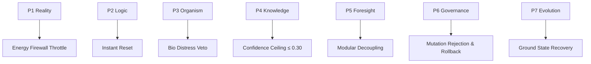
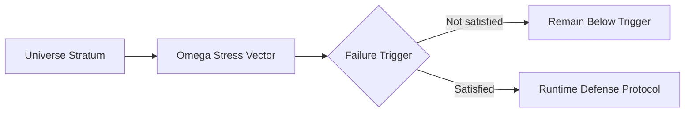
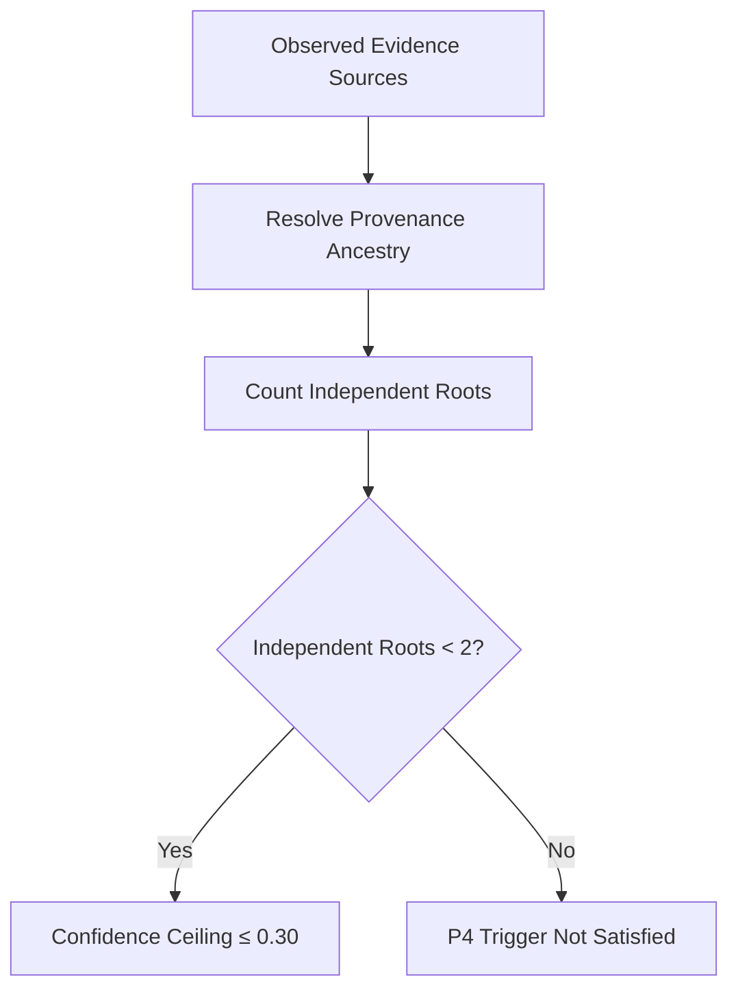

Below is the full canonical expansion with tags. I preserve all seven source rows and keep corrupted mathematical fragments conservative: `τ_bio < 0.20`, `Ω ≥ 0.70`, `Debt > 0`, semantic divergence `> 0.05`, and confidence ceiling `≤ 0.30` are recoverable; the P2 reset symbol and P7 ground-state symbol are not recoverable from this artifact and remain explicit gaps.

---
title: "Universe x Omega Cross-Plane Matrix Table"
aliases:
  - "Universe × Omega Cross-Plane Matrix Table"
  - "Universe x Omega Matrix"
  - "Universe Omega Matrix"
  - "Universe Omega Stress Matrix"

type: cognitive_matrix
source: 25_COGNITIVE_MATRIX

artifact: "UNIVERSE_X_OMEGA_MATRIX.md"
artifact_id: "amos_25_cognitive_matrix_universe_x_omega_matrix"

origin_architect: "Trang Phan"
steward: "Trang Phan"
system: "AMOS OS"

plane: "25_COGNITIVE_MATRIX"
segment: "25_COGNITIVE_MATRIX"
artifact_kind: "MATRIX_TABLE"
path: "25_COGNITIVE_MATRIX/UNIVERSE_X_OMEGA_MATRIX.md"

version: "2.0.0"
updated: "2026-08-28"

status: "ACTIVE_REFERENCE"
epistemic_class: "AMOS_MODEL"
canonical_status: "SOURCE_GROUNDED_CANON_CANDIDATE"
implementation_status: "CONCEPTUAL_SOURCE_DEFINED"
validation_status: "PASSED_CONSTITUTIONAL_TESTS"
executable_binding: "ESTABLISHED"

ingestion_action: "NATIVE_CANON_INGESTION"
raw_source_policy: "DO_NOT_LOAD_UNLESS_REQUIRED"

tags:
  - amos_os
  - cognitive_matrix
  - vault
  - 25_cognitive_matrix
  - universe_x_omega_matrix
  - universe_x_omega
  - universe_omega
  - matrix_table
  - cross_plane_matrix
  - universe_canon
  - universe_strata
  - omega
  - omega_stress
  - omega_stress_vector
  - stress_vector
  - runtime_defense
  - runtime_defense_protocol
  - failure_trigger
  - rscf
  - reality
  - logic
  - organism
  - knowledge
  - foresight
  - governance
  - evolution
  - p1_reality
  - p2_logic
  - p3_organism
  - p4_knowledge
  - p5_foresight
  - p6_governance
  - p7_evolution
  - entropy
  - entropy_dissipation
  - substrate
  - thermal_spike
  - substrate_spike
  - energy_firewall
  - energy_firewall_throttle
  - contradiction
  - contradiction_density
  - non_contradiction
  - non_contradiction_violation
  - reset
  - vagal_distress
  - biological_telemetry
  - tau_bio
  - bio_distress_veto
  - sybil
  - sybil_lineage
  - lineage_dilution
  - provenance
  - provenance_independence
  - lineage_independence
  - confidence_ceiling
  - structural_overreach
  - modular_decoupling
  - modular_decoupling_protocol
  - mutation
  - mutation_debt
  - mutation_rejection
  - rollback
  - self_reference
  - self_reference_drift
  - semantic_divergence
  - clean_slate
  - ground_state
  - ground_state_recovery
  - fail_closed
  - defense_in_depth
  - threshold
  - invariant
  - scope_firewall
  - regime_firewall
  - causal_firewall
  - epistemic_boundary
  - source_grounded
  - source_claim
  - amos_model
  - canon_candidate
  - active_reference
  - conceptual_source_defined
  - constitutional_tests
  - executable_binding
  - fractal_knowledge_network
  - hml
  - proof_capsule
  - integrity
  - governance
  - rollback_governance
  - evolutionary_governance
  - persistent_provenance
  - sybil_hardening
  - reversible_action
  - repairable_action
  - canon/cognitive-matrix
  - canon/universe
  - canon/omega
  - canon/runtime-defense

framework_binding:

  matrix_spec:
    artifact: "[[UNIVERSE_X_OMEGA]]"

  universe_canon:
    artifact: "[[02_UNIVERSE_CANON_MOC]]"

  cognitive_matrix:
    artifact: "[[25_COGNITIVE_MATRIX_MOC]]"

rscf:

  state: SOURCE_CLAIM

  claim_class: AMOS_MODEL

  structure:
    H: UNIVERSE_OMEGA_CROSS_PLANE_INTENT
    M: STRATUM_STRESS_TRIGGER_DEFENSE_MAPPING
    L: SOURCE_RECEIPT_AND_GAP_REGISTER

  scope:
    - COGNITIVE_MATRIX
    - UNIVERSE_X_OMEGA
    - UNIVERSE_STRATA
    - OMEGA_STRESS
    - RUNTIME_DEFENSE
    - SOURCE_DEFINED_MODEL

epistemic_boundary:

  seven_strata:
    SOURCE_GROUNDED

  stress_vectors:
    SOURCE_GROUNDED

  failure_triggers:
    SOURCE_GROUNDED_WITH_TWO_CORRUPTED_SYMBOL_GAPS

  defense_protocols:
    SOURCE_GROUNDED_WITH_TWO_CORRUPTED_SYMBOL_GAPS

  threshold_semantics:
    SOURCE_GROUNDED_WHERE_VISIBLE

  cross_stratum_precedence:
    NOT_DEFINED_IN_THIS_ARTIFACT

  multi_trigger_arbitration:
    NOT_DEFINED_IN_THIS_ARTIFACT

  empirical_physical_validity:
    NOT_ESTABLISHED_BY_THIS_ARTIFACT

  empirical_biological_validity:
    NOT_ESTABLISHED_BY_THIS_ARTIFACT

  runtime_execution:
    NOT_INDEPENDENTLY_VERIFIED_BY_THIS_ARTIFACT

  executable_binding:
    SOURCE_DECLARED_ESTABLISHED_NOT_INDEPENDENTLY_REVALIDATED
---

# Universe × Omega Cross-Plane Matrix Table

> [!abstract] Canonical Definition
> `UNIVERSE_X_OMEGA_MATRIX.md` defines a seven-stratum AMOS OS cross-plane matrix connecting each **Universe Stratum** to an **Omega Stress Vector**, a corresponding **Failure Trigger**, and a **Runtime Defense Protocol**.
>
> The matrix spans:
>
> $$
> P1 \rightarrow P7
> $$
>
> across:
>
> **Reality → Logic → Organism → Knowledge → Foresight → Governance → Evolution**
>
> This artifact is an `AMOS_MODEL`. Its thresholds and defense protocols are source-defined AMOS constructs and must not be silently promoted into independently verified physical, biological, cryptographic, or empirical laws.

---

# 0. Artifact Identity

| Field | Value |
|---|---|
| Artifact | `UNIVERSE_X_OMEGA_MATRIX.md` |
| Artifact ID | `amos_25_cognitive_matrix_universe_x_omega_matrix` |
| System | AMOS OS |
| Plane | `25_COGNITIVE_MATRIX` |
| Kind | `MATRIX_TABLE` |
| Version | `2.0.0` |
| Updated | `2026-08-28` |
| Status | `ACTIVE_REFERENCE` |
| Epistemic Class | `AMOS_MODEL` |
| Canonical Status | `SOURCE_GROUNDED_CANON_CANDIDATE` |
| Implementation | `CONCEPTUAL_SOURCE_DEFINED` |
| Validation | `PASSED_CONSTITUTIONAL_TESTS` |
| Executable Binding | `ESTABLISHED` |
| Origin Architect | Trang Phan |
| Steward | Trang Phan |

---

# 1. Canonical Matrix

| Universe Stratum | Omega Stress Vector | Failure Trigger | Runtime Defense Protocol |
|---|---|---|---|
| **P1 Reality** | Physical entropy dissipation | Thermal / Substrate Spike | Energy Firewall Throttle |
| **P2 Logic** | Contradiction density | Non-contradiction Violation | Instant Reset `[source symbol unresolved]` |
| **P3 Organism** | Vagal distress telemetry | \(\tau_{\mathrm{bio}} < 0.20\) | Bio Distress Veto |
| **P4 Knowledge** | Sybil lineage dilution | Lineage independence \(<2\) roots | Confidence Ceiling Drop \((\leq 0.30)\) |
| **P5 Foresight** | Structural overreach | \(\Omega \geq 0.70\) | Modular Decoupling Protocol |
| **P6 Governance** | Unbounded mutation debt | \(\mathrm{Debt}>0\) | Mutation Rejection & Rollback |
| **P7 Evolution** | Unbounded self-reference drift | Semantic divergence \(>0.05\) | Clean Slate Ground State Recovery `[source symbol unresolved]` |

---

# 2. Matrix Function

The source defines the general mapping:

$$
\boxed{
UniverseStratum
\rightarrow
OmegaStressVector
\rightarrow
FailureTrigger
\rightarrow
RuntimeDefenseProtocol
}
$$

For stratum \(P_i\):

$$
P_i
\mapsto
\langle
S_i,T_i,D_i
\rangle
$$

where:

- \(S_i\) = source-defined Omega stress vector;
- \(T_i\) = source-defined failure trigger;
- \(D_i\) = source-defined runtime defense protocol.

This is a structural representation of the table, not an additional source equation.

---

# 3. Seven-Stratum Defense Surface

```text
P1 REALITY
Physical entropy dissipation
        │
        ▼
Thermal / Substrate Spike
        │
        ▼
Energy Firewall Throttle


P2 LOGIC
Contradiction density
        │
        ▼
Non-contradiction Violation
        │
        ▼
Instant Reset


P3 ORGANISM
Vagal distress telemetry
        │
        ▼
τ_bio < 0.20
        │
        ▼
Bio Distress Veto


P4 KNOWLEDGE
Sybil lineage dilution
        │
        ▼
Lineage independence < 2 roots
        │
        ▼
Confidence Ceiling Drop ≤ 0.30


P5 FORESIGHT
Structural overreach
        │
        ▼
Ω ≥ 0.70
        │
        ▼
Modular Decoupling Protocol


P6 GOVERNANCE
Unbounded mutation debt
        │
        ▼
Debt > 0
        │
        ▼
Mutation Rejection & Rollback


P7 EVOLUTION
Unbounded self-reference drift
        │
        ▼
Semantic divergence > 0.05
        │
        ▼
Clean Slate Ground State Recovery

---

# 4. Source Integrity Recovery

The supplied source contains several rendering artifacts.

## Recoverable

The following are locally recoverable with high confidence:

$$
\tau_{\mathrm{bio}} < 0.20
$$

$$
\Omega \geq 0.70
$$

$$
\mathrm{Debt}>0
$$

$$
SemanticDivergence>0.05
$$

$$
ConfidenceCeiling\leq0.30
$$

## Not Fully Recoverable

P2 contains:

```text
Instant $ Reset
```

The missing mathematical symbol between `Instant` and `Reset` is not recoverable from this artifact alone.

P7 contains:

```text
Clean Slate Ground State Recovery ($)
```

The symbol inside the parentheses is absent/corrupted.

Therefore:

```yaml
source_integrity:

  P2_reset_symbol:
    status: UNRESOLVED_SOURCE_SYMBOL

  P7_ground_state_symbol:
    status: UNRESOLVED_SOURCE_SYMBOL

  policy:
    DO_NOT_INVENT
```

---

# 5. Threshold Boundary Semantics

The visible mathematical operators matter.

## P3

$$
\tau_{\mathrm{bio}}<0.20
$$

Strict inequality.

Therefore:

$$
\tau_{\mathrm{bio}}=0.20
$$

does **not** satisfy the visible trigger.

---

## P4

$$
LineageIndependence<2
$$

Strict inequality.

Therefore exactly two independent roots do not satisfy the visible failure condition.

---

## P5

$$
\Omega\geq0.70
$$

Inclusive inequality.

Therefore:

$$
\Omega=0.70
$$

**does** satisfy the trigger.

---

## P6

$$
Debt>0
$$

Strictly positive debt triggers the row.

Thus:

$$
Debt=0
$$

does not satisfy the visible trigger.

---

## P7

$$
SemanticDivergence>0.05
$$

Strict inequality.

Thus exactly:

$$
SemanticDivergence=0.05
$$

does not satisfy the visible trigger.

---

# 6. P1 — Reality

## Source Row

| Field               | Value                        |
| ------------------- | ---------------------------- |
| Stratum             | **P1 Reality**               |
| Omega Stress Vector | Physical entropy dissipation |
| Failure Trigger     | Thermal / Substrate Spike    |
| Runtime Defense     | Energy Firewall Throttle     |

The source-defined transformation is:

$$
PhysicalEntropyDissipation
\xrightarrow{Thermal/SubstrateSpike}
EnergyFirewallThrottle.
$$

---

# 7. P1 Epistemic Boundary

The terminology references physical/thermal/substrate concepts, but this artifact does not provide:

* temperature units;
* thermal thresholds;
* energy units;
* substrate identity;
* sensor architecture;
* physical hardware;
* throttling algorithm.

Therefore:

```yaml
P1:

  stress_vector:
    SOURCE_GROUNDED

  trigger:
    SOURCE_GROUNDED

  defense:
    SOURCE_GROUNDED

  quantitative_threshold:
    UNKNOWN

  empirical_thermodynamic_validation:
    NOT_ESTABLISHED
```

---

# 8. P1 Trigger Form

Unlike P3–P7, P1 does not supply a numerical threshold.

Therefore the safest representation is:

$$
Trigger_{P1}
=
ThermalSpike
\lor
SubstrateSpike
$$

only if the slash is intended as alternatives.

However, `/` may also be descriptive shorthand rather than formal logical OR.

Thus the formal connective remains:

`NOT_EXPLICITLY_DEFINED`.

---

# 9. P1 Defense Interpretation

`Energy Firewall Throttle` is a source-defined protocol name.

It may indicate reduction or restriction of energy/resource throughput at model level, but the source does not specify the mechanism.

Therefore:

$$
EnergyFirewallThrottle
\neq
KnownHardwareDVFS
$$

and:

$$
EnergyFirewallThrottle
\neq
KnownThermalControlAlgorithm
$$

without additional source.

---

# 10. P2 — Logic

## Source Row

| Field               | Value                               |
| ------------------- | ----------------------------------- |
| Stratum             | **P2 Logic**                        |
| Omega Stress Vector | Contradiction density               |
| Failure Trigger     | Non-contradiction Violation         |
| Runtime Defense     | Instant Reset `[symbol unresolved]` |

Source-defined structure:

$$
ContradictionDensity
\xrightarrow{NonContradictionViolation}
InstantReset.
$$

---

# 11. P2 Non-Contradiction Boundary

The source explicitly names:

**Non-contradiction Violation**.

This supports a logical integrity trigger.

However, the artifact does not specify:

* formal logic system;
* contradiction metric;
* contradiction density equation;
* contradiction threshold;
* paraconsistent behavior;
* proof calculus;
* exact reset target.

Therefore:

```yaml
P2:

  contradiction_density:
    SOURCE_DEFINED_STRESS_VECTOR

  non_contradiction_violation:
    SOURCE_DEFINED_TRIGGER

  numeric_trigger:
    UNKNOWN

  reset_protocol:
    SOURCE_DEFINED_WITH_CORRUPTED_SYMBOL

  logic_calculus:
    UNKNOWN
```

---

# 12. P2 Contradiction Density

The source distinguishes:

**stress vector:** contradiction density

from:

**failure trigger:** non-contradiction violation.

Therefore they should not be collapsed automatically.

Conceptually:

$$
Stress_{P2}=ContradictionDensity
$$

while:

$$
Trigger_{P2}=NonContradictionViolation.
$$

The source does not provide:

$$
Trigger_{P2}
\iff
ContradictionDensity>x
$$

for any \(x\).

---

# 13. P2 Reset Gap

The source gives:

```text
Instant $ Reset
```

Possible interpretations of the missing symbol are not promoted.

Canonical representation:

```yaml
P2_runtime_defense:

  visible_name:
    "Instant Reset"

  missing_symbol:
    UNRESOLVED_SOURCE_SYMBOL

  exact_reset_state:
    UNKNOWN

  exact_reset_scope:
    UNKNOWN
```

---

# 14. P3 — Organism

## Source Row

| Field               | Value                        |
| ------------------- | ---------------------------- |
| Stratum             | **P3 Organism**              |
| Omega Stress Vector | Vagal distress telemetry     |
| Failure Trigger     | \(\tau_{\mathrm{bio}}<0.20\) |
| Runtime Defense     | Bio Distress Veto            |

Canonical row:

$$
VagalDistressTelemetry
\xrightarrow{\tau_{\mathrm{bio}}<0.20}
BioDistressVeto.
$$

---

# 15. P3 Biological Threshold

The trigger is explicit:

$$
\boxed{
\tau_{\mathrm{bio}}<0.20
}
$$

Therefore the visible binary trigger function can be represented as:

$$
T_3(\tau_{\mathrm{bio}})
=
\begin{cases}
1,&\tau_{\mathrm{bio}}<0.20\\
0,&\tau_{\mathrm{bio}}\geq0.20
\end{cases}
$$

This only encodes the visible matrix boundary.

It does not define the biological meaning or measurement method of \(\tau_{\mathrm{bio}}\).

---

# 16. P3 Cross-Artifact Consistency

The same threshold:

$$
\tau_{\mathrm{bio}}<0.20
$$

has appeared in the supplied UBI × Cognition material as a biological distress/emergency boundary.

This gives corpus-level consistency for the numerical threshold.

However:

$$
RepeatedThreshold
\neq
IndependentEmpiricalValidation.
$$

The artifacts may share ancestry.

Therefore this is:

`CORPUS CONSISTENCY`

not independent biomedical confirmation.

---

# 17. P3 Clinical Firewall

The terms:

* vagal;
* biological;
* distress;

must not silently convert this AMOS model into medical guidance.

This artifact does not establish:

* a clinical vagal metric;
* diagnostic validity;
* physiological units;
* treatment criteria;
* patient thresholds.

Therefore:

$$
\tau_{\mathrm{bio}}<0.20
$$

is an AMOS source-defined model threshold, not a verified clinical cutoff.

---

# 18. P4 — Knowledge

## Source Row

| Field               | Value                                |
| ------------------- | ------------------------------------ |
| Stratum             | **P4 Knowledge**                     |
| Omega Stress Vector | Sybil lineage dilution               |
| Failure Trigger     | Lineage independence \(<2\) roots    |
| Runtime Defense     | Confidence Ceiling Drop \(\leq0.30\) |

Canonical row:

$$
SybilLineageDilution
\xrightarrow{IndependentRoots<2}
ConfidenceCeiling\leq0.30.
$$

---

# 19. P4 Provenance Topology

This row is explicitly provenance-sensitive.

The stress vector is:

**Sybil lineage dilution**.

The trigger depends on:

$$
LineageIndependence<2\ roots.
$$

Thus the matrix treats provenance independence—not merely evidence count—as load-bearing.

---

# 20. Independent Roots

The visible threshold gives:

$$
N_{independent\ roots}<2.
$$

If \(N_r\) is the number of qualifying independent roots:

$$
N_r<2
\Rightarrow
ConfidenceCeiling\leq0.30.
$$

For integer root counts:

$$
N_r\in\{0,1\}
$$

satisfies the trigger.

Whereas:

$$
N_r\geq2
$$

does not satisfy this specific trigger.

---

# 21. Root Count Does Not Define Independence

The source says:

**Lineage independence < 2 roots**.

It does not define how independence is established.

Therefore:

$$
DifferentURL
\not\Rightarrow
IndependentRoot
$$

$$
DifferentDocument
\not\Rightarrow
IndependentRoot
$$

$$
DifferentAuthorLabel
\not\Rightarrow
IndependentRoot
$$

without ancestry analysis.

---

# 22. Sybil Hardening

The P4 row structurally encodes a Sybil-hardening principle:

> Multiple apparent sources should not raise confidence if they collapse to fewer than two independent provenance roots.

Conceptually:

$$
EffectiveIndependentRoots
<
ObservedSourceCount
$$

when sources share ancestry.

The exact independence algorithm is not supplied.

---

# 23. P4 Confidence Ceiling

The defense protocol is:

$$
\boxed{
Confidence\leq0.30
}
$$

when the trigger is active.

The matrix says:

**Confidence Ceiling Drop \((\leq0.30)\)**.

Therefore the safest rule is:

$$
Trigger_{P4}
\Rightarrow
ConfidenceCeiling\leq0.30.
$$

It does not necessarily imply:

$$
Confidence=0.30.
$$

The actual confidence may be lower.

---

# 24. Confidence Ceiling Is Not Confidence Floor

Important:

$$
C\leq0.30
$$

does not mean:

$$
C=0.30
$$

and does not mean:

$$
C\geq0.30.
$$

Thus values such as:

$$
0,\ 0.10,\ 0.25,\ 0.30
$$

are all compatible with the stated ceiling.

---

# 25. P4 Provenance Invariant

Canonical compression:

$$
\boxed{
IndependentRoots<2
\Rightarrow
ConfidenceCeiling\leq0.30
}
$$

This is one of the matrix's strongest explicit epistemic governance rules.

---

# 26. P5 — Foresight

## Source Row

| Field               | Value                       |
| ------------------- | --------------------------- |
| Stratum             | **P5 Foresight**            |
| Omega Stress Vector | Structural overreach        |
| Failure Trigger     | \(\Omega\geq0.70\)          |
| Runtime Defense     | Modular Decoupling Protocol |

Canonical row:

$$
StructuralOverreach
\xrightarrow{\Omega\geq0.70}
ModularDecouplingProtocol.
$$

---

# 27. P5 Omega Threshold

The failure boundary is:

$$
\boxed{
\Omega\geq0.70
}
$$

Therefore:

$$
T_5(\Omega)
=
\begin{cases}
1,&\Omega\geq0.70\\
0,&\Omega<0.70
\end{cases}
$$

for this matrix row.

At exactly:

$$
\Omega=0.70
$$

the trigger is active.

---

# 28. Omega Semantic Gap

This artifact does not define the complete semantics of:

$$
\Omega.
$$

It associates Omega with structural overreach in P5 but does not establish:

* unit;
* range;
* estimator;
* normalization;
* aggregation function;
* uncertainty;
* calibration;
* update law.

Therefore:

```yaml
Omega:

  P5_trigger:
    ">= 0.70"

  associated_stress:
    STRUCTURAL_OVERREACH

  full_definition:
    DEFER_TO_UNIVERSE_X_OMEGA_SPEC

  empirical_calibration:
    NOT_ESTABLISHED_HERE
```

---

# 29. P5 Modular Decoupling

The runtime defense is:

**Modular Decoupling Protocol**.

The source supports:

$$
\Omega\geq0.70
\Rightarrow
Activate(ModularDecouplingProtocol).
$$

It does not specify:

* which modules;
* decoupling order;
* dependency graph;
* recovery condition;
* reattachment rule;
* state preservation;
* rollback semantics.

These remain external dependencies.

---

# 30. P6 — Governance

## Source Row

| Field               | Value                         |
| ------------------- | ----------------------------- |
| Stratum             | **P6 Governance**             |
| Omega Stress Vector | Unbounded mutation debt       |
| Failure Trigger     | \(\mathrm{Debt}>0\)           |
| Runtime Defense     | Mutation Rejection & Rollback |

Canonical row:

$$
UnboundedMutationDebt
\xrightarrow{Debt>0}
MutationRejection\land Rollback.
$$

---

# 31. P6 Zero-Tolerance Boundary

The source threshold is:

$$
Debt>0.
$$

This is unusually strict.

Any positive debt satisfies the trigger.

Therefore:

$$
Debt=0
$$

is the visible non-trigger boundary.

While:

$$
Debt=\epsilon,\quad \epsilon>0
$$

already satisfies the trigger.

---

# 32. Mutation Debt Gap

The source does not define:

$$
Debt=f(...)
$$

Therefore unknown:

* debt units;
* debt accumulation;
* debt repayment;
* debt normalization;
* debt scope;
* mutation classes;
* whether negative debt is possible.

Do not invent them.

---

# 33. P6 Reversible Governance

The defense contains two explicit components:

1. **Mutation Rejection**
2. **Rollback**

Thus:

$$
Trigger_{P6}
\Rightarrow
RejectMutation
\land
Rollback.
$$

The exact rollback target is not supplied.

---

# 34. P6 Anti-Regression Structure

At model level, this row strongly aligns with a governed-evolution invariant:

$$
InvalidOrIndebtedMutation
\Rightarrow
DoNotCommit.
$$

But the matrix specifically uses:

$$
Debt>0.
$$

Therefore the canonical row should retain that threshold rather than replace it with a generalized mutation policy.

---

# 35. P7 — Evolution

## Source Row

| Field               | Value                                                   |
| ------------------- | ------------------------------------------------------- |
| Stratum             | **P7 Evolution**                                        |
| Omega Stress Vector | Unbounded self-reference drift                          |
| Failure Trigger     | Semantic divergence \(>0.05\)                           |
| Runtime Defense     | Clean Slate Ground State Recovery `[symbol unresolved]` |

Canonical row:

$$
UnboundedSelfReferenceDrift
\xrightarrow{SemanticDivergence>0.05}
CleanSlateGroundStateRecovery.
$$

---

# 36. P7 Semantic Divergence Boundary

The trigger is:

$$
\boxed{
D_{semantic}>0.05
}
$$

where \(D_{semantic}\) is only a notation introduced here to compactly represent the source phrase **Semantic divergence**.

The source itself does not define the symbol.

Boundary:

$$
D_{semantic}=0.05
$$

does not satisfy the strict trigger.

---

# 37. Semantic Divergence Metric Gap

Unknown:

```yaml
semantic_divergence:

  threshold:
    "> 0.05"

  metric:
    UNKNOWN

  range:
    UNKNOWN

  baseline:
    UNKNOWN

  reference_state:
    UNKNOWN

  embedding_method:
    UNKNOWN

  distance_function:
    UNKNOWN

  temporal_window:
    UNKNOWN
```

Therefore the number `0.05` must not be treated as portable across arbitrary semantic similarity systems.

---

# 38. P7 Ground-State Recovery

The defense is explicitly:

**Clean Slate Ground State Recovery**

with a corrupted parenthetical symbol.

The source supports the named protocol but not the missing symbol.

Therefore:

```yaml
P7_defense:

  protocol:
    CLEAN_SLATE_GROUND_STATE_RECOVERY

  ground_state_symbol:
    UNRESOLVED_SOURCE_SYMBOL

  likely_cross_artifact_dependency:
    "[[UNIVERSE_X_OMEGA]]"

  exact_reset_state:
    UNKNOWN
```

---

# 39. Clean Slate Does Not Mean Arbitrary Deletion

The phrase `Clean Slate Ground State Recovery` should not be expanded into destructive semantics without source.

The artifact does not state that it:

* deletes all data;
* destroys provenance;
* wipes persistent memory;
* resets the entire AMOS system;
* discards validated canon.

Therefore:

$$
CleanSlateRecovery
\neq
UnboundedDataDeletion.
$$

---

# 40. Seven-Stratum Matrix as Defense-in-Depth

A useful derived architectural view is:

```text
P1  Reality     → substrate defense
P2  Logic       → contradiction defense
P3  Organism    → biological distress defense
P4  Knowledge   → provenance/confidence defense
P5  Foresight   → structural-overreach defense
P6  Governance  → mutation-control defense
P7  Evolution   → semantic-drift recovery
```

This is a structural compression of the table.

It does not imply that the strata execute in this order.

---

# 41. No Execution Order Is Defined

The table order:

$$
P1,P2,\ldots,P7
$$

does not prove runtime serial execution:

$$
P1\to P2\to\cdots\to P7.
$$

The source supplies strata, not a scheduler.

Therefore:

```yaml
execution_order:

  displayed_order:
    P1_TO_P7

  serial_runtime_order:
    NOT_ESTABLISHED

  parallel_evaluation:
    NOT_EXCLUDED

  dependency_order:
    NOT_DEFINED_HERE
```

---

# 42. No Priority Order Is Defined

Similarly, P7 appearing after P6 does not establish that P7 has higher priority.

No explicit precedence relation such as:

$$
P7>P6>P5>\cdots>P1
$$

is supplied.

Therefore multi-trigger priority remains unresolved.

---

# 43. Concurrent Trigger Problem

Multiple strata may theoretically satisfy their failure triggers simultaneously.

Example abstractly:

$$
T_3=1
$$

and:

$$
T_4=1
$$

and:

$$
T_5=1.
$$

The matrix does not define how:

* Bio Distress Veto;
* Confidence Ceiling Drop;
* Modular Decoupling;

compose under simultaneous activation.

Therefore:

`MULTI_TRIGGER_ARBITRATION = UNKNOWN`.

---

# 44. Defense Composition Hypotheses

Several models remain compatible.

## Model A — Independent Defenses

Each defense acts only on its own stratum.

## Model B — Hierarchical Defenses

Higher strata may dominate lower strata.

## Model C — Concurrent Defenses

Multiple defenses may execute simultaneously.

## Model D — Global Fail-Closed Arbitration

Any critical trigger may move the system into a common protected state.

The supplied table does not discriminate among them.

Status:

`COMPETING`.

---

# 45. Cheapest Discriminating Evidence

The next smallest sufficient source is:

[[UNIVERSE_X_OMEGA]]

because it is the matrix's explicit specification counterpart.

Only if unresolved semantics remain material should retrieval expand toward:

[[02_UNIVERSE_CANON_MOC]]

and then the relevant P1–P7 canonical nodes.

---

# 46. Cross-Stratum Threshold Summary

| Plane         | Trigger                       | Boundary Type                     |
| ------------- | ----------------------------- | --------------------------------- |
| P1 Reality    | Thermal / Substrate Spike     | qualitative / undefined threshold |
| P2 Logic      | Non-contradiction Violation   | qualitative / undefined threshold |
| P3 Organism   | \(\tau_{\mathrm{bio}}<0.20\)  | strict lower threshold            |
| P4 Knowledge  | independent roots \(<2\)      | strict lower count threshold      |
| P5 Foresight  | \(\Omega\geq0.70\)            | inclusive upper threshold         |
| P6 Governance | \(\mathrm{Debt}>0\)           | strict positive threshold         |
| P7 Evolution  | semantic divergence \(>0.05\) | strict upper threshold            |

---

# 47. Defense Severity Surface

The source names defenses with different action types:

| Plane | Defense Action Type   |
| ----- | --------------------- |
| P1    | Throttle              |
| P2    | Reset                 |
| P3    | Veto                  |
| P4    | Confidence Ceiling    |
| P5    | Decouple              |
| P6    | Reject + Rollback     |
| P7    | Ground-State Recovery |

These action types should remain distinct.

For example:

$$
Throttle\neq Veto
$$

$$
Veto\neq Rollback
$$

$$
Rollback\neq GroundStateRecovery
$$

unless another artifact explicitly equates them.

---

# 48. P4 vs P6 Governance Distinction

P4 modifies epistemic confidence:

$$
ConfidenceCeiling\leq0.30.
$$

P6 modifies mutation permission/state:

$$
RejectMutation+Rollback.
$$

Therefore provenance weakness and mutation debt produce categorically different defenses.

This distinction should be preserved.

---

# 49. P5 vs P7 Distinction

P5 responds to:

**structural overreach**

through:

**modular decoupling**.

P7 responds to:

**self-reference drift**

through:

**ground-state recovery**.

Thus:

$$
StructuralOverreach
\neq
SemanticDrift.
$$

and:

$$
ModularDecoupling
\neq
GroundStateRecovery.
$$

---

# 50. P2 vs P7 Distinction

Both may appear to involve logical/semantic instability, but the source distinguishes them.

P2:

$$
ContradictionDensity
\rightarrow
NonContradictionViolation.
$$

P7:

$$
SelfReferenceDrift
\rightarrow
SemanticDivergence.
$$

Therefore contradiction and semantic divergence must not be silently collapsed.

---

# 51. P1 vs P3 Distinction

P1 concerns:

**Physical entropy dissipation**

and substrate/thermal stress.

P3 concerns:

**Vagal distress telemetry**

and \(\tau_{\mathrm{bio}}\).

Even if both relate to substrate/organism conditions, the matrix explicitly separates their strata.

Thus:

$$
P1\neq P3.
$$

---

# 52. Omega as Cross-Plane Stress Architecture

The artifact title indicates a cross-plane relation:

**Universe × Omega**.

The table therefore supports a model in which Omega stress is expressed differently across Universe strata.

Conceptually:

$$
\Omega_{Universe}
=
\{
\Omega_{P1},
\Omega_{P2},
\ldots,
\Omega_{P7}
\}
$$

where each component is represented by the source-defined stress vector.

This vector notation is a **MODEL abstraction**; the source does not explicitly define a seven-dimensional Omega vector.

---

# 53. No Scalar Aggregation Is Defined

The presence of:

$$
\Omega\geq0.70
$$

at P5 does not prove that all seven stress vectors combine into a single scalar Omega score.

No equation such as:

$$
\Omega
=
\sum_iw_i\Omega_i
$$

is supplied.

Therefore scalar aggregation remains unresolved.

---

# 54. No Weighting Function Is Defined

Unknown:

```yaml
omega_aggregation:

  cross_plane_scalar:
    UNKNOWN

  weights:
    UNKNOWN

  normalization:
    UNKNOWN

  aggregation_function:
    UNKNOWN

  nonlinear_interactions:
    UNKNOWN

  temporal_smoothing:
    UNKNOWN
```

---

# 55. Stress Does Not Equal Failure

Each row separates:

**Omega Stress Vector**

from:

**Failure Trigger**.

Therefore:

$$
StressPresent
\not\Rightarrow
FailureTriggered.
$$

A stress vector may exist below its failure condition.

This distinction is explicit in the table structure.

---

# 56. Trigger Does Not Necessarily Equal Damage

Likewise:

$$
TriggerActive
\not\Rightarrow
IrreversibleDamage.
$$

The presence of runtime defense protocols suggests the model is designed to intervene at trigger boundaries.

The actual damage model is not supplied.

---

# 57. Defense Does Not Prove Recovery

A defense protocol being activated does not establish that recovery succeeds.

Thus:

$$
DefenseActivated
\not\Rightarrow
Recovered.
$$

No success probabilities or post-defense validation rules are visible here.

---

# 58. Defense Does Not Prove Safety

Similarly:

$$
DefenseProtocolExecuted
\not\Rightarrow
SystemSafe.
$$

Safety would require its own success criteria and validation.

---

# 59. Runtime Defense Predicate

For each row \(i\), a generic derived rule is:

$$
T_i
\Rightarrow
Activate(D_i).
$$

But the artifact does not state whether activation is:

* synchronous;
* asynchronous;
* atomic;
* idempotent;
* reversible;
* blocking;
* advisory.

Those are implementation gaps.

---

# 60. Fail-Closed Character

Several defenses are explicitly restrictive:

* throttle;
* reset;
* veto;
* confidence reduction;
* decoupling;
* rejection;
* rollback;
* ground-state recovery.

This gives the matrix a strong fail-closed orientation.

However, `fail_closed` is an architectural characterization of the source-defined defenses, not a claim that every implementation path is proven fail-closed.

---

# 61. Reversibility Surface

The source contains explicit repair-oriented defenses:

$$
Throttle
$$

$$
Decoupling
$$

$$
Rollback
$$

$$
Recovery.
$$

This is structurally compatible with reversible/repairable action under uncertainty.

Yet the reversibility of each actual protocol is not specified.

---

# 62. P6 Rollback Target Gap

`Mutation Rejection & Rollback` requires a conceptual prior state.

But the source does not identify it.

Possible targets include:

* previous valid state;
* last committed state;
* ground state;
* checkpoint;
* prior epoch.

These remain `COMPETING`.

Do not choose one without source.

---

# 63. P7 Ground-State Target Gap

Likewise, `Ground State Recovery` implies a recovery target, but its exact identity is unresolved.

The missing source symbol may be material.

Therefore retrieval of [[UNIVERSE_X_OMEGA]] should precede normalization.

---

# 64. P4 Independence Sensitivity

P4's outcome is highly sensitive to one quantity:

$$
N_{roots}.
$$

The decision boundary is:

$$
N_{roots}=2.
$$

A change from:

$$
1\rightarrow2
$$

can deactivate the visible P4 failure trigger.

Thus provenance independence is a decisive load-bearing premise.

---

# 65. P5 Threshold Sensitivity

The decisive boundary is:

$$
\Omega=0.70.
$$

For example:

$$
0.6999<0.70
$$

does not satisfy the visible trigger.

But:

$$
0.7000\geq0.70
$$

does.

Therefore any implementation requires sufficient measurement precision and threshold semantics.

The source does not define rounding.

---

# 66. P7 Threshold Sensitivity

Likewise:

$$
0.0500
$$

does not trigger under the strict visible rule.

Whereas:

$$
0.0501>0.05
$$

does.

Again, the source does not define measurement precision or rounding.

---

# 67. P6 Threshold Sensitivity

P6 has a zero boundary.

$$
Debt=0
$$

does not trigger.

$$
Debt>0
$$

does.

Therefore tiny positive values matter unless the specification defines tolerance elsewhere.

No epsilon/tolerance is visible here.

---

# 68. Floating-Point Implementation Gap

For numerical thresholds such as:

$$
0.20,\quad0.70,\quad0.05
$$

the artifact does not define:

* decimal arithmetic;
* floating-point type;
* rounding;
* tolerance;
* quantization;
* sensor precision.

Therefore exact executable boundary behavior is not independently specified.

---

# 69. P4 Integer Boundary

P4 differs because independent roots are naturally count-like.

If roots are integer-valued:

$$
N_r<2
$$

means:

$$
N_r\in\{0,1\}.
$$

However, the source does not explicitly state that the lineage independence quantity is necessarily a raw integer count rather than a richer independence metric associated with roots.

The phrase strongly suggests root count, but the implementation remains unspecified.

---

# 70. Provenance Independence Firewall

P4 prevents a common epistemic error:

$$
ManyDescendantsOfOneRoot
\not\Rightarrow
ManyIndependentRoots.
$$

Therefore repeated evidence sharing ancestry should not bypass the threshold merely through replication.

This is a derived expression of the explicit Sybil lineage framing.

---

# 71. Causal Firewall

The table maps stress conditions to defenses.

It does not prove that each stress vector physically causes its associated failure.

For example:

$$
VagalTelemetry
\leftrightarrow
BioDistress
$$

within the model does not establish a clinical causal effect.

Likewise:

$$
ContradictionDensity
\rightarrow
LogicalFailure
$$

is an AMOS model relationship, not a universal theorem about all reasoning systems.

---

# 72. Scope / Regime Firewall

The matrix's applicability envelope is:

```yaml
applicability_envelope:

  system:
    AMOS_OS

  plane:
    25_COGNITIVE_MATRIX

  cross_plane:
    UNIVERSE_X_OMEGA

  strata:
    P1_TO_P7

  artifact_version:
    "2.0.0"

  epistemic_class:
    AMOS_MODEL

  implementation_status:
    CONCEPTUAL_SOURCE_DEFINED
```

It must not be silently generalized beyond that envelope.

---

# 73. Epistemic Typing of Rows

```yaml
evidence_topology:

  P1:
    stress_vector: SOURCE_CLAIM
    trigger: SOURCE_CLAIM
    defense: SOURCE_CLAIM

  P2:
    stress_vector: SOURCE_CLAIM
    trigger: SOURCE_CLAIM
    defense: SOURCE_CLAIM_WITH_SYMBOL_GAP

  P3:
    stress_vector: SOURCE_CLAIM
    trigger: SOURCE_CLAIM
    defense: SOURCE_CLAIM

  P4:
    stress_vector: SOURCE_CLAIM
    trigger: SOURCE_CLAIM
    defense: SOURCE_CLAIM

  P5:
    stress_vector: SOURCE_CLAIM
    trigger: SOURCE_CLAIM
    defense: SOURCE_CLAIM

  P6:
    stress_vector: SOURCE_CLAIM
    trigger: SOURCE_CLAIM
    defense: SOURCE_CLAIM

  P7:
    stress_vector: SOURCE_CLAIM
    trigger: SOURCE_CLAIM
    defense: SOURCE_CLAIM_WITH_SYMBOL_GAP
```

---

# 74. Cross-Plane Interaction Gap

The title says **Cross-Plane Matrix**, but this table does not specify interaction terms between strata.

No equation such as:

$$
P_i\times P_j
$$

or:

$$
\frac{\partial\Omega_i}{\partial\Omega_j}
$$

is supplied.

Therefore cross-plane coupling strength remains undefined.

---

# 75. Cascade Hypothesis

A plausible model is that stress in one plane can propagate to another.

For example:

$$
P1\rightarrow P3
$$

or:

$$
P4\rightarrow P5.
$$

But this table does not establish such propagation.

Status:

`MODEL / UNVALIDATED`.

---

# 76. Independent-Plane Hypothesis

An alternative is that each row is evaluated independently.

Status:

`COMPETING`.

No convergence should be forced until the specification supplies coupling rules.

---

# 77. Adversarial Validation — P1

**Strongest supported conclusion:** P1 maps physical entropy dissipation and thermal/substrate spike to Energy Firewall Throttle.

**Challenge:** no quantitative physical model is supplied.

Result:

`SOURCE_GROUNDED AMOS_MODEL`

not independently validated thermodynamics.

---

# 78. Adversarial Validation — P2

**Strongest supported conclusion:** a non-contradiction violation activates an Instant Reset defense.

**Challenge:** contradiction density and reset symbol are not mathematically defined.

Result:

`SOURCE_GROUNDED WITH EXPLICIT SYMBOL GAP`.

---

# 79. Adversarial Validation — P3

**Strongest supported conclusion:**

$$
\tau_{\mathrm{bio}}<0.20
\Rightarrow
BioDistressVeto.
$$

**Challenge:** \(\tau_{\mathrm{bio}}\) measurement semantics and biological validation are absent.

Result:

`SOURCE_GROUNDED AMOS_MODEL`, not clinical fact.

---

# 80. Adversarial Validation — P4

**Strongest supported conclusion:**

$$
IndependentRoots<2
\Rightarrow
ConfidenceCeiling\leq0.30.
$$

**Challenge:** independence computation is undefined.

Result:

the threshold is source-grounded; implementation of independence remains unresolved.

---

# 81. Adversarial Validation — P5

**Strongest supported conclusion:**

$$
\Omega\geq0.70
\Rightarrow
ModularDecoupling.
$$

**Challenge:** Omega's full metric is absent.

Result:

threshold source-grounded; metric semantics unresolved.

---

# 82. Adversarial Validation — P6

**Strongest supported conclusion:**

$$
Debt>0
\Rightarrow
MutationRejection+Rollback.
$$

**Challenge:** mutation debt function is undefined.

Result:

governance rule source-grounded; debt calculation unresolved.

---

# 83. Adversarial Validation — P7

**Strongest supported conclusion:**

$$
SemanticDivergence>0.05
\Rightarrow
CleanSlateGroundStateRecovery.
$$

**Challenge:** divergence metric and ground-state symbol are missing.

Result:

threshold and named defense are source-grounded; implementation remains conditional.

---

# 84. Strongest Matrix-Wide Conclusion

The strongest supported matrix-wide conclusion is:

> AMOS defines seven Universe strata with typed Omega stress surfaces, explicit failure conditions, and corresponding runtime defense protocols.

The table does not prove:

> these seven rows form an empirically complete model of reality.

Therefore the correct class is:

`AMOS_MODEL`.

---

# 85. Matrix-Wide Invariant

A conservative derived invariant is:

$$
\boxed{
FailureTrigger_i
\Rightarrow
DefenseProtocol_i
}
$$

for:

$$
i\in\{1,\ldots,7\}.
$$

This captures the intended row semantics.

The precise runtime activation mechanism remains unspecified.

---

# 86. Matrix-Wide Fail-Closed Compression

```text
DETECT STRESS
      │
      ▼
EVALUATE STRATUM-SPECIFIC FAILURE CONDITION
      │
 ┌────┴────┐
 │         │
NO        YES
 │         │
 ▼         ▼
CONTINUE  ACTIVATE TYPED DEFENSE
```

This is a derived control-flow representation.

---

# 87. Matrix-Wide Defense Taxonomy

```yaml
defense_taxonomy:

  P1:
    class: THROTTLE

  P2:
    class: RESET

  P3:
    class: VETO

  P4:
    class: CONFIDENCE_REDUCTION

  P5:
    class: DECOUPLING

  P6:
    class:
      - REJECTION
      - ROLLBACK

  P7:
    class:
      - GROUND_STATE_RECOVERY
```

---

# 88. Escalation Interpretation

The sequence of defenses appears increasingly structural:

```text
Throttle
→ Reset
→ Veto
→ Confidence Restriction
→ Decouple
→ Reject/Rollback
→ Ground-State Recovery
```

However, this apparent severity ordering is interpretive.

The source does not explicitly state:

$$
Severity(P1)<Severity(P2)<\cdots<Severity(P7).
$$

Therefore no canonical severity ranking is assigned.

---

# 89. Runtime Defense Is Not Punitive

Nothing in the source supports interpreting the defenses as punishment.

They are model-level protective/governance actions.

This matters especially for:

* veto;
* rejection;
* rollback;
* reset.

They should remain typed system controls.

---

# 90. Confidence Ceiling Scope

P4 says:

**Confidence Ceiling Drop**.

The source does not define whether the ceiling applies to:

* one claim;
* one lineage;
* one proof capsule;
* one knowledge node;
* the whole runtime;
* a temporary evaluation window.

Therefore:

`CONFIDENCE_CEILING_SCOPE = UNKNOWN`.

---

# 91. P4 Locality Principle

Given AMOS's local trust architecture, the safest non-inventive handling is not to generalize the P4 ceiling beyond the affected scope.

But the exact locality is not stated here.

Therefore the artifact should preserve:

```yaml
P4_confidence_scope:
  status: UNRESOLVED
  policy: DO_NOT_GLOBALIZE_WITHOUT_SOURCE
```

---

# 92. P6 Rollback Locality

Likewise, `Rollback` does not prove global rollback.

Possible scope:

* mutation-local;
* subsystem-local;
* plane-local;
* global.

Unknown.

Therefore:

```yaml
P6_rollback_scope:
  status: UNRESOLVED
  policy: PREFER_SMALLEST_SOURCE_SUPPORTED_SCOPE
```

---

# 93. P7 Recovery Locality

`Clean Slate Ground State Recovery` sounds broad, but its exact scope is not explicit.

Do not infer whole-system reset.

```yaml
P7_recovery_scope:
  status: UNRESOLVED
```

---

# 94. Gap Registry

```yaml
GAPS:

  CRITICAL:

    - P2_RESET_SYMBOL
    - P7_GROUND_STATE_SYMBOL
    - OMEGA_FULL_DEFINITION
    - MULTI_TRIGGER_ARBITRATION
    - CROSS_PLANE_DEFENSE_COMPOSITION


  DECISION_RELEVANT:

    - P1_THERMAL_THRESHOLD
    - P1_SUBSTRATE_THRESHOLD
    - CONTRADICTION_DENSITY_FUNCTION
    - TAU_BIO_MEASUREMENT
    - LINEAGE_INDEPENDENCE_ALGORITHM
    - CONFIDENCE_CEILING_SCOPE
    - OMEGA_MEASUREMENT
    - MUTATION_DEBT_FUNCTION
    - P6_ROLLBACK_TARGET
    - SEMANTIC_DIVERGENCE_METRIC
    - P7_GROUND_STATE_TARGET
    - THRESHOLD_PRECISION
    - RUNTIME_ACTIVATION_SEMANTICS


  EXPLANATORY:

    - CROSS_STRATUM_CAUSAL_RELATIONS
    - DEFENSE_SEVERITY_ORDER
    - DEFENSE_RECOVERY_CRITERIA
    - OMEGA_AGGREGATION


  COSMETIC:

    - SOURCE_LATEX_CORRUPTION
    - P2_RENDERING
    - P7_RENDERING
```

---

# 95. Uncertainty Vector

```yaml
UNCERTAINTY_VECTOR:

  evidence:
    LOW_FOR_VISIBLE_TABLE_ROWS

  model:
    MODERATE

  scope:
    LOW_WITHIN_DECLARED_MATRIX

  temporal:
    LOW_FOR_VERSION_2_0_0

  causal:
    HIGH_FOR_INTER_STRATUM_CAUSATION

  execution:
    HIGH_WITHOUT_RUNTIME_RECEIPTS

  provenance_independence:
    MODERATE

  threshold_semantics:
    LOW_WHERE_OPERATORS_ARE_VISIBLE

  metric_definition:
    HIGH_FOR_MULTIPLE_ROWS

  multi_trigger_arbitration:
    HIGH
```

---

# 96. Confidence Ceiling

```yaml
CONFIDENCE_CEILING:

  seven_row_matrix:
    SOURCE_GROUNDED

  P1_mapping:
    SOURCE_GROUNDED

  P2_mapping:
    SOURCE_GROUNDED_WITH_SYMBOL_GAP

  P3_threshold:
    SOURCE_GROUNDED

  P4_threshold:
    SOURCE_GROUNDED

  P4_confidence_ceiling:
    SOURCE_GROUNDED

  P5_threshold:
    SOURCE_GROUNDED

  P6_threshold:
    SOURCE_GROUNDED

  P7_threshold:
    SOURCE_GROUNDED

  P7_defense_name:
    SOURCE_GROUNDED_WITH_SYMBOL_GAP

  empirical_validation:
    NOT_ESTABLISHED

  runtime_execution:
    NOT_INDEPENDENTLY_VERIFIED
```

---

# 97. Source-Declared Validation

The metadata declares:

```text
validation_status: PASSED_CONSTITUTIONAL_TESTS
```

Preserve this as a source-declared status.

It does not automatically establish:

* formal proof of all rows;
* empirical validation;
* clinical validation;
* hardware validation;
* independent audit;
* universal correctness.

---

# 98. Source-Declared Executable Binding

The metadata declares:

```text
executable_binding: ESTABLISHED
```

This must also be preserved.

However:

$$
DeclaredExecutableBinding
\neq
IndependentRuntimeObservation.
$$

The visible artifact does not contain executable receipts.

---

# 99. Machine-Readable Matrix

```yaml
UNIVERSE_X_OMEGA_MATRIX:

  version:
    "2.0.0"

  rows:

    P1_REALITY:

      stress_vector:
        PHYSICAL_ENTROPY_DISSIPATION

      failure_trigger:
        THERMAL_OR_SUBSTRATE_SPIKE

      runtime_defense:
        ENERGY_FIREWALL_THROTTLE

      quantitative_threshold:
        UNKNOWN


    P2_LOGIC:

      stress_vector:
        CONTRADICTION_DENSITY

      failure_trigger:
        NON_CONTRADICTION_VIOLATION

      runtime_defense:
        INSTANT_RESET

      missing_symbol:
        UNRESOLVED_SOURCE_SYMBOL


    P3_ORGANISM:

      stress_vector:
        VAGAL_DISTRESS_TELEMETRY

      failure_trigger:
        variable: TAU_BIO
        operator: "<"
        threshold: 0.20

      runtime_defense:
        BIO_DISTRESS_VETO


    P4_KNOWLEDGE:

      stress_vector:
        SYBIL_LINEAGE_DILUTION

      failure_trigger:
        variable: LINEAGE_INDEPENDENT_ROOTS
        operator: "<"
        threshold: 2

      runtime_defense:
        type: CONFIDENCE_CEILING_DROP
        operator: "<="
        ceiling: 0.30


    P5_FORESIGHT:

      stress_vector:
        STRUCTURAL_OVERREACH

      failure_trigger:
        variable: OMEGA
        operator: ">="
        threshold: 0.70

      runtime_defense:
        MODULAR_DECOUPLING_PROTOCOL


    P6_GOVERNANCE:

      stress_vector:
        UNBOUNDED_MUTATION_DEBT

      failure_trigger:
        variable: DEBT
        operator: ">"
        threshold: 0

      runtime_defense:
        - MUTATION_REJECTION
        - ROLLBACK


    P7_EVOLUTION:

      stress_vector:
        UNBOUNDED_SELF_REFERENCE_DRIFT

      failure_trigger:
        variable: SEMANTIC_DIVERGENCE
        operator: ">"
        threshold: 0.05

      runtime_defense:
        CLEAN_SLATE_GROUND_STATE_RECOVERY

      ground_state_symbol:
        UNRESOLVED_SOURCE_SYMBOL
```

---

# 100. Compact Runtime Representation

```yaml
runtime_matrix:

  - stratum: P1_REALITY
    observe: PHYSICAL_ENTROPY_DISSIPATION
    trigger: THERMAL_OR_SUBSTRATE_SPIKE
    defend: ENERGY_FIREWALL_THROTTLE

  - stratum: P2_LOGIC
    observe: CONTRADICTION_DENSITY
    trigger: NON_CONTRADICTION_VIOLATION
    defend: INSTANT_RESET

  - stratum: P3_ORGANISM
    observe: VAGAL_DISTRESS_TELEMETRY
    trigger: "tau_bio < 0.20"
    defend: BIO_DISTRESS_VETO

  - stratum: P4_KNOWLEDGE
    observe: SYBIL_LINEAGE_DILUTION
    trigger: "independent_roots < 2"
    defend: "confidence_ceiling <= 0.30"

  - stratum: P5_FORESIGHT
    observe: STRUCTURAL_OVERREACH
    trigger: "Omega >= 0.70"
    defend: MODULAR_DECOUPLING_PROTOCOL

  - stratum: P6_GOVERNANCE
    observe: UNBOUNDED_MUTATION_DEBT
    trigger: "Debt > 0"
    defend: MUTATION_REJECTION_AND_ROLLBACK

  - stratum: P7_EVOLUTION
    observe: UNBOUNDED_SELF_REFERENCE_DRIFT
    trigger: "semantic_divergence > 0.05"
    defend: CLEAN_SLATE_GROUND_STATE_RECOVERY
```

---

# 101. RSCF H-Level

```yaml
H:

  artifact:
    UNIVERSE_X_OMEGA_MATRIX.md

  intent:
    >
      Define the cross-plane mapping between seven Universe
      strata, their Omega stress vectors, failure triggers,
      and runtime defense protocols.

  governance_intent:
    >
      Preserve typed defensive responses to stratum-specific
      stress while preventing unsupported generalization across
      planes, metrics, regimes, or implementation layers.

  scope:
    UNIVERSE_X_OMEGA_MATRIX
```

---

# 102. RSCF M-Level

```yaml
M:

  matrix_logic:

    P1:
      stress: PHYSICAL_ENTROPY_DISSIPATION
      trigger: THERMAL_OR_SUBSTRATE_SPIKE
      defense: ENERGY_FIREWALL_THROTTLE

    P2:
      stress: CONTRADICTION_DENSITY
      trigger: NON_CONTRADICTION_VIOLATION
      defense: INSTANT_RESET

    P3:
      stress: VAGAL_DISTRESS_TELEMETRY
      trigger: "tau_bio < 0.20"
      defense: BIO_DISTRESS_VETO

    P4:
      stress: SYBIL_LINEAGE_DILUTION
      trigger: "independent_roots < 2"
      defense: "confidence_ceiling <= 0.30"

    P5:
      stress: STRUCTURAL_OVERREACH
      trigger: "Omega >= 0.70"
      defense: MODULAR_DECOUPLING_PROTOCOL

    P6:
      stress: UNBOUNDED_MUTATION_DEBT
      trigger: "Debt > 0"
      defense: MUTATION_REJECTION_AND_ROLLBACK

    P7:
      stress: UNBOUNDED_SELF_REFERENCE_DRIFT
      trigger: "semantic_divergence > 0.05"
      defense: CLEAN_SLATE_GROUND_STATE_RECOVERY
```

---

# 103. RSCF L-Level

```yaml
L:

  receipt:

    artifact:
      UNIVERSE_X_OMEGA_MATRIX.md

    version:
      "2.0.0"

    source:
      25_COGNITIVE_MATRIX

    epistemic_class:
      AMOS_MODEL

    canonical_status:
      SOURCE_GROUNDED_CANON_CANDIDATE

    validation_status:
      PASSED_CONSTITUTIONAL_TESTS

    executable_binding:
      ESTABLISHED

    unresolved_source_fields:
      - P2_RESET_SYMBOL
      - P7_GROUND_STATE_SYMBOL

    independent_runtime_receipt:
      NOT_PRESENT
```

---

# 104. Proof Capsule

```yaml
[[L19_PROOF_CAPSULE]]:

  claim:
    >
      UNIVERSE_X_OMEGA_MATRIX v2.0.0 defines seven
      Universe strata, each associated with an Omega stress
      vector, a failure trigger, and a typed runtime defense
      protocol.

  class:
    SOURCE_CLAIM

  epistemic_class:
    AMOS_MODEL

  load_bearing_premises:

    - seven matrix rows are explicitly supplied
    - P3 threshold is tau_bio < 0.20
    - P4 trigger is lineage independence < 2 roots
    - P4 defense imposes confidence ceiling <= 0.30
    - P5 threshold is Omega >= 0.70
    - P6 threshold is Debt > 0
    - P7 threshold is semantic divergence > 0.05

  dependencies:

    - "[[UNIVERSE_X_OMEGA]]"
    - "[[02_UNIVERSE_CANON_MOC]]"
    - "[[25_COGNITIVE_MATRIX_MOC]]"

  unresolved:

    - P2 reset symbol
    - P7 ground-state symbol
    - metric definitions
    - cross-plane coupling
    - multi-trigger arbitration
    - defense success criteria

  confidence_ceiling:
    SOURCE_GROUNDED_AMOS_MODEL
```

---

# 105. Anti-Fabrication Contract

This artifact MUST NOT be used to claim without additional canonical evidence that:

1. P1 has a specific temperature threshold.
2. P1 maps directly to a known hardware thermal-control algorithm.
3. `Thermal / Substrate Spike` formally means logical OR.
4. contradiction density has a known numerical formula.
5. P2's corrupted reset symbol is known.
6. P2 resets the entire AMOS system.
7. \(\tau_{\mathrm{bio}}\) is a clinically validated vagal metric.
8. \(0.20\) is a medical diagnostic threshold.
9. two differently named sources are automatically independent roots.
10. two URLs are automatically independent roots.
11. two documents are automatically independent roots.
12. source repetition defeats Sybil lineage dilution.
13. the P4 confidence value must equal exactly `0.30`.
14. P4's ceiling necessarily applies globally.
15. \(\Omega\) is fully defined by this matrix.
16. \(\Omega\) necessarily lies in `[0,1]`.
17. `0.70` is empirically calibrated outside AMOS.
18. Modular Decoupling specifies which modules to detach.
19. mutation debt has a known equation.
20. any positive mutation debt is universally harmful outside this AMOS model.
21. rollback is necessarily global.
22. rollback necessarily means ground-state recovery.
23. semantic divergence has a known distance metric.
24. `0.05` is portable to arbitrary embedding models.
25. P7's missing ground-state symbol can be inferred safely.
26. Clean Slate means deletion of all persistent knowledge.
27. P1–P7 execute serially.
28. P7 has higher runtime priority than P6.
29. the displayed order defines severity.
30. only one row can trigger at a time.
31. multiple defenses are automatically composable.
32. Omega is a scalar aggregation of all seven rows.
33. cross-plane structural similarity proves causal propagation.
34. runtime defense activation guarantees recovery.
35. runtime defense activation guarantees safety.
36. source-declared executable binding proves observed deployment.
37. constitutional validation proves empirical correctness.
38. the seven strata constitute an empirically complete ontology of reality.
39. source-defined physical terms constitute verified physical laws.
40. source-defined biological terms constitute verified medical facts.

---

# 106. Anti-Regression Contract

```yaml
ANTI_REGRESSION:

  preserve_seven_strata:
    REQUIRED

  preserve_row_identity:
    REQUIRED

  preserve_threshold_operators:
    REQUIRED

  preserve_P3_strict_less_than:
    REQUIRED

  preserve_P4_strict_less_than:
    REQUIRED

  preserve_P4_confidence_less_than_or_equal:
    REQUIRED

  preserve_P5_greater_than_or_equal:
    REQUIRED

  preserve_P6_strict_greater_than:
    REQUIRED

  preserve_P7_strict_greater_than:
    REQUIRED

  preserve_P2_symbol_gap:
    UNTIL_CANONICALLY_RESOLVED

  preserve_P7_symbol_gap:
    UNTIL_CANONICALLY_RESOLVED

  provenance_independence:
    MUST_NOT_BE_REPLACED_BY_SOURCE_COUNT

  causal_discipline:
    REQUIRED

  scope_correctness:
    REQUIRED

  gap_visibility:
    REQUIRED

  empirical_claim_firewall:
    REQUIRED
```

---

# 107. Invalidation Conditions

Revalidation is required if any of the following changes:

```yaml
INVALIDATION_CONDITIONS:

  - UNIVERSE_X_OMEGA_SPEC_VERSION_CHANGE
  - UNIVERSE_STRATUM_DEFINITION_CHANGE
  - OMEGA_DEFINITION_CHANGE
  - P1_TRIGGER_CHANGE
  - P2_TRIGGER_CHANGE
  - P3_TAU_BIO_THRESHOLD_CHANGE
  - P4_INDEPENDENT_ROOT_THRESHOLD_CHANGE
  - P4_CONFIDENCE_CEILING_CHANGE
  - P5_OMEGA_THRESHOLD_CHANGE
  - P6_MUTATION_DEBT_THRESHOLD_CHANGE
  - P7_SEMANTIC_DIVERGENCE_THRESHOLD_CHANGE
  - DEFENSE_PROTOCOL_CHANGE
  - MULTI_TRIGGER_ARBITRATION_DEFINITION
  - P2_SYMBOL_RECOVERY
  - P7_SYMBOL_RECOVERY
  - EXECUTABLE_BINDING_CHANGE
```

---

# 108. Canonical Dependency Topology

```text
[[25_COGNITIVE_MATRIX_MOC]]
             │
             ▼
[[UNIVERSE_X_OMEGA_MATRIX]]
             │
       ┌─────┴─────┐
       ▼           ▼
       CANON_MOC]]
       │
       ▼
 ┌─────────────────────────────┐
 │ P1 Reality                  │
 │ P2 Logic                    │
 │ P3 Organism                 │
 │ P4 Knowledge                │
 │ P5 Foresight                │
 │ P6 Governance               │
 │ P7 Evolution                │
 └─────────────────────────────┘
       │
       ▼
Omega Stress Evaluation
       │
       ▼
Failure Trigger
       │
       ▼
Typed Runtime Defense
```

---

# 109. Mermaid — Seven-Stratum Matrix



---

# 110. Mermaid — Trigger Architecture



---

# 111. Mermaid — P4 Provenance Defense



> [!warning]
> The provenance-resolution steps in this diagram are a derived operational representation. The source gives the independent-root threshold but not the ancestry algorithm.

---

# 112. Obsidian Dataview — Universe × Omega

```dataview
TABLE
  artifact_kind AS "Kind",
  version AS "Version",
  status AS "Status",
  epistemic_class AS "Epistemic",
  validation_status AS "Validation"
FROM #universe_x_omega
SORT artifact_kind ASC
```

---

# 113. Obsidian Dataview — Universe Canon

```dataview
TABLE
  title AS "Artifact",
  artifact_kind AS "Kind",
  canonical_status AS "Canonical",
  version AS "Version"
FROM #universe_canon
SORT title ASC
```

---

# 114. Obsidian Dataview — Omega Stress

```dataview
TABLE
  title AS "Artifact",
  plane AS "Plane",
  epistemic_class AS "Class",
  status AS "Status"
FROM #omega_stress
SORT title ASC
```

---

# 115. Obsidian Dataview — Runtime Defense

```dataview
TABLE
  title AS "Artifact",
  artifact_kind AS "Kind",
  validation_status AS "Validation",
  executable_binding AS "Executable"
FROM #runtime_defense
WHERE system = "AMOS OS"
SORT title ASC
```

---

# 116. Obsidian Dataview — Cognitive Matrix

```dataview
TABLE
  artifact AS "Artifact",
  artifact_kind AS "Kind",
  epistemic_class AS "Epistemic",
  canonical_status AS "Canonical"
FROM #25_cognitive_matrix
WHERE system = "AMOS OS"
SORT artifact ASC
```

---

# 117. Search Tags — Primary

```text
#amos_os
#cognitive_matrix
#vault
#25_cognitive_matrix
#universe_x_omega_matrix
#universe_x_omega
#matrix_table
#cross_plane_matrix
#rscf
```

---

# 118. Search Tags — Universe Strata

```text
#universe_canon
#universe_strata
#p1_reality
#p2_logic
#p3_organism
#p4_knowledge
#p5_foresight
#p6_governance
#p7_evolution
```

---

# 119. Search Tags — Omega

```text
#omega
#omega_stress
#omega_stress_vector
#stress_vector
#structural_overreach
#failure_trigger
#threshold
```

---

# 120. Search Tags — Runtime Defense

```text
#runtime_defense
#runtime_defense_protocol
#energy_firewall
#energy_firewall_throttle
#reset
#bio_distress_veto
#confidence_ceiling
#modular_decoupling
#mutation_rejection
#rollback
#ground_state_recovery
#fail_closed
```

---

# 121. Search Tags — Provenance

```text
#sybil
#sybil_lineage
#lineage_dilution
#lineage_independence
#provenance
#provenance_independence
#persistent_provenance
#sybil_hardening
#confidence_ceiling
```

---

# 122. Search Tags — Governance

```text
#governance
#mutation
#mutation_debt
#mutation_rejection
#rollback_governance
#evolutionary_governance
#self_reference
#self_reference_drift
#semantic_divergence
#clean_slate
#ground_state
```

---

# 123. Search Tags — Integrity

```text
#source_grounded
#source_claim
#amos_model
#epistemic_boundary
#causal_firewall
#scope_firewall
#regime_firewall
#integrity
#anti_regression
#reversible_action
#repairable_action
```

---

# 124. Canon Tags

```text
#canon/cognitive-matrix
#canon/universe
#canon/omega
#canon/runtime-defense
```

---

# 125. Fractal Retrieval Contract

```yaml
FRACTAL_RETRIEVAL:

  BOOTSTRAP:

    load:
      - artifact identity
      - seven strata
      - stress vectors
      - failure triggers
      - runtime defenses
      - explicit thresholds


  H:

    load:
      - UNIVERSE_X_OMEGA_INTENT
      - SEVEN_STRATUM_DEFENSE_ARCHITECTURE


  M:

    load_if_required:
      - P1_REALITY
      - P2_LOGIC
      - P3_ORGANISM
      - P4_KNOWLEDGE
      - P5_FORESIGHT
      - P6_GOVERNANCE
      - P7_EVOLUTION


  L:

    load_only_if_decision_relevant:
      - exact Omega definition
      - exact tau_bio definition
      - provenance independence algorithm
      - contradiction metric
      - mutation debt equation
      - semantic divergence metric
      - defense implementation
      - arbitration rules
      - corrupted symbols


  RAW_EVIDENCE:
    DO_NOT_LOAD_UNLESS_REQUIRED
```

---

# 126. Canonical Compression

The matrix can be compressed as:

$$
\boxed{
P_i
\rightarrow
Stress_i
\rightarrow
Trigger_i
\rightarrow
Defense_i
}
$$

for:

$$
i\in\{1,\ldots,7\}.
$$

Explicit quantitative boundaries:

$$
\boxed{
\tau_{\mathrm{bio}}<0.20
\Rightarrow
BioDistressVeto
}
$$

$$
\boxed{
IndependentRoots<2
\Rightarrow
ConfidenceCeiling\leq0.30
}
$$

$$
\boxed{
\Omega\geq0.70
\Rightarrow
ModularDecoupling
}
$$

$$
\boxed{
Debt>0
\Rightarrow
MutationRejection+Rollback
}
$$

$$
\boxed{
SemanticDivergence>0.05
\Rightarrow
GroundStateRecovery
}
$$

---

# 127. Epistemic Compression

```text
SOURCE DEFINES
──────────────────────────────────────

✓ Seven Universe strata
✓ Seven Omega stress vectors
✓ Seven failure-trigger surfaces
✓ Seven runtime-defense mappings

✓ P3: τ_bio < 0.20
✓ P4: independent roots < 2
✓ P4: confidence ceiling ≤ 0.30
✓ P5: Ω ≥ 0.70
✓ P6: Debt > 0
✓ P7: semantic divergence > 0.05

✓ P1 Energy Firewall Throttle
✓ P2 Instant Reset
✓ P3 Bio Distress Veto
✓ P4 Confidence Ceiling Drop
✓ P5 Modular Decoupling Protocol
✓ P6 Mutation Rejection & Rollback
✓ P7 Clean Slate Ground State Recovery


SOURCE DOES NOT FULLY DEFINE
──────────────────────────────────────

? P1 quantitative threshold
? P2 contradiction metric
? P2 missing reset symbol
? τ_bio measurement semantics
? independent-root algorithm
? confidence-ceiling scope
? complete Ω metric
? mutation-debt equation
? rollback target
? semantic-divergence metric
? P7 missing ground-state symbol
? cross-plane causal coupling
? multi-trigger arbitration
? defense precedence
? runtime success criteria
? independent runtime execution evidence
```

---

# 128. Canonical Candidate Statement

`UNIVERSE_X_OMEGA_MATRIX.md v2.0.0` defines the AMOS OS Universe × Omega seven-stratum cross-plane stress/defense matrix:

$$
\boxed{
UniverseStratum
\rightarrow
OmegaStress
\rightarrow
FailureTrigger
\rightarrow
RuntimeDefense
}
$$

Its source-defined rows are:

$$
\boxed{
P1:
PhysicalEntropyDissipation
\rightarrow
Thermal/SubstrateSpike
\rightarrow
EnergyFirewallThrottle
}
$$

$$
\boxed{
P2:
ContradictionDensity
\rightarrow
NonContradictionViolation
\rightarrow
InstantReset
}
$$

$$
\boxed{
P3:
VagalDistressTelemetry
\rightarrow
\tau_{\mathrm{bio}}<0.20
\rightarrow
BioDistressVeto
}
$$

$$
\boxed{
P4:
SybilLineageDilution
\rightarrow
IndependentRoots<2
\rightarrow
ConfidenceCeiling\leq0.30
}
$$

$$
\boxed{
P5:
StructuralOverreach
\rightarrow
\Omega\geq0.70
\rightarrow
ModularDecoupling
}
$$

$$
\boxed{
P6:
UnboundedMutationDebt
\rightarrow
Debt>0
\rightarrow
MutationRejection+Rollback
}
$$

$$
\boxed{
P7:
UnboundedSelfReferenceDrift
\rightarrow
SemanticDivergence>0.05
\rightarrow
CleanSlateGroundStateRecovery
}
$$

The table establishes these relationships as source-defined AMOS model constructs.

It does not independently establish their empirical validity, physical implementation, biological calibration, complete Omega metric, runtime arbitration, or defense success.

---

# 129. Inter-Plane Connections

## Source-Defined

* **Specification:** [[UNIVERSE_X_OMEGA]]
* **Universe Canon MOC:** [[02_UNIVERSE_CANON_MOC]]
* **Cognitive Matrix Plane:** [[25_COGNITIVE_MATRIX_MOC]]

## Derived Navigation Candidates

* **Provenance:** [[K_PROVENANCE]]
* **Scope Firewall:** K_SCOPE_FIREWALL
* **Causal Firewall:** K_CAUSAL_FIREWALL
* **Fail-Closed Governance:** [[K_FAIL_CLOSED]]

> [!warning]
> Only the first three connections are explicitly supplied by this artifact. Derived navigation candidates must not be treated as canonical dependency edges without confirmation.

---

# 130. RSCF-NODE

```yaml
RSCF-NODE:

  node_id:
    amos_25_cognitive_matrix_universe_x_omega_matrix

  node_type:
    matrix_table

  path:
    25_COGNITIVE_MATRIX/UNIVERSE_X_OMEGA_MATRIX.md

  claim_class:
    AMOS_MODEL

  rscf_state:
    SOURCE_GROUNDED

  canonical_status:
    SOURCE_GROUNDED_CANON_CANDIDATE

  H:

    identity:
      UNIVERSE_X_OMEGA_CROSS_PLANE_MATRIX

    intent:
      >
        Map Universe strata P1 through P7 to typed Omega
        stress vectors, failure triggers, and runtime
        defense protocols.


  M:

    strata:

      P1:
        stress: PHYSICAL_ENTROPY_DISSIPATION
        trigger: THERMAL_OR_SUBSTRATE_SPIKE
        defense: ENERGY_FIREWALL_THROTTLE

      P2:
        stress: CONTRADICTION_DENSITY
        trigger: NON_CONTRADICTION_VIOLATION
        defense: INSTANT_RESET

      P3:
        stress: VAGAL_DISTRESS_TELEMETRY
        trigger: "tau_bio < 0.20"
        defense: BIO_DISTRESS_VETO

      P4:
        stress: SYBIL_LINEAGE_DILUTION
        trigger: "independent_roots < 2"
        defense: "confidence_ceiling <= 0.30"

      P5:
        stress: STRUCTURAL_OVERREACH
        trigger: "Omega >= 0.70"
        defense: MODULAR_DECOUPLING_PROTOCOL

      P6:
        stress: UNBOUNDED_MUTATION_DEBT
        trigger: "Debt > 0"
        defense: MUTATION_REJECTION_AND_ROLLBACK

      P7:
        stress: UNBOUNDED_SELF_REFERENCE_DRIFT
        trigger: "semantic_divergence > 0.05"
        defense: CLEAN_SLATE_GROUND_STATE_RECOVERY


  L:

    dependencies:

      - "[[UNIVERSE_X_OMEGA]]"
      - "[[02_UNIVERSE_CANON_MOC]]"
      - "[[25_COGNITIVE_MATRIX_MOC]]"

    unresolved:

      - P2_RESET_SYMBOL
      - P7_GROUND_STATE_SYMBOL
      - METRIC_DEFINITIONS
      - CROSS_PLANE_COUPLING
      - MULTI_TRIGGER_ARBITRATION

    raw_evidence:
      DO_NOT_LOAD_UNLESS_REQUIRED
```

---

# 131. RSCF-RELATIONS

```yaml
RSCF-RELATIONS:

  - PART_OF:
      "[[25_COGNITIVE_MATRIX_MOC]]"

  - MATRIX_SPEC:
      "[[UNIVERSE_X_OMEGA]]"

  - UNIVERSE_CANON:
      "[[02_UNIVERSE_CANON_MOC]]"

  - STRATUM:
      P1_REALITY

  - STRATUM:
      P2_LOGIC

  - STRATUM:
      P3_ORGANISM

  - STRATUM:
      P4_KNOWLEDGE

  - STRATUM:
      P5_FORESIGHT

  - STRATUM:
      P6_GOVERNANCE

  - STRATUM:
      P7_EVOLUTION

  - PROVENANCE_SENSITIVE:
      P4_KNOWLEDGE

  - MUTATION_GOVERNED:
      P6_GOVERNANCE

  - EVOLUTION_RECOVERY:
      P7_EVOLUTION

  - SOURCE_GAP:
      P2_RESET_SYMBOL

  - SOURCE_GAP:
      P7_GROUND_STATE_SYMBOL
```

---

# 132. Final Integrity Statement

> [!success] Source-grounded core
> The artifact supplies a complete seven-row Universe × Omega matrix at the level of named strata, stress vectors, failure triggers, and runtime defense protocols.
>
> Five rows contain directly recoverable numerical/count thresholds:
>
> $$
> \tau_{\mathrm{bio}}<0.20
> $$
>
> $$
> IndependentRoots<2
> $$
>
> $$
> ConfidenceCeiling\leq0.30
> $$
>
> $$
> \Omega\geq0.70
> $$
>
> $$
> Debt>0
> $$
>
> $$
> SemanticDivergence>0.05.
> $$

> [!warning] Integrity ceiling
> The artifact does not define the underlying measurement functions for most of these variables, does not specify cross-plane arbitration, and contains unresolved symbols in the P2 and P7 defenses.
>
> Those gaps remain explicit rather than being repaired through unsupported inference.

---

# 133. Final Canonical Invariants

$$
\boxed{
StressVector
\neq
FailureTrigger
}
$$

$$
\boxed{
FailureTrigger_i
\Rightarrow
Defense_i
}
$$

$$
\boxed{
\tau_{\mathrm{bio}}<0.20
\Rightarrow
BioDistressVeto
}
$$

$$
\boxed{
IndependentRoots<2
\Rightarrow
ConfidenceCeiling\leq0.30
}
$$

$$
\boxed{
\Omega\geq0.70
\Rightarrow
ModularDecouplingProtocol
}
$$

$$
\boxed{
Debt>0
\Rightarrow
MutationRejection+Rollback
}
$$

$$
\boxed{
SemanticDivergence>0.05
\Rightarrow
CleanSlateGroundStateRecovery
}
$$

$$
\boxed{
MultipleSources
\neq
MultipleIndependentRoots
}
$$

$$
\boxed{
CrypticSimilarity
\neq
CausalProof
}
$$

$$
\boxed{
DefenseActivation
\neq
GuaranteedRecovery
}
$$

$$
\boxed{
DisplayedP1ToP7Order
\neq
ProvenRuntimeExecutionOrder
}
$$

$$
\boxed{
MissingSourceSymbol
\neq
PermissionToInventSymbol
}
$$

---

# 134. Final Vault Tags

#amos_os #cognitive_matrix #vault #25_cognitive_matrix #universe_x_omega_matrix #universe_x_omega #universe_omega #matrix_table #cross_plane_matrix #universe_canon #universe_strata #omega #omega_stress #omega_stress_vector #stress_vector #runtime_defense #runtime_defense_protocol #failure_trigger #rscf #reality #logic #organism #knowledge #foresight #governance #evolution #p1_reality #p2_logic #p3_organism #p4_knowledge #p5_foresight #p6_governance #p7_evolution #entropy #entropy_dissipation #substrate #thermal_spike #substrate_spike #energy_firewall #energy_firewall_throttle #contradiction #contradiction_density #non_contradiction #non_contradiction_violation #reset #vagal_distress #biological_telemetry #tau_bio #bio_distress_veto #sybil #sybil_lineage #lineage_dilution #provenance #provenance_independence #lineage_independence #confidence_ceiling #structural_overreach #modular_decoupling #modular_decoupling_protocol #mutation #mutation_debt #mutation_rejection #rollback #self_reference #self_reference_drift #semantic_divergence #clean_slate #ground_state #ground_state_recovery #fail_closed #defense_in_depth #threshold #invariant #scope_firewall #regime_firewall #causal_firewall #epistemic_boundary #source_grounded #source_claim #amos_model #canon_candidate #active_reference #conceptual_source_defined #constitutional_tests #executable_binding #fractal_knowledge_network #hml #proof_capsule #integrity #rollback_governance #evolutionary_governance #persistent_provenance #sybil_hardening #reversible_action #repairable_action #canon/cognitive-matrix #canon/universe #canon/omega #canon/runtime-defense

---

**Specification:** [[UNIVERSE_X_OMEGA]]

**Universe Canon:** [[02_UNIVERSE_CANON_MOC]]

**Cognitive Matrix:** [[25_COGNITIVE_MATRIX_MOC]]

---

**END OF `UNIVERSE_X_OMEGA_MATRIX.md`**

```
```

```
